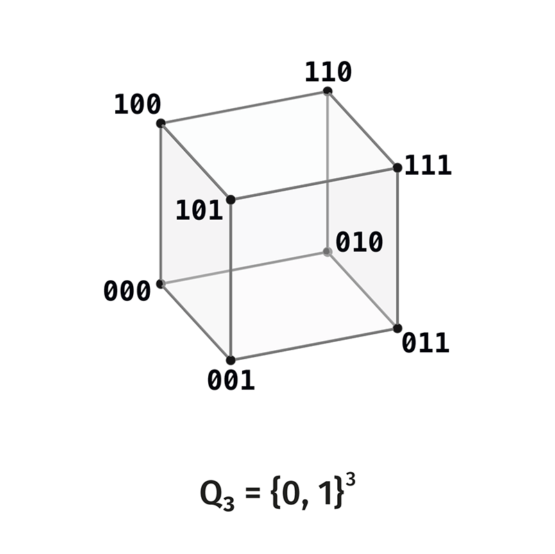
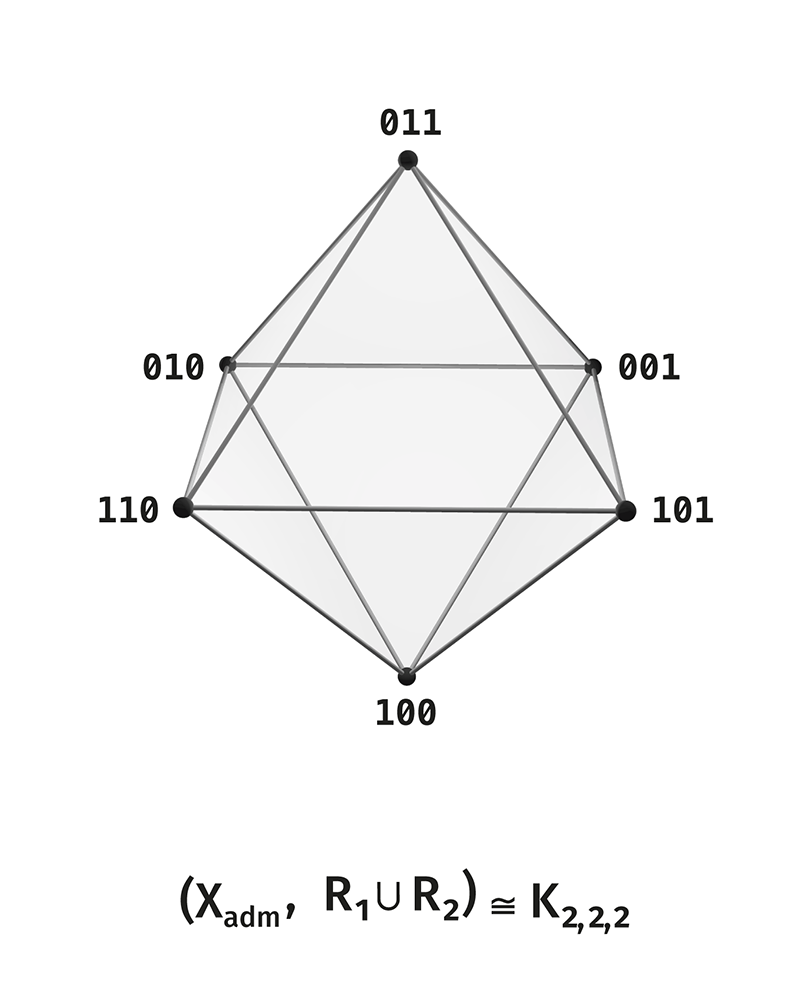

# DOT: Distinction Observable Theory

# Volume 1. Strict Rank-3 Core

Status: first English translation pass.

Volume 0 introduced the foundation of DOT: distinction, scene, observer,
rank, active boundary, and the first complete scene. This volume gives the
strict finite unfolding of the first complete scene.

The central object is

\[
\boxed{
S_3=(U_3;R_1,R_2,R_3).
}
\]

The main formulas of the volume are:

\[
U_3=Q_3\setminus\{000,111\},
\]

\[
R_1\cong C_6,\qquad
R_2\cong K_3\sqcup K_3,\qquad
R_3\cong 3K_2,
\]

\[
(U_3,R_1\cup R_2)\cong K_{2,2,2},
\]

\[
\operatorname{Cham}(O_3)\cong Q_3,
\]

\[
T^3=\kappa,\qquad T^6=\operatorname{id},
\]

\[
U_3/\kappa\cong PG(1,2).
\]

The mathematical ingredients in this volume are standard finite
constructions: the three-bit Boolean cube, Hamming distance, graphs,
cycles, complete multipartite graphs, incidence matrices, finite group
actions, and elementary spectra. The DOT-specific content is the way these
constructions are assembled into the first complete scene of held
distinction.

---

# How to Read This Volume

Volume 1 has one task: to show that the rank-3 active carrier has a closed
strict architecture.

The exposition proceeds as follows:

1. the active carrier \(U_3\) is fixed;
2. the three relations \(R_1,R_2,R_3\) are built;
3. the octahedral skeleton is derived;
4. chambers and incidence are constructed;
5. the cyclic transport \(T\) is introduced;
6. vertex-edge and axial readings are described;
7. symmetries and closure of the strict core are recorded.

Short status notes are used only where they help the reader separate a
standard construction from its DOT role.

---

# Basic Notation

\[
\mathbb F_2=\{0,1\}
\]

is the binary field.

\[
Q_n=\mathbb F_2^n
\]

is the full binary carrier of rank \(n\).

\[
0^n=00\ldots0,\qquad 1^n=11\ldots1
\]

are the two limits of the full carrier.

\[
U_n=Q_n\setminus\{0^n,1^n\}
\]

is the active carrier of rank \(n\).

\[
S_k^{(n)}=\{x\in Q_n:\ |x|=k\}
\]

is the layer of weight \(k\), where \(|x|\) is the number of ones in the
binary word \(x\).

\[
\kappa(x)=1^n+x
\]

is limiting complementarity.

\[
d_H(x,y)=|x+y|
\]

is Hamming distance.

In this volume the main carrier is

\[
U_3=Q_3\setminus\{000,111\}.
\]

The older notation from the previous corpus was

\[
X_{\mathrm{adm}}=U_3.
\]

This volume uses \(U_3\); \(X_{\mathrm{adm}}\) is mentioned only as a
historical synonym.

---

# 1. Active Carrier of Rank \(3\)

Status: standard binary-cube construction.

## 1.1. Full Three-Bit Carrier

The full carrier of rank \(3\) is

\[
Q_3=\mathbb F_2^3.
\]

Explicitly:

\[
Q_3=
\{000,001,010,011,100,101,110,111\}.
\]

The word \(abc\) denotes the triple of bits \((a,b,c)\). Its Hamming
weight is the number of ones in it.

<p align="center">
  <a href="figures/2.1-Q_3.png">
    
  </a>
</p>

## 1.2. Two Limits

There are two homogeneous states in \(Q_3\):

\[
000,\qquad 111.
\]

They are the two limits of the full carrier:

\[
000=0^3,\qquad 111=1^3.
\]

The first limit is the empty side: all coordinates are zero. The second
limit is the saturated side: all coordinates are active at once.

The active scene is built between these limits.

## 1.3. Active Carrier

Define

\[
\boxed{
U_3:=Q_3\setminus\{000,111\}.
}
\]

Thus

\[
U_3=\{001,010,011,100,101,110\}.
\]

Its cardinality is

\[
|U_3|=2^3-2=6.
\]

<p align="center">
  <a href="figures/2.2-X_adm.png">
    
  </a>
</p>

## 1.4. Layer Decomposition

The layers of the full \(Q_3\) are:

\[
S_0^{(3)}=\{000\},
\]

\[
S_1^{(3)}=\{001,010,100\},
\]

\[
S_2^{(3)}=\{011,101,110\},
\]

\[
S_3^{(3)}=\{111\}.
\]

After removing the two limits, the active carrier consists of the two
middle layers:

\[
U_3=S_1^{(3)}\sqcup S_2^{(3)}.
\]

The first middle layer has the three one-bit states. The second middle
layer has the three two-bit states.

## 1.5. Limiting Complementarity

Limiting complementarity is the map

\[
\kappa_3(x)=111+x.
\]

Equivalently, \(\kappa_3\) changes every bit:

\[
0\leftrightarrow1.
\]

It satisfies

\[
\boxed{
\kappa_3^2=\operatorname{id}.
}
\]

On \(U_3\), it pairs every one-bit state with the complementary two-bit
state:

\[
001\leftrightarrow110,
\]

\[
010\leftrightarrow101,
\]

\[
100\leftrightarrow011.
\]

Therefore \(\kappa_3\) exchanges the two active layers:

\[
\kappa_3:S_1^{(3)}\longleftrightarrow S_2^{(3)}.
\]

## 1.6. Simplicial Reading

Let

\[
J_3=\{1,2,3\}.
\]

Each binary word is identified with a subset of \(J_3\):

\[
001\leftrightarrow\{3\},\quad
010\leftrightarrow\{2\},\quad
100\leftrightarrow\{1\},
\]

\[
011\leftrightarrow\{2,3\},\quad
101\leftrightarrow\{1,3\},\quad
110\leftrightarrow\{1,2\}.
\]

Under this identification,

\[
Q_3\cong \mathcal P(J_3),
\]

and

\[
U_3=\mathcal P(J_3)\setminus\{\varnothing,J_3\}.
\]

Thus \(U_3\) is the set of nonempty proper faces of the triangle
\(\Delta^2\):

\[
U_3=\mathcal F(\partial\Delta^2).
\]

The three one-bit states are the vertices of the triangle. The three
two-bit states are its edges.

This gives the first strict place where the active scene is a boundary
carrier.

---

# 2. Three Relations on \(U_3\)

Status: standard Hamming relations restricted to the active carrier.

## 2.1. Hamming Distance

For \(x,y\in U_3\), define

\[
d_H(x,y)=|x+y|.
\]

For \(d=1,2,3\), define the relation

\[
R_d=\{\{x,y\}\subset U_3:\ d_H(x,y)=d\}.
\]

There are three nontrivial distances on \(U_3\), so there are three
relations:

\[
R_1,\qquad R_2,\qquad R_3.
\]

## 2.2. Relation \(R_1\)

\(R_1\) connects two active states when they differ in one bit.

The six edges of \(R_1\) are:

\[
100-110,\quad
110-010,\quad
010-011,
\]

\[
011-001,\quad
001-101,\quad
101-100.
\]

These edges form a six-cycle:

\[
\boxed{
(U_3,R_1)\cong C_6.
}
\]

One possible traversal is

\[
100\to110\to010\to011\to001\to101\to100.
\]

<p align="center">
  <a href="figures/3.1-R_1-C_6.png">
    
  </a>
</p>

## 2.3. Relation \(R_2\)

\(R_2\) connects two active states when they differ in two bits.

Inside \(S_1^{(3)}\) all three one-bit states are pairwise at distance
\(2\):

\[
001-010,\qquad 001-100,\qquad 010-100.
\]

Inside \(S_2^{(3)}\) all three two-bit states are pairwise at distance
\(2\):

\[
011-101,\qquad 011-110,\qquad 101-110.
\]

There are no \(R_2\)-edges between the two layers. Hence

\[
\boxed{
(U_3,R_2)\cong K_3\sqcup K_3.
}
\]

<p align="center">
  <a href="figures/3.2-R_2-2_triangles.png">
    
  </a>
</p>

## 2.4. Relation \(R_3\)

\(R_3\) connects two active states when they differ in three bits.

This is exactly complementarity:

\[
R_3=\{\{x,\kappa_3x\}:x\in U_3\}.
\]

The three edges are:

\[
001-110,\qquad
010-101,\qquad
100-011.
\]

Thus

\[
\boxed{
(U_3,R_3)\cong 3K_2.
}
\]

<p align="center">
  <a href="figures/3.3-R_3-3K_2.png">
    
  </a>
</p>

## 2.5. Partition of All Pairs

The carrier \(U_3\) has six elements, so it has

\[
\binom62=15
\]

unordered pairs.

The three Hamming relations partition these pairs:

\[
|R_1|=6,\qquad |R_2|=6,\qquad |R_3|=3,
\]

and

\[
6+6+3=15=\binom62.
\]

Therefore

\[
\binom{U_3}{2}=R_1\sqcup R_2\sqcup R_3.
\]

This is the full relation package of the rank-3 active carrier.

## 2.6. Full Rank-3 Scene

The strict rank-3 scene is

\[
\boxed{
S_3=(U_3;R_1,R_2,R_3).
}
\]

The three relations have different structural roles:

\[
R_1\cong C_6
\]

gives cyclic closure;

\[
R_2\cong K_3\sqcup K_3
\]

gives two triadic chambers;

\[
R_3\cong 3K_2
\]

gives three polar axes.

---

# 3. Relation Scheme

Status: standard finite association-scheme layer, specialized to the
six-state DOT carrier.

## 3.1. Adding the Diagonal

Add the diagonal relation

\[
R_0=\{\{x,x\}:x\in U_3\}.
\]

Then

\[
R_0,R_1,R_2,R_3
\]

partition \(U_3\times U_3\) when ordered pairs are used.

The diagonal gives identity, and \(R_1,R_2,R_3\) give the three nontrivial
Hamming classes.

## 3.2. Residual Adjacency

The relation

\[
R_{12}=R_1\cup R_2
\]

connects all pairs except complementary pairs.

Hence each vertex is adjacent to four vertices in \(R_{12}\) and is not
adjacent to itself or to its complement.

This is the one-skeleton of the octahedron:

\[
\boxed{
(U_3,R_1\cup R_2)\cong K_{2,2,2}.
}
\]

## 3.3. Relation Algebra

Let \(A_i\) be the adjacency matrix of \(R_i\). The matrices

\[
A_0,A_1,A_2,A_3
\]

span a commutative algebra under matrix multiplication.

This is the rank-3 restriction of the binary Hamming scheme. The DOT role
of this algebra is that the three relations are not independent
decorations; they form one closed finite grammar of distinction.

## 3.4. Evaluation Functors

The same finite carrier admits several evaluations:

\[
(U_3,R_1)\mapsto C_6,
\]

\[
(U_3,R_2)\mapsto K_3\sqcup K_3,
\]

\[
(U_3,R_3)\mapsto 3K_2,
\]

\[
(U_3,R_1\cup R_2)\mapsto K_{2,2,2}.
\]

Each evaluation forgets part of the full grammar and keeps one structural
layer. Volume 1 records how these evaluations fit together.

---

# 4. Holding Conditions on \(U_3\)

Volume 0 introduced three conditions of scene holding. On \(U_3\) they
receive their first complete finite carriers of manifestation.

## 4.1. Polar Holding

Polar holding appears through

\[
\boxed{
R_3=3K_2.
}
\]

This layer holds three complementary pairs:

\[
x\leftrightarrow\kappa_3x.
\]

It is the finite carrier of the noncollapse of polar distinction.

## 4.2. Triadic Holding

Triadic holding appears through

\[
\boxed{
R_2=K_3\sqcup K_3.
}
\]

The two components are the two chambers:

\[
S_1^{(3)},\qquad S_2^{(3)}.
\]

Each chamber is a closed triad.

## 4.3. Cyclic Holding

Cyclic holding appears through

\[
\boxed{
R_1=C_6.
}
\]

The six active states form an internal traversal:

\[
100\to110\to010\to011\to001\to101\to100.
\]

This is the first autonomous cycle in the active carrier.

## 4.4. Borromean Form of the Conditions

The full scene

\[
S_3=(U_3;R_1,R_2,R_3)
\]

is held by the joint work of the three layers:

\[
3K_2,\qquad K_3\sqcup K_3,\qquad C_6.
\]

Removing any layer changes the scene:

- without \(R_3\), complementary axes disappear;
- without \(R_2\), the chamber structure disappears;
- without \(R_1\), internal cyclic closure disappears.

The conditions are Borromean in this sense: the full scene is held by the
triple.

---

# 5. Octahedral Skeleton

Status: standard graph-theoretic reading of \(R_1\cup R_2\).

## 5.1. Combined Relation

Define

\[
R_{12}=R_1\cup R_2.
\]

This relation connects every pair of distinct active states except
complementary pairs.

Since \(R_1\) has six edges and \(R_2\) has six edges,

\[
|R_{12}|=12.
\]

## 5.2. Three Parts

The complementary pairs are:

\[
\{001,110\},\qquad
\{010,101\},\qquad
\{100,011\}.
\]

Use them as the three parts of a complete tripartite graph:

\[
P_1=\{001,110\},
\]

\[
P_2=\{010,101\},
\]

\[
P_3=\{100,011\}.
\]

Two vertices in the same part are complementary, so they are not connected
by \(R_{12}\). Two vertices in different parts are connected by either
\(R_1\) or \(R_2\).

Therefore

\[
(U_3,R_{12})\cong K_{2,2,2}.
\]

## 5.3. Octahedron

The graph \(K_{2,2,2}\) is the one-skeleton of the octahedron.

Hence the active carrier \(U_3\), with the relation \(R_1\cup R_2\), has
the octahedral skeleton:

\[
\boxed{
(U_3,R_1\cup R_2)\cong O_3^{(1)}.
}
\]

<p align="center">
  <a href="figures/4.1-R_12-octahedron.png">
    
  </a>
</p>

## 5.4. Skeleton and Full Scene

The octahedral surface uses \(R_1\cup R_2\). The polar layer \(R_3\) is not
a surface edge of the octahedron.

The full DOT scene retains \(R_3\) as part of the grammar:

\[
S_3=(U_3;R_1,R_2,R_3).
\]

Thus there are two related objects:

\[
(U_3,R_1\cup R_2)
\]

is the octahedral skeleton;

\[
(U_3;R_1,R_2,R_3)
\]

is the full rank-3 scene.

---

# 6. Chambers of the Octahedron

## 6.1. Chamber as a Choice from Three Pairs

The octahedral skeleton has three complementary pairs. A chamber chooses
one vertex from each pair.

There are

\[
2^3=8
\]

such choices.

These eight choices are naturally indexed by the full cube \(Q_3\).

## 6.2. Chambers as Cliques

In \(K_{2,2,2}\), choosing one vertex from each of the three parts gives a
triangle. Therefore every chamber is a \(K_3\).

The eight chambers of the octahedron are the eight triangular faces.

## 6.3. Chamber Carrier

Let

\[
\operatorname{Cham}(O_3)
\]

denote the set of chambers of the octahedral skeleton. Then

\[
\boxed{
\operatorname{Cham}(O_3)\cong Q_3.
}
\]

The two chambers corresponding to \(000\) and \(111\) are the two pure
triads. The other six chambers are mixed.

## 6.4. Chamber Adjacency

Two chambers are adjacent when they differ by one choice, that is, by
flipping one complementary pair.

Under the identification

\[
\operatorname{Cham}(O_3)\cong Q_3,
\]

this chamber adjacency is the edge relation of the cube \(Q_3\).

Thus the cube appears again as the chamber graph of the octahedral
skeleton.

---

# 7. Incidence of Vertices and Chambers

Status: standard incidence construction.

## 7.1. Two Object Types

There are two finite sets:

\[
U_3
\]

of six vertices, and

\[
\operatorname{Cham}(O_3)
\]

of eight chambers.

Incidence records which vertex belongs to which chamber.

## 7.2. Incidence Relation

Define

\[
x\ I\ C
\]

when vertex \(x\in U_3\) belongs to chamber \(C\).

Each chamber contains three vertices.

Each vertex belongs to four chambers: once its complementary pair is fixed
by choosing \(x\), the other two pairs can be chosen freely.

## 7.3. Counts

The number of incidences is

\[
8\cdot3=24.
\]

The same number is

\[
6\cdot4=24.
\]

Both counts describe the same incidence relation.

## 7.4. Incidence Matrix

Let \(B\) be the \(6\times8\) incidence matrix:

\[
B_{x,C}=1\quad\Longleftrightarrow\quad x\in C.
\]

The row sums are \(4\), and the column sums are \(3\).

The matrix \(B\) links the vertex layer and the chamber layer.

## 7.5. Reconstructing Vertex Adjacency

Two vertices are adjacent in the octahedral skeleton exactly when they
occur together in a chamber.

Thus the vertex adjacency of \(K_{2,2,2}\) can be reconstructed from
incidence with chambers.

Complementary vertices never occur together in a chamber.

## 7.6. Reconstructing Chamber Adjacency

Two chambers are adjacent in the chamber cube when they differ in one
axis choice.

Equivalently, two adjacent chambers share two vertices and differ in the
third.

The incidence layer therefore links:

\[
U_3,\qquad O_3,\qquad \operatorname{Cham}(O_3)\cong Q_3.
\]

---

# 8. Cyclic Transport

## 8.1. Orientation of the Cycle

Choose the \(R_1\)-cycle

\[
100\to110\to010\to011\to001\to101\to100.
\]

This choice gives an orientation of \(C_6\).

## 8.2. Operator \(T\)

Define \(T\) as one step along this oriented cycle:

\[
T(100)=110,
\]

\[
T(110)=010,
\]

\[
T(010)=011,
\]

\[
T(011)=001,
\]

\[
T(001)=101,
\]

\[
T(101)=100.
\]

Then

\[
\boxed{
T^6=\operatorname{id}.
}
\]

## 8.3. Phases of \(T\)

The powers of \(T\) give the six phases of the cycle:

\[
T^0,\ T^1,\ T^2,\ T^3,\ T^4,\ T^5.
\]

The third power is complementarity:

\[
\boxed{
T^3=\kappa_3.
}
\]

Indeed:

\[
100\xrightarrow{T^3}011,
\]

\[
010\xrightarrow{T^3}101,
\]

\[
001\xrightarrow{T^3}110.
\]

These are exactly the three complementary pairs.

## 8.4. Phase Table

For the chosen order

\[
100,110,010,011,001,101,
\]

the phase table is:

\[
\begin{array}{c|c}
\text{phase} & \text{state}\\
\hline
0 & 100\\
1 & 110\\
2 & 010\\
3 & 011\\
4 & 001\\
5 & 101
\end{array}
\]

The phase shift by \(3\) sends every state to its complement.

## 8.5. Period and Basic Three-Cycle

Since

\[
T^6=\operatorname{id},\qquad T^3=\kappa_3,
\]

the cyclic operator contains both a six-step closure and a three-step
polar half-period.

The even phases

\[
0,2,4
\]

form one \(R_2\)-triangle. The odd phases

\[
1,3,5
\]

form the other.

Thus the cycle also contains the two chambers:

\[
R_2=K_3\sqcup K_3.
\]

## 8.6. Finite \(Z_2\)-Holonomy

The identity

\[
T^3=\kappa_3
\]

is the finite holonomy of the rank-3 cycle. A half-turn of the cycle
returns to the opposite state.

This is the strict finite form behind later circle and Möbius readings.

---

# 9. Vertices, Edges, and Supports

Status: standard support reading of subsets of \(J_3\).

## 9.1. Support Reading

Under the subset identification

\[
Q_3\cong \mathcal P(J_3),
\]

the active carrier consists of:

- the three vertices of the triangle, \(S_1^{(3)}\);
- the three edges of the triangle, \(S_2^{(3)}\).

Hence

\[
U_3=S_1^{(3)}\sqcup S_2^{(3)}
\]

is a vertex-edge carrier of the triangle.

## 9.2. Two Profiles

The two layers have different profiles:

\[
S_1^{(3)}:\quad \text{singletons},
\]

\[
S_2^{(3)}:\quad \text{two-element subsets}.
\]

Complementarity sends each vertex to the opposite edge:

\[
\{i\}\longleftrightarrow J_3\setminus\{i\}.
\]

In the triangle, this is the relation

\[
\text{vertex}\leftrightarrow\text{opposite edge}.
\]

## 9.3. Coordinate Triangle

The coordinate triangle has vertices

\[
1,\qquad2,\qquad3.
\]

Its nonempty proper faces are:

\[
\{1\},\{2\},\{3\},
\]

and

\[
\{1,2\},\{1,3\},\{2,3\}.
\]

These six faces are exactly \(U_3\).

## 9.4. Relations in Vertex-Edge Reading

In the vertex-edge reading:

- \(R_3\) pairs each vertex with the opposite edge;
- \(R_2\) connects vertices with vertices and edges with edges;
- \(R_1\) connects incident vertex-edge pairs.

Thus the three Hamming relations become:

\[
R_1:\text{incidence},
\]

\[
R_2:\text{same-dimensional adjacency},
\]

\[
R_3:\text{opposition}.
\]

This is the simplicial face of the same strict scene.

---

# 10. Axes and Projective Factor

## 10.1. Axial Pairs

The three complementary pairs are:

\[
D=\{100,011\},
\]

\[
F=\{010,101\},
\]

\[
C=\{001,110\}.
\]

At this strict level, \(D,F,C\) are names of the three axes.

## 10.2. Axial Factorization

The quotient by complementarity sends each pair to one axis:

\[
U_3/\kappa_3=\{D,F,C\}.
\]

Every active state can be written as

\[
\text{axis}+\text{side}.
\]

Thus

\[
\boxed{
U_3\cong I_3^{\mathrm{axes}}\times\{-,+\}.
}
\]

Here

\[
I_3^{\mathrm{axes}}=\{D,F,C\}.
\]

The factor \(\{-,+\}\) records which side of the axis is chosen.

## 10.3. Relations in Axial Coordinates

In axial coordinates:

- \(R_3\) changes side and keeps the axis;
- \(R_2\) changes axis inside the same layer side;
- \(R_1\) changes both axis and side along the selected cycle.

This gives a compact reading of the full relation package.

## 10.4. Projective Factor

Since \(U_3\) has three complement-pairs,

\[
|U_3/\kappa_3|=3.
\]

The quotient is the projective line over \(\mathbb F_2\):

\[
\boxed{
U_3/\kappa_3\cong PG(1,2).
}
\]

The three points of \(PG(1,2)\) are the three axes of the octahedral
scene.

---

# 11. Lift from Rank \(2\) to Rank \(3\)

This section records the structural change that occurs when the
two-coordinate carrier is lifted to the three-coordinate carrier.

## 11.1. Initial Carrier

At rank \(2\),

\[
Q_2=\{00,01,10,11\}.
\]

Its active carrier is

\[
U_2=\{01,10\}.
\]

This is one complementary pair.

Rank \(3\) turns the pair-form into a six-state carrier with three axes,
two chambers, and one cycle.

## 11.2. Five Lifts

The lift from rank \(2\) to rank \(3\) can be read through five related
changes.

### 11.2.1. Face Lift

The square carrier \(Q_2\) appears inside faces of \(Q_3\). A two-bit
carrier becomes a local face in the three-bit cube.

### 11.2.2. Limit Lift

The limits change:

\[
00,11
\]

are limits of \(Q_2\), while

\[
000,111
\]

are limits of \(Q_3\).

A state that was limiting in one rank can become internal or layered in
the next rank after prefixing.

### 11.2.3. Pair Lift

The single active pair of \(U_2\) becomes three complementary pairs in
\(U_3\).

This is the first axial multiplication.

### 11.2.4. Triadic Lift

Rank \(3\) introduces two triadic chambers:

\[
S_1^{(3)},\qquad S_2^{(3)}.
\]

The pair-form is no longer the whole active scene; it becomes one layer of
a richer structure.

### 11.2.5. Transport Lift

Rank \(3\) supports the cycle

\[
C_6.
\]

The cyclic transport \(T\) ties the six active states into one closed
traversal.

## 11.3. Relation Becomes Object

The lift from rank \(2\) to rank \(3\) shows the general DOT pattern:
what is a relation or limit in a lower rank can become an internal object
or layer in the next rank.

This principle becomes explicit in higher ranks, where axes, chambers,
boundary operators, and projective factors are unfolded as internal
structures.

---

# 12. Symmetries

Status: standard automorphism groups of the finite graphs, with DOT
interpretation through preserved relation layers.

## 12.1. Symmetries of the Relation Scheme

The full relation scheme

\[
R_0,R_1,R_2,R_3
\]

has the symmetries that preserve all distance classes.

These symmetries include:

- permutations of the three coordinates;
- complementarity \(\kappa_3\);
- compositions of these operations.

The resulting color-preserving symmetry group of the scheme has order
\(12\). It is the dihedral symmetry of the selected \(C_6\) together with
the Hamming-distance coloring.

## 12.2. Why the Octahedron Has More Symmetries

The octahedral skeleton

\[
(U_3,R_1\cup R_2)\cong K_{2,2,2}
\]

forgets the distinction between \(R_1\) and \(R_2\). It remembers only
which pairs are non-complementary.

Therefore it has the larger octahedral symmetry group:

\[
B_3=(\mathbb Z_2)^3\rtimes S_3,
\qquad |B_3|=48.
\]

The full DOT scene uses the more refined relation coloring:

\[
R_1,\qquad R_2,\qquad R_3.
\]

This refinement reduces the symmetry.

## 12.3. Symmetry of Transport

After a direction of the \(C_6\)-cycle is chosen, the cyclic transport is
generated by \(T\):

\[
\langle T\rangle\cong \mathbb Z_6.
\]

If orientation is forgotten but the cycle is kept, the symmetry is
dihedral:

\[
D_6.
\]

Thus there is a symmetry tower:

\[
B_3\supset D_6\supset \mathbb Z_6.
\]

Each step fixes more structure:

- \(B_3\): octahedral skeleton;
- \(D_6\): chosen six-cycle;
- \(\mathbb Z_6\): chosen oriented transport.

---

# 13. Closure of the Strict Core

## 13.1. Final Package

The strict rank-3 package consists of:

\[
U_3=\{001,010,011,100,101,110\},
\]

\[
R_1,R_2,R_3,
\]

\[
\kappa_3,
\]

\[
T,
\]

\[
R_{12}=R_1\cup R_2,
\]

\[
\operatorname{Cham}(O_3).
\]

These data give all strict objects needed for the first complete scene.

## 13.2. Main Equalities and Isomorphisms

The core equalities are:

\[
|U_3|=6,
\]

\[
U_3=S_1^{(3)}\sqcup S_2^{(3)},
\]

\[
\kappa_3:S_1^{(3)}\leftrightarrow S_2^{(3)},
\]

\[
(U_3,R_1)\cong C_6,
\]

\[
(U_3,R_2)\cong K_3\sqcup K_3,
\]

\[
(U_3,R_3)\cong 3K_2,
\]

\[
(U_3,R_1\cup R_2)\cong K_{2,2,2},
\]

\[
\operatorname{Cham}(O_3)\cong Q_3,
\]

\[
T^3=\kappa_3,
\]

\[
T^6=\operatorname{id},
\]

\[
U_3/\kappa_3\cong PG(1,2).
\]

## 13.3. What Volume 1 Closes

Volume 1 closes the strict finite rank-3 core:

- the carrier is fixed;
- all pair relations are partitioned;
- the octahedral skeleton is derived;
- chambers are reconstructed;
- cyclic transport is fixed;
- axes and projective factor are obtained;
- the symmetry layers are separated.

The next volumes unfold this closed core into higher ranks, boundary
operators, operator towers, Fano-tetrahedral readings, and cyclic-topological
avatars.

---

# Appendix A. Spectra of Basic Carriers

Status: standard spectral graph checks.

## A.1. Cycle \(C_6\)

The Laplacian spectrum of \(C_6\) is

\[
0,\ 1,\ 1,\ 3,\ 3,\ 4.
\]

This verifies the cyclic layer \(R_1\).

## A.2. Cube \(Q_3\)

The chamber graph is \(Q_3\). Its Laplacian spectrum is

\[
0,\ 2,\ 2,\ 2,\ 4,\ 4,\ 4,\ 6.
\]

This verifies the chamber layer.

## A.3. Octahedral Skeleton \(K_{2,2,2}\)

The octahedral skeleton has six vertices and degree \(4\). Its adjacency
spectrum is

\[
4,\ 0,\ 0,\ -2,\ -2,\ -2.
\]

Its Laplacian spectrum is

\[
0,\ 4,\ 4,\ 6,\ 6,\ 6.
\]

This verifies the skeleton \(R_1\cup R_2\).

---

# Appendix B. Composite Vertex-Chamber Graph

One useful finite package combines:

- the six vertices of \(U_3\);
- the eight chambers of \(O_3\);
- the incidence relation between them.

The bipartite incidence block has row sums \(4\) and column sums \(3\).

This composite graph is not the first definition of the scene. It is a
derived verification package showing that the vertex layer and chamber
layer are mutually recoverable through incidence.

---

# Appendix C. Verifiable Blocks

The verification layer checks the following finite claims:

- construction of \(U_3\);
- partition into \(R_1,R_2,R_3\);
- graph isomorphisms \(C_6\), \(K_3\sqcup K_3\), \(3K_2\), \(K_{2,2,2}\);
- chamber carrier \(\operatorname{Cham}(O_3)\cong Q_3\);
- cyclic transport \(T^3=\kappa\), \(T^6=\operatorname{id}\);
- basic spectra;
- higher-rank shell laws used by later volumes.

Run:

```bash
python3 01_Verification/DOT_Core_verifier.py
```

from the repository root.

---

# Summary of Volume 1

The rank-3 active carrier

\[
U_3=Q_3\setminus\{000,111\}
\]

has six states. Hamming distance on this carrier gives three relations:

\[
R_1=C_6,\qquad R_2=K_3\sqcup K_3,\qquad R_3=3K_2.
\]

The union \(R_1\cup R_2\) is the octahedral skeleton

\[
K_{2,2,2}.
\]

The missing layer \(R_3\) is the polar axis layer of the full scene. The
cycle \(R_1\) carries an operator \(T\) with

\[
T^6=\operatorname{id},\qquad T^3=\kappa.
\]

The complement quotient is

\[
U_3/\kappa\cong PG(1,2).
\]

This is the strict finite closure of the first complete DOT scene.

