# Theory of Observable Distinction (DOT)

## Introduction

### I.1. Subject of the Manuscript

The Theory of Observable Distinction is a finite combinatorial theory organized around one principle: **distinction is the primary structural fact, and objects arise as stable forms of held and presented distinction**. Standard mathematics starts with elements or sets and builds structure on them; DOT starts with the conditions of distinction and shows which finite structures appear when these conditions are successively strengthened.

The idea of the theory responds to a general scientific intuition: observation participates in how a distinction becomes available, stable, and checkable. In quantum physics, contemporary artificial-intelligence architectures, logic, information theory, cognitive science, and the theory of complex systems, this intuition takes the form of one question: which states are distinguishable, which relations fix their distinguishability, which maps present it in an observable form, and which data are preserved under such a transition.

The strict part of DOT is a finite combinatorial apparatus. Every statement in it rests on an explicitly constructed carrier, an explicit relation, an explicit reading, and explicit recovery data.

The objects of the theory are finite sets with fixed relations. Distinction between them is a finite check. Growth of the theory is a finite procedure of adding a new binary digit to an already constructed carrier. Thus DOT is built from the ground up, is checkable in finitely many steps, and admits external projections through explicitly formulated bridge constructions.

### I.2. Main Principle

Simple inequality only says that two positions are different; therefore distinction in DOT is not reduced to the statement "one thing is not equal to another." A distinction must be **held** by a structure, must be **presented** in some description, and must preserve a **recoverable** part under transitions between descriptions.

For this purpose, four basic roles are introduced: **carrier**, **relation**, **reading**, and **recovery**.

The carrier specifies a finite domain of positions. The relation fixes which positions are connected and how their distinguishability is held. The reading translates distinction into another domain of description; in general, it may glue positions together by sending several positions to one image. Recovery fixes which part of the original positions and links remains available after such a reading.

These four roles specify a way of recording finite data, not an external interpretation. The formal unit of this notation is a **presentation**, the quadruple

\[
(X, R, q, \operatorname{rec}).
\]

A presentation gives each distinction a checkable finite form. Every statement of the theory reduces to checking properties of such a quadruple on a finite carrier.

A held distinction in DOT has three levels of closure.

**Pairwise level.** A position receives its role only together with the opposite position. A pair appears as one distinction: each member points to the other and does not have the same role without it. In the formal part this is written as a polar presentation, and it becomes the first rank structure of the theory.

**Cyclic level.** When there are several distinctions, separate pairs of opposites are connected by transitions between positions. If a sequence of transitions returns the structure to its initial position, a cycle appears. The cycle fixes a finite law of return: each step is defined inside the same system, and after finitely many steps the system returns to the beginning. At this level, opposition receives a second manifestation: it becomes the position reached after half of a cyclic traversal. One and the same set of positions acquires two related descriptions: a cycle of neighboring transitions and a partition into opposite pairs.

**Integral level.** Several distinctions may be held as one common scene. In such a scene, positions, opposites, transitions between them, and admissible joint configurations all matter; in the formal part these configurations are called chambers. Incidence relations appear between objects of distinct types. This scene gives a combinatorial form of the Borromean intuition: stability is determined by the mutual holding of all axes at once, and when one role is removed the meaning of the others changes.

The minimal complete scene of this type contains three opposite pairs, that is, six positions forming the first complete geometric configuration of the theory.

### I.3. Structure of the Document

The formal part of DOT is organized by ranks. A rank indicates how many binary coordinates participate in the current level of construction: at the first rank there is one coordinate, at the second rank two, and so on. Each next rank adds a new binary digit and creates a wider domain in which distinctions already constructed receive a new role.

The document begins with the protocol of presentation: relational carrier, reading, recovery datum, exact presentation, and recovery conditions are introduced. After that it constructs the minimal polar presentation of rank 1, its automorphism, and the coordinate notation of the first rank lift.

Rank 2 introduces a four-position carrier and the first different graph readings of one and the same carrier: a cycle, complement pairs, complete connectedness, and partial connectedness with a distinguished seam. Rank 3 constructs the admissible carrier

\[
X_{\mathrm{adm}} = Q_3 \setminus \{000,111\},
\]

on which the relation grammar \(R_1,R_2,R_3\), the cycle reading \(C_6\), two triangular components \(K_3\sqcup K_3\), complement pairs \(3K_2\), the octahedral shell \(K_{2,2,2}\), the chamber layer, the incidence package, and cyclic transport appear together.

Rank 4 shows how the octahedral structure already constructed is re-read inside a larger carrier. Here one obtains the shell decomposition \(4+6+4+1\), the self-dual middle layer, the outer shell, the residual graph \(K_{2,2,2,2}\), the cycle atlas, and the Singer cycle \(C_{15}\).

Rank 5 closes the finite carrier atlas of the manuscript. Its carrier has \(31\) positions and the shell decomposition \(5+10+10+5+1\). In the two middle layers one obtains relation grammars on ten-position carriers, including graph readings by intersecting and disjoint pairs; in the outer layer one obtains the residual graph \(K_{2,2,2,2,2}\), the cycle \(C_{10}\), the checked edge-disjoint cover \(5C_8\), and the projective Singer cycle \(C_{31}\) through \(\mathbb F_{32}\).

After the rank construction, the general law of growth is formulated. The transition from rank \(n\) to rank \(n+1\) is written as the addition of a new highest binary digit:

\[
\Lambda_n: \{0,1\}\times Q_n\to Q_{n+1},
\qquad
\Lambda_n(\varepsilon,x)=\varepsilon\mid x.
\]

This law explains how carriers, shells, complement pairs, outer shells, and operator layers are transported. The finite part of the manuscript closes as the package

\[
\mathfrak{R}_{\leq 5}^{\operatorname{fin}}
=
(\Pi_1,\mathfrak{C}_2,\mathfrak{C}_3,\mathfrak{C}_4,\mathfrak{A}_5),
\]

which gathers the constructed ranks under one name.

### I.4. Bridge Layers and External Projections

The main document fixes the strict finite core. External readings are not mixed into the core automatically: a bridge receives structural status only when its carrier, relation, reading, and recovery or operator role are specified.

The accompanying notes develop several such projections. The binary growth note separately unfolds the rank lift and binary-coordinate mechanism. The color bridge reads \(Q_3\) as the RGB/CMY cube and \(X_{\mathrm{adm}}\) as a six-color carrier with relations \(R_1,R_2,R_3\), the octahedral shell, and Kuhn/HSV sectors. The spectral block isolates checkable spectral statements for finite graph structures. The six-state \(A_2/sl_3/su(3)\) bridge shows how the six-state carrier may be compared with root and representation-theoretic grammar while preserving its bridge-layer status.

These notes show which projection readings become possible after the finite core has already been constructed.

### I.5. Status of Names and Transition to the Formal Part

The text uses three statuses of names.

**Native.** A name is constructed inside the formal part. Its carrier, relation, reading, recovery data, or operator role are specified. Such names participate in statements and checks.

**Readable.** A name is a reading of a structure already constructed. It helps see a carrier as a cycle, graph, shell, system of chambers, incidence layer, or another structural image. A readable name obtains strict status only through already constructed data.

**Not-yet / bridge.** A name points to a future layer or an external extension of the theory. It serves as a navigation label and obtains proof status only after an explicit construction.

This separation keeps the boundary between the finite-combinatorial basis of the theory and possible bridge extensions beyond it. After this boundary, the formal part begins: first the representation protocol is specified, and then the ranks and their closure packages are constructed.

## §0. Presentation

### §0.1. Relational Carrier

In the first part of the theory, a relation is written as a subset of the
Cartesian square. This notation is suitable for symmetric, directed, and later
relation structures.

**Definition 0.1.**
A relational carrier is a pair

\[(X,R),
\]

where

\[X
\]

is a set of elements, and

\[R\subseteq X\times X
\]

is a relation on \(X\).

The set \(X\) specifies the domain of elements. The relation \(R\) specifies
the way in which they are structurally held.

### §0.2. Subcarriers

Before introducing recovery datum, one must specify the type of object returned
by recovery datum.

**Definition 0.2.**
For a relational carrier

\[(X,R)
\]

denote by

\[\operatorname{SubRel}(X,R)
\]

the set of all pairs

\[(X',R')
\]

such that

\[X'\subseteq X,
\]

\[R'\subseteq R\cap(X'\times X').
\]

Elements of \(\operatorname{SubRel}(X,R)\) are called subcarriers of the carrier
\((X,R)\).

### §0.3. Reading

Reading sends the carrier to a reading domain. In the initial formalism, the
reading domain consists only of actually occurring images.

**Definition 0.3.**
A reading is a surjective map

\[q:X\to Y.
\]

Surjectivity means

\[\operatorname{Im}(q)=Y.
\]

For each

\[y\in Y
\]

the fiber

\[X_y=q^{-1}(y)={x\in X:q(x)=y}
\]

is defined. The fiber shows which elements of the original carrier are read as
one element \(y\).

### §0.4. Recovery Datum

A reading can collapse several carrier elements to one element of the reading
domain. Recovery datum fixes which part of the original carrier remains
recoverable over each element of the reading.

**Definition 0.4.**
A recovery datum for a reading

\[q:X\to Y
\]

is a map

\[\operatorname{rec}:Y\to \operatorname{SubRel}(X,R).
\]

For each \(y\in Y\),

\[\operatorname{rec}(y)=(X_y^{\operatorname{rec}},R_y^{\operatorname{rec}}),
\]

where

\[X_y^{\operatorname{rec}}\subseteq q^{-1}(y),
\]

\[R_y^{\operatorname{rec}}
\subseteq
R\cap
\bigl(X_y^{\operatorname{rec}}\times X_y^{\operatorname{rec}}\bigr).
\]

Recovery datum fixes which elements of the fiber and which relation inside them
remain recoverable.

### §0.5. Presentation

**Definition 0.5.**
A presentation is a quadruple

\[\Pi=(X,R,q,\operatorname{rec}),
\]

where

\[(X,R)
\]

is a relational carrier,

\[q:X\to Y
\]

is a surjective reading,

\[\operatorname{rec}:Y\to \operatorname{SubRel}(X,R)
\]

is a recovery datum.

A presentation fixes four components:

\[\text{carrier},
\]

\[\text{relation},
\]

\[\text{reading},
\]

\[\text{recoverability}.
\]

A term is considered introduced in a given layer if a presentation is specified
in which this term has all four components.

### §0.6. Full Recovery over a Reading Element

**Definition 0.6.**
Recovery datum is called full over \(y\in Y\) if

\[\operatorname{rec}(y)
=
\bigl(q^{-1}(y),\ R|_{q^{-1}(y)}\bigr),
\]

where

\[R|_{q^{-1}(y)}
=
R\cap(q^{-1}(y)\times q^{-1}(y)).
\]

In this case, the entire fiber of the reading over \(y\), together with the
induced relation, is recoverable.

### §0.7. Exact Presentation

**Definition 0.7.**
A presentation

\[\Pi=(X,R,q,\operatorname{rec})
\]

is called exact over \(y\in Y\) if the recovery datum is full over \(y\).

A presentation is called exact if it is exact over every

\[y\in Y.
\]

# §1. Polar Presentation

### §1.1. Trivial and Nontrivial Presentations

The formal structure of a presentation admits trivial cases. For example,

\[X={*},
\]

\[R=\varnothing,
\]

\[q=\operatorname{id}_{{*}},
\]

\[\operatorname{rec}(*)=({*},\varnothing).
\]

This is a correct presentation with a one-point fiber of the identity reading.
The recovery datum has the form \((\{*\},\varnothing)\).

A meaningful initial unit must contain at least one nontrivial fiber: two
distinguishable elements of the carrier are read as one element of the reading
and remain recoverable as distinct.

The minimal such case contains exactly two elements.

### §1.2. Polar Layer

**Definition 1.1.**
The polar layer is the relational carrier

\[(P,R_P),
\]

where

\[P={a,-a},
\]

and

\[R_P={(a,-a),(-a,a)}.
\]

The relation \(R_P\) is symmetric and irreflexive. It is written using ordered
pairs for compatibility with the general notation

\[R\subseteq X\times X.
\]

The polar layer fixes the unoriented pair \((a,-a)\).

The elements

\[a,\quad -a
\]

are called polarities.

### §1.3. Invariant Reading

Let

\[\mathbf I={I}.
\]

Define the reading

\[\pi:P\to \mathbf I
\]

by

\[\pi(a)=I,
\]

\[\pi(-a)=I.
\]

The map \(\pi\) is surjective:

\[\operatorname{Im}(\pi)=\mathbf I.
\]

The carrier \(P\) contains two distinguishable polarities:

\[a,\quad -a.
\]

In the reading \(\mathbf I\), they have one image:

\[\pi(a)=\pi(-a)=I.
\]

The element \(I\) is the image of both polarities in the reading \(\pi\).
Therefore \(I\) is called the invariant reading of the polar layer.

### §1.4. Recovery Datum of the Polar Layer

The fiber over \(I\) is

\[\pi^{-1}(I)=P={a,-a}.
\]

The restriction of the relation to this fiber is

\[R_P|_{\pi^{-1}(I)}=R_P.
\]

**Definition 1.2.**
The recovery datum of the polar layer is given by

\[\operatorname{rec}_P(I)=(P,R_P).
\]

This is full recovery over \(I\).

### §1.5. First Presentation

**Definition 1.3.**
The first presentation is

\[\Pi_1=(P,R_P,\pi,\operatorname{rec}_P),
\]

where

\[P={a,-a},
\]

\[R_P={(a,-a),(-a,a)},
\]

\[\pi:P\to \mathbf I,
\qquad
\pi(a)=\pi(-a)=I,
\]

\[\operatorname{rec}_P(I)=(P,R_P).
\]

The presentation \(\Pi_1\) is exact: the only element of the reading has full
recovery.

Indeed,

\[\pi^{-1}(I)=P,
\qquad
R_P|_{\pi^{-1}(I)}=R_P,
\]

and therefore

\[\operatorname{rec}_P(I)=(P,R_P)
=
\bigl(\pi^{-1}(I),R_P|_{\pi^{-1}(I)}\bigr).
\]

Compressed notation:

\[{a,-a}\xrightarrow{\pi} I,
\qquad
\operatorname{rec}_P(I)=(P,R_P).
\]

In \(\Pi_1\), the following are fixed:

\[\text{two polarities},
\]

\[\text{one invariant reading},
\]

\[\text{full recovery of the polar relation}.
\]

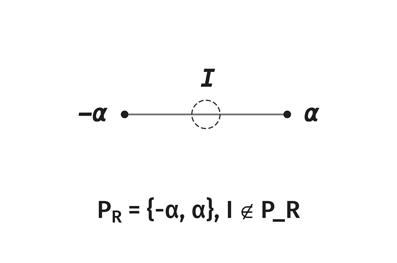

The empty circle \(I\) in the figure is not a vertex of the carrier \(P\). It
denotes the image of the reading:

\[\pi(a)=\pi(-a)=I.
\]

# §2. Automorphisms over the Invariant Reading

### §2.1. Automorphism of the Polar Layer over \(I\)

After defining \(\Pi_1\), one can consider bijections of the carrier preserving
the presentation data.

**Definition 2.1.**
An automorphism of the polar layer over \(I\) is a bijection

\[f:P\to P
\]

such that

\[(x,y)\in R_P
\Longleftrightarrow
(f(x),f(y))\in R_P,
\]

and

\[\pi\circ f=\pi.
\]

The set of such automorphisms is denoted

\[\operatorname{Aut}_I(P,R_P).
\]

In the case of \(\Pi_1\), both conditions are satisfied by every bijection
\(P\to P\): the reading \(\pi\) is constant, and \(R_P\) is the complete
symmetric relation between two distinct elements.

The meaningful role of these conditions appears on richer carriers, where the
reading and relation cease to be trivial.

### §2.2. Two Bijections of the Polar Layer

The two-element set \(P\) has exactly two bijections.

The first is

\[\operatorname{id}_P(a)=a,
\]

\[\operatorname{id}_P(-a)=-a.
\]

The second is

\[\tau(a)=-a,
\]

\[\tau(-a)=a.
\]

**Statement 2.2.**

\[\operatorname{Aut}_I(P,R_P)={\operatorname{id}_P,\tau}.
\]

**Check.**
On a two-element set, every bijection either leaves both elements fixed or
interchanges them. These two cases give

\[\operatorname{id}_P
\]

and

\[\tau.
\]

There are no other bijections of a two-element set.

Both bijections preserve \(R_P\) and \(\pi\). Therefore

\[\operatorname{Aut}_I(P,R_P)={\operatorname{id}_P,\tau}.
\]

### §2.3. Canonical Swap

**Definition 2.3.**
The automorphism

\[\tau(a)=-a,
\qquad
\tau(-a)=a
\]

is called the canonical swap of the polar layer.

It satisfies

\[\tau^2=\operatorname{id}_P.
\]

Check:

\[\tau^2(a)=\tau(-a)=a,
\]

\[\tau^2(-a)=\tau(a)=-a.
\]

### §2.4. Local Involution

The property

\[\tau^2=\operatorname{id}_P
\]

describes the local involution of the polar layer.

Applying the swap twice recovers the original polarity:

\[a\mapsto -a\mapsto a,
\]

\[-a\mapsto a\mapsto -a.
\]

Sections §§0-2 define the local involution of the exact polar fiber.

# §3. First Rank Lift: Coordinate Notation of Polarity

### §3.1. From Polarity to Coordinate

The polar layer

\[P={a,-a}
\]

defines two distinguishable polarities of one invariant reading.

For rank extension, one needs notation in which several independent polar
layers can be placed side by side as coordinates. This notation is a bit.

**Definition 3.1.**
A coordinate notation of the polar layer is a bijection

\[c:P\to \mathbb F_2
\]

of the form

\[c(a)=0,
\qquad
c(-a)=1.
\]

The choice of which polarity receives \(0\) and which receives \(1\) is a choice
of notation. The structure of the polar layer is determined by two-elementness,
the relation \(R_P\), and swap symmetry.

If the opposite notation is chosen,

\[c'(a)=1,
\qquad
c'(-a)=0,
\]

then

\[c'=s\circ c,
\qquad
s(x)=x+1.
\]

Thus the two coordinate notations differ by the same swap already defined
inside the polar layer.

In the chosen coordinate notation, the canonical swap takes the form

\[c\circ\tau\circ c^{-1}(x)=x+1
\qquad
(x\in\mathbb F_2).
\]

Check:

\[0\mapsto 1,
\qquad
1\mapsto 0.
\]

Thus the local swap receives the algebraic notation of adding one in
\(\mathbb F_2\).

### §3.2. Rank 1 as the Coordinate Form of the First Layer

**Definition 3.2.**
The coordinate carrier of rank \(1\) is

\[Q_1=\mathbb F_2={0,1}.
\]

On it, the polar relation is defined by

\[R_1^{\mathrm{pol}}={(0,1),(1,0)}.
\]

The reading of rank \(1\) is

\[q_1:Q_1\to\mathbf I,
\]

\[q_1(0)=q_1(1)=I.
\]

The recovery datum is

\[\operatorname{rec}_1(I)=(Q_1,R_1^{\mathrm{pol}}).
\]

This gives the coordinate presentation

\[\Pi_1^{\mathrm{coord}}
=
(Q_1,R_1^{\mathrm{pol}},q_1,\operatorname{rec}_1).
\]

This notation is obtained from \(\Pi_1\) by replacing the names of elements
through \(c\):

\[a\mapsto 0,
\qquad
-a\mapsto 1.
\]

The reading is preserved under this replacement:

\[q_1(c(x))=\pi(x)
\qquad
(x\in P).
\]

The relation and recovery datum are also transported by \(c\):

\[(c\times c)(R_P)=R_1^{\mathrm{pol}},
\]

\[\operatorname{rec}_1(I)=(c(P),(c\times c)(R_P)).
\]

The polar layer has received a coordinate form.

### §3.3. Full Carrier and Manifest States

Coordinate notation makes it possible to build carriers from several
independent bits.

**Definition 3.3.**
The full coordinate carrier of rank \(n\) is

\[Q_n=\mathbb F_2^n.
\]

Its element

\[x=(x_1,\ldots,x_n)
\]

records the state of \(n\) polar coordinates.

The zero state

\[0^n=(0,\ldots,0)
\]

is called the empty coordinate state.

A state

\[x\neq 0^n
\]

is called a manifest coordinate state: at least one coordinate is in position
\(1\).

The set of all manifest states is denoted

\[Q_n^*=\mathbb F_2^n\setminus{0^n}.
\]

For \(n=1\):

\[Q_1={0,1},
\]

\[Q_1^*={1}.
\]

Here \(Q_1\) is the full coordinate carrier of the polar layer, while
\(Q_1^*\) is the register of its nonzero manifestation.

\(Q_1\) and \(Q_1^*\) have different carrier roles.

### §3.4. Coordinate Carrier \(Q_n\)

The carrier

\[Q_n=\mathbb F_2^n
\]

is used as the coordinate domain of states.

A presentation on \(Q_n\) still requires three further data:

\[\text{relation},
\qquad
\text{reading},
\qquad
\text{recovery datum}.
\]

They are specified by separate constructions over the chosen set.

### §3.5. Coordinate Swaps

Let

\[e_i=(0,\ldots,0,1,0,\ldots,0)
\]

be the basis vector with \(1\) in the \(i\)-th coordinate.

The local swap in the \(i\)-th coordinate is written as

\[\sigma_i(x)=x+e_i.
\]

Here addition is taken in \(\mathbb F_2^n\).

For \(n=1\), this coincides with the notation of the canonical swap:

\[x\mapsto x+1.
\]

For \(n>1\), the formula

\[x\mapsto x+e_i
\]

changes only one polar coordinate and leaves the remaining coordinates fixed.

The local swaps \(\sigma_i\) are used in §4 to describe symmetries of the
two-bit carrier.

### §3.6. New Bit

Notation convention: the new bit occupies the highest position on the left. The
opposite convention gives an isomorphic carrier by permutation of coordinates.

For the transition

\[Q_{n-1}\to Q_n
\]

we identify the old carrier with the subset

\[Q_{n-1}\cong {0}\times Q_{n-1}\subset Q_n.
\]

The new basis bit is

\[e_n=(1,0,\ldots,0)\in Q_n.
\]

Then

\[Q_n=\mathbb F_2 e_n\oplus Q_{n-1}.
\]

The block of the new bit is

\[B_n=e_n+Q_{n-1}.
\]

It contains all states in which the new bit is switched on.

### §3.7. Emergence Decomposition

Set

\[Q_0={0},
\qquad
Q_0^*=\varnothing.
\]

**Statement 3.4.**
For \(n\geq 1\),

\[Q_n^*
=
Q_{n-1}^*
\sqcup
{e_n}
\sqcup
(e_n+Q_{n-1}^*).
\]

**Check.**
Every element \(x\in Q_n\) has the form

\[x=\varepsilon e_n+y,
\]

where

\[\varepsilon\in\mathbb F_2,
\qquad
y\in Q_{n-1}.
\]

If

\[\varepsilon=0,
\]

then

\[x=y.
\]

Since \(x\neq0^n\), we get

\[y\in Q_{n-1}^*.
\]

Hence

\[x\in Q_{n-1}^*.
\]

If

\[\varepsilon=1,
\]

then

\[x=e_n+y.
\]

For

\[y=0
\]

we get

\[x=e_n.
\]

For

\[y\neq0
\]

we get

\[x\in e_n+Q_{n-1}^*.
\]

The three cases are disjoint. Therefore

\[Q_n^*
=
Q_{n-1}^*
\sqcup
{e_n}
\sqcup
(e_n+Q_{n-1}^*).
\]

### §3.8. Meaning of Rank Lift

Rank lift has three parts:

\[\text{old},
\]

\[\text{new},
\]

\[\text{old-with-new}.
\]

In formula form:

\[Q_n^*
=
Q_{n-1}^*
\sqcup
{e_n}
\sqcup
(e_n+Q_{n-1}^*).
\]

The old layer is preserved:

\[Q_{n-1}^*.
\]

The new bit gives a separate coordinate:

\[{e_n}.
\]

The old layer with the new coordinate load is

\[e_n+Q_{n-1}^*.
\]

Rank lift adds a new bit and simultaneously rereads the entire already
assembled nonzero layer.

The first emergence blocks are

\[B_1={1},
\]

\[B_2={10,11},
\]

\[B_3={100,101,110,111}.
\]

The full nonzero layers are then

\[Q_1^*={1},
\]

\[Q_2^*={01}\sqcup{10}\sqcup{11},
\]

\[Q_3^*
=
{001,010,011}
\sqcup
{100}
\sqcup
{101,110,111}.
\]

Emergence order specifies the order in which new blocks appear:

\[1;
\]

\[10,\ 11;
\]

\[100,\ 101,\ 110,\ 111.
\]

### §3.9. Shell Order

After the full carrier is assembled, it can be classified by Hamming weight.

**Definition 3.5.**
For

\[x=(x_1,\ldots,x_n)\in Q_n
\]

the Hamming weight is

\[|x|=x_1+\cdots+x_n.
\]

The shell of rank \(n\) is

\[S_k^{(n)}
=
{x\in Q_n:\ |x|=k}.
\]

Emergence order is responsible for the order in which bits appear.

Shell order is responsible for the role of an element inside the already
assembled carrier.

These two orders are different.

For example, in \(Q_3^*\), the state

\[100
\]

enters as the new bit of rank \(3\), while by shell order it has weight \(1\).
The state

\[011
\]

belongs to the old layer \(Q_2^*\) in emergence order and has weight \(2\) by
shell order.

# §4. Rank 2: First Comparison Carrier

## §4.1. Relation Reading

In §0, reading was defined as a map

\[
q:X\to Y.
\]

At rank \(2\), the carrier is read through a chosen relation \(R\). For this,
a separate term is introduced.

**Definition 4.1.**
A relation reading on a carrier \(X\) is a presentation

\[
\Pi=(X,R,q,\operatorname{rec}),
\]

in which the structural distinction between readings is determined by the
choice of the relation \(R\).

Relation reading preserves the general definition of presentation and singles
out the relation component as the main carrier of the reading.

## §4.2. Graph Reading

**Definition 4.2.**
A graph reading is a relation reading

\[
\Pi=(X,R,q,\operatorname{rec}),
\]

in which

\[
R
\]

is a graph adjacency relation on \(X\).

If, in addition,

\[
q=\operatorname{id}_X,
\]

then the graph reading is called an identity graph reading.

In an identity graph reading, all fibers of \(q\) are singletons. The structural
load is in \(R\).

## §4.3. Exact Recovery for Identity Graph Reading

Below, the graph readings \(C_4\), \(2K_2\), \(K_4\), and \(K_4-e\) use the
same recovery datum for the identity reading.

Let

\[
q=\operatorname{id}_X.
\]

Then for every \(x\in X\),

\[
q^{-1}(x)=\{x\}.
\]

If \(R\) is irreflexive, then

\[
R|_{\{x\}}
=
R\cap(\{x\}\times\{x\})
=
\varnothing.
\]

Therefore exact recovery for an identity graph reading is given by

\[
\operatorname{rec}_{\operatorname{id}}(x)=(\{x\},\varnothing).
\]

This convention is used below for the graph readings

\[
C_4,\qquad 2K_2,\qquad K_4,\qquad K_4-e.
\]

## §4.4. Two-Bit Carrier

**Definition 4.3.**  
The two-bit carrier is

\[
Q_2=\mathbb F_2^2
=
\{00,01,10,11\}.
\]

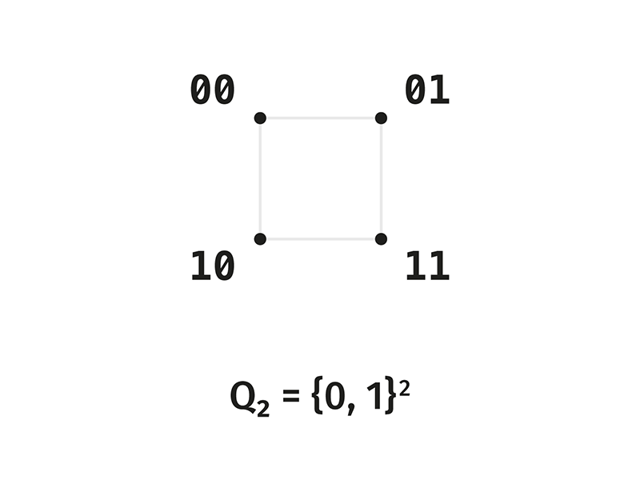

The notation

\[
b_2b_1
\]

means the tuple

\[
(x_2,x_1)=(b_2,b_1).
\]

The notation is compatible with §3.6: the new bit \(x_2\) occupies the higher
position on the left, while the old coordinate \(x_1\) occupies the lower
position on the right.

The coordinate \(x_1\) is the old coordinate of rank \(1\).  
The coordinate \(x_2\) is the new bit added by rank lift.

By the emergence decomposition,

\[
Q_2^*
=
Q_1^*
\sqcup
\{e_2\}
\sqcup
(e_2+Q_1^*).
\]

In bit notation:

\[
Q_2^*
=
\{01\}
\sqcup
\{10\}
\sqcup
\{11\}.
\]

Here

\[
01
\]

is the old manifest layer,

\[
10
\]

is the new bit,

\[
11
\]

is the old layer with the new coordinate load.

## §4.5. Coordinate Swaps

Let

\[
e_1=01,
\qquad
e_2=10.
\]

**Definition 4.4.**
The first coordinate swap is

\[
\sigma_1(x)=x+e_1.
\]

The second coordinate swap is

\[
\sigma_2(x)=x+e_2.
\]

In expanded notation:

\[
\sigma_1:
00\leftrightarrow 01,
\qquad
10\leftrightarrow 11.
\]

\[
\sigma_2:
00\leftrightarrow 10,
\qquad
01\leftrightarrow 11.
\]

Both swaps extend the local law of rank \(1\):

\[
x\mapsto x+1.
\]

At rank \(2\), this law has two independent coordinate realizations.

## §4.6. Coordinate Commutativity

**Statement 4.5.**

\[
\sigma_1\sigma_2=\sigma_2\sigma_1.
\]

Their product equals the complement transition:

\[
\sigma_1\sigma_2(x)=x+11.
\]

**Check.**
For any \(x\in Q_2\):

\[
\sigma_1\sigma_2(x)
=
\sigma_1(x+10)
=
x+10+01
=
x+11.
\]

Similarly,

\[
\sigma_2\sigma_1(x)
=
\sigma_2(x+01)
=
x+01+10
=
x+11.
\]

Therefore

\[
\sigma_1\sigma_2=\sigma_2\sigma_1.
\]

## §4.7. Hamming Relations on \(Q_2\)

In §3, Hamming weight

\[
|x|
\]

was introduced.

On \(Q_2\), Hamming distance is defined through this weight.

**Definition 4.6.**
For \(x,y\in Q_2\),

\[
d_H(x,y)=|x+y|.
\]

The vector \(x+y\) marks the coordinates in which \(x\) and \(y\) differ.

On \(Q_2\), there are two nontrivial Hamming relations:

\[
H_1^{(2)}
=
\{(x,y)\in Q_2^2:x\neq y,\ d_H(x,y)=1\},
\]

\[
H_2^{(2)}
=
\{(x,y)\in Q_2^2:x\neq y,\ d_H(x,y)=2\}.
\]

**Statement 4.7.**

\[
H_1^{(2)}
=
\{(x,x+e_i):x\in Q_2,\ i=1,2\}.
\]

\[
H_2^{(2)}
=
\{(x,x+11):x\in Q_2\}.
\]

**Check.**
If

\[
d_H(x,y)=1,
\]

then

\[
|x+y|=1.
\]

In \(Q_2\), this means

\[
x+y=e_i
\]

for a unique \(i\in\{1,2\}\). Therefore

\[
y=x+e_i.
\]

Conversely, if

\[
y=x+e_i,
\]

then

\[
x+y=e_i
\]

and hence

\[
d_H(x,y)=1.
\]

For distance \(2\), we have

\[
|x+y|=2.
\]

In \(Q_2\), the unique vector of weight \(2\) is

\[
11.
\]

Thus

\[
x+y=11,
\]

whence

\[
y=x+11.
\]

In other words,

\[
H_1^{(2)}
\]

is the edge structure generated by the coordinate swaps

\[
\sigma_1,\sigma_2.
\]

The transitions \(H_1^{(2)}\) are exactly the transitions of the form

\[
x\mapsto \sigma_i(x)=x+e_i.
\]

## §4.8. Graph Reading \(C_4\)

**Definition 4.8.**
The graph reading \(C_4\) on \(Q_2\) is the presentation

\[
\Pi_2^{C_4}
=
(Q_2,H_1^{(2)},\operatorname{id}_{Q_2},\operatorname{rec}_{\operatorname{id}}),
\]

where

\[
\operatorname{rec}_{\operatorname{id}}(x)=(\{x\},\varnothing).
\]

**Statement 4.9.**

\[
(Q_2,H_1^{(2)})\cong C_4.
\]

**Check.**
The relation \(H_1^{(2)}\) connects states that differ in exactly one
coordinate:

\[
00\leftrightarrow 01,
\]

\[
01\leftrightarrow 11,
\]

\[
11\leftrightarrow 10,
\]

\[
10\leftrightarrow 00.
\]

Each vertex has degree \(2\):

\[
\deg(00)=2,
\quad
\deg(01)=2,
\quad
\deg(10)=2,
\quad
\deg(11)=2.
\]

The graph is connected: every vertex can be reached from any other by the
listed edges.

A connected graph on four vertices in which every vertex has degree \(2\) is a
cycle of length \(4\). Therefore

\[
(Q_2,H_1^{(2)})\cong C_4.
\]

Orientation and path composition are not specified here.

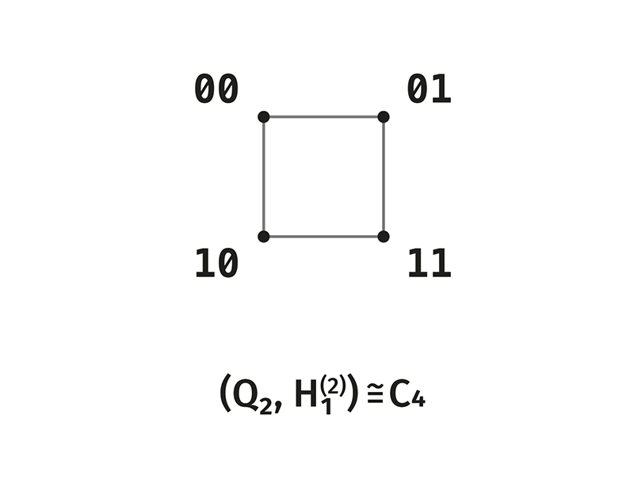

## §4.9. Graph Reading \(2K_2\)

**Definition 4.10.**
The graph reading \(2K_2\) on \(Q_2\) is the presentation

\[
\Pi_2^{2K_2}
=
(Q_2,H_2^{(2)},\operatorname{id}_{Q_2},\operatorname{rec}_{\operatorname{id}}).
\]

**Statement 4.11.**

\[
(Q_2,H_2^{(2)})\cong 2K_2.
\]

**Check.**
The relation \(H_2^{(2)}\) connects each state with its complement state:

\[
x\mapsto x+11.
\]

This gives two pairs:

\[
00\leftrightarrow 11,
\]

\[
01\leftrightarrow 10.
\]

Each vertex has degree \(1\). There are exactly two connected components:

\[
\{00,11\},
\qquad
\{01,10\}.
\]

Each component is the complete graph on two vertices, that is, \(K_2\).
Therefore

\[
(Q_2,H_2^{(2)})\cong K_2\sqcup K_2=2K_2.
\]

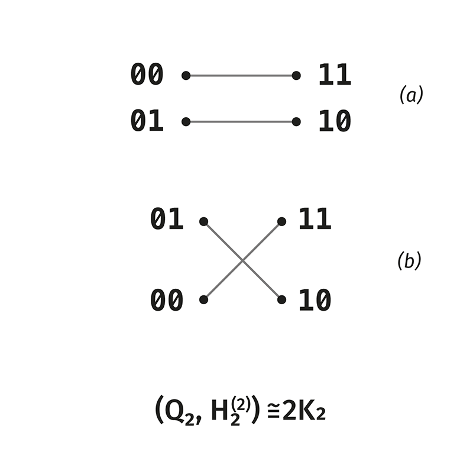

## §4.10. Comparator \(\chi\)

Rank \(1\) contains one polar coordinate. Comparison of two coordinates begins
at rank \(2\).

At rank \(2\), a state

\[
x=(x_2,x_1)
\]

contains two coordinates. Therefore a comparison reading is introduced.

**Definition 4.12.**
The comparator of rank \(2\) is the map

\[
\chi:Q_2\to\mathbb F_2
\]

defined by

\[
\chi(x_2,x_1)=x_2+x_1.
\]

Values:

\[
\chi(00)=0,
\]

\[
\chi(11)=0,
\]

\[
\chi(01)=1,
\]

\[
\chi(10)=1.
\]

The value \(0\) means coincidence of coordinates.  
The value \(1\) means difference of coordinates.

For \(Q_2\),

\[
\chi(x)=|x|\pmod 2.
\]

This formula concerns precisely the two-bit carrier. Generalizing parity
reading to \(Q_n\) requires a separate definition.

## §4.11. Fibers of the Comparator and Comparison Presentation

The comparator \(\chi\) has two fibers:

\[
\operatorname{Eq}
=
\chi^{-1}(0)
=
\{00,11\},
\]

\[
\operatorname{Opp}
=
\chi^{-1}(1)
=
\{01,10\}.
\]

For the comparison presentation, choose the relation

\[
H_2^{(2)}.
\]

Reason for the choice: \(H_2^{(2)}\) is the minimal nontrivial Hamming relation
on \(Q_2\) whose edges lie inside the fibers of \(\chi\).

Indeed,

\[
H_2^{(2)}
=
\{00\leftrightarrow 11,\ 01\leftrightarrow 10\}.
\]

Both links lie inside fibers:

\[
00,11\in \chi^{-1}(0),
\]

\[
01,10\in \chi^{-1}(1).
\]

By contrast, the relation

\[
H_1^{(2)}
\]

connects states from different fibers of \(\chi\), since changing one
coordinate changes the value

\[
x_2+x_1.
\]

Therefore \(H_2^{(2)}\) is the natural relation component for the comparison
presentation: it preserves the internal structure of each fiber.

**Definition 4.13.**  
The comparison presentation of rank \(2\) is

\[
\Pi_2^\chi
=
(Q_2,H_2^{(2)},\chi,\operatorname{rec}_\chi),
\]

where

\[
\operatorname{rec}_\chi(0)
=
(\{00,11\},H_2^{(2)}|_{\{00,11\}}),
\]

\[
\operatorname{rec}_\chi(1)
=
(\{01,10\},H_2^{(2)}|_{\{01,10\}}).
\]

**Statement 4.14.**
The presentation

\[
\Pi_2^\chi
\]

is exact.

**Check.**
We have

\[
\chi^{-1}(0)=\{00,11\},
\]

\[
\chi^{-1}(1)=\{01,10\}.
\]

Recovery datum on each fiber coincides with the induced relation
\(H_2^{(2)}\):

\[
\operatorname{rec}_\chi(0)
=
(\chi^{-1}(0),H_2^{(2)}|_{\chi^{-1}(0)}),
\]

\[
\operatorname{rec}_\chi(1)
=
(\chi^{-1}(1),H_2^{(2)}|_{\chi^{-1}(1)}).
\]

Therefore \(\Pi_2^\chi\) is exact.

The reading \(\chi\) reduces \(Q_2\) to two modes:

\[
\text{coincidence},
\qquad
\text{difference}.
\]

Recovery datum preserves the complement pairs on which these modes are
realized.

## §4.12. Invariance of the Comparison Reading

**Statement 4.15.**
The comparator \(\chi\) is invariant under the complement transition

\[
x\mapsto x+11.
\]

That is,

\[
\chi(x+11)=\chi(x).
\]

**Check.**
Let

\[
x=(x_2,x_1).
\]

Then

\[
x+11=(x_2+1,x_1+1).
\]

Therefore

\[
\chi(x+11)
=
(x_2+1)+(x_1+1)
=
x_2+x_1+1+1
=
x_2+x_1
=
\chi(x).
\]

Thus complement preserves the comparison mode: coincidence remains
coincidence, and difference remains difference.

## §4.13. Total Poles and Puncture at Rank 2

Total poles are defined by a structural property.

**Definition 4.16.**  
A total pole in \(Q_n\) is a state in which all \(n\) coordinates coincide.

There are exactly two such states:

\[
0^n=(0,\ldots,0),
\]

\[
1^n=(1,\ldots,1).
\]

For rank \(2\), the total poles are

\[
00,
\qquad
11.
\]

In other words, in \(Q_2\) these are the states

\[
x_2=x_1.
\]

**Definition 4.17.**  
The punctured coordinate subset of rank \(2\) is

\[
Q_2^\circ
=
Q_2\setminus\{00,11\}.
\]

That is,

\[
Q_2^\circ=\{01,10\}.
\]

**Definition 4.18.**  
Rank-2 puncture is the transition from the full coordinate carrier \(Q_2\) to
the subset \(Q_2^\circ\), obtained by excluding total poles:

\[
Q_2
\rightsquigarrow
Q_2^\circ
=
Q_2\setminus\{00,11\}.
\]

Here puncture means the transition from the full coordinate carrier to a
distinguished subset.

The full carrier \(Q_2\) preserves the total poles

\[
00,\qquad 11,
\]

while \(Q_2^\circ\) fixes the active mixed residue of rank \(2\).

After choosing a relation on \(Q_2^\circ\), the corresponding pair becomes a
relational subcarrier.

## §4.14. Central Seam

**Definition 4.19.**
The central seam of rank \(2\) is the subcarrier

\[
A_2
=
(\{01,10\},H_2^{(2)}|_{\{01,10\}}).
\]

In graph notation:

\[
01\leftrightarrow 10.
\]

Thus

\[
A_2
\]

is the punctured coordinate subset \(Q_2^\circ\), equipped with the complement
relation.

**Statement 4.20.**
The central seam \(A_2\) has type \(K_2\).

**Check.**
By \(K_2\) we mean the complete graph on two vertices.

The carrier of the seam,

\[
\{01,10\},
\]

contains two vertices. Between them there is one unoriented edge:

\[
01\leftrightarrow 10.
\]

Therefore

\[
A_2\cong K_2.
\]

At rank \(2\), puncture defines a two-point axis. At rank \(3\), puncture of
the total poles in \(Q_3\) defines a six-point mixed carrier.

## §4.15. Full Graph Reading \(K_4\)

**Definition 4.21.**
The full relation reading on \(Q_2\) is given by the relation

\[
R_{K_4}^{(2)}
=
\{(x,y)\in Q_2^2:x\neq y\}.
\]

The corresponding presentation is

\[
\Pi_2^{K_4}
=
(Q_2,R_{K_4}^{(2)},\operatorname{id}_{Q_2},\operatorname{rec}_{\operatorname{id}}).
\]

**Statement 4.22.**

\[
(Q_2,R_{K_4}^{(2)})\cong K_4.
\]

**Check.**
In \(R_{K_4}^{(2)}\), each vertex of \(Q_2\) is connected to every other
vertex:

\[
x\neq y
\quad\Longrightarrow\quad
(x,y)\in R_{K_4}^{(2)}.
\]

The carrier \(Q_2\) has four states. The complete graph on four vertices is
\(K_4\). Therefore

\[
(Q_2,R_{K_4}^{(2)})\cong K_4.
\]

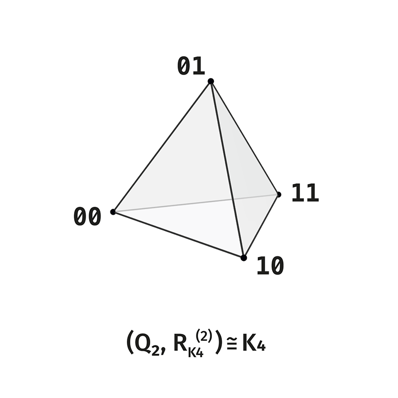

## §4.16. Simplex Sectors

Fix two three-point carrier subsets that contain the central seam and exactly
one total pole. Their relation structure is given by the partial closure
\(R_{K_4-e}^{(2)}\).

**Definition 4.23.**
The lower sector is

\[
\Delta_{\wedge}
=
\{00,01,10\}.
\]

The upper sector is

\[
\Delta_{\vee}
=
\{11,01,10\}.
\]

Their intersection is

\[
\Delta_{\wedge}\cap\Delta_{\vee}
=
\{01,10\}.
\]

Therefore both sectors have the same central seam

\[
A_2=\{01,10\}.
\]

**Statement 4.24.**  
Among the three-point subsets of \(Q_2\), exactly two contain the central seam
\(A_2\).

These are

\[
\Delta_{\wedge}
=
A_2\cup\{00\},
\]

\[
\Delta_{\vee}
=
A_2\cup\{11\}.
\]

**Check.**  
A three-point subset containing

\[
A_2=\{01,10\}
\]

must have the form

\[
A_2\cup\{z\},
\]

where

\[
z\in Q_2\setminus A_2.
\]

But

\[
Q_2\setminus A_2=\{00,11\}.
\]

Therefore there are exactly two possible choices:

\[
z=00
\]

or

\[
z=11.
\]

They give \(\Delta_{\wedge}\) and \(\Delta_{\vee}\).

Each of these two sectors contains exactly one total pole; the carrier of the
seam \(A_2\) consists of \(01\) and \(10\).

## §4.17. Partial Closure \(K_4-e\)

**Definition 4.25.**
The relation

\[
R_{K_4-e}^{(2)}
\]

is defined by deleting the total-pole diagonal from the full relation reading
\(K_4\):

\[
R_{K_4-e}^{(2)}
=
R_{K_4}^{(2)}
\setminus
\{(00,11),(11,00)\}.
\]

The corresponding presentation is

\[
\Pi_2^{K_4-e}
=
(Q_2,R_{K_4-e}^{(2)},\operatorname{id}_{Q_2},\operatorname{rec}_{\operatorname{id}}).
\]

**Statement 4.26.**

\[
(Q_2,R_{K_4-e}^{(2)})\cong K_4-e.
\]

**Check.**
The graph \(K_4\) has six unoriented edges between four vertices.

One unoriented edge is deleted:

\[
00\leftrightarrow 11.
\]

Five edges remain:

\[
00\leftrightarrow 01,
\]

\[
00\leftrightarrow 10,
\]

\[
11\leftrightarrow 01,
\]

\[
11\leftrightarrow 10,
\]

\[
01\leftrightarrow 10.
\]

This is the complete graph on four vertices without one edge. Therefore

\[
(Q_2,R_{K_4-e}^{(2)})\cong K_4-e.
\]

**Corollary 4.27.**  
In the graph reading \(K_4-e\), the carrier \(Q_2\) is read as two triangular
scenes glued along the central seam.

**Check.**  
There is only one deleted edge in \(R_{K_4-e}^{(2)}\):

\[
00\leftrightarrow 11.
\]

The lower sector is

\[
\Delta_{\wedge}=\{00,01,10\}.
\]

The pair \(\{00,11\}\) is absent from \(\Delta_{\wedge}\). All three pairs of
its vertices remain connected:

\[
00\leftrightarrow 01,
\]

\[
00\leftrightarrow 10,
\]

\[
01\leftrightarrow 10.
\]

Therefore \(\Delta_{\wedge}\) is a triangle.

The upper sector is

\[
\Delta_{\vee}=\{11,01,10\}.
\]

The pair \(\{00,11\}\) is absent from \(\Delta_{\vee}\). All three pairs of its
vertices remain connected:

\[
11\leftrightarrow 01,
\]

\[
11\leftrightarrow 10,
\]

\[
01\leftrightarrow 10.
\]

Therefore \(\Delta_{\vee}\) is a triangle.

The common edge of the two triangles is

\[
01\leftrightarrow 10.
\]

This is the central seam \(A_2\).

The relation on the simplex sectors is induced from the partial closure:

\[
R_{\Delta_{\wedge}}
=
R_{K_4-e}^{(2)}
\cap
(\Delta_{\wedge}\times\Delta_{\wedge}),
\]

\[
R_{\Delta_{\vee}}
=
R_{K_4-e}^{(2)}
\cap
(\Delta_{\vee}\times\Delta_{\vee}).
\]

Thus the simplex sectors as relation carriers have the form

\[
(\Delta_{\wedge},R_{\Delta_{\wedge}}),
\qquad
(\Delta_{\vee},R_{\Delta_{\vee}}).
\]

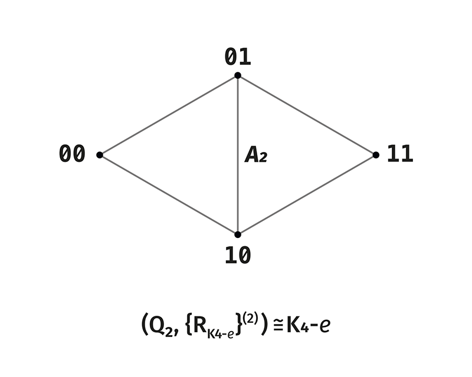

## §4.18. Relation Readings of Rank 2

On the same carrier

\[
Q_2=\{00,01,10,11\}
\]

different relation readings have been obtained:

\[
C_4,
\]

\[
2K_2,
\]

\[
K_4,
\]

\[
K_4-e.
\]

They have one carrier but different relations.

\[
C_4
\]

reads \(Q_2\) through change of one coordinate.

\[
2K_2
\]

reads \(Q_2\) through complement pairs.

\[
K_4
\]

reads \(Q_2\) as full connectivity of four states.

\[
K_4-e
\]

reads \(Q_2\) as two triangular scenes glued along the central seam.

These readings are different relation presentations of one carrier.

## §4.19. Closure Package of Rank \(2\)

The rank-2 comparison package fixes all relation presentations constructed on
\(Q_2\):

\[
\mathfrak C_2
=
\left(
Q_2,
\Pi_2^{C_4},
\Pi_2^{2K_2},
\Pi_2^\chi,
\Pi_2^{K_4},
\Pi_2^{K_4-e},
A_2
\right).
\]

Here \(A_2=\{01,10\}\) is the central seam of §4.14.

\(\mathfrak C_2\) has the status of a structure/package. In the sense of §0.5,
a presentation has the form \((X,R,q,\operatorname{rec})\);
\(\mathfrak C_2\) gives the closure name of the rank-2 comparison layer for
the five already constructed presentations.

# §5. Rank 3: Admissible Carrier

## §5.1. Three-Bit Carrier

**Definition 5.1.**
The three-bit carrier is

\[
Q_3=\mathbb F_2^3.
\]

In expanded notation:

\[
Q_3=
\{000,001,010,011,100,101,110,111\}.
\]

The notation

\[
b_3b_2b_1
\]

means the tuple

\[
(x_3,x_2,x_1)=(b_3,b_2,b_1).
\]

The notation is compatible with §3.6 for rank lift: the new bit \(x_3\)
occupies the higher position on the left, and the coordinates \(x_2,x_1\) are
inherited from \(Q_2\).

## §5.2. Emergence Decomposition of Rank 3

By Statement 3.4 (§3.7), for rank lift at \(n=3\):

\[
Q_3^*
=
Q_2^*
\sqcup
\{e_3\}
\sqcup
(e_3+Q_2^*).
\]

Here

\[
e_3=100.
\]

Since

\[
Q_2^*=\{01,10,11\},
\]

in three-bit notation we obtain:

\[
Q_3^*
=
\{001,010,011\}
\sqcup
\{100\}
\sqcup
\{101,110,111\}.
\]

The first block is the old manifest layer:

\[
\{001,010,011\}.
\]

The second block is the new bit:

\[
\{100\}.
\]

The third block is the old layer with the new coordinate load:

\[
\{101,110,111\}.
\]

This is emergence order. It shows the order in which coordinate roles appear;
the shell role of states is defined after the carrier has been assembled.

## §5.3. Total Poles in \(Q_3\)

By Definition 4.16 (§4.13), a total pole in \(Q_n\) is a state in which all
\(n\) coordinates coincide.

In \(Q_3\), there are two such states:

\[
0^3=000,
\]

\[
1^3=111.
\]

They are called the total poles of rank \(3\).

The state

\[
000
\]

is the lower total pole.

The state

\[
111
\]

is the upper total pole.

Both states are homogeneous: they contain no mixed distribution of coordinates.

## §5.4. Mixed States

At rank \(2\), mixed states formally formed the punctured carrier
\(Q_2^\circ = \{01, 10\}\). At rank \(3\), this set ceases to be a simple
two-point axis.

**Definition 5.2.**
A state

\[
x\in Q_n
\]

is called a mixed state if it lies outside the total-pole pair.

The set of mixed states of rank \(3\) is

\[
Q_3\setminus\{000,111\}.
\]

In expanded notation:

\[
\{001,010,011,100,101,110\}.
\]

## §5.5. Admissible Carrier

In §4.13, puncture was introduced as the transition from the full coordinate
carrier to the subset obtained by excluding total poles. Now the general form
of this transition is fixed.

**Definition 5.3.**  
The punctured coordinate subset of rank \(n\) is

\[
Q_n^\circ
=
Q_n\setminus\{0^n,1^n\}.
\]

Rank-\(n\) puncture is the transition

\[
Q_n
\rightsquigarrow
Q_n^\circ
\]

from the full coordinate carrier to the subset obtained by excluding the two
total poles.

The full carrier \(Q_n\) is preserved as the coordinate carrier of rank \(n\).
The subset \(Q_n^\circ\) fixes the active mixed residue of this rank.

After choosing a relation \(R\) on \(Q_n^\circ\), the pair

\[
(Q_n^\circ,R)
\]

becomes a relational carrier. Before a relation is chosen, \(Q_n^\circ\) is
only a distinguished coordinate subset.

**Definition 5.4.**  
The admissible carrier of rank \(3\) is the punctured coordinate subset of
rank \(3\):

\[
X_{\mathrm{adm}}
=
Q_3^\circ
=
Q_3\setminus\{000,111\}.
\]

That is,

\[
X_{\mathrm{adm}}
=
\{001,010,011,100,101,110\}.
\]

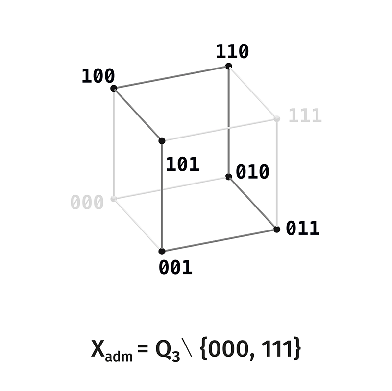

In §5, \(X_{\mathrm{adm}}\) is introduced as a carrier set.

The full carrier

\[
Q_3
\]

remains the full coordinate carrier of rank \(3\). The subset
\(X_{\mathrm{adm}}\) is its active mixed residue.

## §5.6. Shell Decomposition of \(X_{\mathrm{adm}}\)

By Definition 3.5 (§3.9), the shell of rank \(n\) is
\(S_k^{(n)} = \{x \in Q_n : |x| = k\}\). For \(n = 3\):

\[
S_k^{(3)}=\{x\in Q_3:|x|=k\}.
\]

The full shell decomposition of \(Q_3\) is

\[
S_0^{(3)}=\{000\},
\]

\[
S_1^{(3)}=\{001,010,100\},
\]

\[
S_2^{(3)}=\{011,101,110\},
\]

\[
S_3^{(3)}=\{111\}.
\]

The total poles are the extreme shells:

\[
S_0^{(3)}=\{000\},
\qquad
S_3^{(3)}=\{111\}.
\]

After puncture, the middle shells remain:

\[
X_{\mathrm{adm}}
=
S_1^{(3)}
\sqcup
S_2^{(3)}.
\]

That is,

\[
X_{\mathrm{adm}}
=
\{001,010,100\}
\sqcup
\{011,101,110\}.
\]

## §5.7. Rank 2 Puncture and Rank 3 Puncture

Rank-2 puncture:

\[
Q_2\setminus\{00,11\}
=
\{01,10\}.
\]

The residue has two states and returns a carrier of type \(K_2\).

Rank-3 puncture:

\[
Q_3\setminus\{000,111\}
=
\{001,010,011,100,101,110\}.
\]

**Statement 5.5.**  
The cardinality of the admissible carrier of rank \(3\) is \(6\):

\[
|X_{\mathrm{adm}}| = 2^3 - 2 = 6.
\]

At rank \(2\), the cardinality of the punctured coordinate subset is \(2\).

**Check.**  
For rank \(2\):

\[
2^2-2=2.
\]

After deleting total poles, two states remain.

For rank \(3\):

\[
2^3-2=6.
\]

After deleting total poles, six states remain.

**Remark.**  
Unlike rank \(2\), where puncture leaves a two-point subset, rank \(3\) first
gives a six-point mixed carrier:

\[
X_{\mathrm{adm}}
=
Q_3\setminus\{000,111\}.
\]

Section §5 fixes the carrier layer.

## §5.8. Complement on \(X_{\mathrm{adm}}\)

On \(Q_3\), there is bitwise complement:

\[
\overline{x}=x+111.
\]

It sends the total poles to each other:

\[
000\leftrightarrow 111.
\]

It also preserves the admissible carrier:

\[
x\in X_{\mathrm{adm}}
\quad\Longrightarrow\quad
\overline{x}\in X_{\mathrm{adm}}.
\]

**Statement 5.6.**
Complement sends the shell \(S_1^{(3)}\) to the shell \(S_2^{(3)}\), and
conversely:

\[
\overline{S_1^{(3)}}=S_2^{(3)},
\]

\[
\overline{S_2^{(3)}}=S_1^{(3)}.
\]

**Check.**
In general, complement in \(Q_n\) changes the weight of \(x\) to \(n-|x|\).
For \(n=3\), this means that if

\[
|x|=1,
\]

then \(|\overline{x}| = 3 - 1 = 2\). If

\[
|x|=2,
\]

then \(|\overline{x}| = 3 - 2 = 1\). Therefore

\[
S_1^{(3)}\leftrightarrow S_2^{(3)}.
\]

In expanded notation:

\[
001\leftrightarrow 110,
\]

\[
010\leftrightarrow 101,
\]

\[
100\leftrightarrow 011.
\]

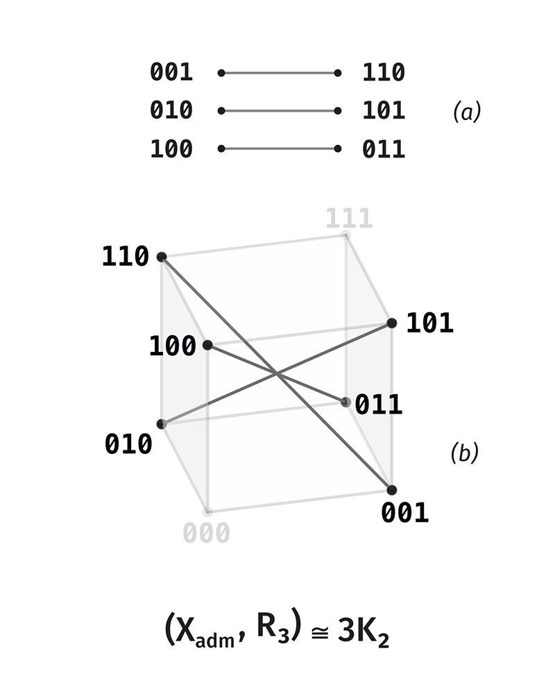

At this level, complement is an involution \((x \mapsto \overline{x} \mapsto x)\),
extending the complement transition introduced in §4.

# §6. Relation Grammar of the Admissible Carrier

## §6.1. Carrier of §6

Section §6 uses the carrier constructed in §5:

\[
X_{\mathrm{adm}}
=
Q_3\setminus\{000,111\}
=
S_1^{(3)}\sqcup S_2^{(3)}.
\]

The carrier of §6 is \(X_{\mathrm{adm}}\). The new layer defines relations
between already constructed admissible states.

## §6.2. Hamming Distance on \(X_{\mathrm{adm}}\)

By analogy with Definition 4.6 (§4.7), Hamming distance on \(Q_n\) is given by

\[
d_H(x,y)=|x+y|,
\]

where addition is taken in \(\mathbb F_2^n\), and \(|x+y|\) denotes Hamming
weight. Section §6 uses the case \(n=3\).

For distinct

\[
x,y\in X_{\mathrm{adm}},
\]

exactly three values are possible:

\[
d_H(x,y)=1,
\qquad
d_H(x,y)=2,
\qquad
d_H(x,y)=3.
\]

**Definition 6.1.**  
For

\[
k\in\{1,2,3\},
\]

the relation \(R_k\) on \(X_{\mathrm{adm}}\) is defined by

\[
R_k
=
\{(x,y)\in X_{\mathrm{adm}}\times X_{\mathrm{adm}}:
x\neq y,\ d_H(x,y)=k\}.
\]

Each \(R_k\) is symmetric and irreflexive.

## §6.3. Presentation for Hamming Graph Readings

For each

\[
k\in\{1,2,3\},
\]

consider the identity graph reading

\[
\Pi_{3,k}
=
\bigl(
X_{\mathrm{adm}},
R_k,
\operatorname{id}_{X_{\mathrm{adm}}},
\operatorname{rec}_{\operatorname{id}}
\bigr).
\]

By §4.3, for an identity graph reading with an irreflexive relation \(R\), the
recovery datum has the form

\[
\operatorname{rec}_{\operatorname{id}}(x)
=
(\{x\},\varnothing).
\]

Since \(R_k\) is irreflexive, this formula applies to each \(\Pi_{3,k}\).
Therefore all

\[
\Pi_{3,1},
\qquad
\Pi_{3,2},
\qquad
\Pi_{3,3}
\]

are exact identity graph readings.

## §6.4. Relation \(R_1\): One-Step Hamming Relation

The relation \(R_1\) connects states that differ in exactly one coordinate:

\[
(x,y)\in R_1
\quad\Longleftrightarrow\quad
d_H(x,y)=1.
\]

The unoriented edges of \(R_1\) are

\[
001\leftrightarrow 011,
\]

\[
011\leftrightarrow 010,
\]

\[
010\leftrightarrow 110,
\]

\[
110\leftrightarrow 100,
\]

\[
100\leftrightarrow 101,
\]

\[
101\leftrightarrow 001.
\]

These edges form a six-cycle:

\[
001
\leftrightarrow
011
\leftrightarrow
010
\leftrightarrow
110
\leftrightarrow
100
\leftrightarrow
101
\leftrightarrow
001.
\]

**Statement 6.2.**

\[
(X_{\mathrm{adm}},R_1)\cong C_6.
\]

**Check.**  
The listed sequence passes through all six vertices of \(X_{\mathrm{adm}}\) and
returns to the starting vertex. Each vertex has exactly two \(R_1\)-adjacent
vertices. Therefore the graph reading \((X_{\mathrm{adm}},R_1)\) is a
connected \(2\)-regular graph on six vertices. Hence

\[
(X_{\mathrm{adm}},R_1)\cong C_6.
\]

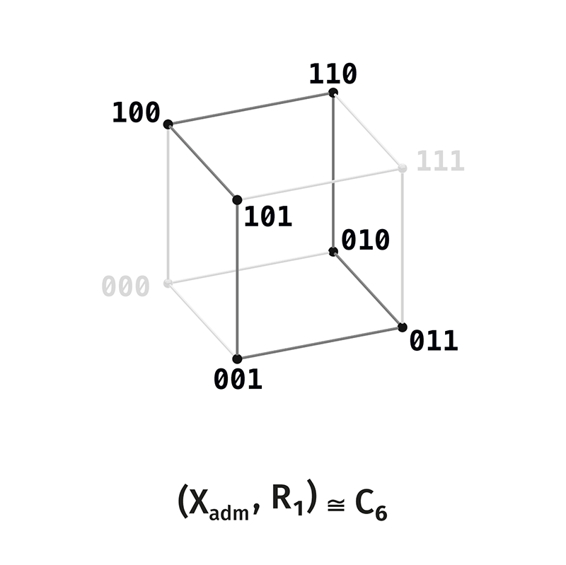

**Remark.**  
In the full \(Q_3\), each vertex has three one-step Hamming neighbors. In the
transition to \(X_{\mathrm{adm}}\), vertices from \(S_1^{(3)}\) lose adjacency
with \(000\), and vertices from \(S_2^{(3)}\) lose adjacency with \(111\). The
remaining one-step adjacency gives \(C_6\).

In §6, \(C_6\) is only a graph reading on \(X_{\mathrm{adm}}\). Orientation and
transport on this cycle are not introduced.

## §6.5. Relation \(R_2\): Two-Step Hamming Relation

The relation \(R_2\) connects states that differ in exactly two coordinates:

\[
(x,y)\in R_2
\quad\Longleftrightarrow\quad
d_H(x,y)=2.
\]

**Statement 6.3.**

\[
(X_{\mathrm{adm}},R_2)
\cong
K_3\sqcup K_3.
\]

**Check.**  
Let

\[
x,y\in S_1^{(3)},
\qquad
x\neq y.
\]

Both states have weight \(1\), and their ones stand in different coordinates.
Therefore \(x+y\) has weight \(2\), that is,

\[
d_H(x,y)=2.
\]

Thus all distinct pairs inside \(S_1^{(3)}\) are connected by \(R_2\), and
\(S_1^{(3)}\) gives a component \(K_3\).

Now let

\[
x,y\in S_2^{(3)},
\qquad
x\neq y.
\]

Both states have weight \(2\), and their zeros stand in different coordinates.
When adding \(x+y\), exactly two ones remain. Therefore

\[
d_H(x,y)=2.
\]

Thus \(S_2^{(3)}\) gives the second component \(K_3\).

If

\[
x\in S_1^{(3)},
\qquad
y\in S_2^{(3)},
\]

then only the values

\[
d_H(x,y)=1
\]

or

\[
d_H(x,y)=3
\]

are possible. The value \(2\) does not occur between shells. Hence

\[
(X_{\mathrm{adm}},R_2)
\cong
K_3\sqcup K_3.
\]

Each \(K_3\) contains \(3\) edges, so

\[
|E(R_2)|=6.
\]

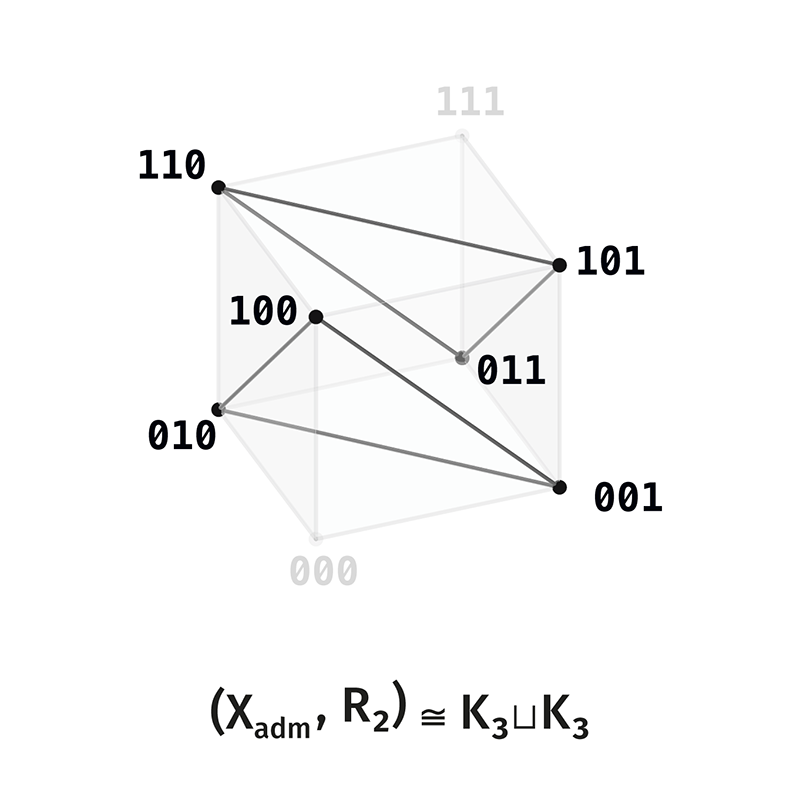

## §6.6. Relation \(R_3\): Complement Relation

The relation \(R_3\) connects states that differ in all three coordinates:

\[
(x,y)\in R_3
\quad\Longleftrightarrow\quad
d_H(x,y)=3.
\]

For three-bit states, this is equivalent to

\[
y=x+111.
\]

By Statement 5.6 (§5.8), complement involution sends

\[
S_1^{(3)}
\leftrightarrow
S_2^{(3)}.
\]

It partitions \(X_{\mathrm{adm}}\) into three complement pairs:

\[
001\leftrightarrow110,
\]

\[
010\leftrightarrow101,
\]

\[
100\leftrightarrow011.
\]

**Statement 6.4.**

\[
(X_{\mathrm{adm}},R_3)\cong 3K_2.
\]

**Check.**  
For each

\[
x\in X_{\mathrm{adm}},
\]

the state

\[
x+111
\]

also belongs to \(X_{\mathrm{adm}}\), and

\[
d_H(x,x+111)=3.
\]

Since

\[
(x+111)+111=x,
\]

complement is an involution. Therefore \(X_{\mathrm{adm}}\) is partitioned
into three disjoint pairs:

\[
\{001,110\},
\qquad
\{010,101\},
\qquad
\{100,011\}.
\]

Each pair has type \(K_2\), and relation \(R_3\) gives no edges between
different complement pairs. Therefore

\[
(X_{\mathrm{adm}},R_3)\cong 3K_2.
\]

**Remark.**  
\(R_1\) and \(R_3\) use the same carrier \(X_{\mathrm{adm}}\), but define
different relation readings. \(R_1\) connects one-step Hamming neighbors, while
\(R_3\) connects complement pairs.

## §6.7. Relation Grammar as a Partition of Pairs

**Statement 6.5.**  
The Hamming relations

\[
R_1,\quad R_2,\quad R_3
\]

partition the set of all unoriented pairs of distinct states of
\(X_{\mathrm{adm}}\).

**Check.**  
For any distinct

\[
x,y\in X_{\mathrm{adm}}\subset Q_3,
\]

the distance \(d_H(x,y)\) takes one of the values

\[
1,\quad 2,\quad 3.
\]

There are no other positive Hamming distances in \(Q_3\).

The pair \(\{x,y\}\) belongs to exactly one relation \(R_k\), since the value
of \(d_H(x,y)\) is unique. Hence the relations \(R_1,R_2,R_3\) are pairwise
disjoint and together cover all pairs of distinct states.

Control count:

\[
\binom{|X_{\mathrm{adm}}|}{2}
=
\binom{6}{2}
=
15.
\]

From Statements 6.2-6.4:

\[
|E(R_1)|=6,
\]

\[
|E(R_2)|=6,
\]

\[
|E(R_3)|=3.
\]

In total:

\[
6+6+3=15.
\]

Therefore

\[
\mathcal R_{\mathrm{adm}}^{(3)}
=
\{R_1,R_2,R_3\}
\]

is the full static Hamming relation grammar of \(X_{\mathrm{adm}}\).

## §6.8. Emergence Order, Shell Order, and Relation Order

In §5, emergence order described how \(Q_3^*\) arises from the rank lift

\[
Q_2\to Q_3.
\]

In §5, shell order described the role of states inside the already assembled
\(Q_3\):

\[
S_1^{(3)},
\qquad
S_2^{(3)}.
\]

In §6, relation order is used, defined by Hamming distance:

\[
d_H=1,
\qquad
d_H=2,
\qquad
d_H=3.
\]

The relation \(R_1\) alternates shells and gives

\[
C_6.
\]

The relation \(R_2\) reads each shell separately and gives

\[
K_3\sqcup K_3.
\]

The relation \(R_3\) connects shells by complement pairs and gives

\[
3K_2.
\]

The emergence order of rank \(3\) remains fixed. Section §6 constructs
relation readings on the already assembled carrier.

# §7. Octahedral Relation Carrier

## §7.1. Complement Pairs as Non-Adjacency Blocks

By §6, the relation \(R_3\) defines three complement pairs:

\[
001\leftrightarrow110,
\]

\[
010\leftrightarrow101,
\]

\[
100\leftrightarrow011.
\]

To distinguish them from the emergence blocks \(B_n\) of §3.6, denote these
pairs by

\[
\beta_1,\quad \beta_2,\quad \beta_3.
\]

**Definition 7.1.**  
The complement-pair partition of the carrier \(X_{\mathrm{adm}}\) is the
decomposition

\[
X_{\mathrm{adm}}
=
\beta_1\sqcup\beta_2\sqcup\beta_3,
\]

where

\[
\beta_1=\{001,110\},
\]

\[
\beta_2=\{010,101\},
\]

\[
\beta_3=\{100,011\}.
\]

Each \(\beta_i\) is one component of the graph reading

\[
(X_{\mathrm{adm}},R_3)\cong 3K_2.
\]

In §7, these pairs define the parts of the complete tripartite graph reading.
In the relation \(R_{12}\), there are no edges inside each \(\beta_i\); edges
are present between distinct \(\beta_i\).

## §7.2. Union Relation \(R_{12}\)

**Definition 7.2.**  
On \(X_{\mathrm{adm}}\), define the relation

\[
R_{12}
=
R_1\cup R_2.
\]

Thus for

\[
x,y\in X_{\mathrm{adm}},
\qquad
x\neq y,
\]

we have

\[
(x,y)\in R_{12}
\]

if and only if

\[
d_H(x,y)=1
\]

or

\[
d_H(x,y)=2.
\]

By Statement 6.5, the relations \(R_1,R_2,R_3\) partition all pairs of
distinct states of \(X_{\mathrm{adm}}\). Therefore \(R_{12}\) can be read as
the residue relative to the complement relation \(R_3\): it contains exactly
the pairs that are not complement pairs.

Equivalently, since for \(x\neq y\) in \(Q_3\)

\[
d_H(x,y)\in\{1,2,3\},
\]

and the condition

\[
d_H(x,y)=3
\]

is equivalent to

\[
y=x+111,
\]

we have:

\[
(x,y)\in R_{12}
\quad\Longleftrightarrow\quad
x\neq y
\ \text{and}
y\neq x+111.
\]

In other words, \(R_{12}\) connects all distinct admissible states except the
complement state of a given \(x\).

## §7.3. Presentation for \(R_{12}\)

On the relation

\[
R_{12},
\]

define the identity graph reading

\[
\Pi_{12}
=
\bigl(
X_{\mathrm{adm}},
R_{12},
\operatorname{id}_{X_{\mathrm{adm}}},
\operatorname{rec}_{\operatorname{id}}
\bigr).
\]

The relations \(R_1\) and \(R_2\) are symmetric and irreflexive. Therefore
their union

\[
R_{12}=R_1\cup R_2
\]

is also symmetric and irreflexive.

By §4.3, for an identity graph reading with an irreflexive relation \(R\), the
recovery datum has the form

\[
\operatorname{rec}_{\operatorname{id}}(x)
=
(\{x\},\varnothing).
\]

Since \(R_{12}\) is irreflexive, this formula applies to \(\Pi_{12}\).
Therefore \(\Pi_{12}\) is an exact identity graph reading.

The structural object of §7 is the presentation \(\Pi_{12}\). The graph
\(K_{2,2,2}\) and the octahedral \(1\)-skeleton are graph readings of this
presentation.

## §7.4. The Graph \(K_{2,2,2}\)

Before formulating the statement, fix the target graph reading.

**Definition 7.3.**  
The graph

\[
K_{2,2,2}
\]

is the complete tripartite graph with three parts of size \(2\). This means
that the vertex set is decomposed as

\[
V
=
V_1\sqcup V_2\sqcup V_3,
\qquad
|V_1|=|V_2|=|V_3|=2,
\]

with no edges inside each \(V_i\), and with every two vertices from different
parts connected by an edge.

## §7.5. Check \(R_{12}\cong K_{2,2,2}\)

**Statement 7.4.**

\[
(X_{\mathrm{adm}},R_{12})
\cong
K_{2,2,2}.
\]

**Check.**  
We show that the complement-pair partition

\[
\beta_1,\beta_2,\beta_3
\]

plays the role of the parts

\[
V_1,V_2,V_3
\]

from Definition 7.3.

Use the decomposition

\[
X_{\mathrm{adm}}
=
\beta_1\sqcup\beta_2\sqcup\beta_3,
\]

where

\[
\beta_1=\{001,110\},
\]

\[
\beta_2=\{010,101\},
\]

\[
\beta_3=\{100,011\}.
\]

Inside each \(\beta_i\), there is exactly one pair of states. This pair is a
complement pair, so its Hamming distance is \(3\). Therefore it belongs to
\(R_3\), but not to

\[
R_{12}=R_1\cup R_2.
\]

Thus there are no \(R_{12}\)-edges inside each part \(\beta_i\).

Now take

\[
x\in \beta_i,
\qquad
y\in \beta_j,
\qquad
i\neq j.
\]

Then \(y\) lies outside the complement pair of \(x\). Therefore

\[
d_H(x,y)\neq 3.
\]

Since

\[
x\neq y
\]

and both states lie in \(Q_3\), only two possible values remain:

\[
d_H(x,y)=1
\]

or

\[
d_H(x,y)=2.
\]

By definition of \(R_{12}\), this gives

\[
(x,y)\in R_{12}.
\]

Therefore vertices from different \(\beta_i\) are connected by all possible
edges, while inside one \(\beta_i\) there are no edges. This is exactly the
structure

\[
K_{2,2,2}.
\]

**Control count.**  
From §6:

\[
|E(R_1)|=6,
\qquad
|E(R_2)|=6.
\]

By Statement 6.5, the relations \(R_1\) and \(R_2\) are disjoint. Therefore

\[
|E(R_{12})|
=
|E(R_1)|+|E(R_2)|
=
6+6
=
12.
\]

On the other hand, in \(K_{2,2,2}\) there are three pairs of parts, and between
each pair of parts there are

\[
2\cdot2=4
\]

edges. Therefore

\[
|E(K_{2,2,2})|
=
3\cdot4
=
12.
\]

The count agrees with the structural check.

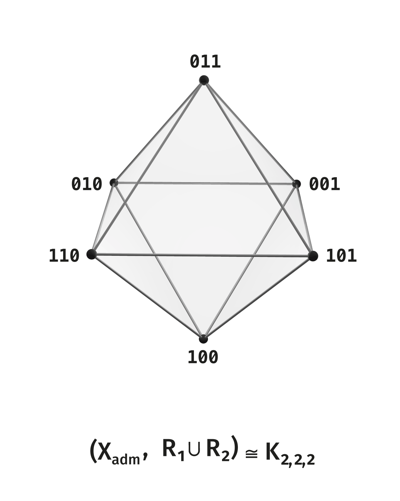

## §7.6. \(K_{2,2,2}\) as the \(1\)-Skeleton of the Octahedron

**Definition 7.5.**  
Let

\[
O_3^{(1)}
\]

denote the graph of the \(1\)-skeleton of the standard octahedron.

Its vertices can be written as

\[
\{+e_1,-e_1,+e_2,-e_2,+e_3,-e_3\}.
\]

Two distinct vertices are connected by an edge if and only if they are not
opposite:

\[
u\sim v
\quad\Longleftrightarrow\quad
u\neq v
\ \text{and}
u\neq -v.
\]

The opposite pairs are

\[
E_1=\{+e_1,-e_1\},
\]

\[
E_2=\{+e_2,-e_2\},
\]

\[
E_3=\{+e_3,-e_3\}.
\]

**Statement 7.6.**

\[
K_{2,2,2}
\cong
O_3^{(1)}.
\]

**Check.**  
Decompose the vertices of \(O_3^{(1)}\) into three opposite pairs:

\[
E_1=\{+e_1,-e_1\},
\]

\[
E_2=\{+e_2,-e_2\},
\]

\[
E_3=\{+e_3,-e_3\}.
\]

Inside each pair \(E_i\), the vertices are opposite, so there is no edge
between them.

If two vertices lie in different pairs \(E_i\) and \(E_j\), then they are not
opposite. By definition of \(O_3^{(1)}\), there is an edge between them.

Therefore \(O_3^{(1)}\) is the complete tripartite graph with three parts of
size \(2\):

\[
O_3^{(1)}
\cong
K_{2,2,2}.
\]

**Corollary 7.7.**

\[
(X_{\mathrm{adm}},R_{12})
\cong
O_3^{(1)}.
\]

**Check.**  
By Statement 7.4:

\[
(X_{\mathrm{adm}},R_{12})
\cong
K_{2,2,2}.
\]

By Statement 7.6:

\[
K_{2,2,2}
\cong
O_3^{(1)}.
\]

Transitivity of isomorphism gives

\[
(X_{\mathrm{adm}},R_{12})
\cong
O_3^{(1)}.
\]

## §7.7. Octahedral Graph Reading on \(X_{\mathrm{adm}}\)

**Definition 7.8.**  
The octahedral graph reading package on \(X_{\mathrm{adm}}\) is the structure

\[
\mathcal O_{12}
=
\bigl(
\Pi_{12},
[(X_{\mathrm{adm}},R_{12})\cong O_3^{(1)}]
\bigr),
\]

where \(\Pi_{12}\) is the presentation from §7.3, and the second component
means the isomorphism type

\[
(X_{\mathrm{adm}},R_{12})
\cong
O_3^{(1)}
\]

from Corollary 7.7.

\(\mathcal O_{12}\) has package status. Its presentation component is given by
\(\Pi_{12}^{O}\).

A concrete drawing of the octahedron is obtained only after choosing an
isomorphism

\[
\varphi:(X_{\mathrm{adm}},R_{12})\to O_3^{(1)}.
\]

The octahedral graph reading itself does not depend on one chosen drawing.

**Remark.**  
Graph isomorphism preserves non-adjacency. The non-edges of the graph reading

\[
(X_{\mathrm{adm}},R_{12})
\]

are exactly the complement pairs

\[
\beta_1,\quad \beta_2,\quad \beta_3.
\]

The non-edges of \(O_3^{(1)}\) are exactly the opposite pairs

\[
E_1,\quad E_2,\quad E_3.
\]

Therefore any isomorphism

\[
\varphi:(X_{\mathrm{adm}},R_{12})\to O_3^{(1)}
\]

induces a bijection

\[
\{\beta_1,\beta_2,\beta_3\}
\to
\{E_1,E_2,E_3\}.
\]

One admissible choice of isomorphism is

\[
001\mapsto +e_1,
\qquad
110\mapsto -e_1,
\]

\[
010\mapsto +e_2,
\qquad
101\mapsto -e_2,
\]

\[
100\mapsto +e_3,
\qquad
011\mapsto -e_3.
\]

Then

\[
\beta_1=\{001,110\}
\]

is sent to

\[
E_1=\{+e_1,-e_1\},
\]

\[
\beta_2=\{010,101\}
\]

is sent to

\[
E_2=\{+e_2,-e_2\},
\]

\[
\beta_3=\{100,011\}
\]

is sent to

\[
E_3=\{+e_3,-e_3\}.
\]

The choice of a concrete isomorphism contains two independent kinds of freedom.

The first is block freedom: one may choose any bijection

\[
\{\beta_1,\beta_2,\beta_3\}
\to
\{E_1,E_2,E_3\}.
\]

The second is sign freedom: inside each pair, one may interchange \(+e_i\) and
\(-e_i\).

These two freedoms give

\[
3!\cdot 2^3=48
\]

graph isomorphisms of this type. Conversely, any isomorphism must send
non-edges to non-edges, so it is determined exactly by a permutation of the
three complement pairs and by a possible permutation of the two elements inside
each pair.

These choices define a concrete coordinate realization of the already
constructed octahedral graph reading.

## §7.8. Distinguishability of \(R_1\) and \(R_2\) inside \(R_{12}\)

The octahedral graph reading uses the relation

\[
R_{12}=R_1\cup R_2.
\]

At the same time, the distinction between \(R_1\) and \(R_2\) is preserved.

The relation \(R_1\) remains the one-step Hamming relation:

\[
(X_{\mathrm{adm}},R_1)\cong C_6.
\]

The relation \(R_2\) remains the two-step Hamming relation:

\[
(X_{\mathrm{adm}},R_2)\cong K_3\sqcup K_3.
\]

The relation \(R_{12}\) combines Hamming distance \(1\) and Hamming distance
\(2\) into one graph reading. In the full relation grammar of §6, the edges of
the octahedral skeleton have two sources:

\[
d_H=1
\]

and

\[
d_H=2.
\]

The relation grammar of §6 is preserved. The graph reading of §7 assembles
\(R_1\) and \(R_2\) into the common octahedral skeleton.

## §7.9. Shell Order and Octahedral Partition

Section §7 uses another decomposition of the already assembled carrier.

The shell order from §5 gives

\[
X_{\mathrm{adm}}
=
S_1^{(3)}
\sqcup
S_2^{(3)}.
\]

In §6, the relation \(R_2\) read this shell decomposition directly:

\[
S_1^{(3)}\mapsto K_3,
\qquad
S_2^{(3)}\mapsto K_3.
\]

Section §7 uses a different decomposition:

\[
X_{\mathrm{adm}}
=
\beta_1\sqcup\beta_2\sqcup\beta_3.
\]

This is the octahedral partition. It is defined by complement pairing.

Each \(\beta_i\) contains one state from \(S_1^{(3)}\) and one state from
\(S_2^{(3)}\). For example,

\[
\beta_1=\{001,110\},
\]

where

\[
001\in S_1^{(3)},
\qquad
110\in S_2^{(3)}.
\]

Thus shell order and octahedral partition are different structures on the same
carrier.

The carrier of §7 is

\[
X_{\mathrm{adm}}.
\]

The new layer consists of choosing the union relation

\[
R_{12}=R_1\cup R_2
\]

and its graph reading

\[
(X_{\mathrm{adm}},R_{12})
\cong
O_3^{(1)}.
\]

# §8. Chamber Layer of the Octahedron

## §8.1. Skeleton Data from §7

By §7.1, the admissible carrier is partitioned into complement pairs:

\[
X_{\mathrm{adm}}
=
\beta_1\sqcup\beta_2\sqcup\beta_3,
\]

where

\[
\beta_1=\{001,110\},
\]

\[
\beta_2=\{010,101\},
\]

\[
\beta_3=\{100,011\}.
\]

By Statement 7.4, the relation \(R_{12}\) connects two vertices if and only if
they belong to different complement pairs. In the octahedral graph reading of
§7.7, each \(\beta_i\) is read as a pair of opposite vertices.

Equivalently:

\[
x\in\beta_i,
\qquad
y\in\beta_j,
\qquad
i\neq j
\]

gives

\[
(x,y)\in R_{12},
\]

while two distinct vertices of the same \(\beta_i\) are not adjacent in
\(R_{12}\).

## §8.2. Chambers as Choices from Complement Pairs

**Definition 8.1.**
A chamber of the chamber layer \(O_3\) is a subset

\[
C\subset X_{\mathrm{adm}}
\]

such that

\[
|C\cap \beta_i|=1
\]

for each

\[
i=1,2,3.
\]

The set of all chambers is denoted

\[
\operatorname{Cham}(O_3).
\]

A chamber chooses exactly one vertex from each pair of opposite vertices:

\[
C=\{x_1,x_2,x_3\},
\qquad
x_i\in\beta_i.
\]

In §8, a chamber and its vertex support coincide: the vertex support of a
chamber \(C\) is the subset \(C\subset X_{\mathrm{adm}}\) itself. The definition
of §8 uses only the finite chamber carrier.

## §8.3. Chambers and Three-Vertex Cliques

**Statement 8.2.**
For a subset

\[
C\subset X_{\mathrm{adm}},
\qquad
|C|=3,
\]

the following conditions are equivalent:

\[
C\in \operatorname{Cham}(O_3);
\]

\[
C
\text{ is a three-vertex clique in }
(X_{\mathrm{adm}},R_{12}).
\]

**Check.**
Let

\[
C\in \operatorname{Cham}(O_3).
\]

Then \(C\) contains exactly one vertex from each \(\beta_i\). Therefore any two
distinct vertices \(x,y\in C\) belong to different complement pairs. By §8.1:

\[
(x,y)\in R_{12}.
\]

Thus \(C\) is a three-vertex clique.

Conversely, let

\[
C=\{x,y,z\}
\]

be a three-vertex clique in \(R_{12}\). Two distinct vertices from one
complement pair are not adjacent in \(R_{12}\). Therefore \(C\) cannot contain
two vertices from the same \(\beta_i\). Since there are exactly three
complement pairs and \(|C|=3\), the set \(C\) contains exactly one vertex from
each \(\beta_i\). Hence

\[
C\in\operatorname{Cham}(O_3).
\]

\[
\Box
\]

## §8.4. Number of Chambers

**Statement 8.3.**

\[
|\operatorname{Cham}(O_3)|=8.
\]

**Check.**
A chamber is determined by an independent choice of one element in each of the
three complement pairs:

\[
\beta_1,
\quad
\beta_2,
\quad
\beta_3.
\]

Each pair gives two choices. Therefore

\[
|\operatorname{Cham}(O_3)|
=
2\cdot 2\cdot 2
=
8.
\]

\[
\Box
\]

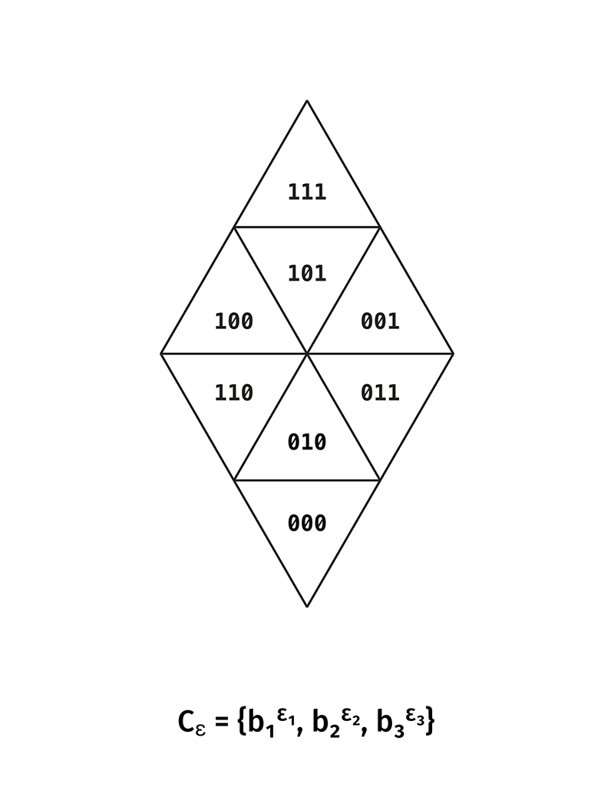

## §8.5. Coordinate Notation of Chambers

Fix the order of complement pairs:

\[
\beta_1,
\beta_2,
\beta_3.
\]

Inside each pair, choose a binary marking:

\[
b_1^0=001,
\qquad
b_1^1=110,
\]

\[
b_2^0=010,
\qquad
b_2^1=101,
\]

\[
b_3^0=100,
\qquad
b_3^1=011.
\]

This marking realizes the sign freedom of §7.6: inside each complement pair,
one may exchange marker \(0\) and marker \(1\). Another choice gives an
isomorphic coordinate notation through independent permutations of the two
elements inside complement pairs.

For

\[
\varepsilon=(\varepsilon_1,\varepsilon_2,\varepsilon_3)\in\{0,1\}^3
\]

define the chamber

\[
C_\varepsilon
=
\{b_1^{\varepsilon_1},b_2^{\varepsilon_2},b_3^{\varepsilon_3}\}.
\]

In agreement with the bit order of §3.6, the index of the chamber as a
three-bit string is written in the order

\[
\varepsilon_3\varepsilon_2\varepsilon_1.
\]

That is,

\[
C_{\varepsilon_3\varepsilon_2\varepsilon_1}
=
\{b_1^{\varepsilon_1},b_2^{\varepsilon_2},b_3^{\varepsilon_3}\}.
\]

This gives a map

\[
\Phi:\operatorname{Cham}(O_3)\to Q_3
\]

by the formula

\[
\Phi(C_\varepsilon)=\varepsilon_3\varepsilon_2\varepsilon_1.
\]

Here \(Q_3\) means the full three-bit carrier of §5.1:

\[
Q_3=\{0,1\}^3.
\]

It contains all eight states, including

\[
000
\qquad
\text{and}
\qquad
111.
\]

**Statement 8.4.**
The map

\[
\Phi:\operatorname{Cham}(O_3)\to Q_3
\]

is a bijection.

**Check.**
Each chamber contains exactly one element from each pair \(\beta_i\). Therefore
it uniquely determines the triple of choices

\[
(\varepsilon_1,\varepsilon_2,\varepsilon_3).
\]

Conversely, each triple

\[
\varepsilon\in\{0,1\}^3
\]

defines exactly one chamber \(C_\varepsilon\). Hence \(\Phi\) is bijective.

\[
\Box
\]

In compressed notation:

\[
\operatorname{Cham}(O_3)\cong Q_3.
\]

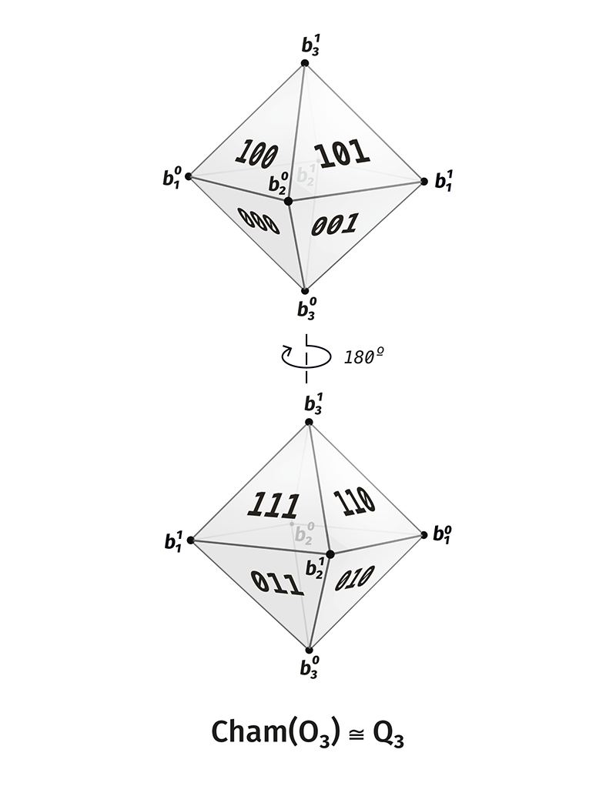

This bijection codes the chambers of the octahedron by elements of \(Q_3\).
The vertex carrier \(X_{\mathrm{adm}}\) and the chamber carrier remain
different object types.

## §8.6. Chamber Adjacency and Cube Graph

**Definition 8.5.**
For \(n\geq 1\), the graph reading

\[
Q_n^{(1)}
\]

is the Hamming-one graph on the full carrier \(Q_n\). Its relation is defined
by the rule

\[
(x,y)\in R_{Q_n}^{(1)}
\quad\Longleftrightarrow\quad
x\neq y
\text{ and }
d_H(x,y)=1.
\]

For \(n=3\), the graph \(Q_3^{(1)}\) has \(8\) vertices and \(12\) edges. For
\(n=2\), it is the same one-step Hamming graph reading that was read as \(C_4\)
in §4.

**Definition 8.6.**
For

\[
C,D\in\operatorname{Cham}(O_3),
\]

set

\[
(C,D)\in R_{\operatorname{ch}}
\]

if and only if

\[
C\neq D
\]

and

\[
|C\cap D|=2.
\]

Thus two chambers are adjacent if they share two vertices.

**Statement 8.7.**

\[
(\operatorname{Cham}(O_3),R_{\operatorname{ch}})
\cong
Q_3^{(1)}.
\]

**Check.**
Let

\[
C_\varepsilon,
\qquad
C_\delta
\]

be two chambers.

They have a common vertex from the pair \(\beta_i\) if and only if

\[
\varepsilon_i=\delta_i.
\]

Therefore

\[
|C_\varepsilon\cap C_\delta|=2
\]

if and only if \(\varepsilon\) and \(\delta\) coincide in exactly two
coordinates and differ in exactly one coordinate:

\[
d_H(\varepsilon,\delta)=1.
\]

This is the adjacency rule in the cube graph \(Q_3^{(1)}\). Therefore

\[
(\operatorname{Cham}(O_3),R_{\operatorname{ch}})
\cong
Q_3^{(1)}.
\]

\[
\Box
\]

Thus

\[
\operatorname{Cham}(O_3)\cong Q_3
\]

as a chamber carrier, and

\[
(\operatorname{Cham}(O_3),R_{\operatorname{ch}})
\cong Q_3^{(1)}
\]

as a chamber graph reading.

# §9. Incidence Package of the Octahedral Layer

## §9.1. Two Sides of the Incidence Layer

Denote the vertex side by

\[
V_O:=X_{\mathrm{adm}}.
\]

Denote the chamber side by

\[
C_O:=\operatorname{Cham}(O_3).
\]

By §7,

\[
V_O
=
\{001,010,011,100,101,110\}.
\]

By §8.5 the marking of complement pairs is fixed as

\[
b_1^0=001,
\qquad
b_1^1=110,
\]

\[
b_2^0=010,
\qquad
b_2^1=101,
\]

\[
b_3^0=100,
\qquad
b_3^1=011.
\]

That is,

\[
\beta_1=\{b_1^0,b_1^1\},
\qquad
\beta_2=\{b_2^0,b_2^1\},
\qquad
\beta_3=\{b_3^0,b_3^1\}.
\]

This marking realizes the sign freedom of §7.6: swapping
\(b_i^0\leftrightarrow b_i^1\) inside any \(\beta_i\) changes the
coordinate notation and preserves the incidence structure up to
isomorphism.

A chamber has the form

\[
C_\varepsilon
=
\{b_1^{\varepsilon_1},b_2^{\varepsilon_2},b_3^{\varepsilon_3}\},
\qquad
\varepsilon=(\varepsilon_1,\varepsilon_2,\varepsilon_3)\in\{0,1\}^3.
\]

In the bit notation of §3.6 the same chamber is denoted by

\[
C_{\varepsilon_3\varepsilon_2\varepsilon_1}.
\]

Therefore

\[
|V_O|=6,
\qquad
|C_O|=8.
\]

## §9.2. Incidence Relation

**Definition 9.1.**
The incidence relation of the octahedral package is the relation

\[
\operatorname{Inc}_O
\subset
V_O\times C_O
\]

such that

\[
(x,C)\in\operatorname{Inc}_O
\]

if and only if

\[
x\in C.
\]

Thus a vertex is incident to a chamber if and only if it belongs to the
vertex support of that chamber.

In coordinate notation,

\[
(b_i^\eta,C_\varepsilon)\in\operatorname{Inc}_O
\]

if and only if

\[
\varepsilon_i=\eta.
\]

Equivalently,

\[
b_i^\eta\in C_\varepsilon
\quad\Longleftrightarrow\quad
\varepsilon_i=\eta.
\]

This formula follows directly from the definition of a chamber in §8.5:
the chamber \(C_\varepsilon\) contains exactly the element
\(b_i^{\varepsilon_i}\) from the pair \(\beta_i\).

## §9.3. Incidence as a Vertex-Chamber Relation

The incidence relation is not the same as the relation

\[
R_{12}
\]

on the vertex side.

The relation

\[
R_{12}\subset V_O\times V_O
\]

connects vertices with vertices.

The relation

\[
R_{\operatorname{ch}}\subset C_O\times C_O
\]

connects chambers with chambers.

The relation

\[
\operatorname{Inc}_O\subset V_O\times C_O
\]

connects objects of different types:

\[
\text{vertex}
\longleftrightarrow
\text{chamber}.
\]

Therefore §9 introduces a new two-type relation layer on \(V_O\sqcup C_O\).

## §9.4. Incidence Count

**Remark 9.2.**
Each chamber is incident to exactly three vertices, and each vertex is
incident to exactly four chambers.

Indeed, a chamber has the form

\[
C_\varepsilon
=
\{b_1^{\varepsilon_1},b_2^{\varepsilon_2},b_3^{\varepsilon_3}\}.
\]

It contains exactly one vertex from each complement pair, hence exactly
three vertices.

If

\[
x=b_i^\eta,
\]

then a chamber \(C_\varepsilon\) contains \(x\) if and only if

\[
\varepsilon_i=\eta.
\]

One coordinate \(\varepsilon_i\) is fixed. The other two are free, so the
number of such chambers is

\[
2\cdot 2=4.
\]

The total number of incidences is

\[
24.
\]

It is computed from both sides:

\[
|C_O|\cdot 3
=
8\cdot 3
=
24,
\]

\[
|V_O|\cdot 4
=
6\cdot 4
=
24.
\]

## §9.5. Vertex Stars and Coordinate Faces

**Definition 9.3.**
For a vertex

\[
x\in V_O
\]

its incidence star is the set

\[
\operatorname{Star}(x)
=
\{C\in C_O:(x,C)\in\operatorname{Inc}_O\}.
\]

Thus \(\operatorname{Star}(x)\) is the set of all chambers containing the
vertex \(x\).

For

\[
x=b_i^\eta
\]

we obtain the coordinate formula

\[
\operatorname{Star}(b_i^\eta)
=
\{C_\varepsilon:\varepsilon_i=\eta\}.
\]

By §9.4,

\[
|\operatorname{Star}(b_i^\eta)|=4.
\]

**Definition 9.4.**
A coordinate face in \(Q_3\) is a subset of the form

\[
F_i^\eta
=
\{\varepsilon\in Q_3:\varepsilon_i=\eta\},
\]

where

\[
i\in\{1,2,3\},
\qquad
\eta\in\{0,1\}.
\]

Each coordinate face has four elements and is isomorphic to \(Q_2\).

In the chamber-coordinate reading

\[
C_O\cong Q_3
\]

the set \(\operatorname{Star}(b_i^\eta)\) is read as the coordinate face

\[
F_i^\eta.
\]

Therefore each vertex of the octahedral skeleton corresponds to one
coordinate face of the chamber cube:

\[
\text{vertex of }O_3^{(1)}
\longleftrightarrow
\text{coordinate face of }Q_3.
\]

This is a direct consequence of the incidence relation.

## §9.6. Complement Pairs as Opposite Coordinate Faces

Let

\[
b_i^0,b_i^1\in\beta_i
\]

be the two vertices of one complement pair.

Then

\[
\operatorname{Star}(b_i^0)
=
\{C_\varepsilon:\varepsilon_i=0\},
\]

\[
\operatorname{Star}(b_i^1)
=
\{C_\varepsilon:\varepsilon_i=1\}.
\]

**Remark 9.5.**
These two sets are disjoint:

\[
\operatorname{Star}(b_i^0)
\cap
\operatorname{Star}(b_i^1)
=
\varnothing.
\]

Their union is the whole chamber side:

\[
\operatorname{Star}(b_i^0)
\cup
\operatorname{Star}(b_i^1)
=
C_O.
\]

Therefore a complement pair of vertices of the octahedral skeleton is read
on the chamber side as a pair of opposite coordinate faces in \(Q_3\):

\[
\beta_i
=
\{b_i^0,b_i^1\}
\quad
\longleftrightarrow
\quad
\{F_i^0,F_i^1\}.
\]

This is a consequence of the chosen coordinate notation for chambers.

## §9.7. Vertex Adjacency Is Recovered from Incidence

**Statement 9.6.**
For two distinct vertices

\[
x,y\in V_O
\]

we have

\[
(x,y)\in R_{12}
\]

if and only if

\[
\operatorname{Star}(x)\cap\operatorname{Star}(y)\neq\varnothing.
\]

More precisely,

\[
|\operatorname{Star}(x)\cap\operatorname{Star}(y)|=2
\]

if \(x\) and \(y\) lie in different complement pairs, and

\[
|\operatorname{Star}(x)\cap\operatorname{Star}(y)|=0
\]

if

\[
\{x,y\}=\beta_i
\]

for some \(i\).

**Check.**
Let

\[
x=b_i^\eta,
\qquad
y=b_j^\mu.
\]

Then

\[
\operatorname{Star}(x)
=
\{C_\varepsilon:\varepsilon_i=\eta\},
\]

\[
\operatorname{Star}(y)
=
\{C_\varepsilon:\varepsilon_j=\mu\}.
\]

If

\[
i=j
\]

and

\[
\eta\neq \mu,
\]

then the conditions

\[
\varepsilon_i=\eta,
\qquad
\varepsilon_i=\mu
\]

are incompatible. Therefore

\[
\operatorname{Star}(x)\cap\operatorname{Star}(y)=\varnothing.
\]

This is the case of a complement pair.

If

\[
i\neq j,
\]

then the two conditions

\[
\varepsilon_i=\eta,
\qquad
\varepsilon_j=\mu
\]

fix two coordinates of \(\varepsilon\), while the third remains free.
Therefore there are exactly two chambers containing both \(x\) and \(y\):

\[
|\operatorname{Star}(x)\cap\operatorname{Star}(y)|=2.
\]

By §7 the relation \(R_{12}\) connects exactly vertices from different
complement pairs and does not connect the two vertices of one complement
pair. Hence

\[
(x,y)\in R_{12}
\quad\Longleftrightarrow\quad
\operatorname{Star}(x)\cap\operatorname{Star}(y)\neq\varnothing.
\]

\[
\Box
\]

This means that the skeleton

\[
(V_O,R_{12})
\]

can be recovered from the incidence relation.

## §9.8. Chamber Adjacency Is Recovered from Incidence

For a chamber

\[
C\in C_O
\]

denote its vertex support by

\[
\operatorname{Vert}(C)
=
\{x\in V_O:(x,C)\in\operatorname{Inc}_O\}.
\]

By the definition of a chamber,

\[
|\operatorname{Vert}(C)|=3.
\]

**Statement 9.7.**
For two distinct chambers

\[
C,D\in C_O
\]

we have

\[
(C,D)\in R_{\operatorname{ch}}
\]

if and only if

\[
|\operatorname{Vert}(C)\cap\operatorname{Vert}(D)|=2.
\]

**Check.**
By §8.6 the relation \(R_{\operatorname{ch}}\) was defined by the rule

\[
(C,D)\in R_{\operatorname{ch}}
\quad\Longleftrightarrow\quad
C\neq D
\text{ and }
|C\cap D|=2.
\]

But in §8, \(C\) and \(D\) are already the vertex supports of the chambers,
so

\[
C\cap D
=
\operatorname{Vert}(C)\cap\operatorname{Vert}(D).
\]

Also by §8.6,

\[
|C_\varepsilon\cap C_\delta|=2
\quad\Longleftrightarrow\quad
\varepsilon\text{ and }\delta\text{ differ in exactly one coordinate}
\quad\Longleftrightarrow\quad
d_H(\varepsilon,\delta)=1.
\]

Thus the definition by intersection of vertex supports and the Hamming-one
definition on \(Q_3\) give the same relation \(R_{\operatorname{ch}}\).

Therefore

\[
(C,D)\in R_{\operatorname{ch}}
\quad\Longleftrightarrow\quad
|\operatorname{Vert}(C)\cap\operatorname{Vert}(D)|=2.
\]

\[
\Box
\]

Thus the incidence relation recovers the vertex skeleton and the chamber
adjacency.

## §9.9. Incidence Matrix

After fixing the marking of chambers

\[
C_{\varepsilon_3\varepsilon_2\varepsilon_1},
\qquad
\varepsilon_i\in\{0,1\},
\]

the incidence relation can be written as a Boolean matrix.

Let the rows be indexed by the vertices

\[
b_1^0,
b_1^1,
b_2^0,
b_2^1,
b_3^0,
b_3^1.
\]

Let the columns be indexed by the chambers in the order compatible with the
bit order of §3.6:

\[
C_{000},C_{001},C_{010},C_{011},
C_{100},C_{101},C_{110},C_{111}.
\]

Here the index \(abc\) in \(C_{abc}\) means

\[
a=\varepsilon_3,
\qquad
b=\varepsilon_2,
\qquad
c=\varepsilon_1.
\]

**Definition 9.8.**
The incidence matrix of the octahedral package is the matrix

\[
B_O
\in
\{0,1\}^{6\times 8}
\]

with entries

\[
(B_O)_{b_i^\eta,\varepsilon}
=
1
\]

if and only if

\[
(b_i^\eta,C_\varepsilon)\in\operatorname{Inc}_O.
\]

By the formula of §9.2 this is equivalent to

\[
(B_O)_{b_i^\eta,\varepsilon}
=
1
\quad\Longleftrightarrow\quad
\varepsilon_i=\eta.
\]

In the chosen order of rows and columns,

\[
B_O=
\begin{pmatrix}
1&0&1&0&1&0&1&0\\
0&1&0&1&0&1&0&1\\
1&1&0&0&1&1&0&0\\
0&0&1&1&0&0&1&1\\
1&1&1&1&0&0&0&0\\
0&0&0&0&1&1&1&1
\end{pmatrix}.
\]

Each column contains three ones:

\[
\sum_{x\in V_O}(B_O)_{x,\varepsilon}=3.
\]

Each row contains four ones:

\[
\sum_{\varepsilon\in Q_3}(B_O)_{b_i^\eta,\varepsilon}=4.
\]

The matrix \(B_O\) is a notation for the incidence relation. The relation
grammar remains defined by the relation layers themselves. Another choice
of marking inside complement pairs, or another order of rows and columns,
gives a matrix obtained by permuting rows and columns.

## §9.10. Incidence Graph

**Definition 9.9.**
The incidence graph of the octahedral package is the bipartite graph

\[
G_{\operatorname{inc}}(O)
\]

with vertex set

\[
V_O\sqcup C_O
\]

and edges

\[
x---C
\]

if and only if

\[
(x,C)\in\operatorname{Inc}_O.
\]

This graph is bipartite because all its edges go only between the vertex
side \(V_O\) and the chamber side \(C_O\).

It has

\[
|V_O|+|C_O|=6+8=14
\]

vertices and

\[
24
\]

edges.

The degrees of the two types are different:

\[
\deg(x)=4
\quad
\text{for }x\in V_O,
\]

\[
\deg(C)=3
\quad
\text{for }C\in C_O.
\]

Thus

\[
G_{\operatorname{inc}}(O)
\]

is a \((4,3)\)-bipartite incidence graph.

The number

\[
14=6+8
\]

here means a typed sum:

\[
6\ \text{vertices}
+
8\ \text{chambers}.
\]

This is a disjoint \(14\)-element carrier with two vertex types.

## §9.11. Two-Type Carrier

To write incidence as a relation on one carrier, introduce the disjoint sum

\[
Z_O
=
V_O
\sqcup
C_O.
\]

The elements of \(Z_O\) have type

\[
\operatorname{type}(z)
=
\begin{cases}
\operatorname{v}, & z\in V_O,\\
\operatorname{c}, & z\in C_O.
\end{cases}
\]

Here \(\operatorname{v}\) denotes vertex type, and \(\operatorname{c}\)
denotes chamber type.

On \(Z_O\) define three relations.

The vertex relation:

\[
R_{vv}:=R_{12}
\subset
V_O\times V_O.
\]

The chamber relation:

\[
R_{cc}:=R_{\operatorname{ch}}
\subset
C_O\times C_O.
\]

The cross-type incidence relation:

\[
R_{vc}
\subset
Z_O\times Z_O
\]

is defined as the symmetrization of \(\operatorname{Inc}_O\):

\[
R_{vc}
=
\{(x,C),(C,x):x\in V_O,
\ C\in C_O,
\ (x,C)\in\operatorname{Inc}_O\}.
\]

**Definition 9.10.**
The full relation package of §9 is

\[
R_O
=
R_{vv}
\cup
R_{cc}
\cup
R_{vc}.
\]

Then

\[
(Z_O,R_O)
\]

is the two-type incidence carrier of the octahedral layer.

## §9.12. Incidence Presentation

**Definition 9.11.**
The incidence presentation of the octahedral layer is

\[
\Pi_O^{\operatorname{inc}}
=
\left(
Z_O,
R_O,
\operatorname{id}_{Z_O},
\operatorname{rec}_{\operatorname{id}}
\right),
\]

where

\[
Z_O=V_O\sqcup C_O,
\]

\[
R_O=R_{vv}\cup R_{cc}\cup R_{vc},
\]

\[
\operatorname{id}_{Z_O}:Z_O\to Z_O
\]

is the identity reading.

The relation \(R_O\) is irreflexive: \(R_{vv}\) and \(R_{cc}\) connect
distinct elements inside their own types, while \(R_{vc}\) connects
elements of different types. Therefore

\[
R_O|_{\{z\}}=\varnothing
\]

for every

\[
z\in Z_O.
\]

The recovery datum is

\[
\operatorname{rec}_{\operatorname{id}}(z)
=
(\{z\},\varnothing).
\]

Since the reading is the identity reading, the presentation is exact.

This presentation records the incidence layer as a relation carrier with a
fixed identity reading and recovery datum.

## §9.13. Recoverability of the Incidence Package

The incidence package recovers two relation structures.

The first one is

\[
R_{12}
\]

on the vertex side, because

\[
(x,y)\in R_{12}
\quad\Longleftrightarrow\quad
\operatorname{Star}(x)\cap\operatorname{Star}(y)\neq\varnothing.
\]

The second one is

\[
R_{\operatorname{ch}}
\]

on the chamber side, because

\[
(C,D)\in R_{\operatorname{ch}}
\quad\Longleftrightarrow\quad
|\operatorname{Vert}(C)\cap\operatorname{Vert}(D)|=2.
\]

In addition, the incidence relation has the matrix form

\[
(B_O)_{x,C}=1
\quad\Longleftrightarrow\quad
(x,C)\in\operatorname{Inc}_O.
\]

Therefore the incidence package connects the two sides of the octahedral
graph reading,

\[
O_3^{(1)}
\quad
\text{and}
\quad
\operatorname{Cham}(O_3)\cong Q_3,
\]

into one two-type finite structure.

# §10. Orientation and Cyclic Transport on \(C_6\)

## §10.1. \(R_1\) as an Unoriented Cycle

By §6 the relation

\[
R_1
\]

on

\[
X_{\mathrm{adm}}
=
\{001,010,011,100,101,110\}
\]

is defined by the rule

\[
(x,y)\in R_1
\quad\Longleftrightarrow\quad
d_H(x,y)=1.
\]

The graph reading is

\[
(X_{\mathrm{adm}},R_1)\cong C_6.
\]

One cyclic order compatible with \(R_1\) is

\[
001
\to
011
\to
010
\to
110
\to
100
\to
101
\to
001.
\]

Each neighboring pair has Hamming distance \(1\):

\[
d_H(001,011)=1,
\qquad
d_H(011,010)=1,
\qquad
d_H(010,110)=1,
\]

\[
d_H(110,100)=1,
\qquad
d_H(100,101)=1,
\qquad
d_H(101,001)=1.
\]

At the level of §6 this was only an unoriented graph reading. In §10 an
orientation is added.

## §10.2. Choice of Orientation

**Definition 10.1.**
Fix the orientation on

\[
(X_{\mathrm{adm}},R_1)\cong C_6
\]

as follows:

\[
001\to011\to010\to110\to100\to101\to001.
\]

Denote the oriented cycle by

\[
\vec C_6.
\]

This choice does not follow from the relation \(R_1\) alone. The relation
\(R_1\) defines an unoriented cycle; the orientation is a new transport
datum.

The opposite orientation is also admissible:

\[
001\to101\to100\to110\to010\to011\to001.
\]

In the present transport layer the first orientation is fixed. The opposite
orientation would give the operator

\[
T^{-1}.
\]

## §10.3. Cyclic Transport Operator

**Definition 10.2.**
The cyclic transport operator

\[
T:X_{\mathrm{adm}}\to X_{\mathrm{adm}}
\]

is defined by the chosen orientation:

\[
T(001)=011,
\qquad
T(011)=010,
\qquad
T(010)=110,
\]

\[
T(110)=100,
\qquad
T(100)=101,
\qquad
T(101)=001.
\]

In string form:

\[
T:
001\to011\to010\to110\to100\to101\to001.
\]

The operator \(T\) is a bijection of the set \(X_{\mathrm{adm}}\). Its
inverse operator

\[
T^{-1}=T^5
\]

corresponds to the opposite orientation.

## §10.4. \(T\) as an \(R_1\)-Step

**Statement 10.3.**
For every

\[
x\in X_{\mathrm{adm}}
\]

we have

\[
(x,T(x))\in R_1.
\]

**Check.**
By definition of \(T\), each pair

\[
x\to T(x)
\]

is a neighboring pair in the cycle

\[
001\to011\to010\to110\to100\to101\to001.
\]

This cycle is a graph reading of the relation \(R_1\). Therefore

\[
d_H(x,T(x))=1,
\]

that is,

\[
(x,T(x))\in R_1.
\]

\[
\Box
\]

In compact form:

\[
T=\text{oriented }R_1\text{-step}.
\]

## §10.5. Directed Transport Relation

**Definition 10.4.**
The directed transport relation is the relation

\[
\vec R_T
\subset
X_{\mathrm{adm}}\times X_{\mathrm{adm}}
\]

such that

\[
(x,y)\in\vec R_T
\quad\Longleftrightarrow\quad
y=T(x).
\]

That is,

\[
\vec R_T
=
\{(x,T(x)):x\in X_{\mathrm{adm}}\}.
\]

Explicitly:

\[
\vec R_T
=
\{
(001,011),
(011,010),
(010,110),
(110,100),
(100,101),
(101,001)
\}.
\]

The opposite directed relation is

\[
\vec R_T^{-1}
=
\{(T(x),x):x\in X_{\mathrm{adm}}\}.
\]

**Corollary 10.5.**
Symmetrizing the directed transport relation recovers \(R_1\):

\[
R_1
=
\vec R_T
\cup
\vec R_T^{-1}.
\]

**Check.**
By Statement 10.3,

\[
\vec R_T\subset R_1.
\]

The relation \(R_1\) is a symmetric unoriented \(6\)-cycle in directed
notation: it contains \(12\) directed pairs. The relation \(\vec R_T\)
contains \(6\) directed pairs, one orientation for each edge of the cycle.
Therefore

\[
\vec R_T\cup\vec R_T^{-1}
\]

contains both directions of all six edges of \(R_1\), and hence coincides
with \(R_1\).

\[
\Box
\]

Thus \(T\) chooses one of the two orientations of the already constructed
relation layer \(R_1\).

## §10.6. Relation Grammar and Transport

The relation grammar of §6 was static:

\[
\mathcal R_{\mathrm{adm}}^{(3)}
=
\{R_1,R_2,R_3\}.
\]

The transport layer adds direction, composition, paths, iteration, and
return. In this notation,

\[
R_1
\]

is unoriented adjacency,

\[
\vec R_T
\]

is oriented transport adjacency, and

\[
T
\]

is the next-step operator.

## §10.7. Path Category of the Oriented Cycle

After choosing \(T\), one step and compositions of steps are defined.

**Definition 10.6.**
The path category of the oriented transport cycle is denoted by

\[
\operatorname{Path}_T(C_6).
\]

Its objects are

\[
\operatorname{Ob}(\operatorname{Path}_T(C_6))
=
X_{\mathrm{adm}}.
\]

The generating arrows are

\[
x\to T(x)
\]

for all

\[
x\in X_{\mathrm{adm}}.
\]

Composition is given by iteration:

\[
x
\to
T(x)
\to
T^2(x)
\to
\cdots
\to
T^k(x).
\]

That is, a path of length \(k\) from \(x\) arrives at

\[
T^k(x).
\]

In §10 this category fixes path composition. In §11 it is factorized by the
period

\[
T^6=\operatorname{id}.
\]

## §10.8. Cyclic Action before Periodization

The operator \(T\) defines integer iteration:

\[
\rho_T:\mathbb Z\to \operatorname{Sym}(X_{\mathrm{adm}})
\]

by the formula

\[
\rho_T(k)=T^k.
\]

For every

\[
x\in X_{\mathrm{adm}}
\]

we obtain the orbit map

\[
\gamma_x:\mathbb Z\to X_{\mathrm{adm}},
\qquad
\gamma_x(k)=T^k(x).
\]

At the level of §10 this is written as iteration over \(\mathbb Z\). In
§11 the orbit map is factorized through

\[
\mathbb Z/6\mathbb Z.
\]

Thus §10 introduces cyclic transport, and §11 closes it by periodization.

## §10.9. \(T\) Preserves the Static Relation Grammar

**Statement 10.7.**
The operator \(T\) preserves the Hamming relation layers:

\[
(x,y)\in R_k
\quad\Longleftrightarrow\quad
(Tx,Ty)\in R_k
\]

for

\[
k=1,2,3.
\]

**Check.**
For \(R_1\), this follows from the fact that \(T\) is a rotation of the
chosen \(C_6\). A rotation of the cycle sends neighboring vertices to
neighboring vertices.

For \(R_3\), the relation defines the complement pairs

\[
001\leftrightarrow110,
\qquad
010\leftrightarrow101,
\qquad
100\leftrightarrow011.
\]

Check the action of \(T\) on these pairs:

\[
\{001,110\}\mapsto\{011,100\},
\]

\[
\{100,011\}\mapsto\{101,010\},
\]

\[
\{010,101\}\mapsto\{110,001\}.
\]

Hence \(T\) permutes the complement pairs and preserves \(R_3\).

By §6.7 the relation grammar

\[
\{R_1,R_2,R_3\}
\]

partitions all pairs of distinct elements of \(X_{\mathrm{adm}}\) by
Hamming distance. Since \(T\) is bijective and preserves \(R_1\) and
\(R_3\), it also preserves their complement inside the set of all pairs,
that is, \(R_2\).

\[
\Box
\]

Therefore

\[
T\in
\operatorname{Aut}
\bigl(
X_{\mathrm{adm}},
R_1,R_2,R_3
\bigr).
\]

## §10.10. Extension to the Chamber Side

By §§8-9 there is a chamber side:

\[
C_O=\operatorname{Cham}(O_3).
\]

For a subset \(C\subset X_{\mathrm{adm}}\), denote

\[
T[C]:=\{T(x):x\in C\}.
\]

Since \(T\) permutes the complement pairs

\[
\beta_1,\beta_2,\beta_3,
\]

the image of a chamber is again a chamber.

**Definition 10.8.**
The chamber transport

\[
T_{\operatorname{ch}}:C_O\to C_O
\]

is defined by the rule

\[
T_{\operatorname{ch}}(C)=T[C].
\]

If

\[
C\in \operatorname{Cham}(O_3),
\]

then \(C\) contains exactly one vertex from each complement pair. Since
\(T\) permutes complement pairs, the set \(T[C]\) also contains exactly one
vertex from each complement pair. Hence

\[
T[C]\in \operatorname{Cham}(O_3).
\]

Therefore \(T_{\operatorname{ch}}\) is well defined.

## §10.11. Compatibility with Incidence

**Statement 10.9.**
The transport \(T\) preserves incidence:

\[
(x,C)\in\operatorname{Inc}_O
\quad\Longleftrightarrow\quad
(Tx,T_{\operatorname{ch}}C)\in\operatorname{Inc}_O.
\]

**Check.**
By definition of incidence,

\[
(x,C)\in\operatorname{Inc}_O
\quad\Longleftrightarrow\quad
x\in C.
\]

But

\[
x\in C
\quad\Longleftrightarrow\quad
T(x)\in T[C].
\]

And

\[
T[C]=T_{\operatorname{ch}}(C).
\]

Therefore

\[
(x,C)\in\operatorname{Inc}_O
\quad\Longleftrightarrow\quad
(Tx,T_{\operatorname{ch}}C)\in\operatorname{Inc}_O.
\]

\[
\Box
\]

Thus the transport acts on the vertex side and on the incidence package.

## §10.12. Transport Automorphism of the Incidence Carrier

By §9 the two-type carrier was constructed:

\[
Z_O
=
V_O\sqcup C_O,
\]

where

\[
V_O=X_{\mathrm{adm}},
\qquad
C_O=\operatorname{Cham}(O_3).
\]

**Definition 10.10.**
The full transport automorphism on the incidence carrier is the map

\[
T_Z:Z_O\to Z_O
\]

such that

\[
T_Z(x)=T(x)
\]

for

\[
x\in V_O,
\]

and

\[
T_Z(C)=T_{\operatorname{ch}}(C)
\]

for

\[
C\in C_O.
\]

Since \(T\) preserves \(R_{12}\), \(T_{\operatorname{ch}}\) preserves
chamber adjacency, and together they preserve incidence, we obtain

\[
T_Z\in
\operatorname{Aut}(Z_O,R_O).
\]

Here

\[
R_O
=
R_{vv}\cup R_{cc}\cup R_{vc}
\]

is the full relation package of §9.

## §10.13. Transport Presentations

**Definition 10.11.**
The vertex transport presentation is the exact presentation

\[
\Pi_T^{V}
=
\left(
X_{\mathrm{adm}},
\vec R_T,
\operatorname{id}_{X_{\mathrm{adm}}},
\operatorname{rec}_{\operatorname{id}}
\right),
\]

where

\[
\vec R_T
=
\{(x,T(x)):x\in X_{\mathrm{adm}}\}.
\]

The reading is the identity reading. The recovery datum is

\[
\operatorname{rec}_{\operatorname{id}}(x)
=
(\{x\},\varnothing),
\]

because \(\vec R_T\) is irreflexive.

**Definition 10.12.**
The incidence transport presentation is the exact incidence presentation of
§9,

\[
\Pi_O^{\operatorname{inc}}
=
\left(
Z_O,
R_O,
\operatorname{id}_{Z_O},
\operatorname{rec}_{\operatorname{id}}
\right),
\]

considered together with the additional automorphism datum

\[
T_Z\in\operatorname{Aut}(Z_O,R_O).
\]

The strict presentation format remains a quadruple. Transport is fixed as
operator structure over an exact presentation.

# §11. Periodization Package of Rank \(3\)

## §11.1. Table of Powers of \(T\)

By definition:

\[
T:
001\to011\to010\to110\to100\to101\to001.
\]

The power \(T^0\):

\[
T^0=\operatorname{id}_{X_{\mathrm{adm}}}.
\]

The power \(T^1\):

\[
T^1=T.
\]

The power \(T^2\):

\[
001\to010,
\qquad
011\to110,
\qquad
010\to100,
\]

\[
110\to101,
\qquad
100\to001,
\qquad
101\to011.
\]

The power \(T^3\):

\[
001\to110,
\qquad
011\to100,
\qquad
010\to101,
\]

\[
110\to001,
\qquad
100\to011,
\qquad
101\to010.
\]

The power \(T^4\):

\[
T^4=T^{-2}.
\]

The power \(T^5\):

\[
T^5=T^{-1}.
\]

The power \(T^6\):

\[
T^6=\operatorname{id}_{X_{\mathrm{adm}}}.
\]

## §11.2. \(T^2\) as an \(R_2\)-Phase

**Statement 11.1.**
For every

\[
x\in X_{\mathrm{adm}}
\]

we have

\[
(x,T^2(x))\in R_2.
\]

**Check.**
Check from the table:

\[
d_H(001,010)=2,
\qquad
d_H(011,110)=2,
\qquad
d_H(010,100)=2,
\]

\[
d_H(110,101)=2,
\qquad
d_H(100,001)=2,
\qquad
d_H(101,011)=2.
\]

Therefore

\[
(x,T^2(x))\in R_2
\]

for all

\[
x\in X_{\mathrm{adm}}.
\]

\[
\Box
\]

In compact form:

\[
T^2=\text{oriented }R_2\text{-phase}.
\]

## §11.3. \(T^2\) Preserves Shell Order

By §5,

\[
X_{\mathrm{adm}}
=
S_1^{(3)}
\sqcup
S_2^{(3)},
\]

where

\[
S_1^{(3)}
=
\{001,010,100\},
\]

\[
S_2^{(3)}
=
\{011,101,110\}.
\]

**Statement 11.2.**

\[
T^2(S_1^{(3)})=S_1^{(3)},
\]

\[
T^2(S_2^{(3)})=S_2^{(3)}.
\]

**Check.**
On \(S_1^{(3)}\):

\[
001\to010\to100\to001.
\]

On \(S_2^{(3)}\):

\[
011\to110\to101\to011.
\]

Thus \(T^2\) defines two oriented \(3\)-cycles.

\[
\Box
\]

Since

\[
(X_{\mathrm{adm}},R_2)\cong K_3\sqcup K_3,
\]

the operator \(T^2\) chooses an orientation inside each \(K_3\)-component.

## §11.4. \(T\) Switches Shell Order

**Statement 11.3.**

\[
T(S_1^{(3)})=S_2^{(3)},
\]

\[
T(S_2^{(3)})=S_1^{(3)}.
\]

**Check.**
From the table of \(T\):

\[
001\mapsto011,
\qquad
010\mapsto110,
\qquad
100\mapsto101.
\]

Hence

\[
S_1^{(3)}\to S_2^{(3)}.
\]

And:

\[
011\mapsto010,
\qquad
110\mapsto100,
\qquad
101\mapsto001.
\]

Hence

\[
S_2^{(3)}\to S_1^{(3)}.
\]

\[
\Box
\]

Therefore

\[
T:S_1^{(3)}\leftrightarrow S_2^{(3)},
\]

\[
T^2:S_i^{(3)}\to S_i^{(3)}.
\]

## §11.5. \(T^3\) as Complement Phase

**Statement 11.4.**

\[
T^3(x)=x+111
\]

for all

\[
x\in X_{\mathrm{adm}}.
\]

**Check.**
From the table:

\[
T^3(001)=110=001+111,
\qquad
T^3(011)=100=011+111,
\]

\[
T^3(010)=101=010+111,
\qquad
T^3(110)=001=110+111,
\]

\[
T^3(100)=011=100+111,
\qquad
T^3(101)=010=101+111.
\]

Therefore

\[
T^3(x)=x+111
\]

for all admissible states.

Structurally, \(T^3\) is the shift by three steps in a cycle of length
\(6\), hence the passage to the opposite vertex of the cycle. By §6 the
relation \(R_3\) reads exactly the complement pairs:

\[
001\leftrightarrow110,
\qquad
010\leftrightarrow101,
\qquad
100\leftrightarrow011.
\]

Therefore \(T^3\) coincides with the complement involution on
\(X_{\mathrm{adm}}\).

\[
\Box
\]

In compact form:

\[
T^3=\overline{(\cdot)}.
\]

## §11.6. \(T^3\) as an \(R_3\)-Phase

The relation

\[
R_3
\]

defines the complement pairs:

\[
001\leftrightarrow110,
\qquad
010\leftrightarrow101,
\qquad
100\leftrightarrow011.
\]

By §11.5,

\[
(x,T^3(x))\in R_3
\]

for every

\[
x\in X_{\mathrm{adm}}.
\]

Moreover,

\[
\vec R_{T^3}=R_3,
\]

where

\[
\vec R_{T^3}:=\{(x,T^3(x)):x\in X_{\mathrm{adm}}\}.
\]

Indeed, \(T^3\) is an involution, since

\[
T^3\circ T^3=T^6=\operatorname{id}_{X_{\mathrm{adm}}}.
\]

If

\[
(x,y)\in\vec R_{T^3},
\]

then \(y=T^3(x)\), hence \(x=T^3(y)\), and

\[
(y,x)\in\vec R_{T^3}.
\]

Therefore \(\vec R_{T^3}\) is symmetric and contains both directions of
each complement pair. This is exactly \(R_3\).

In compact form:

\[
T^3=\text{complement-phase}=\text{\(R_3\)-phase}.
\]

## §11.7. \(T^6=\operatorname{id}\)

**Statement 11.5.**

\[
T^6=\operatorname{id}_{X_{\mathrm{adm}}}.
\]

**Check.**
The operator \(T\) passes through six states:

\[
001\to011\to010\to110\to100\to101\to001.
\]

After six steps every state returns to itself. Hence

\[
T^6(x)=x
\]

for all

\[
x\in X_{\mathrm{adm}}.
\]

Therefore

\[
T^6=\operatorname{id}_{X_{\mathrm{adm}}}.
\]

\[
\Box
\]

## §11.8. Minimality of the Period

**Statement 11.6.**
The period of \(T\) on \(X_{\mathrm{adm}}\) is exactly \(6\).

That is, if

\[
T^k=\operatorname{id}_{X_{\mathrm{adm}}},
\qquad
k>0,
\]

then

\[
6\mid k.
\]

**Check.**
The orbit of \(001\) under \(T\) is

\[
001,\quad
011,\quad
010,\quad
110,\quad
100,\quad
101,\quad
001.
\]

Before the sixth step, \(001\) does not return to itself. Therefore the
minimal positive \(k\) for which

\[
T^k(001)=001
\]

is \(6\). Hence the minimal period of the whole operator \(T\) is \(6\).

\[
\Box
\]

## §11.9. Cyclic Group Generated by \(T\)

**Corollary 11.7.**

\[
\langle T\rangle
=
\{
T^0,T^1,T^2,T^3,T^4,T^5
\}
\]

and

\[
\langle T\rangle\cong\mathbb Z/6\mathbb Z.
\]

The isomorphism is given by

\[
[k]_6\mapsto T^k.
\]

Iteration over \(\mathbb Z\),

\[
k\mapsto T^k,
\]

factorizes through the quotient

\[
\mathbb Z\to\mathbb Z/6\mathbb Z.
\]

Repeated transport can be written as an infinite sequence of steps, but the
state of the carrier depends only on the path-length class modulo \(6\).

The carrier remains finite:

\[
|X_{\mathrm{adm}}|=6.
\]

## §11.10. Phase Table

The powers of \(T\) give the full phase table of the transport:

\[
\begin{array}{c|c|c}
\text{power} & \text{relation reading} & \text{meaning}\\
\hline
T^0 & \operatorname{id} & \text{initial phase}\\
T^1 & \vec R_T\subset R_1 & \text{oriented }R_1\text{-step}\\
T^2 & \vec R_{T^2}\subset R_2 & \text{oriented }R_2\text{-phase}\\
T^3 & \vec R_{T^3}=R_3 & \text{complement / half-period}\\
T^4 & \vec R_{T^4}\subset R_2 & \text{reverse }R_2\text{-phase}\\
T^5 & \vec R_{T^5}\subset R_1 & \text{reverse }R_1\text{-step}\\
T^6 & \operatorname{id} & \text{full return}
\end{array}
\]

Here

\[
\vec R_{T^k}
=
\{(x,T^k(x)):x\in X_{\mathrm{adm}}\}.
\]

For \(k=1\):

\[
R_1=
\vec R_T\cup \vec R_{T^5}.
\]

For \(k=2\):

\[
R_2=
\vec R_{T^2}\cup \vec R_{T^4}.
\]

For \(k=3\):

\[
R_3=
\vec R_{T^3}.
\]

In the first two cases, two directed phase relations give two orientations
of one static Hamming layer. In the case \(k=3\), the directed relation is
already symmetric because \(T^3\) is an involution.

Thus transport decomposes the static Hamming grammar into phases of one
cyclic operator.

## §11.11. Period Quotient

**Definition 11.8.**
The count carrier of path length is

\[
\mathbb Z.
\]

The period quotient of the transport is the quotient map

\[
q_{\operatorname{per}}:\mathbb Z\to\mathbb Z/6\mathbb Z,
\]

\[
q_{\operatorname{per}}(k)=[k]_6.
\]

For every

\[
x\in X_{\mathrm{adm}}
\]

the orbit map

\[
\gamma_x:\mathbb Z\to X_{\mathrm{adm}},
\qquad
\gamma_x(k)=T^k(x)
\]

factorizes as

\[
\mathbb Z
\xrightarrow{q_{\operatorname{per}}}
\mathbb Z/6\mathbb Z
\xrightarrow{\tilde\gamma_x}
X_{\mathrm{adm}},
\]

where

\[
\tilde\gamma_x([k]_6)=T^k(x).
\]

This is well defined because

\[
T^{k+6}=T^k.
\]

The period quotient preserves position in the finite transport cycle. The
absolute number of completed turns in \(\mathbb Z\) belongs to lifted path
data.

## §11.12. Complement-Pair Quotient

In §7 the complement pairs were introduced:

\[
\beta_1=\{001,110\},
\]

\[
\beta_2=\{010,101\},
\]

\[
\beta_3=\{100,011\}.
\]

Denote the quotient carrier of complement pairs by

\[
B_\beta=\{\beta_1,\beta_2,\beta_3\}.
\]

Define the projection

\[
p_\beta:X_{\mathrm{adm}}\to B_\beta
\]

by the rule

\[
p_\beta(x)=\beta_i
\quad
\text{if}
\quad
x\in\beta_i.
\]

The operator \(T\) sends each complement pair to a complement pair:

\[
T(\beta_1)=\beta_3,
\qquad
T(\beta_3)=\beta_2,
\qquad
T(\beta_2)=\beta_1.
\]

Therefore \(T\) induces an operator

\[
\bar T:B_\beta\to B_\beta
\]

such that

\[
\bar T(\beta_1)=\beta_3,
\qquad
\bar T(\beta_3)=\beta_2,
\qquad
\bar T(\beta_2)=\beta_1.
\]

We obtain commutativity:

\[
p_\beta\circ T
=
\bar T\circ p_\beta.
\]

That is, the transport \(T\) on \(X_{\mathrm{adm}}\) covers a \(3\)-cycle
on the quotient carrier \(B_\beta\).

## §11.13. Base Period \(3\), Lift Period \(6\)

**Statement 11.9.**
The periods of \(T\) and \(\bar T\) are related as follows:

\[
\bar T^3=\operatorname{id}_{B_\beta},
\]

\[
T^3=\overline{(\cdot)}\neq\operatorname{id}_{X_{\mathrm{adm}}},
\]

\[
T^6=\operatorname{id}_{X_{\mathrm{adm}}}.
\]

**Check.**
On the quotient carrier \(B_\beta\):

\[
\beta_1\to\beta_3\to\beta_2\to\beta_1.
\]

Therefore

\[
\bar T^3=\operatorname{id}_{B_\beta}.
\]

On the full carrier, by §11.5,

\[
T^3(x)=x+111.
\]

This is the complement involution. Therefore three transport steps send a
vertex to its complement inside the same \(\beta\)-pair.

By §11.7,

\[
T^6=\operatorname{id}_{X_{\mathrm{adm}}}.
\]

\[
\Box
\]

In compact form:

\[
\text{base-period}=3,
\qquad
\text{lift-period}=6.
\]

## §11.14. Finite \(Z_2\)-Holonomy

**Definition 11.10.**
The holonomy of the base closed path

\[
\bar T^3=\operatorname{id}_{B_\beta}
\]

with respect to the projection

\[
p_\beta:X_{\mathrm{adm}}\to B_\beta
\]

is the family of fiber automorphisms

\[
\operatorname{hol}_\beta(\beta_i):\beta_i\to\beta_i
\]

defined by

\[
\operatorname{hol}_\beta(\beta_i)
:=
T^3|_{\beta_i}.
\]

For each complement pair, \(T^3|_{\beta_i}\) swaps the two vertices:

\[
T^3|_{\beta_1}:
001\leftrightarrow110,
\]

\[
T^3|_{\beta_2}:
010\leftrightarrow101,
\]

\[
T^3|_{\beta_3}:
100\leftrightarrow011.
\]

Therefore the holonomy after one base cycle is a nontrivial
\(Z_2\)-involution on each two-element fiber:

\[
\operatorname{hol}_\beta(\beta_i)\neq\operatorname{id}_{\beta_i}.
\]

By Statement 11.5,

\[
(T^3)^2=T^6=\operatorname{id}_{X_{\mathrm{adm}}}.
\]

Hence each fiber holonomy has order \(2\).

## §11.15. Difference between \(\tau^2=\operatorname{id}\) and \(T^6=\operatorname{id}\)

In §2 the local swap was introduced:

\[
\tau(a)=-a,
\]

\[
\tau(-a)=a,
\]

\[
\tau^2=\operatorname{id}.
\]

This is a local rank-1 involution on one two-element polar layer.

In §11 another law is obtained:

\[
T^6=\operatorname{id}_{X_{\mathrm{adm}}}.
\]

This is global rank-3 periodization on the six-point admissible carrier.

The correct distinction is:

\[
\tau^2=\operatorname{id}
\]

means the double local swap of polarity, while

\[
T^6=\operatorname{id}
\]

means six cyclic transport steps on the rank-3 carrier.

The connection between them is given through

\[
T^3,
\]

which acts as a complement swap inside each complement pair \(\beta_i\).
This is the rank-3 realization of the polar swap.

## §11.16. Periodization Package

**Definition 11.11.**
The periodization package of rank \(3\) is the structure, that is, the
single record of all transport data of §§10-11 used for later references:

\[
\mathcal P_T^{(3)}
=
\left(
X_{\mathrm{adm}},
\vec R_T,
T,
\langle T\rangle,
q_{\operatorname{per}},
p_\beta,
\bar T,
\operatorname{hol}_\beta
\right).
\]

Here:

\[
X_{\mathrm{adm}}
\]

is the admissible carrier;

\[
\vec R_T
\]

is the directed transport relation;

\[
T
\]

is the cyclic transport operator;

\[
\langle T\rangle\cong\mathbb Z/6\mathbb Z
\]

is the finite cyclic transport group;

\[
q_{\operatorname{per}}:\mathbb Z\to\mathbb Z/6\mathbb Z
\]

is the period quotient of path length;

\[
p_\beta:X_{\mathrm{adm}}\to B_\beta
\]

is the quotient projection to the complement-pair carrier;

\[
\bar T:B_\beta\to B_\beta
\]

is the induced \(3\)-cycle on the complement-pair quotient;

\[
\operatorname{hol}_\beta
\]

is the family of finite \(Z_2\)-fiber holonomies defined by the action of
\(T^3\) on the fibers \(\beta_i\).

The periodization package is a named structure collecting the transport
data already built.

# §12. Shell Semantics and \(1+2\) Mixed Admissibility

## §12.1. Coordinate-Index Set

**Definition 12.1.**
The coordinate-index set of rank \(3\) is the set

\[
J_3=\{1,2,3\}.
\]

If

\[
x=x_3x_2x_1\in Q_3,
\]

then the index \(i\in J_3\) corresponds to the coordinate \(x_i\).

The notation is compatible with the bit order of §3.6:

\[
x=x_3x_2x_1.
\]

Thus for the state

\[
001
\]

we have

\[
x_1=1,\qquad x_2=0,\qquad x_3=0.
\]

## §12.2. Support-Side Carrier and Support Reading

**Definition 12.2.**
The proper nonempty support carrier of the coordinate set \(J_3\) is

\[
\mathcal P^\circ(J_3)
=
\{A\subset J_3:A\neq\varnothing,\ A\neq J_3\}.
\]

In expanded form:

\[
\mathcal P^\circ(J_3)
=
\{\{1\},\{2\},\{3\},\{1,2\},\{1,3\},\{2,3\}\}.
\]

**Definition 12.3.**
The support reading on \(X_{\mathrm{adm}}\) is the map

\[
\operatorname{supp}:X_{\mathrm{adm}}\to \mathcal P^\circ(J_3)
\]

defined by

\[
\operatorname{supp}(x)=\{i\in J_3:x_i=1\}.
\]

Since

\[
X_{\mathrm{adm}}=Q_3\setminus\{000,111\},
\]

the support of every \(x\in X_{\mathrm{adm}}\) is a proper nonempty subset
of \(J_3\). Therefore the codomain of the support reading is exactly
\(\mathcal P^\circ(J_3)\).

In expanded form:

\[
\operatorname{supp}(001)=\{1\},
\]

\[
\operatorname{supp}(010)=\{2\},
\]

\[
\operatorname{supp}(100)=\{3\},
\]

\[
\operatorname{supp}(011)=\{1,2\},
\]

\[
\operatorname{supp}(101)=\{1,3\},
\]

\[
\operatorname{supp}(110)=\{2,3\}.
\]

## §12.3. The Support Reading Is a Bijection

**Statement 12.4.**

\[
\operatorname{supp}:X_{\mathrm{adm}}\to\mathcal P^\circ(J_3)
\]

is a bijection.

**Check.**
Each state \(x\in X_{\mathrm{adm}}\) uniquely determines the set of
coordinates where the value is \(1\).

Conversely, every

\[
A\in\mathcal P^\circ(J_3)
\]

uniquely determines a bit state

\[
\chi_A\in X_{\mathrm{adm}}
\]

by the rule

\[
(\chi_A)_i=
\begin{cases}
1,& i\in A,\\
0,& i\notin A.
\end{cases}
\]

Since \(A\) is nonempty and not equal to \(J_3\), the state \(\chi_A\) is
neither \(000\) nor \(111\). Therefore

\[
\chi_A\in X_{\mathrm{adm}}.
\]

Hence

\[
\operatorname{supp}^{-1}(A)=\chi_A.
\]

Thus the support reading is a bijection.

\[
\Box
\]

## §12.4. Support Relation Package

The Hamming relation grammar of \(X_{\mathrm{adm}}\) is transferred to
\(\mathcal P^\circ(J_3)\).

For

\[
A,B\in\mathcal P^\circ(J_3)
\]

define

\[
\rho_k
=
\{(A,B):A\neq B,\ |A\triangle B|=k\},
\qquad
k=1,2,3,
\]

where

\[
A\triangle B=(A\setminus B)\cup(B\setminus A)
\]

is symmetric difference.

The relations \(\rho_1,\rho_2,\rho_3\) are the transfer of the already
constructed \(R_1,R_2,R_3\) through the bijection \(\operatorname{supp}\).
The relation layer on \(X_{\mathrm{adm}}\) remains the same.

**Statement 12.5.**
For

\[
x,y\in X_{\mathrm{adm}}
\]

and

\[
A=\operatorname{supp}(x),
\qquad
B=\operatorname{supp}(y),
\]

we have

\[
(x,y)\in R_k
\quad\Longleftrightarrow\quad
(A,B)\in \rho_k.
\]

**Check.**
The Hamming distance between \(x\) and \(y\) is the number of coordinates
in which they differ:

\[
d_H(x,y)=|\{i:x_i\neq y_i\}|.
\]

The condition

\[
x_i\neq y_i
\]

is equivalent to the index \(i\) belonging to exactly one of the sets

\[
\operatorname{supp}(x),
\qquad
\operatorname{supp}(y).
\]

That is,

\[
\{i:x_i\neq y_i\}
=
\operatorname{supp}(x)\triangle\operatorname{supp}(y).
\]

Therefore

\[
d_H(x,y)
=
|\operatorname{supp}(x)\triangle\operatorname{supp}(y)|.
\]

By the definitions of \(R_k\) and \(\rho_k\), this gives the required
equivalence.

\[
\Box
\]

Thus the support reading preserves the relation grammar:

\[
(X_{\mathrm{adm}},R_1,R_2,R_3)
\cong
(\mathcal P^\circ(J_3),\rho_1,\rho_2,\rho_3).
\]

## §12.5. Shell Reading through Support

By §5.6,

\[
X_{\mathrm{adm}}=S_1^{(3)}\sqcup S_2^{(3)},
\]

where

\[
S_1^{(3)}=\{001,010,100\},
\]

\[
S_2^{(3)}=\{011,101,110\}.
\]

Through the support reading this decomposition takes the form

\[
S_1^{(3)}
\cong
\{A\subset J_3:|A|=1\},
\]

\[
S_2^{(3)}
\cong
\{A\subset J_3:|A|=2\}.
\]

Thus \(S_1^{(3)}\) is the singleton shell, and \(S_2^{(3)}\) is the pair
shell.

In expanded form:

\[
S_1^{(3)}
\longleftrightarrow
\{1\},\{2\},\{3\},
\]

\[
S_2^{(3)}
\longleftrightarrow
\{1,2\},\{1,3\},\{2,3\}.
\]

## §12.6. Manifest Support and Complementary Support

**Definition 12.6.**
For

\[
x\in X_{\mathrm{adm}}
\]

the manifest support is the set

\[
M(x)=\operatorname{supp}(x).
\]

The complementary support is the set

\[
C(x)=J_3\setminus M(x).
\]

The names \(M(x)\) and \(C(x)\) are abbreviations for the support and its
complement. They do not introduce a new carrier layer.

Since \(x\in X_{\mathrm{adm}}\),

\[
M(x)\neq\varnothing,
\qquad
C(x)\neq\varnothing.
\]

In addition,

\[
|M(x)|+|C(x)|=3.
\]

Therefore only two cases are possible:

\[
(|M(x)|,|C(x)|)=(1,2)
\]

or

\[
(|M(x)|,|C(x)|)=(2,1).
\]

## §12.7. \(1+2\) Mixed Admissibility

**Definition 12.7.**
A state

\[
x\in X_{\mathrm{adm}}
\]

is called \(1+2\) mixed-admissible if its coordinate support has one of the
two profiles

\[
(|M(x)|,|C(x)|)=(1,2)
\]

or

\[
(|M(x)|,|C(x)|)=(2,1).
\]

The carrier \(X_{\mathrm{adm}}\) is called the \(1+2\)
mixed-admissibility carrier of rank \(3\), because each of its states has
one of these two profiles.

**Statement 12.8.**

\[
X_{\mathrm{adm}}
\]

consists exactly of the \(1+2\) mixed-admissible states of rank \(3\).

**Check.**
If

\[
x\in X_{\mathrm{adm}},
\]

then

\[
x\neq 000,
\qquad
x\neq 111.
\]

Hence

\[
|M(x)|\neq 0,
\qquad
|M(x)|\neq 3.
\]

Since the rank is \(3\), only the weights

\[
|M(x)|=1
\]

and

\[
|M(x)|=2
\]

remain.

If \(|M(x)|=1\), then \(|C(x)|=2\). If \(|M(x)|=2\), then
\(|C(x)|=1\). Therefore every state of \(X_{\mathrm{adm}}\) has profile
\(1+2\) or \(2+1\).

Conversely, if a state \(x\in Q_3\) has profile \(1+2\) or \(2+1\), then
it is neither \(000\) nor \(111\). Hence

\[
x\in X_{\mathrm{adm}}.
\]

\[
\Box
\]

## §12.8. Two Asymmetric Profiles

The shell \(S_1^{(3)}\) contains states of profile

\[
1+2:
\]

\[
|M(x)|=1,
\qquad
|C(x)|=2.
\]

The shell \(S_2^{(3)}\) contains states of profile

\[
2+1:
\]

\[
|M(x)|=2,
\qquad
|C(x)|=1.
\]

In expanded form:

\[
001:
\quad
M=\{1\},
\qquad
C=\{2,3\},
\]

\[
010:
\quad
M=\{2\},
\qquad
C=\{1,3\},
\]

\[
100:
\quad
M=\{3\},
\qquad
C=\{1,2\};
\]

and

\[
011:
\quad
M=\{1,2\},
\qquad
C=\{3\},
\]

\[
101:
\quad
M=\{1,3\},
\qquad
C=\{2\},
\]

\[
110:
\quad
M=\{2,3\},
\qquad
C=\{1\}.
\]

Thus \(X_{\mathrm{adm}}\) consists of two asymmetric reading profiles of one
mixed carrier:

\[
1\mid 2
\qquad
\text{and}
\qquad
2\mid 1.
\]

This is an internal semantic layer of the carrier.

## §12.9. Exactness of the Support Reading

Since

\[
\operatorname{supp}:X_{\mathrm{adm}}\to\mathcal P^\circ(J_3)
\]

is a bijection, every fiber of the support reading is a singleton:

\[
\operatorname{supp}^{-1}(A)=\{\chi_A\}.
\]

The recovery datum is defined by

\[
\operatorname{rec}_{\operatorname{supp}}(A)
=
(\{\chi_A\},\varnothing).
\]

If the relation is taken to be any of

\[
R_1,\quad R_2,\quad R_3,\quad R_{12},
\]

then the restriction of the relation to a singleton fiber is empty, because
all these relations are irreflexive.

Therefore the support reading is exact over every

\[
A\in\mathcal P^\circ(J_3).
\]

Moreover, the relation package is recovered by the formula

\[
R_k
=
(\operatorname{supp}\times\operatorname{supp})^{-1}(\rho_k),
\qquad
k=1,2,3.
\]

That is, the support reading is a lossless semantic reading of the relation
grammar of rank \(3\).

## §12.10. Compatibility with Transport

By §11,

\[
T:S_1^{(3)}\leftrightarrow S_2^{(3)},
\]

\[
T^2:S_i^{(3)}\to S_i^{(3)},
\]

\[
T^3(x)=x+111.
\]

In the language of §12 this means:

\[
T
\]

sends the profile

\[
1+2
\]

to the profile

\[
2+1
\]

and back;

\[
T^2
\]

preserves the profile type;

\[
T^3
\]

sends manifest support to complementary support:

\[
M(T^3x)=C(x),
\]

\[
C(T^3x)=M(x).
\]

Indeed,

\[
T^3(x)=x+111
\]

is bitwise complement, so ones and zeroes are interchanged.

## §12.11. Emergence Order and Shell Order in §12

In §12 we use the shell order of the already assembled rank-3 carrier.

By emergence order, the state

\[
100
\]

enters as the new digit of rank \(3\). By shell order it lies in

\[
S_1^{(3)}.
\]

The state

\[
011
\]

belongs to the old \(Q_2^*\)-layer in the emergence decomposition, but by
shell order it lies in

\[
S_2^{(3)}.
\]

Therefore \(1+2\) mixed admissibility describes the internal shell
semantics of the already assembled carrier

\[
X_{\mathrm{adm}}.
\]

# §13. Complement Duality and Vertex/Opposite-Edge Reading

## §13.1. Coordinate Triangle

**Definition 13.1.**
The coordinate triangle of rank \(3\) is the complete graph

\[
K(J_3)
\]

on the vertex set

\[
J_3=\{1,2,3\}.
\]

Its vertex set is

\[
V_\Delta=\{\{1\},\{2\},\{3\}\}.
\]

Its edge set is

\[
E_\Delta=\{\{1,2\},\{1,3\},\{2,3\}\}.
\]

Here an edge is written as a two-element subset of \(J_3\).

By §12,

\[
S_1^{(3)}
\cong
V_\Delta,
\]

\[
S_2^{(3)}
\cong
E_\Delta.
\]

That is,

\[
X_{\mathrm{adm}}
\cong
V_\Delta\sqcup E_\Delta.
\]

## §13.2. Vertex/Edge Form of the Support Reading

**Definition 13.2.**
The vertex/edge form of the support reading is the reading
\(\operatorname{supp}\) from §12 with the codomain partitioned by subset
cardinality:

\[
\mathcal P^\circ(J_3)=V_\Delta\sqcup E_\Delta.
\]

For

\[
x\in S_1^{(3)}
\]

the vertex form of the state \(x\) is the singleton

\[
\operatorname{supp}(x)=\{i\}.
\]

For

\[
x\in S_2^{(3)}
\]

the edge form of the state \(x\) is the pair

\[
\operatorname{supp}(x)=\{i,j\}.
\]

This is a refinement of the support reading of §12.

In expanded form:

\[
001\leftrightarrow \{1\},
\]

\[
010\leftrightarrow \{2\},
\]

\[
100\leftrightarrow \{3\},
\]

and

\[
011\leftrightarrow \{1,2\},
\]

\[
101\leftrightarrow \{1,3\},
\]

\[
110\leftrightarrow \{2,3\}.
\]

Thus \(S_1^{(3)}\) is read as the vertex side, and \(S_2^{(3)}\) as the
edge side of the coordinate triangle.

## §13.3. Relation \(R_1\) as Vertex-Edge Incidence

**Statement 13.3.**
For

\[
x,y\in X_{\mathrm{adm}},
\qquad
x\neq y,
\]

the relation

\[
(x,y)\in R_1
\]

is equivalent to one of the supports being a vertex, the other being an
edge, and the vertex belonging to the edge.

In other words, if

\[
A=\operatorname{supp}(x),
\qquad
B=\operatorname{supp}(y),
\]

then

\[
(x,y)\in R_1
\]

if and only if

\[
|A|=1,\quad |B|=2,\quad A\subset B,
\]

or

\[
|A|=2,\quad |B|=1,\quad B\subset A.
\]

**Check.**
By §12.4,

\[
(x,y)\in R_1
\quad\Longleftrightarrow\quad
|\operatorname{supp}(x)\triangle\operatorname{supp}(y)|=1.
\]

In \(\mathcal P^\circ(J_3)\), only supports of cardinality \(1\) and \(2\)
are possible.

If the symmetric difference has cardinality \(1\), then the supports differ
by adding or removing one index. Hence one support is a singleton, the
other is a two-element set, and the singleton support is contained in the
two-element support.

Conversely, if

\[
A=\{i\},
\qquad
B=\{i,j\},
\]

then

\[
A\triangle B=\{j\},
\]

and

\[
|A\triangle B|=1.
\]

Therefore

\[
(x,y)\in R_1.
\]

\[
\Box
\]

In vertex/edge language:

\[
R_1
=
\text{incidence between vertex and incident edge}.
\]

## §13.4. Opposite-Edge Operator and Relation \(R_3\)

**Definition 13.4.**
For a vertex

\[
\{i\}\in V_\Delta
\]

the opposite edge is the edge

\[
\operatorname{opp}(\{i\})=J_3\setminus\{i\}.
\]

That is,

\[
\operatorname{opp}(\{1\})=\{2,3\},
\]

\[
\operatorname{opp}(\{2\})=\{1,3\},
\]

\[
\operatorname{opp}(\{3\})=\{1,2\}.
\]

This operation extends to edges:

\[
\operatorname{opp}(\{i,j\})=J_3\setminus\{i,j\}.
\]

It is an involution on \(\mathcal P^\circ(J_3)\):

\[
\operatorname{opp}^2=\operatorname{id}_{\mathcal P^\circ(J_3)}.
\]

Through the support reading, the operator \(\operatorname{opp}\) coincides
with the complement involution \(x\mapsto x+111\). Therefore
\(\operatorname{opp}\) is an automorphism of the support package, in
particular an automorphism of the relation reading
\((\mathcal P^\circ(J_3),\rho_3)\).

**Statement 13.5.**
The relation \(R_3\) is the vertex/opposite-edge relation.

That is,

\[
(x,y)\in R_3
\]

if and only if

\[
\operatorname{supp}(y)
=
J_3\setminus\operatorname{supp}(x).
\]

**Check.**
By §6,

\[
(x,y)\in R_3
\quad\Longleftrightarrow\quad
y=x+111.
\]

Bitwise addition of \(111\) changes \(1\) to \(0\) and \(0\) to \(1\).
Therefore

\[
\operatorname{supp}(x+111)
=
J_3\setminus\operatorname{supp}(x).
\]

Hence

\[
(x,y)\in R_3
\quad\Longleftrightarrow\quad
\operatorname{supp}(y)
=
J_3\setminus\operatorname{supp}(x).
\]

\[
\Box
\]

In expanded notation:

\[
001\leftrightarrow 110
\quad
\text{that is}
\quad
\{1\}\leftrightarrow\{2,3\},
\]

\[
010\leftrightarrow 101
\quad
\text{that is}
\quad
\{2\}\leftrightarrow\{1,3\},
\]

\[
100\leftrightarrow 011
\quad
\text{that is}
\quad
\{3\}\leftrightarrow\{1,2\}.
\]

Thus the complement pairs

\[
\beta_1,\beta_2,\beta_3
\]

receive the semantic reading

\[
\text{vertex}
\leftrightarrow
\text{opposite edge}.
\]

## §13.5. Relation \(R_2\) as Same-Type Shift

**Statement 13.6.**
The relation \(R_2\) connects distinct vertices with each other and
distinct edges with each other:

\[
R_2
=
R_2|_{S_1^{(3)}}\sqcup R_2|_{S_2^{(3)}}.
\]

Through the support reading:

\[
(x,y)\in R_2
\]

if and only if

\[
|\operatorname{supp}(x)|=|\operatorname{supp}(y)|,
\qquad
\operatorname{supp}(x)\neq\operatorname{supp}(y).
\]

**Check.**
If \(A,B\subset J_3\) are both singletons and \(A\neq B\), then

\[
|A\triangle B|=2.
\]

If \(A,B\subset J_3\) are both two-element sets and \(A\neq B\), then they
differ in exactly one missing index, and the symmetric difference again has
cardinality \(2\).

By §12.4 this is equivalent to

\[
d_H(x,y)=2.
\]

Hence

\[
(x,y)\in R_2.
\]

Conversely, if one support has cardinality \(1\) and the other has
cardinality \(2\), then the symmetric difference has cardinality \(1\) in
the incidence case, or \(3\) in the opposite-edge case. The value \(2\) does
not occur between the vertex side and the edge side.

Therefore \(R_2\) connects only same-type supports:

\[
\text{vertex}\leftrightarrow\text{vertex},
\]

\[
\text{edge}\leftrightarrow\text{edge}.
\]

\[
\Box
\]

This is why the graph reading

\[
(X_{\mathrm{adm}},R_2)\cong K_3\sqcup K_3
\]

decomposes into two components:

\[
V_\Delta\mapsto K_3,
\qquad
E_\Delta\mapsto K_3.
\]

## §13.6. Hamming Step between Axes

A transition between distinct same-type supports requires replacing one
manifest index by another. For example,

\[
001\to010
\]

in support language is

\[
\{1\}\to\{2\}.
\]

For this transition one must simultaneously remove the manifest mark from
coordinate \(1\) and place it on coordinate \(2\). Therefore

\[
d_H(001,010)=2.
\]

The same is true inside \(S_2^{(3)}\): changing a pair support also changes
two coordinates.

In the semantic grammar of rank \(3\):

\[
R_1=\text{vertex-edge incidence},
\]

\[
R_2=\text{same-type axis shift},
\]

\[
R_3=\text{vertex/opposite-edge duality}.
\]

## §13.7. Two Asymmetries of One Complement Pair

Each complement pair

\[
\beta_i
\]

contains one state from \(S_1^{(3)}\) and one state from \(S_2^{(3)}\).

For example:

\[
\beta_1=\{001,110\}.
\]

Through the support reading:

\[
001\leftrightarrow\{1\},
\]

\[
110\leftrightarrow\{2,3\}.
\]

That is, the same complement pair has two asymmetric sides:

\[
\{1\}\mid\{2,3\}
\]

and

\[
\{2,3\}\mid\{1\}.
\]

The first side is the vertex reading:

\[
1+2.
\]

The second side is the opposite-edge reading:

\[
2+1.
\]

The complement

\[
x\mapsto x+111
\]

flips these two readings:

\[
M(x)\leftrightarrow C(x).
\]

## §13.8. Vertex/Opposite-Edge Presentation

The vertex/opposite-edge reading can be written as a relation reading on
the already constructed carrier.

Take the relation

\[
R_3
\]

on

\[
X_{\mathrm{adm}}.
\]

Take the reading

\[
q_{v/e}=\operatorname{supp}:X_{\mathrm{adm}}\to \mathcal P^\circ(J_3).
\]

The recovery datum is defined as in §12.9:

\[
\operatorname{rec}_{v/e}(A)
=
(\{\chi_A\},\varnothing).
\]

We obtain the exact relation reading

\[
\Pi_{v/e}^{(3)}
=
\left(
X_{\mathrm{adm}},
R_3,
q_{v/e},
\operatorname{rec}_{v/e}
\right).
\]

In this reading, the structural role of the relation \(R_3\) is read as

\[
\text{vertex}
\leftrightarrow
\text{opposite edge}.
\]

## §13.9. Relation Package in Vertex/Edge Grammar

The result of §13 can be written as one table of formulas.

For

\[
A=\operatorname{supp}(x),
\qquad
B=\operatorname{supp}(y)
\]

we have:

\[
(x,y)\in R_1
\quad\Longleftrightarrow\quad
A\subset B
\text{ or }
B\subset A,
\quad
\{|A|,|B|\}=\{1,2\}.
\]

\[
(x,y)\in R_2
\quad\Longleftrightarrow\quad
|A|=|B|,
\quad
A\neq B.
\]

\[
(x,y)\in R_3
\quad\Longleftrightarrow\quad
B=J_3\setminus A.
\]

Thus the relation grammar of §6 receives an internal semantic form.

# §14. Axial Pairs and \(X_{\mathrm{adm}}\cong I_3\times\{-,+\}\)

## §14.1. Axial Invariant Carrier \(I_3\)

**Definition 14.1.**
The axial invariant carrier of rank \(3\) is the set

\[
I_3=\{I_1,I_2,I_3\}.
\]

It is the semantic reading of the quotient carrier of complement pairs

\[
B_\beta=\{\beta_1,\beta_2,\beta_3\}
\]

through the bijection

\[
\beta_i\mapsto I_i.
\]

That is, \(I_i\) denotes an invariant that has two manifestations inside
the pair \(\beta_i\). The set \(I_3\) defines the axial packaging of the
already constructed quotient carrier \(B_\beta\).

## §14.2. Sign Carrier

**Definition 14.2.**
The polar sign carrier of an axial pair is the two-element set

\[
\Sigma=\{-,+\}.
\]

The sign is defined by shell position inside a complement pair:

\[
\operatorname{sgn}(x)=-
\quad\Longleftrightarrow\quad
x\in S_1^{(3)},
\]

\[
\operatorname{sgn}(x)=+
\quad\Longleftrightarrow\quad
x\in S_2^{(3)}.
\]

Thus the sign \(-\) fixes the vertex side / \(1+2\) profile, and the sign
\(+\) fixes the opposite-edge side / \(2+1\) profile.

In §14 this convention is part of the axial packaging. The opposite choice
of signs would give an isomorphic packaging.

## §14.3. Axial Coordinate Map

**Definition 14.3.**
The axial map

\[
a:X_{\mathrm{adm}}\to I_3
\]

is defined by

\[
a(x)=I_i
\quad\Longleftrightarrow\quad
x\in\beta_i.
\]

The sign map

\[
\operatorname{sgn}:X_{\mathrm{adm}}\to\{-,+\}
\]

is defined in §14.2.

Define

\[
\Theta:X_{\mathrm{adm}}\to I_3\times\{-,+\}
\]

by

\[
\Theta(x)=\bigl(a(x),\operatorname{sgn}(x)\bigr).
\]

In expanded form:

\[
\Theta(001)=(I_1,-),
\]

\[
\Theta(110)=(I_1,+),
\]

\[
\Theta(010)=(I_2,-),
\]

\[
\Theta(101)=(I_2,+),
\]

\[
\Theta(100)=(I_3,-),
\]

\[
\Theta(011)=(I_3,+).
\]

Compact notation:

\[
001=I_1^-,
\qquad
110=I_1^+,
\]

\[
010=I_2^-,
\qquad
101=I_2^+,
\]

\[
100=I_3^-,
\qquad
011=I_3^+.
\]

## §14.4. Axial Factorization

**Statement 14.4.**

\[
\Theta:X_{\mathrm{adm}}\to I_3\times\{-,+\}
\]

is a bijection. Therefore

\[
X_{\mathrm{adm}}\cong I_3\times\{-,+\}.
\]

**Check.**
The carrier \(X_{\mathrm{adm}}\) is partitioned into three complement pairs:

\[
X_{\mathrm{adm}}=\beta_1\sqcup\beta_2\sqcup\beta_3.
\]

Each pair \(\beta_i\) contains exactly two states:

\[
\beta_i=\{I_i^-,I_i^+\},
\]

one from \(S_1^{(3)}\) and one from \(S_2^{(3)}\).

Hence for each \(I_i\in I_3\) and each \(\eta\in\{-,+\}\) there exists
exactly one state

\[
I_i^\eta\in X_{\mathrm{adm}}.
\]

Therefore \(\Theta\) is surjective and injective.

Since

\[
|I_3\times\{-,+\}|=3\cdot 2=6
\]

and

\[
|X_{\mathrm{adm}}|=6,
\]

we obtain a bijection.

\[
\Box
\]

## §14.5. Axial Pairs \(H_i\)

**Definition 14.5.**
For each

\[
I_i\in I_3
\]

the axial pair

\[
H_i
\]

is defined as the fiber of the axial map:

\[
H_i=a^{-1}(I_i).
\]

That is,

\[
H_i=\beta_i.
\]

In expanded form:

\[
H_1=\{I_1^-,I_1^+\}=\{001,110\},
\]

\[
H_2=\{I_2^-,I_2^+\}=\{010,101\},
\]

\[
H_3=\{I_3^-,I_3^+\}=\{100,011\}.
\]

The relation on each axial pair is the restriction of \(R_3\):

\[
R_3|_{H_i}.
\]

Therefore

\[
(H_i,R_3|_{H_i})\cong K_2.
\]

## §14.6. Axial Invariant Presentation

For each axial pair define the local invariant reading

\[
\pi_i:H_i\to\{I_i\}
\]

by

\[
\pi_i(I_i^-)=I_i,
\]

\[
\pi_i(I_i^+)=I_i.
\]

The recovery datum is

\[
\operatorname{rec}_i(I_i)
=
(H_i,R_3|_{H_i}).
\]

We obtain the exact axial presentation

\[
\Pi_i^{\operatorname{ax}}
=
(H_i,R_3|_{H_i},\pi_i,\operatorname{rec}_i).
\]

This is the rank-3 repetition of the basic form of §1:

\[
P=\{a,-a\}\to I.
\]

At rank \(3\), instead of one invariant, three axial invariants appear:

\[
I_1,\quad I_2,\quad I_3,
\]

each with two polar manifestations:

\[
I_i^-,
\qquad
I_i^+.
\]

## §14.7. Relation Grammar in Axial Coordinates

Through the bijection

\[
\Theta:X_{\mathrm{adm}}\to I_3\times\{-,+\}
\]

the relations \(R_1,R_2,R_3\) obtain axial form.

Let

\[
i,j\in\{1,2,3\},
\qquad
\eta,\theta\in\{-,+\}.
\]

### \(R_3\): same axis, opposite sign

\[
(I_i^\eta,I_j^\theta)\in R_3
\]

if and only if

\[
i=j,
\qquad
\theta\neq\eta.
\]

That is,

\[
R_3
=
\text{same axis / opposite polarity}.
\]

### \(R_2\): different axis, same sign

\[
(I_i^\eta,I_j^\theta)\in R_2
\]

if and only if

\[
i\neq j,
\qquad
\theta=\eta.
\]

That is,

\[
R_2
=
\text{same shell / axis shift}.
\]

### \(R_1\): different axis, opposite sign

\[
(I_i^\eta,I_j^\theta)\in R_1
\]

if and only if

\[
i\neq j,
\qquad
\theta\neq\eta.
\]

That is,

\[
R_1
=
\text{axis shift with polarity switch}.
\]

## §14.8. Check of the Axial Relation Grammar

**Statement 14.6.**
The axial formulas of §14.7 define the same relations \(R_1,R_2,R_3\) as
the Hamming-distance grammar of §6.

**Check.**
For \(R_3\): if \(i=j\) and \(\theta\neq\eta\), then the states lie in one
complement pair

\[
H_i=\beta_i.
\]

By §7 each \(\beta_i\) is a component of the graph reading

\[
(X_{\mathrm{adm}},R_3)\cong 3K_2.
\]

Therefore such states are connected by \(R_3\). Conversely, \(R_3\)
connects only complement pairs, that is, only states of one axis with
different signs.

For \(R_2\): if \(i\neq j\) and \(\theta=\eta\), then both states lie in
one shell:

\[
S_1^{(3)}
\]

when \(\eta=-\), or

\[
S_2^{(3)}
\]

when \(\eta=+\). By §6 the relation \(R_2\) on each shell gives a
\(K_3\)-component. Hence different axes of the same sign are connected by
\(R_2\).

Conversely, \(R_2\) connects only states inside one shell and does not
connect complement pairs. Therefore in axial coordinates it has the form

\[
i\neq j,
\qquad
\theta=\eta.
\]

For \(R_1\): the remaining pairs of distinct states have different axes and
different signs:

\[
i\neq j,
\qquad
\theta\neq\eta.
\]

Since all pairs of distinct states of \(X_{\mathrm{adm}}\) are partitioned
into \(R_1,R_2,R_3\), these pairs give \(R_1\).

\[
\Box
\]

## §14.9. Transport in Axial Coordinates

By §§10-11:

\[
T:
001\to011\to010\to110\to100\to101\to001.
\]

In axial notation:

\[
I_1^-
\to
I_3^+
\to
I_2^-
\to
I_1^+
\to
I_3^-
\to
I_2^+
\to
I_1^-.
\]

On the quotient carrier of axes \(I_3\), the induced base cycle has the
form

\[
I_1\to I_3\to I_2\to I_1.
\]

Denote this \(3\)-cycle by

\[
\bar T_I:I_3\to I_3.
\]

The operator \(\bar T_I\) is the semantic reading of the operator
\(\bar T:B_\beta\to B_\beta\) from §11 through the bijection
\(\beta_i\mapsto I_i\).

Then transport can be written as

\[
T(I_i^\eta)=\bar T_I(I_i)^{-\eta},
\]

where \(-\eta\) means sign change:

\[
-(-)=+,
\qquad
-(+)=-.
\]

Hence:

\[
T^2(I_i^\eta)=\bar T_I^2(I_i)^\eta,
\]

\[
T^3(I_i^\eta)=I_i^{-\eta}.
\]

This agrees with §11:

\[
T^2
\]

preserves shell/sign,

\[
T^3
\]

changes complement inside the same axis,

\[
T^6=\operatorname{id}_{X_{\mathrm{adm}}}.
\]

## §14.10. \(I_3\times\{-,+\}\) and Vertex/Opposite-Edge

The connection between §13 and §14 is given by

\[
I_i^-
\leftrightarrow
\{i\},
\]

\[
I_i^+
\leftrightarrow
J_3\setminus\{i\}.
\]

Thus \(I_i^-\) is the vertex reading of the axial invariant \(I_i\), while
\(I_i^+\) is the opposite-edge reading of the same invariant.

In expanded form:

\[
I_1^- = 001
\leftrightarrow
\{1\},
\]

\[
I_1^+ = 110
\leftrightarrow
\{2,3\};
\]

\[
I_2^- = 010
\leftrightarrow
\{2\},
\]

\[
I_2^+ = 101
\leftrightarrow
\{1,3\};
\]

\[
I_3^- = 100
\leftrightarrow
\{3\},
\]

\[
I_3^+ = 011
\leftrightarrow
\{1,2\}.
\]

Each axial invariant has two manifestations:

\[
\text{vertex-side}
\]

and

\[
\text{opposite-edge-side}.
\]

## §14.11. Axial Semantic Package

The assembled semantic package of block D can be written as

\[
\mathcal A^{(3)}
=
\left(
X_{\mathrm{adm}},
R_1,R_2,R_3,
\operatorname{supp},
J_3,
I_3,
\Theta,
\{H_i\}_{i=1}^3
\right).
\]

Here:

\[
X_{\mathrm{adm}}
\]

is the admissible carrier;

\[
R_1,R_2,R_3
\]

is the relation grammar;

\[
\operatorname{supp}
\]

is the support reading;

\[
J_3
\]

is the coordinate-index set;

\[
I_3
\]

is the axial invariant carrier;

\[
\Theta:X_{\mathrm{adm}}\to I_3\times\{-,+\}
\]

is the axial factorization;

\[
H_i=\{I_i^-,I_i^+\}
\]

are the axial pairs.

The object \(\mathcal A^{(3)}\) is a structure/package, that is, a
collection of data assembled in §§12-14.

# §15. Lift Typology \(Q_2\to Q_3\)

## §15.1. Source Carrier \(Q_2\)

By §4 the two-bit carrier is

\[
Q_2=\mathbb F_2^2=\{00,01,10,11\}.
\]

Inside \(Q_2\) four source patterns are distinguished, with different lift
roles in rank \(3\).

First:

\[
Q_2
\]

as the full two-bit carrier.

Second:

\[
P_{\mathrm{tot}}^{(2)}=\{00,11\}
\]

as the total-pole pair.

Third:

\[
Q_2^\circ=Q_2\setminus\{00,11\}=\{01,10\}
\]

as a punctured two-point axis.

Fourth:

\[
\Delta^{(2)}
\]

as a three-point closure sector.

For the closure sector two dual forms are used:

\[
\Delta_0^{(2)}=Q_2\setminus\{00\}=\{01,10,11\},
\]

\[
\Delta_1^{(2)}=Q_2\setminus\{11\}=\{00,01,10\}.
\]

They are related by the two-bit complement

\[
x\mapsto x+11.
\]

## §15.2. Target Carriers of Rank \(3\)

In rank \(3\) the following target carriers and relation layers have
already been constructed:

\[
Q_3=\mathbb F_2^3,
\]

\[
X_{\mathrm{adm}}=Q_3\setminus\{000,111\},
\]

\[
S_1^{(3)}=\{001,010,100\},
\]

\[
S_2^{(3)}=\{011,101,110\},
\]

\[
H_i=\{I_i^-,I_i^+\}
\qquad
(i=1,2,3),
\]

\[
X_{\mathrm{adm}}\cong I_3\times\{-,+\}.
\]

Relations:

\[
R_1,
\qquad
R_2,
\qquad
R_3.
\]

The axial form from §14:

\[
R_3:
\text{same axis / opposite sign},
\]

\[
R_2:
\text{different axis / same sign},
\]

\[
R_1:
\text{different axis / opposite sign}.
\]

Transport:

\[
T(I_i^\eta)=\bar T_I(I_i)^{-\eta}.
\]

## §15.3. Roles of Typed Lift

The transition

\[
Q_2\to Q_3
\]

has several target roles.

The same source layer can enter rank \(3\) as:

\[
\text{face},
\]

\[
\text{limit-pole pair},
\]

\[
\text{axial pair},
\]

\[
\text{triad component},
\]

\[
\text{transport preform}.
\]

Therefore the lift typology records the map of sets and the role of the
target:

\[
\text{carrier role},
\qquad
\text{relation role},
\qquad
\text{reading role},
\qquad
\text{recoverability role}.
\]

## §15.4. Face Lift

The coordinate face \(F_i^\varepsilon\) was already introduced in
Definition 9.4 as a subset of the form

\[
F_i^\varepsilon=\{z\in Q_3:z_i=\varepsilon\}.
\]

In §9 this notation was used on the chamber-coordinate carrier
\(C_O\cong Q_3\). In §15 the same combinatorial face is used in the role of
a coordinate face of the full coordinate carrier \(Q_3=\mathbb F_2^3\) from
§5. The carrier roles differ; the subset formula is the same.

For

\[
i\in J_3=\{1,2,3\},
\qquad
\varepsilon\in\mathbb F_2
\]

we have:

\[
F_i^\varepsilon=\{x\in Q_3:x_i=\varepsilon\}.
\]

Since one coordinate is fixed and two are free,

\[
F_i^\varepsilon\cong Q_2.
\]

The face lift is the insertion bijection

\[
\iota_i^\varepsilon:Q_2\to F_i^\varepsilon\subset Q_3
\]

that inserts the fixed value \(\varepsilon\) into coordinate \(i\).

For example, when the highest coordinate \(x_3=0\) is fixed:

\[
\iota_3^0(00)=000,
\]

\[
\iota_3^0(01)=001,
\]

\[
\iota_3^0(10)=010,
\]

\[
\iota_3^0(11)=011.
\]

When \(x_3=1\):

\[
\iota_3^1(00)=100,
\]

\[
\iota_3^1(01)=101,
\]

\[
\iota_3^1(10)=110,
\]

\[
\iota_3^1(11)=111.
\]

## §15.5. Relation Preservation for Face Lift

Let

\[
Q_2^{(1)}
\]

denote the Hamming-one graph on \(Q_2\), and let

\[
Q_3^{(1)}
\]

denote the Hamming-one graph on \(Q_3\).

**Corollary 15.1.**
The face lift

\[
\iota_i^\varepsilon:Q_2\to F_i^\varepsilon
\]

is a graph isomorphism:

\[
(Q_2,Q_2^{(1)})
\cong
(F_i^\varepsilon,Q_3^{(1)}|_{F_i^\varepsilon}).
\]

**Check.**
Two points \(u,v\in Q_2\) differ in one coordinate if and only if their
images

\[
\iota_i^\varepsilon(u),
\qquad
\iota_i^\varepsilon(v)
\]

differ in one of the two free coordinates of the face \(F_i^\varepsilon\).

The fixed coordinate \(i\) is the same in both images, so Hamming distance
is preserved.

Therefore

\[
d_H(u,v)=1
\quad\Longleftrightarrow\quad
d_H(\iota_i^\varepsilon(u),\iota_i^\varepsilon(v))=1.
\]

\[
\Box
\]

Face lift works on the full carrier

\[
Q_3.
\]

Its admissible trace

\[
F_i^\varepsilon\cap X_{\mathrm{adm}}
\]

is obtained after puncturing the total poles.

## §15.6. Admissible Trace of a Face

Each face

\[
F_i^\varepsilon
\]

contains exactly one total pole:

\[
000
\quad
\text{or}
\quad
111.
\]

Therefore

\[
F_i^\varepsilon\cap X_{\mathrm{adm}}
\]

has three points.

For example:

\[
F_3^0=\{000,001,010,011\},
\]

\[
F_3^0\cap X_{\mathrm{adm}}=\{001,010,011\}.
\]

And:

\[
F_3^1=\{100,101,110,111\},
\]

\[
F_3^1\cap X_{\mathrm{adm}}=\{100,101,110\}.
\]

Thus the face lift gives a full \(Q_2\)-slice in \(Q_3\), and after
puncture leaves a three-point admissible trace.

## §15.7. Total-Pole Lift

**Definition 15.2.**
The total-pole lift is the map

\[
\operatorname{tp}_{2\to3}:P_{\mathrm{tot}}^{(2)}\to P_{\mathrm{tot}}^{(3)}
\]

given by

\[
\operatorname{tp}_{2\to3}(00)=000,
\]

\[
\operatorname{tp}_{2\to3}(11)=111.
\]

Here

\[
P_{\mathrm{tot}}^{(3)}=\{000,111\}.
\]

This lift preserves pole type:

\[
\text{lower total pole}
\mapsto
\text{lower total pole},
\]

\[
\text{upper total pole}
\mapsto
\text{upper total pole}.
\]

The total-pole lift is not directed into the active shell
\(X_{\mathrm{adm}}\). Its target lies in the limiting pair of the full
carrier:

\[
P_{\mathrm{tot}}^{(3)}
=
Q_3\setminus X_{\mathrm{adm}}.
\]

On \(P_{\mathrm{tot}}^{(2)}\) and \(P_{\mathrm{tot}}^{(3)}\) the complete
two-point relation is used.

**Corollary 15.3.**
\(\operatorname{tp}_{2\to3}\) is an isomorphism of two two-point pole
carriers with complete two-point relation.

**Check.**
The map

\[
00\mapsto000,
\qquad
11\mapsto111
\]

is bijective and sends the unique unordered pole pair of the two-bit layer
to the unique unordered pole pair of the three-bit layer.

\[
\Box
\]

The total-pole lift fixes the total poles of the full \(Q_3\) as a limiting
pair outside \(X_{\mathrm{adm}}\).

## §15.8. Pair Lift

**Definition 15.4.**
The two-bit punctured axis is

\[
Q_2^\circ=\{01,10\}.
\]

Its relation is the complete two-point relation on this carrier:

\[
R_\circ^{(2)}=\{(01,10),(10,01)\}.
\]

In rank \(3\), each axial pair

\[
H_i=\{I_i^-,I_i^+\}
\]

has the relation

\[
R_3|_{H_i}.
\]

After choosing the sign convention of §14, the pair lift is defined by

\[
\lambda_i^{\operatorname{pair}}:Q_2^\circ\to H_i
\]

with formulas

\[
\lambda_i^{\operatorname{pair}}(01)=I_i^-,
\]

\[
\lambda_i^{\operatorname{pair}}(10)=I_i^+.
\]

The opposite choice

\[
01\mapsto I_i^+,
\qquad
10\mapsto I_i^-
\]

is also admissible and gives an isomorphic pair lift. In §15 the first
convention is fixed.

For \(i=1,2,3\):

\[
H_1=\{001,110\},
\]

\[
H_2=\{010,101\},
\]

\[
H_3=\{100,011\}.
\]

**Corollary 15.5.**
For each

\[
i\in\{1,2,3\}
\]

the pair lift gives an isomorphism:

\[
(Q_2^\circ,R_\circ^{(2)})
\cong
(H_i,R_3|_{H_i}).
\]

**Check.**
The source \(Q_2^\circ\) has two points connected by the relation
\(R_\circ^{(2)}\).

The target \(H_i\) has two points:

\[
I_i^-,
\qquad
I_i^+.
\]

By §14 they lie on the same axis and have opposite signs. Therefore they
are connected by the relation \(R_3\):

\[
(I_i^-,I_i^+)\in R_3,
\]

\[
(I_i^+,I_i^-)\in R_3.
\]

The pair lift sends the unique two-point relation of the source to the
unique two-point relation of the target:

\[
(\lambda_i^{\operatorname{pair}}\times\lambda_i^{\operatorname{pair}})
(R_\circ^{(2)})
=
R_3|_{H_i}.
\]

\[
\Box
\]

The pair lift preserves the recoverable two-sidedness of the source axis.
In the target this two-sidedness becomes one of the three axial pairs:

\[
3K_2.
\]

## §15.9. Triad Lift

The two-bit layer has three-point closure sectors:

\[
\Delta_0^{(2)}=\{01,10,11\},
\]

\[
\Delta_1^{(2)}=\{00,01,10\}.
\]

On each such sector one may take the complete relation

\[
K_\Delta.
\]

That is, any two distinct points of the sector are connected.

In rank \(3\) there are two shell triads:

\[
S_1^{(3)}=\{001,010,100\},
\]

\[
S_2^{(3)}=\{011,101,110\}.
\]

By §§6 and 14:

\[
R_2|_{S_1^{(3)}}\cong K_3,
\]

\[
R_2|_{S_2^{(3)}}\cong K_3.
\]

In this section use the shorthand

\[
S_-^{(3)}=S_1^{(3)},
\qquad
S_+^{(3)}=S_2^{(3)}.
\]

**Definition 15.6.**
A triad lift consists of three choices:

\[
\Delta\in\{\Delta_0^{(2)},\Delta_1^{(2)}\},
\]

\[
\eta\in\{-,+\},
\]

and a bijection

\[
r:\Delta\to I_3.
\]

After these choices, define the map

\[
\lambda_{\Delta,\eta,r}^{\operatorname{triad}}:\Delta\to S_\eta^{(3)}
\]

by

\[
\lambda_{\Delta,\eta,r}^{\operatorname{triad}}(u)=r(u)^\eta.
\]

For \(r:\Delta\to I_3\) there are \(6\) bijections. All of them give
isomorphic triad lifts differing by a renaming of the axes \(I_1,I_2,I_3\).
The datum \(r\) is part of the lift itself.

**Corollary 15.7.**
The triad lift gives a graph isomorphism:

\[
(\Delta,K_\Delta)
\cong
(S_\eta^{(3)},R_2|_{S_\eta^{(3)}}).
\]

**Check.**
The source \(\Delta\) has three points, and the relation \(K_\Delta\)
connects every pair of distinct points.

The target \(S_\eta^{(3)}\) also has three points. By §6:

\[
R_2|_{S_\eta^{(3)}}
\]

is the complete graph \(K_3\).

Any bijection between two three-point complete graphs is a graph
isomorphism.

\[
\Box
\]

The triad lift sends a two-bit closure sector to the target role of one of
the two shell components of the relation \(R_2\):

\[
K_3\sqcup K_3.
\]

## §15.10. Transport Lift

In the two-bit punctured layer there is a local swap:

\[
\tau_2:Q_2^\circ\to Q_2^\circ,
\]

\[
\tau_2(01)=10,
\]

\[
\tau_2(10)=01.
\]

It satisfies

\[
\tau_2^2=\operatorname{id}_{Q_2^\circ}.
\]

The connection with coordinate swaps of §§3-4 is

\[
\tau_2=(\sigma_1\sigma_2)|_{Q_2^\circ}.
\]

In other words, \(\tau_2\) is the two-bit complement \(x\mapsto x+11\)
restricted to the punctured carrier \(Q_2^\circ\).

In rank \(3\), transport has already been built:

\[
T:X_{\mathrm{adm}}\to X_{\mathrm{adm}},
\]

\[
T^6=\operatorname{id}_{X_{\mathrm{adm}}},
\]

\[
T^3(x)=x+111.
\]

Through axial coordinates:

\[
T(I_i^\eta)=\bar T_I(I_i)^{-\eta}.
\]

Therefore:

\[
T^3(I_i^\eta)=I_i^{-\eta}.
\]

## §15.11. Pair Swap as Half-Return of Transport

**Statement 15.8.**
For every pair lift

\[
\lambda_i^{\operatorname{pair}}:Q_2^\circ\to H_i
\]

the following commutative identity holds:

\[
T^3\circ \lambda_i^{\operatorname{pair}}
=
\lambda_i^{\operatorname{pair}}\circ \tau_2.
\]

**Check.**
For \(01\):

\[
\lambda_i^{\operatorname{pair}}(01)=I_i^-.
\]

Then

\[
T^3(\lambda_i^{\operatorname{pair}}(01))
=
T^3(I_i^-)
=
I_i^+.
\]

On the other side:

\[
\tau_2(01)=10,
\]

\[
\lambda_i^{\operatorname{pair}}(\tau_2(01))
=
\lambda_i^{\operatorname{pair}}(10)
=
I_i^+.
\]

The equality holds on \(01\).

For \(10\):

\[
\lambda_i^{\operatorname{pair}}(10)=I_i^+.
\]

\[
T^3(I_i^+)=I_i^-.
\]

And:

\[
\tau_2(10)=01,
\]

\[
\lambda_i^{\operatorname{pair}}(01)=I_i^-.
\]

The equality holds on \(10\).

\[
\Box
\]

Thus the local swap of the two-bit punctured layer enters rank \(3\) as
the half-return inside the six-step transport:

\[
\tau_2
\quad\leadsto\quad
T^3|_{H_i}.
\]

## §15.12. Full Transport Lift

The transport lift has two parts.

The first part is local recovery on each axial pair:

\[
\tau_2
\leadsto
T^3|_{H_i}.
\]

The second part is global cyclic extension:

\[
T(I_i^\eta)=\bar T_I(I_i)^{-\eta}.
\]

That is, one \(T\)-step simultaneously:

\[
\text{moves to another axis},
\]

\[
\text{switches sign}.
\]

The operator \(T\) passes through all three axes and two polar
manifestations:

\[
I_1^-
\to
I_3^+
\to
I_2^-
\to
I_1^+
\to
I_3^-
\to
I_2^+
\to
I_1^-.
\]

Rank \(2\) gives the local two-sided preform:

\[
01\leftrightarrow10.
\]

Rank \(3\) unfolds it into cyclic transport:

\[
C_6.
\]

## §15.13. Table of Five Lift Modes

The five lift modes can be collected into a table.

\[
\begin{array}{c|c|c|c}
\text{lift} & \text{source} & \text{target} & \text{relation / role}\\
\hline
\text{face} & Q_2 & F_i^\varepsilon\subset Q_3 & Q_2^{(1)}\cong Q_3^{(1)}|_{F_i^\varepsilon}\\
\text{total-pole} & \{00,11\} & \{000,111\} & K_2\cong K_2\\
\text{pair} & Q_2^\circ=\{01,10\} & H_i & R_\circ^{(2)}\cong R_3|_{H_i}\\
\text{triad} & \Delta^{(2)} & S_\eta^{(3)} & K_\Delta\cong R_2|_{S_\eta^{(3)}}\\
\text{transport} & (Q_2^\circ,\tau_2) & (X_{\mathrm{adm}},T) & \tau_2\leadsto T^3|_{H_i},\ T\text{ globalizes}
\end{array}
\]

This table fixes

\[
Q_2\to Q_3
\]

as a typed lift typology with five target roles.

## §15.14. Exactness of Lift Readings

Face, total-pole, pair, and triad lifts are bijective identifications
between the source carrier and the target carrier of the corresponding
type.

Therefore each of them defines an exact reading in the opposite direction.

For example, for a pair lift

\[
\lambda_i^{\operatorname{pair}}:Q_2^\circ\to H_i
\]

there is an inverse reading

\[
q_i^{\operatorname{pair}}:H_i\to Q_2^\circ.
\]

The recovery datum is

\[
\operatorname{rec}_i^{\operatorname{pair}}(u)
=
(\{\lambda_i^{\operatorname{pair}}(u)\},\varnothing)
\]

for singleton fibers, if the reading is taken as an inverse bijection.

If instead the reading glues the whole axial pair into the invariant
\(I_i\),

\[
\pi_i:H_i\to\{I_i\},
\]

then the recovery datum has the form of §14:

\[
\operatorname{rec}_i(I_i)
=
(H_i,R_3|_{H_i}).
\]

Both records are exact, but they correspond to different reading goals: in
the first case one recovers a coordinate point of the source, while in the
second case one recovers the full polar fiber over the invariant.

## §15.15. Emergence Order and Shell Order in the Lift Layer

The rank-lift formula from §3 gives:

\[
Q_3^*
=
Q_2^*
\sqcup
\{e_3\}
\sqcup
(e_3+Q_2^*).
\]

For

\[
e_3=100
\]

we obtain:

\[
Q_3^*
=
\{001,010,011\}
\sqcup
\{100\}
\sqcup
\{101,110,111\}.
\]

After puncturing the upper total pole \(111\):

\[
X_{\mathrm{adm}}
=
\{001,010,011\}
\sqcup
\{100\}
\sqcup
\{101,110\}.
\]

This is emergence order.

The shell order of the already assembled \(X_{\mathrm{adm}}\):

\[
S_1^{(3)}=\{001,010,100\},
\]

\[
S_2^{(3)}=\{011,101,110\}.
\]

Therefore the state

\[
100
\]

enters as the new digit of rank \(3\) and by shell order lies in
\(S_1^{(3)}\).

The state

\[
011
\]

comes from the old \(Q_2^*\)-layer, but by shell order lies in
\(S_2^{(3)}\).

The lift typology uses both orders:

\[
\text{emergence order}
\]

for understanding the appearance of the digit;

\[
\text{shell order}
\]

for understanding target roles in \(X_{\mathrm{adm}}\).

# §16. Typed Lift Package and Relation/Object Transition

## §16.1. Typed Lift Package

**Definition 16.1.**
The typed lift package of the transition

\[
Q_2\to Q_3
\]

is the structure/package

\[
\mathfrak L_{2\to3}
=
\left(
\mathfrak L_{\operatorname{face}},
\mathfrak L_{\operatorname{tot}},
\mathfrak L_{\operatorname{pair}},
\mathfrak L_{\operatorname{triad}},
\mathfrak L_{\operatorname{tr}}
\right).
\]

It is a collection of lift data with the status of a structure/package.

The components are:

\[
\mathfrak L_{\operatorname{face}}
=
\{\iota_i^\varepsilon:Q_2\to F_i^\varepsilon\}_{i,\varepsilon},
\]

\[
\mathfrak L_{\operatorname{tot}}
=
\{\operatorname{tp}_{2\to3}:P_{\mathrm{tot}}^{(2)}\to P_{\mathrm{tot}}^{(3)}\},
\]

\[
\mathfrak L_{\operatorname{pair}}
=
\{\lambda_i^{\operatorname{pair}}:Q_2^\circ\to H_i\}_{i=1}^3,
\]

\[
\mathfrak L_{\operatorname{triad}}
=
\{\lambda_{\Delta,\eta,r}^{\operatorname{triad}}:\Delta\to S_\eta^{(3)}\},
\]

\[
\mathfrak L_{\operatorname{tr}}
=
\{(Q_2^\circ,\tau_2)\leadsto (X_{\mathrm{adm}},T)\}.
\]

## §16.2. Carrier Side and Relation Side

Each lift has two sides:

\[
\text{carrier side}
\]

and

\[
\text{relation side}.
\]

Face lift:

\[
Q_2
\to
F_i^\varepsilon\subset Q_3
\]

on the carrier side;

\[
Q_2^{(1)}
\to
Q_3^{(1)}|_{F_i^\varepsilon}
\]

on the relation side.

Total-pole lift:

\[
\{00,11\}
\to
\{000,111\}
\]

on the carrier side;

\[
K_2
\to
K_2
\]

on the relation side, where \(K_2\) denotes the complete two-point relation
on the corresponding pole pair.

Pair lift:

\[
Q_2^\circ
\to
H_i
\]

on the carrier side;

\[
R_\circ^{(2)}
\to
R_3|_{H_i}
\]

on the relation side.

Triad lift:

\[
\Delta^{(2)}
\to
S_\eta^{(3)}
\]

on the carrier side;

\[
K_\Delta
\to
R_2|_{S_\eta^{(3)}}
\]

on the relation side.

Transport lift:

\[
Q_2^\circ
\to
X_{\mathrm{adm}}
\]

on the carrier side through axial pairs;

\[
\tau_2
\to
T^3|_{H_i}
\to
T
\]

on the operator side.

## §16.3. Recoverability of Source Structures

**Remark 16.2.**
Each lift mode in \(\mathfrak L_{2\to3}\) preserves its source pattern as a
recoverable target role.

The face lift is a bijection:

\[
\iota_i^\varepsilon:Q_2\to F_i^\varepsilon.
\]

Therefore the source \(Q_2\) is recovered from the face by the inverse map.

The total-pole lift is a bijection:

\[
P_{\mathrm{tot}}^{(2)}\to P_{\mathrm{tot}}^{(3)}.
\]

Therefore the two-pole source is recovered from the two-pole target.

The pair lift is a bijection:

\[
Q_2^\circ\to H_i.
\]

Therefore the punctured two-point axis is recovered from the axial pair
\(H_i\).

The triad lift is a bijection:

\[
\Delta^{(2)}\to S_\eta^{(3)}.
\]

Therefore the three-point closure sector is recovered from the shell triad.

The transport lift recovers the local swap through half-return:

\[
T^3|_{H_i}
\]

by the commutative identity

\[
T^3\circ \lambda_i^{\operatorname{pair}}
=
\lambda_i^{\operatorname{pair}}\circ \tau_2.
\]

Therefore the source operator \(\tau_2\) is recoverable inside the target
transport package.

## §16.4. Relation/Object Transition: Pair Case

The pair lift shows the first concrete finite transition:

\[
R_\circ^{(2)}
\to
H_i.
\]

At rank \(2\) the punctured layer

\[
Q_2^\circ=\{01,10\}
\]

has the unique two-point relation

\[
R_\circ^{(2)}.
\]

At rank \(3\) this two-point relation receives the target object role

\[
H_i=\{I_i^-,I_i^+\}.
\]

And inside the target object the relation is read as

\[
R_3|_{H_i}.
\]

The source relation receives an object role in the higher carrier:

\[
(Q_2^\circ,R_\circ^{(2)})
\leadsto
(H_i,R_3|_{H_i}).
\]

This is a concrete finite relation/object transition \(2\to3\).

## §16.5. Relation/Object Transition: Triad Case

The triad lift gives the second concrete finite transition.

Source:

\[
(\Delta^{(2)},K_\Delta).
\]

Target:

\[
(S_\eta^{(3)},R_2|_{S_\eta^{(3)}}).
\]

At rank \(2\) the complete three-point sector is a closure reading inside
\(Q_2\).

At rank \(3\) it receives the target role as a shell component:

\[
S_1^{(3)}
\]

or

\[
S_2^{(3)}.
\]

And the relation becomes the internal relation grammar of the target shell:

\[
R_2|_{S_\eta^{(3)}}\cong K_3.
\]

Thus:

\[
K_\Delta
\leadsto
S_\eta^{(3)}.
\]

Here the relation shape \(K_3\) of rank \(2\) becomes an object shell of
rank \(3\).

## §16.6. Carrier/Scene Transition: Face Case

The face lift fixes another type of role reading:

\[
Q_2
\to
F_i^\varepsilon\subset Q_3.
\]

Here the source carrier of rank \(2\) becomes a coordinate face inside the
full rank-3 coordinate carrier \(Q_3\) from §5.

The scene role of the face target is defined by the face
\(F_i^\varepsilon\) itself.

Through the chamber-coordinate reading of §8 there is a bijection

\[
\Phi:\operatorname{Cham}(O_3)\to Q_3.
\]

Therefore the same subset

\[
F_i^\varepsilon\subset Q_3
\]

is used as a coordinate face of the chamber carrier only after passing
through \(\Phi\). The carrier roles differ:

\[
Q_3
\]

as the full coordinate carrier of §5, and

\[
\operatorname{Cham}(O_3)\cong Q_3
\]

as the chamber-coordinate carrier of §8.

In the strict lift layer of §16 the face-lift target is a face of the full
coordinate carrier of §5. The chamber-coordinate reading is a compatible
reading through \(\Phi\). The carrier role is defined by the face-lift
target.

## §16.7. Limit Transition: Total-Pole Case

The total-pole lift fixes the limiting mode:

\[
\{00,11\}
\to
\{000,111\}.
\]

Target:

\[
P_{\mathrm{tot}}^{(3)}
=
Q_3\setminus X_{\mathrm{adm}}.
\]

Therefore the total-pole lift does not send source poles into the active
shell. It preserves them as the limit pair of the full carrier.

In §5 the puncture defined

\[
X_{\mathrm{adm}}=Q_3\setminus\{000,111\}.
\]

§16 fixes the source role of this pair:

\[
\{00,11\}
\leadsto
\{000,111\}.
\]

That is, totality of rank \(2\) receives the limit role of rank \(3\).

## §16.8. Operator Transition: Transport Case

The transport lift fixes the operator transition:

\[
\tau_2^2=\operatorname{id}_{Q_2^\circ}
\]

passes to

\[
T^6=\operatorname{id}_{X_{\mathrm{adm}}}.
\]

Locally:

\[
\tau_2
\leadsto
T^3|_{H_i}.
\]

Globally:

\[
T
\]

passes through all three axis fibers:

\[
H_1,\quad H_2,\quad H_3.
\]

In axial notation:

\[
T(I_i^\eta)=\bar T_I(I_i)^{-\eta}.
\]

Therefore the transport transition has two recoverable forms:

\[
\text{local half-return}
\]

and

\[
\text{global six-cycle}.
\]

Rank \(2\) gives the local involutive seed. Rank \(3\) gives the cyclic
transport package.

## §16.9. Role Distribution

The summary in §15.13 already gave the technical source/target/relation
table. In §16 the same information is read as role distribution:

\[
Q_2
\leadsto
F_i^\varepsilon
\quad
\text{as face target};
\]

\[
P_{\mathrm{tot}}^{(2)}
\leadsto
P_{\mathrm{tot}}^{(3)}
\quad
\text{as limit pair};
\]

\[
Q_2^\circ
\leadsto
H_i
\quad
\text{as axial object};
\]

\[
\Delta^{(2)}
\leadsto
S_\eta^{(3)}
\quad
\text{as shell object};
\]

\[
\tau_2
\leadsto
T^3|_{H_i}
\leadsto
T
\quad
\text{as transport law}.
\]

The source structures of \(Q_2\) are distributed across the roles of the
higher carrier.

## §16.10. Compatibility with \(X_{\mathrm{adm}}\cong I_3\times\{-,+\}\)

The axial packaging of §14 makes the pair lift and the transport lift
transparent.

Pair lift:

\[
Q_2^\circ
\to
H_i=\{I_i^-,I_i^+\}.
\]

Transport lift:

\[
T^3(I_i^-)=I_i^+,
\]

\[
T^3(I_i^+)=I_i^-.
\]

Triad lift:

\[
\Delta^{(2)}
\to
\{I_1^\eta,I_2^\eta,I_3^\eta\}.
\]

That is:

\[
\text{pair lift fixes axis }I_i;
\]

\[
\text{triad lift fixes sign }\eta;
\]

\[
\text{transport lift changes both axis and sign by }T.
\]

Axial coordinates separate three actions:

\[
\text{same axis / sign switch};
\]

\[
\text{same sign / axis shift};
\]

\[
\text{axis shift / sign switch}.
\]

This is exactly the relation grammar:

\[
R_3,\quad R_2,\quad R_1.
\]

## §16.11. Compatibility with \(1+2\) Mixed Admissibility

The pair-lift target

\[
H_i=\{I_i^-,I_i^+\}
\]

contains one point from

\[
S_1^{(3)}
\]

and one point from

\[
S_2^{(3)}.
\]

That is, the pair lift connects the two profiles:

\[
1+2
\quad
\leftrightarrow
\quad
2+1.
\]

The triad-lift target

\[
S_\eta^{(3)}
\]

fixes one profile:

\[
S_1^{(3)}:
1+2,
\]

\[
S_2^{(3)}:
2+1.
\]

The transport lift alternates profiles:

\[
T:S_1^{(3)}\leftrightarrow S_2^{(3)}.
\]

And preserves the profile on the second step:

\[
T^2:S_\eta^{(3)}\to S_\eta^{(3)}.
\]

Therefore the lift package is compatible with the internal semantics of
block D.

## §16.12. Finite Relation-to-Object Transition

**Definition 16.3.**
A concrete finite relation-to-object transition \(2\to3\) is a situation in
which a relation carrier of source rank \(2\),

\[
(A,R_A),
\]

has a lift

\[
\lambda:A\to B\subset X_{\mathrm{adm}}
\]

such that

\[
(\lambda\times\lambda)(R_A)=R_B
\]

for some relation

\[
R_B
\]

on the target object \(B\).

In §16 there are two concrete strict cases:

\[
(Q_2^\circ,R_\circ^{(2)})
\leadsto
(H_i,R_3|_{H_i}),
\]

\[
(\Delta^{(2)},K_\Delta)
\leadsto
(S_\eta^{(3)},R_2|_{S_\eta^{(3)}}).
\]

They are finite cases. The general notation

\[
\text{relation}_n\to\text{object}_{n+1}
\]

is used here as the name of this finite pattern.

# §17. Closure of the Strict Rank-3 Core

## §17.1. Closure Package \(\mathfrak C_3\)

**Definition 17.1.**
The closure package of strict rank \(3\) is the structure/package

\[
\mathfrak C_3
=
\left(
Q_3,
X_{\mathrm{adm}},
R_1,R_2,R_3,R_{12},
O_3^{\leq \operatorname{ch}},
\Pi_O^{\operatorname{inc}},
\mathcal P_T^{(3)},
\mathcal A^{(3)},
\mathfrak L_{2\to3}
\right).
\]

This is a closure name for the already constructed rank-3 module. It
collects the components of §§5-16 into one reference record and preserves
their previous types: carriers remain carriers, presentations remain
presentations, and packages remain packages.

Components:

\[
Q_3
\]

is the full rank-3 carrier of §5;

\[
X_{\mathrm{adm}}=Q_3\setminus\{000,111\}
\]

is the admissible carrier of §5;

\[
R_1,R_2,R_3,R_{12}
\]

is the relation grammar of §§6-7;

\[
O_3^{\leq \operatorname{ch}}
\]

is the chamber-layer package of §8;

\[
\Pi_O^{\operatorname{inc}}
\]

is the incidence presentation of §9;

\[
\mathcal P_T^{(3)}
\]

is the periodization package of §§10-11;

\[
\mathcal A^{(3)}
\]

is the internal semantic package of §§12-14;

\[
\mathfrak L_{2\to3}
\]

is the typed lift package of §§15-16.

## §17.2. Carriers and Relations

The carrier side of the structure \(\mathfrak C_3\) consists of

\[
Q_3,
\qquad
X_{\mathrm{adm}},
\qquad
S_1^{(3)},S_2^{(3)},
\qquad
\operatorname{Cham}(O_3),
\qquad
Z_O,
\]

and the quotient/semantic carriers

\[
B_\beta,
\qquad
J_3,
\qquad
\mathcal P^\circ(J_3),
\qquad
I_3,
\qquad
\Sigma=\{-,+\}.
\]

The relation side on \(X_{\mathrm{adm}}\):

\[
R_k=\{(x,y)\in X_{\mathrm{adm}}\times X_{\mathrm{adm}}:x\neq y,\ d_H(x,y)=k\},
\qquad
k=1,2,3,
\]

with graph readings:

\[
(X_{\mathrm{adm}},R_1)\cong C_6,
\]

\[
(X_{\mathrm{adm}},R_2)\cong K_3\sqcup K_3,
\]

\[
(X_{\mathrm{adm}},R_3)\cong 3K_2.
\]

The union relation

\[
R_{12}=R_1\cup R_2
\]

has the octahedral graph reading

\[
(X_{\mathrm{adm}},R_{12})
\cong
K_{2,2,2}
\cong
O_3^{(1)}.
\]

In internal semantic coordinates:

\[
R_1=\text{vertex-edge incidence}=\text{different axis / opposite sign},
\]

\[
R_2=\text{same-type shift}=\text{different axis / same sign},
\]

\[
R_3=\text{vertex/opposite-edge duality}=\text{same axis / opposite sign}.
\]

## §17.3. Incidence, Transport, and Semantics

The chamber-layer package:

\[
O_3^{\leq \operatorname{ch}}
=
\bigl(
X_{\mathrm{adm}},
R_{12},
\operatorname{Cham}(O_3),
R_{\operatorname{ch}}
\bigr).
\]

Its chamber-coordinate reading:

\[
\operatorname{Cham}(O_3)\cong Q_3.
\]

The incidence presentation:

\[
\Pi_O^{\operatorname{inc}}
=
\left(
Z_O,
R_O,
\operatorname{id}_{Z_O},
\operatorname{rec}_{\operatorname{id}}
\right),
\]

where

\[
Z_O=V_O\sqcup C_O,
\qquad
V_O=X_{\mathrm{adm}},
\qquad
C_O=\operatorname{Cham}(O_3).
\]

The incidence relation:

\[
(b_i^\eta,C_\varepsilon)\in\operatorname{Inc}_O
\quad\Longleftrightarrow\quad
\varepsilon_i=\eta.
\]

The transport package is generated by the operator

\[
T:
001\to011\to010\to110\to100\to101\to001.
\]

Its phase formulas:

\[
T^2:S_i^{(3)}\to S_i^{(3)},
\]

\[
T^3(x)=x+111,
\]

\[
T^6=\operatorname{id}_{X_{\mathrm{adm}}},
\]

and

\[
\langle T\rangle\cong\mathbb Z/6\mathbb Z.
\]

On the complement-pair quotient \(B_\beta\), the induced operator is

\[
\bar T:B_\beta\to B_\beta,
\qquad
\bar T^3=\operatorname{id}_{B_\beta}.
\]

In axial coordinates, the corresponding operator is

\[
\bar T_I:I_3\to I_3.
\]

The finite fiber action after one base cycle:

\[
\operatorname{hol}_\beta(\beta_i)=T^3|_{\beta_i}.
\]

The internal semantic package:

\[
\mathcal A^{(3)}
=
\left(
X_{\mathrm{adm}},
R_1,R_2,R_3,
\operatorname{supp},
J_3,
I_3,
\Theta,
\{H_i\}_{i=1}^3
\right).
\]

It contains the support reading

\[
\operatorname{supp}:X_{\mathrm{adm}}\to\mathcal P^\circ(J_3),
\]

the vertex/opposite-edge reading

\[
X_{\mathrm{adm}}\cong V_\Delta\sqcup E_\Delta,
\]

and the axial factorization

\[
\Theta:X_{\mathrm{adm}}\to I_3\times\{-,+\}.
\]

Therefore:

\[
X_{\mathrm{adm}}\cong I_3\times\{-,+\}.
\]

## §17.4. Recoverability

Exact readings inside \(\mathfrak C_3\):

\[
\operatorname{supp}:X_{\mathrm{adm}}\to\mathcal P^\circ(J_3),
\]

is an exact reading because it is bijective;

\[
\Pi_O^{\operatorname{inc}}
\]

is an exact presentation because identity reading is used on \(Z_O\);

\[
\Pi_i^{\operatorname{ax}}
=
(H_i,R_3|_{H_i},\pi_i,\operatorname{rec}_i),
\]

where

\[
\operatorname{rec}_i(I_i)=(H_i,R_3|_{H_i}).
\]

The lift package preserves source structures through bijective face,
total-pole, pair, and triad lifts. The transport lift recovers the rank-2
local swap by the formula

\[
T^3\circ \lambda_i^{\operatorname{pair}}
=
\lambda_i^{\operatorname{pair}}\circ \tau_2.
\]

## §17.5. Emergence Order and Shell Order

Rank \(3\) uses two different orders.

Emergence order:

\[
Q_3^*
=
Q_2^*
\sqcup
\{e_3\}
\sqcup
(e_3+Q_2^*).
\]

For \(e_3=100\):

\[
Q_3^*
=
\{001,010,011\}
\sqcup
\{100\}
\sqcup
\{101,110,111\}.
\]

After puncture:

\[
X_{\mathrm{adm}}
=
\{001,010,011\}
\sqcup
\{100\}
\sqcup
\{101,110\}.
\]

Shell order:

\[
S_1^{(3)}=\{001,010,100\},
\]

\[
S_2^{(3)}=\{011,101,110\}.
\]

These two orders differ. The state \(100\) enters as the new rank-3 basis
state in emergence order and lies in \(S_1^{(3)}\) by shell order. The
state \(011\) belongs to the old \(Q_2^*\)-block in emergence order and
lies in \(S_2^{(3)}\) by shell order.

# §18. Carrier and Shell Atlas of Rank \(4\)

## §18.1. Coordinate Labels and Rank-3 Embedding

In rank \(4\) use the coordinate-label set

\[
J_4=\{A,B,C,D\}.
\]

The labels \(A,B,C,D\) are neutral bit labels in §18.

Bit order of rank \(4\):

\[
D,C,B,A.
\]

Basis vectors:

\[
e_A=0001,
\qquad
e_B=0010,
\qquad
e_C=0100,
\qquad
e_D=1000.
\]

Distinguish \(P_m^{(3)}\) and \(P_m^{(4)}\): they may have the same decimal
index \(m\), but they belong to different carriers.

The identification \(3\to4\) is given by the face lift

\[
\iota_{3\to4}:Q_3\to Q_4,
\qquad
\iota_{3\to4}(x_3x_2x_1)=0x_3x_2x_1.
\]

That is, the rank-3 carrier enters the coordinate face \(\{x_D=0\}\) of the
full rank-4 carrier. For example:

\[
\iota_{3\to4}(111)=0111.
\]

This is the image of the old rank-3 saturation point in the face \(D=0\).

## §18.2. Rank Lift \(3\to4\)

By Statement 3.4, for rank \(4\):

\[
Q_4^*
=
Q_3^*
\sqcup
\{e_D\}
\sqcup
(e_D+Q_3^*).
\]

Here:

\[
e_D=1000=P_8^{(4)}.
\]

In expanded form:

\[
Q_4^*
=
\{P_1,\ldots,P_7\}
\sqcup
\{P_8\}
\sqcup
\{P_9,\ldots,P_{15}\}.
\]

This is emergence order. Shell order is defined separately after the
carrier is assembled.

## §18.3. Basic Carriers of Rank \(4\)

The full carrier:

\[
Q_4=\mathbb F_2^4.
\]

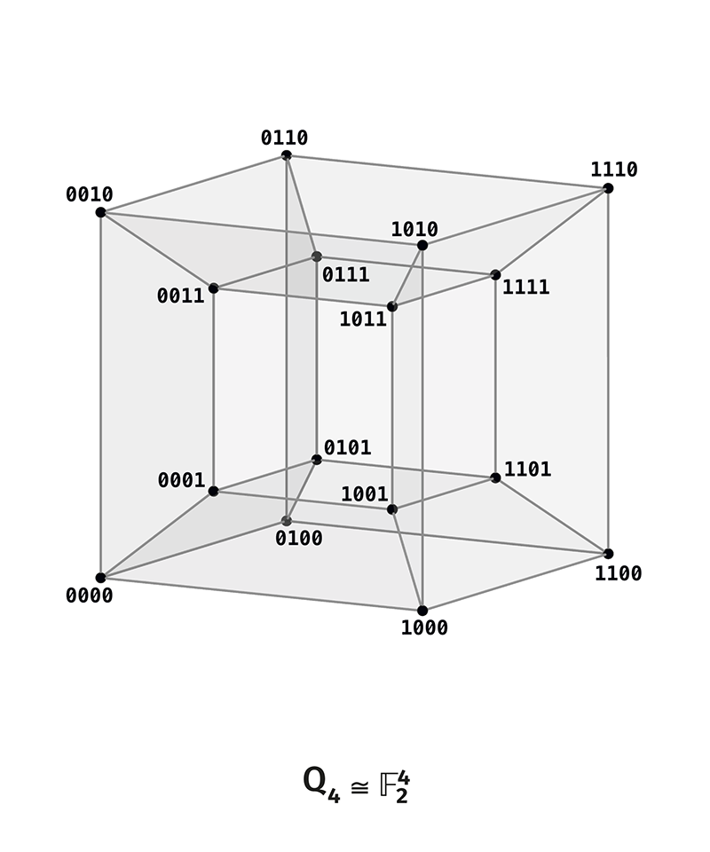

The nonzero layer:

\[
\mathcal P_4=Q_4\setminus\{0000\}.
\]

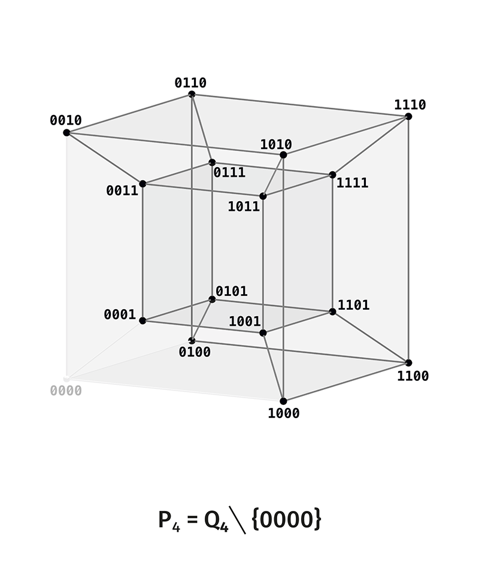

The full nontrivial carrier:

\[
U_4=Q_4\setminus\{0000,1111\}.
\]

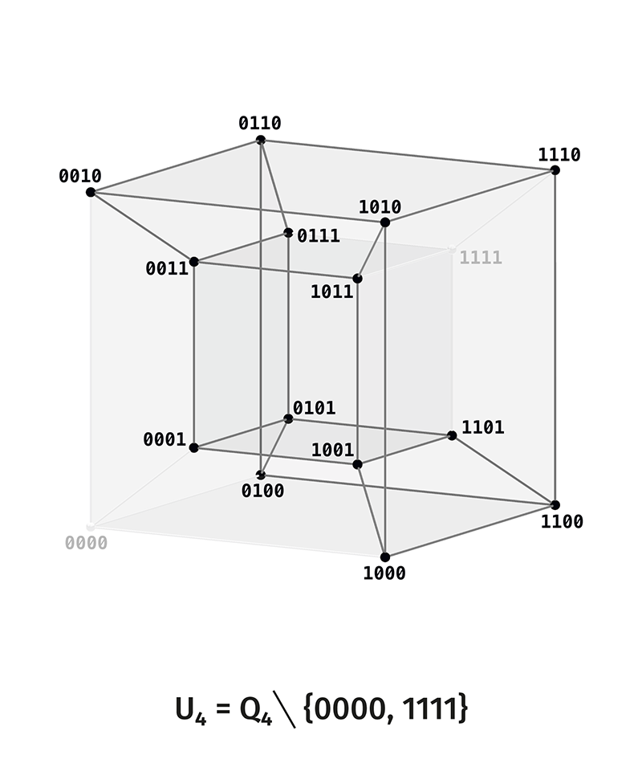

Outer shell:

\[
V_4=S_1^{(4)}\sqcup S_3^{(4)}.
\]

Middle shell:

\[
M_4=S_2^{(4)}.
\]

**Statement 18.1.**

\[
|Q_4|=16,
\qquad
|\mathcal P_4|=15,
\qquad
|U_4|=14,
\]

\[
|V_4|=8,
\qquad
|M_4|=6.
\]

**Check.**
Since \(Q_4=\mathbb F_2^4\), we have \(|Q_4|=2^4=16\). The carrier
\(\mathcal P_4\) is obtained by deleting \(0000\), so
\(|\mathcal P_4|=15\). The carrier \(U_4\) is obtained by deleting the two
total poles, so \(|U_4|=14\).

For the shells:

\[
|V_4|=\binom41+\binom43=4+4=8,
\]

\[
|M_4|=\binom42=6.
\]

\[
\Box
\]

## §18.4. \(P_1\)--\(P_{15}\)

The numbering is defined by binary value:

\[
P_m^{(4)}=\text{four-bit representation of }m.
\]

The carrier table:

\[
\begin{array}{c|c|c}
\text{element} & \text{bit} & \text{support}\\
\hline
P_1 & 0001 & A\\
P_2 & 0010 & B\\
P_3 & 0011 & AB\\
P_4 & 0100 & C\\
P_5 & 0101 & AC\\
P_6 & 0110 & BC\\
P_7 & 0111 & ABC\\
P_8 & 1000 & D\\
P_9 & 1001 & AD\\
P_{10} & 1010 & BD\\
P_{11} & 1011 & ABD\\
P_{12} & 1100 & CD\\
P_{13} & 1101 & ACD\\
P_{14} & 1110 & BCD\\
P_{15} & 1111 & ABCD
\end{array}
\]

The saturation point of rank \(4\):

\[
P_{15}^{(4)}=1111=ABCD.
\]

Under the rank lift \(4\to5\):

\[
\iota_{4\to5}(P_{15}^{(4)})=01111=P_{15}^{(5)}.
\]

In rank \(5\) this point lies in the shell \(S_4^{(5)}\) as the
missing-\(E\) state, while saturation of rank \(5\) is
\(P_{31}^{(5)}=11111\).

## §18.5. Shell Order of Rank \(4\)

\[
\mathcal P_4
=
S_1^{(4)}
\sqcup
S_2^{(4)}
\sqcup
S_3^{(4)}
\sqcup
S_4^{(4)}.
\]

**Statement 18.2.**

\[
15=4+6+4+1.
\]

In other words:

\[
|S_1^{(4)}|=4,
\quad
|S_2^{(4)}|=6,
\quad
|S_3^{(4)}|=4,
\quad
|S_4^{(4)}|=1.
\]

**Check.**
The shell \(S_k^{(4)}\) consists of \(k\)-element supports in \(J_4\).
Therefore:

\[
|S_k^{(4)}|=\binom4k.
\]

Hence:

\[
\binom41=4,
\qquad
\binom42=6,
\qquad
\binom43=4,
\qquad
\binom44=1.
\]

\[
\Box
\]

In rank \(4\) distinguish:

\[
S_1^{(4)}\leftrightarrow S_3^{(4)}
\]

as outer-shell duality, and

\[
S_2^{(4)}\leftrightarrow S_2^{(4)}
\]

as middle self-duality.

## §18.6. Shells of Rank \(4\)

The first shell:

\[
S_1^{(4)}=\{P_1,P_2,P_4,P_8\}=\{A,B,C,D\}.
\]

The second shell:

\[
S_2^{(4)}
=
\{P_3,P_5,P_6,P_9,P_{10},P_{12}\}
=
\{AB,AC,BC,AD,BD,CD\}.
\]

The third shell:

\[
S_3^{(4)}
=
\{P_7,P_{11},P_{13},P_{14}\}
=
\{ABC,ABD,ACD,BCD\}.
\]

The fourth shell:

\[
S_4^{(4)}=\{P_{15}\}=\{ABCD\}.
\]

## §18.7. Complement Map and Seven Complement Pairs

On \(Q_4\), define the complement involution

\[
\kappa_4(x)=x+1111.
\]

It sends a support to the complementary support:

\[
\operatorname{supp}(\kappa_4(x))=J_4\setminus\operatorname{supp}(x).
\]

Inside \(\mathcal P_4\setminus\{P_{15}\}\), complement gives seven pairs:

\[
P_1\leftrightarrow P_{14},
\qquad
P_2\leftrightarrow P_{13},
\qquad
P_3\leftrightarrow P_{12},
\]

\[
P_4\leftrightarrow P_{11},
\qquad
P_5\leftrightarrow P_{10},
\qquad
P_6\leftrightarrow P_9,
\]

\[
P_7\leftrightarrow P_8.
\]

The point \(P_{15}\) has complement \(0000\), which is deleted from
\(\mathcal P_4\):

\[
\kappa_4(P_{15})=0000.
\]

For each active complement pair:

\[
x+\kappa_4(x)=P_{15}.
\]

Therefore each such pair defines a projective line:

\[
\ell_x=\{x,\kappa_4(x),P_{15}\}.
\]

There are \(7\) such lines through \(P_{15}\).

## §18.8. Outer Duality and Middle Self-Duality

Complement acts on shells as follows:

\[
\kappa_4:S_1^{(4)}\xrightarrow{\cong}S_3^{(4)},
\]

\[
\kappa_4:S_2^{(4)}\xrightarrow{\cong}S_2^{(4)}.
\]

Outer complement pairs:

\[
A\leftrightarrow BCD,
\qquad
B\leftrightarrow ACD,
\qquad
C\leftrightarrow ABD,
\qquad
D\leftrightarrow ABC.
\]

Middle complement pairs:

\[
AB\leftrightarrow CD,
\qquad
AC\leftrightarrow BD,
\qquad
AD\leftrightarrow BC.
\]

**Statement 18.3.**
The complement involution \(\kappa_4\) decomposes the middle shell
\(S_2^{(4)}\) into three complement pairs:

\[
S_2^{(4)}
=
\{P_3,P_{12}\}
\sqcup
\{P_5,P_{10}\}
\sqcup
\{P_6,P_9\}.
\]

**Check.**
If \(X\subset J_4\) has cardinality \(2\), then \(J_4\setminus X\) also has
cardinality \(2\). Therefore \(\kappa_4\) preserves \(S_2^{(4)}\). Direct
table:

\[
AB\leftrightarrow CD,
\qquad
AC\leftrightarrow BD,
\qquad
AD\leftrightarrow BC.
\]

There are no fixed points, because \(X=J_4\setminus X\) is impossible for a
subset \(X\subset J_4\). Hence \(S_2^{(4)}\) decomposes into three pairs.

\[
\Box
\]

## §18.9. What Is Fixed in §18

In §18 the carrier and shell atlas of rank \(4\) has been built:

\[
\mathcal P_4=\mathbb F_2^4\setminus\{0000\}.
\]

The main shell decomposition:

\[
15=4+6+4+1.
\]

The main duality structures:

\[
S_1^{(4)}\leftrightarrow S_3^{(4)},
\qquad
S_2^{(4)}\leftrightarrow S_2^{(4)}.
\]

Rank \(4\) is an even-rank interlayer: its middle shell is self-dual, and
the rank-3 carrier enters the coordinate face \(\{D=0\}\) through
\(\iota_{3\to4}\).

# §19. Middle Relation Grammar of Rank \(4\)

## §19.1. Hamming Relations on \(\mathcal P_4\)

On \(\mathcal P_4\), define the Hamming relations

\[
\mathsf H_k^{(4)}
=
\{(x,y)\in \mathcal P_4\times\mathcal P_4:x\neq y,\ d_H(x,y)=k\},
\qquad
k=1,2,3,4.
\]

**Statement 19.1.**
If unordered graph edges are counted, then

\[
|\mathsf H_1^{(4)}|=28,
\qquad
|\mathsf H_2^{(4)}|=42,
\]

\[
|\mathsf H_3^{(4)}|=28,
\qquad
|\mathsf H_4^{(4)}|=7.
\]

**Check.**
In the full \(Q_4\), the number of Hamming-distance \(k\) graph edges is

\[
2^{4-1}\binom4k=8\binom4k.
\]

Passing to \(\mathcal P_4=Q_4\setminus\{0000\}\) removes the edges from
\(0000\) to \(S_k^{(4)}\). There are

\[
\binom4k
\]

such edges.

Therefore

\[
|\mathsf H_k^{(4)}|=8\binom4k-\binom4k=7\binom4k.
\]

Hence:

\[
7\binom41=28,
\quad
7\binom42=42,
\quad
7\binom43=28,
\quad
7\binom44=7.
\]

\[
\Box
\]

## §19.2. The Graph \(L(K_4)\) and \(K_{2,2,2}\)

The line graph \(L(K_4)\) has vertices equal to the edges of the graph
\(K_4\). Therefore:

\[
V(L(K_4))=\{\text{two-element subsets of }J_4\}.
\]

Two vertices of \(L(K_4)\) are adjacent if and only if the corresponding
\(2\)-subsets have one common coordinate.

**Statement 19.2.**

\[
L(K_4)\cong K_{2,2,2}.
\]

**Check.**
The vertices of \(L(K_4)\) are the six \(2\)-subsets of \(J_4\). The only
non-adjacent pairs are the disjoint pairs:

\[
AB\leftrightarrow CD,
\qquad
AC\leftrightarrow BD,
\qquad
AD\leftrightarrow BC.
\]

These three disjoint pairs define three parts of size \(2\). Between
different parts all vertices are adjacent. Therefore the graph has the form
\(K_{2,2,2}\).

\[
\Box
\]

## §19.3. Relation Grammar on \(S_2^{(4)}\)

The middle shell \(S_2^{(4)}\) is the set of \(2\)-subsets of \(J_4\). For
\(X,Y\in S_2^{(4)}\):

\[
|X\triangle Y|=4-2|X\cap Y|.
\]

**Statement 19.3.**

\[
(S_2^{(4)},\mathsf H_2^{(4)}|_{S_2^{(4)}})\cong K_{2,2,2}.
\]

**Check.**
If \(X,Y\in S_2^{(4)}\) are distinct, then either \(|X\cap Y|=1\), or
\(X\cap Y=\varnothing\). When \(|X\cap Y|=1\), we have
\(|X\triangle Y|=2\), that is, \(d_H(X,Y)=2\). This is exactly the adjacency
relation of the line graph \(L(K_4)\). By Statement 19.2:

\[
L(K_4)\cong K_{2,2,2}.
\]

\[
\Box
\]

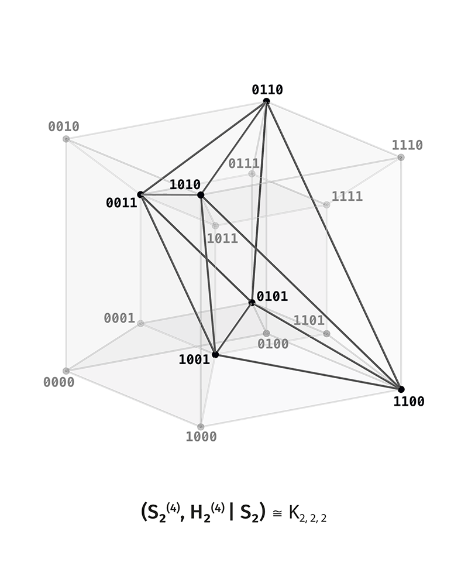

**Statement 19.4.**

\[
(S_2^{(4)},\mathsf H_4^{(4)}|_{S_2^{(4)}})\cong 3K_2.
\]

**Check.**
Distance \(4\) between two \(2\)-subsets occurs if and only if they are
disjoint. In \(J_4\) there are exactly three disjoint complement pairs:

\[
AB\leftrightarrow CD,
\qquad
AC\leftrightarrow BD,
\qquad
AD\leftrightarrow BC.
\]

Therefore \(\mathsf H_4^{(4)}|_{S_2^{(4)}}\) consists of three disjoint
\(K_2\)-components.

\[
\Box
\]

## §19.4. Octahedral Middle Slice

In rank \(3\):

\[
(X_{\mathrm{adm}},R_1\cup R_2)\cong K_{2,2,2}.
\]

In rank \(4\):

\[
(S_2^{(4)},\mathsf H_2^{(4)}|_{S_2^{(4)}})\cong K_{2,2,2}.
\]

The rank-3 octahedral graph pattern is realized inside rank \(4\) as the
graph reading of the middle shell \(S_2^{(4)}\). In rank \(3\) this pattern
was a relation union on the active carrier; in rank \(4\) it becomes a
single Hamming-distance layer on the middle shell.

## §19.5. Cross Grammar of the Middle Shell

Between \(S_2^{(4)}\) and neighboring shells, only distances \(1\) and \(3\)
are possible.

For \(X\in S_2^{(4)}\) and \(Y\in S_1^{(4)}\):

\[
d_H(X,Y)=1
\quad\Longleftrightarrow\quad
Y\subset X.
\]

For \(X\in S_2^{(4)}\) and \(Y\in S_3^{(4)}\):

\[
d_H(X,Y)=1
\quad\Longleftrightarrow\quad
X\subset Y.
\]

All other cross pairs between \(S_2\) and \(S_1\sqcup S_3\) have distance
\(3\).

**Statement 19.5.**
Cross-edge counts of the middle shell:

\[
|E_{\mathsf H_1}(S_1,S_2)|=12,
\qquad
|E_{\mathsf H_3}(S_1,S_2)|=12,
\]

\[
|E_{\mathsf H_1}(S_2,S_3)|=12,
\qquad
|E_{\mathsf H_3}(S_2,S_3)|=12.
\]

**Check.**
Each pair \(X\in S_2^{(4)}\) contains exactly \(2\) singletons. The other
\(2\) singletons are outside \(X\). Since \(|S_2^{(4)}|=6\), we get

\[
6\cdot2=12
\]

distance \(1\) edges to \(S_1\), and \(12\) distance \(3\) edges to \(S_1\).

Each pair \(X\in S_2^{(4)}\) is contained in exactly \(2\) triples and
intersects exactly \(2\) further triples in one coordinate. Therefore:

\[
6\cdot2=12
\]

distance \(1\) edges to \(S_3\), and \(12\) distance \(3\) edges to \(S_3\).

\[
\Box
\]

## §19.6. What Is Fixed in §19

The main strict facts of §19:

\[
(S_2^{(4)},\mathsf H_2^{(4)}|_{S_2^{(4)}})\cong K_{2,2,2},
\]

\[
(S_2^{(4)},\mathsf H_4^{(4)}|_{S_2^{(4)}})\cong 3K_2.
\]

The middle shell \(S_2^{(4)}\) is the rank-4 location where the octahedral
graph pattern of rank \(3\) is realized as a one-relation graph reading.

# §20. Outer Shell and Operator Layer of Rank \(4\)

## §20.1. Outer Axial Factorization

Outer shell:

\[
V_4=S_1^{(4)}\sqcup S_3^{(4)}.
\]

Define the axial carrier:

\[
I_4=\{I_A,I_B,I_C,I_D\},
\qquad
\Sigma=\{-,+\}.
\]

For \(i\in J_4\):

\[
I_i^-=\{i\}\in S_1^{(4)},
\qquad
I_i^+=J_4\setminus\{i\}\in S_3^{(4)}.
\]

Then:

\[
H_i^{(4)}=\{I_i^-,I_i^+\}.
\]

**Statement 20.1.**

\[
V_4\cong I_4\times\Sigma,
\]

and

\[
(V_4,\mathsf H_4^{(4)}|_{V_4})\cong 4K_2.
\]

**Check.**
Every element of \(V_4\) lies in exactly one complement pair:

\[
A\leftrightarrow BCD,
\quad
B\leftrightarrow ACD,
\quad
C\leftrightarrow ABD,
\quad
D\leftrightarrow ABC.
\]

The sign \(-\) means membership in \(S_1^{(4)}\), and the sign \(+\) means
membership in \(S_3^{(4)}\). This gives a bijection
\(V_4\to I_4\times\Sigma\). The relation \(\mathsf H_4^{(4)}\) connects
only complement partners, so the graph reading is \(4K_2\).

\[
\Box
\]

## §20.2. Residual Graph on \(V_4\)

The residual relation:

\[
\Omega_4
=
\{(x,y)\in V_4\times V_4:x\neq y,\ y\neq\kappa_4(x)\}.
\]

**Statement 20.2.**

\[
(V_4,\Omega_4)\cong K_{2,2,2,2}.
\]

In addition:

\[
|V_4|=8,
\qquad
\deg=6,
\qquad
|E(K_{2,2,2,2})|=24.
\]

**Check.**
The parts of the graph are the four complement pairs
\(H_A^{(4)},H_B^{(4)},H_C^{(4)},H_D^{(4)}\), each of size \(2\). Inside
one part the relation is absent; between different parts all edges are
present. This is \(K_{2,2,2,2}\).

Each vertex is connected to all \(8-1\) other vertices except one
complement partner, so the degree is \(6\). Hence:

\[
|E|=\frac{8\cdot6}{2}=24.
\]

\[
\Box
\]

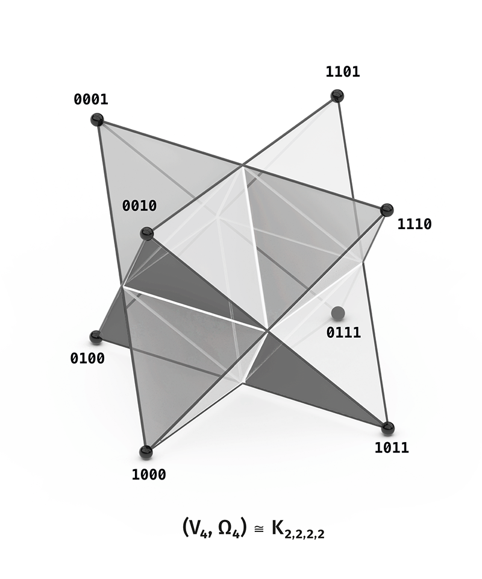

## §20.3. Hamming Decomposition of \(\Omega_4\)

**Statement 20.3.**

\[
\Omega_4
=
\mathsf H_2^{(4)}\cap(V_4\times V_4).
\]

That is, all residual edges on \(V_4\) are Hamming-distance \(2\) edges.

**Check.**
Inside \(S_1^{(4)}\), two distinct singleton points differ in two
coordinates. Inside \(S_3^{(4)}\), two distinct triple points also differ in
two coordinates.

For \(\{i\}\in S_1^{(4)}\) and \(Y\in S_3^{(4)}\), if
\(Y\neq J_4\setminus\{i\}\), then \(i\in Y\). Then:

\[
d_H(\{i\},Y)=|Y|-1=2.
\]

The only cross case of distance \(4\) is the complement pair
\(\{i\}\leftrightarrow J_4\setminus\{i\}\), and it is excluded from
\(\Omega_4\).

\[
\Box
\]

## §20.4. Outer Axial Presentations

For each \(i\in J_4\), define the reading

\[
\pi_i^{(4)}:H_i^{(4)}\to\{I_i\},
\qquad
\pi_i^{(4)}(I_i^-)=\pi_i^{(4)}(I_i^+)=I_i.
\]

Recovery:

\[
\operatorname{rec}_i^{(4)}(I_i)
=
(H_i^{(4)},\mathsf H_4^{(4)}|_{H_i^{(4)}}).
\]

Presentation:

\[
\Pi_i^{\operatorname{ax},(4)}
=
\left(
H_i^{(4)},
\mathsf H_4^{(4)}|_{H_i^{(4)}},
\pi_i^{(4)},
\operatorname{rec}_i^{(4)}
\right).
\]

Each \(\Pi_i^{\operatorname{ax},(4)}\) is exact: the unique fiber of the
reading is \(H_i^{(4)}\), and recovery returns this fiber with the induced
relation.

## §20.5. Edge Layer and Line Graph

The edge layer of the outer graph:

\[
E_4=E(K_{2,2,2,2}).
\]

The operator layer as a line graph:

\[
L_4=L(K_{2,2,2,2}).
\]

**Statement 20.4.**

\[
|V(L_4)|=24,
\qquad
\deg(L_4)=10,
\qquad
|E(L_4)|=120.
\]

**Check.**
The vertices of \(L_4\) are the edges of \(K_{2,2,2,2}\), therefore:

\[
|V(L_4)|=24.
\]

Each edge of the source graph touches two vertices of degree \(6\). In the
line graph it is adjacent to

\[
(6-1)+(6-1)=10
\]

other edges. Therefore:

\[
|E(L_4)|=\frac{24\cdot10}{2}=120.
\]

\[
\Box
\]

## §20.6. What Is Fixed in §20

The outer shell of rank \(4\) has axial factorization

\[
V_4\cong I_4\times\{-,+\},
\]

residual graph

\[
(V_4,\Omega_4)\cong K_{2,2,2,2},
\]

and operator layer

\[
L_4=L(K_{2,2,2,2}).
\]

All residual edges \(\Omega_4\) are realized as Hamming-distance \(2\) edges
on \(V_4\).

# §21. Cycle Atlas and Presentations of Rank \(4\)

## §21.1. Cycle Atlas of Rank \(4\)

**Definition 21.1.**
The rank-4 cycle atlas is the structure/package

\[
\mathcal C_4
=
(C_8^{(4)},C_6^{(4),\operatorname{mid}},C_{15}^{(4)}),
\]

where \(C_8^{(4)}\) is the chosen Hamilton cycle on \(V_4\),
\(C_6^{(4),\operatorname{mid}}\) is the chosen Hamilton cycle on the middle
shell \(S_2^{(4)}\), and \(C_{15}^{(4)}\) is the Singer cycle on
\(\mathcal P_4\).

This is a structure/package in the sense of a closure name for rank-4 cycle
readings.

## §21.2. Hamilton Cycle \(C_8\) on \(V_4\)

Fix the cycle:

\[
A^-\to B^-\to C^-\to D^-\to A^+\to B^+\to C^+\to D^+\to A^-.
\]

In \(P\)-coordinates:

\[
P_1\to P_2\to P_4\to P_8\to P_{14}\to P_{13}\to P_{11}\to P_7\to P_1.
\]

**Statement 21.2.**
This cycle is a Hamilton cycle of the graph \((V_4,\Omega_4)\).

**Check.**
The cycle passes through all \(8\) vertices of \(V_4\) exactly once. Each
neighboring pair lies in different complement parts \(H_i^{(4)}\), including
the last pair \(D^+\to A^-\). Therefore each neighboring pair is an edge of
the relation \(\Omega_4\).

\[
\Box
\]

## §21.3. Hamilton Cycle \(C_6\) on the Middle Shell

Fix the cycle on \(S_2^{(4)}\):

\[
AB\to AC\to BC\to CD\to BD\to AD\to AB.
\]

In \(P\)-coordinates:

\[
P_3\to P_5\to P_6\to P_{12}\to P_{10}\to P_9\to P_3.
\]

**Statement 21.3.**
This cycle is a Hamilton cycle of the graph

\[
(S_2^{(4)},\mathsf H_2^{(4)}|_{S_2^{(4)}}).
\]

**Check.**
The cycle lists all \(6\) points of \(S_2^{(4)}\). Each neighboring pair
intersects in exactly one coordinate:

\[
AB\cap AC=A,
\quad
AC\cap BC=C,
\quad
BC\cap CD=C,
\]

\[
CD\cap BD=D,
\quad
BD\cap AD=D,
\quad
AD\cap AB=A.
\]

Therefore each transition has Hamming distance \(2\), that is, it is an
edge of the relation \(\mathsf H_2^{(4)}|_{S_2^{(4)}}\).

\[
\Box
\]

## §21.4. Singer Cycle \(C_{15}\)

For an explicit construction, introduce

\[
\mathbb F_{16}=\mathbb F_2[t]/(t^4+t+1).
\]

The polynomial \(t^4+t+1\) is chosen as a primitive polynomial.
Multiplication by \(t\) on \(\mathbb F_{16}^{\times}\) gives a
\(15\)-cycle.

One representative:

\[
P_1\to P_2\to P_4\to P_8\to P_3
\to P_6\to P_{12}\to P_{11}\to P_5\to P_{10}
\to P_7\to P_{14}\to P_{15}\to P_{13}\to P_9
\to P_1.
\]

In bits:

\[
0001\to0010\to0100\to1000\to0011
\to0110\to1100\to1011\to0101\to1010
\to0111\to1110\to1111\to1101\to1001
\to0001.
\]

**Statement 21.4.**
After choosing the primitive polynomial \(t^4+t+1\), multiplication by
\(t\) defines a \(15\)-cycle on \(\mathcal P_4\).

**Check.**
In the field \(\mathbb F_{16}\), the group \(\mathbb F_{16}^{\times}\) has
\(15\) elements. Since \(t^4+t+1\) is chosen primitive, the class \(t\)
generates \(\mathbb F_{16}^{\times}\). Therefore the sequence of
multiplications by \(t\) passes through all \(15\) nonzero elements and
returns to the starting point after \(15\) steps. The displayed cycle is
this sequence in the bit basis \(1,t,t^2,t^3\).

\[
\Box
\]

## §21.5. Complement-Pair and Middle-Axial Presentations

The complement-pair reading on \(\mathcal P_4\setminus\{P_{15}\}\):

\[
B_7^{(4)}
=
\{\{x,\kappa_4(x)\}:x\in\mathcal P_4\setminus\{P_{15}\}\}.
\]

This is a set of \(7\) complement pairs.

\[
\pi_\kappa^{(4)}:\mathcal P_4\setminus\{P_{15}\}\to B_7^{(4)},
\]

\[
\pi_\kappa^{(4)}(x)=\{x,\kappa_4(x)\}.
\]

Recovery:

\[
\operatorname{rec}_\kappa^{(4)}(\{x,\kappa_4(x)\})
=
(\{x,\kappa_4(x)\},\mathsf H_4^{(4)}|_{\{x,\kappa_4(x)\}}).
\]

Presentation:

\[
\Pi_\kappa^{(4)}
=
\left(
\mathcal P_4\setminus\{P_{15}\},
\mathsf H_4^{(4)}|_{\mathcal P_4\setminus\{P_{15}\}},
\pi_\kappa^{(4)},
\operatorname{rec}_\kappa^{(4)}
\right).
\]

The presentation \(\Pi_\kappa^{(4)}\) is exact: each fiber of the reading is
one complement pair, and recovery returns this pair together with the
induced \(\mathsf H_4^{(4)}\)-relation.

Middle axial pairs:

\[
H_{AB|CD}^{\operatorname{mid}}=\{AB,CD\},
\qquad
H_{AC|BD}^{\operatorname{mid}}=\{AC,BD\},
\qquad
H_{AD|BC}^{\operatorname{mid}}=\{AD,BC\}.
\]

For each such middle pair \(H_j^{\operatorname{mid}}\), define the
presentation:

\[
Y_j^{\operatorname{mid}}=\{I_j^{\operatorname{mid}}\}.
\]

\[
\pi_j^{\operatorname{mid}}:H_j^{\operatorname{mid}}\to Y_j^{\operatorname{mid}},
\qquad
\pi_j^{\operatorname{mid}}(x)=I_j^{\operatorname{mid}}.
\]

\[
\operatorname{rec}_j^{\operatorname{mid}}(I_j^{\operatorname{mid}})
=
(H_j^{\operatorname{mid}},\mathsf H_4^{(4)}|_{H_j^{\operatorname{mid}}}).
\]

\[
\Pi_j^{\operatorname{mid-ax},(4)}
=
\left(
H_j^{\operatorname{mid}},
\mathsf H_4^{(4)}|_{H_j^{\operatorname{mid}}},
\pi_j^{\operatorname{mid}},
\operatorname{rec}_j^{\operatorname{mid}}
\right).
\]

These presentations are exact by the same argument as the axial
presentations of §20.4.

## §21.6. Closure of Rank \(4\)

The rank-4 finite package:

\[
\mathfrak C_4
=
\left(
\mathcal P_4,
\{S_k^{(4)}\}_{k=1}^4,
\mathsf H_1^{(4)},\mathsf H_2^{(4)},\mathsf H_3^{(4)},\mathsf H_4^{(4)},
V_4,
S_2^{(4)},
\Omega_4,
\mathcal C_4,
\Pi_\kappa^{(4)},
\{\Pi_i^{\operatorname{ax},(4)}\}_{i\in J_4},
\{\Pi_j^{\operatorname{mid-ax},(4)}\}_{j\in\{AB|CD,\ AC|BD,\ AD|BC\}}
\right).
\]

This is a structure/package in the sense of a closure name for the rank-4
finite carrier atlas.

In §21 rank \(4\) is fixed as an even finite interlayer: the middle shell is
self-dual, the rank-3 octahedral pattern is realized as the
\(S_2^{(4)}\)-slice, and the cycle structure has atlas form.

# §22. Carrier and Shell Atlas of Rank \(5\)

## §22.1. Coordinate Labels and Rank-4 Embedding

In rank \(5\) use the coordinate-label set:

\[
J_5=\{A,B,C,D,E\}.
\]

The first four labels coincide with the rank-4 coordinate labels. The fifth
label

\[
E
\]

defines the fifth bit coordinate:

\[
E=\text{fifth coordinate of }Q_5.
\]

Semantic readings of the form

\[
E=\text{composition coordinate},
\qquad
\text{binding},
\qquad
\text{neutral closure},
\qquad
\text{composition/closure}
\]

are used as explanatory names. The formal role of \(E\) in §22 is the fifth
coordinate of \(Q_5\).

Bit order of rank \(5\):

\[
E,D,C,B,A.
\]

Therefore:

\[
A=00001,
\]

\[
B=00010,
\]

\[
C=00100,
\]

\[
D=01000,
\]

\[
E=10000.
\]

Distinguish \(P_m^{(4)}\) and \(P_m^{(5)}\). They may have the same decimal
index \(m\), but they belong to different carriers.

The identification \(4\to5\) is given by the face lift

\[
\iota_{4\to5}:\mathcal P_4\to P^{(5)},
\]

\[
\iota_{4\to5}(x)=0\cdot e_E+x.
\]

In bits:

\[
\iota_{4\to5}(x_4x_3x_2x_1)=0x_4x_3x_2x_1.
\]

Therefore the former rank-4 saturation point

\[
P_{15}^{(4)}=1111
\]

is read in rank \(5\) through the embedding as

\[
\iota_{4\to5}(P_{15}^{(4)})=P_{15}^{(5)}=01111.
\]

This is the image of the old point in the coordinate face \(E=0\).

## §22.2. Rank Lift \(4\to5\)

By the rank-lift formula of §3:

\[
Q_n^*
=
Q_{n-1}^*
\sqcup
\{e_n\}
\sqcup
(e_n+Q_{n-1}^*).
\]

For rank \(5\):

\[
Q_5^*
=
Q_4^*
\sqcup
\{e_E\}
\sqcup
(e_E+Q_4^*).
\]

Here:

\[
e_E=10000=P_{16}^{(5)}.
\]

Therefore:

\[
P_1^{(5)},\ldots,P_{15}^{(5)}
\]

preserve the embedded rank-4 layer without \(E\);

\[
P_{16}^{(5)}
\]

introduces the new coordinate;

\[
P_{17}^{(5)},\ldots,P_{31}^{(5)}
\]

are the old rank-4 layer with new \(E\)-load.

In expanded form:

\[
Q_5^*
=
\{P_1,\ldots,P_{15}\}
\sqcup
\{P_{16}\}
\sqcup
\{P_{17},\ldots,P_{31}\}.
\]

This is emergence order. Shell order is defined separately after the
carrier is assembled.

## §22.3. Basic Carriers of Rank \(5\)

Several carriers are distinguished in §22.

The full carrier:

\[
Q_5=\mathbb F_2^5.
\]

It contains \(32\) states.

The nonzero carrier:

\[
P^{(5)}=Q_5\setminus\{00000\}.
\]

\[
|P^{(5)}|=31.
\]

Over \(\mathbb F_2\), all nonzero vectors already give projective points.
Therefore \(P^{(5)}\) admits a readable \(PG(4,2)\)-reading; in §22 the
native carrier remains \(P^{(5)}\).

The full nontrivial carrier:

\[
U_5=Q_5\setminus\{00000,11111\}.
\]

\[
|U_5|=30.
\]

This is the rank-5 analog of the puncture pattern of §5: the full carrier
without two total poles.

The outer shell:

\[
V_5=S_1^{(5)}\sqcup S_4^{(5)}.
\]

\[
|V_5|=5+5=10.
\]

The middle finite carrier:

\[
M_5=S_2^{(5)}\sqcup S_3^{(5)}.
\]

\[
|M_5|=10+10=20.
\]

This carrier fixes the middle pair/triple layer.

**Statement 22.1.**
The main sizes of rank-5 carriers are

\[
|Q_5|=32,
\qquad
|P^{(5)}|=31,
\qquad
|U_5|=30,
\]

\[
|V_5|=10,
\qquad
|M_5|=20.
\]

**Check.**
Since \(Q_5=\mathbb F_2^5\), we have

\[
|Q_5|=2^5=32.
\]

The carrier \(P^{(5)}\) is obtained by deleting \(00000\), hence:

\[
|P^{(5)}|=31.
\]

The carrier \(U_5\) is obtained by deleting two total poles, hence:

\[
|U_5|=30.
\]

For \(V_5\):

\[
|V_5|=|S_1^{(5)}|+|S_4^{(5)}|=\binom51+\binom54=5+5=10.
\]

For \(M_5\):

\[
|M_5|=|S_2^{(5)}|+|S_3^{(5)}|=\binom52+\binom53=10+10=20.
\]

\[
\Box
\]

## §22.4. \(P_1\)--\(P_{31}\)

The numbering is defined by binary value:

\[
P_m^{(5)}=\text{five-bit representation of }m.
\]

Basic points:

\[
P_1=00001=A,
\]

\[
P_2=00010=B,
\]

\[
P_4=00100=C,
\]

\[
P_8=01000=D,
\]

\[
P_{16}=10000=E.
\]

Rank-5 saturation:

\[
P_{31}=11111=A+B+C+D+E.
\]

Embedded rank-4 saturation:

\[
P_{15}^{(5)}=01111=A+B+C+D.
\]

That is, in rank \(5\):

\[
P_{15}^{(5)}=A+B+C+D=\text{missing }E.
\]

The points of the shell \(S_4^{(5)}\) are missing-one-coordinate positions.
The precise term is

\[
S_4^{(5)}\text{-point missing one coordinate}.
\]

## §22.5. Shell Order of Rank \(5\)

By shell order after assembling the carrier:

\[
P^{(5)}
=
S_1^{(5)}
\sqcup
S_2^{(5)}
\sqcup
S_3^{(5)}
\sqcup
S_4^{(5)}
\sqcup
S_5^{(5)}.
\]

Shell sizes are binomial:

\[
|S_k^{(5)}|=\binom{5}{k}.
\]

Therefore:

\[
31=5+10+10+5+1.
\]

This is shell order. Emergence order is defined in §22.2.

**Statement 22.2.**
The shell decomposition of \(P^{(5)}\) has sizes:

\[
|S_1^{(5)}|=5,\quad
|S_2^{(5)}|=10,\quad
|S_3^{(5)}|=10,\quad
|S_4^{(5)}|=5,\quad
|S_5^{(5)}|=1.
\]

**Check.**
The shell \(S_k^{(5)}\) consists of \(k\)-element supports in the
five-coordinate set \(J_5\). Therefore:

\[
|S_k^{(5)}|=\binom5k.
\]

Hence:

\[
\binom51=5,\quad
\binom52=10,\quad
\binom53=10,\quad
\binom54=5,\quad
\binom55=1.
\]

\[
\Box
\]

## §22.6. First Shell \(S_1^{(5)}\)

\[
S_1^{(5)}=\{P_1,P_2,P_4,P_8,P_{16}\}.
\]

In coordinate labels:

\[
S_1^{(5)}=\{A,B,C,D,E\}.
\]

This is the basis shell of rank \(5\).

## §22.7. Second Shell \(S_2^{(5)}\)

\[
S_2^{(5)}
=
\{P_3,P_5,P_6,P_9,P_{10},P_{12},P_{17},P_{18},P_{20},P_{24}\}.
\]

In support notation:

\[
S_2^{(5)}
=
\{AB,AC,BC,AD,BD,CD,AE,BE,CE,DE\}.
\]

This is the set of \(2\)-element subsets of \(J_5\):

\[
|S_2^{(5)}|=\binom{5}{2}=10.
\]

Semantic reading:

\[
S_2^{(5)}=\text{pair-interaction shell}.
\]

## §22.8. Third Shell \(S_3^{(5)}\)

\[
S_3^{(5)}
=
\{P_7,P_{11},P_{13},P_{14},P_{19},P_{21},P_{22},P_{25},P_{26},P_{28}\}.
\]

In support notation:

\[
S_3^{(5)}
=
\{ABC,ABD,ACD,BCD,ABE,ACE,BCE,ADE,BDE,CDE\}.
\]

This is the set of \(3\)-element subsets of \(J_5\):

\[
|S_3^{(5)}|=\binom{5}{3}=10.
\]

Semantic reading:

\[
S_3^{(5)}=\text{triple-closure shell}.
\]

## §22.9. Fourth Shell \(S_4^{(5)}\)

\[
S_4^{(5)}=\{P_{15},P_{23},P_{27},P_{29},P_{30}\}.
\]

In support notation:

\[
S_4^{(5)}=\{ABCD,ABCE,ABDE,ACDE,BCDE\}.
\]

Each point of \(S_4^{(5)}\) misses one coordinate:

\[
ABCD=\text{missing }E,
\]

\[
ABCE=\text{missing }D,
\]

\[
ABDE=\text{missing }C,
\]

\[
ACDE=\text{missing }B,
\]

\[
BCDE=\text{missing }A.
\]

In \(P\)-numbers:

\[
P_{15}=ABCD=\text{missing }E,
\]

\[
P_{23}=ABCE=\text{missing }D,
\]

\[
P_{27}=ABDE=\text{missing }C,
\]

\[
P_{29}=ACDE=\text{missing }B,
\]

\[
P_{30}=BCDE=\text{missing }A.
\]

## §22.10. Fifth Shell \(S_5^{(5)}\)

\[
S_5^{(5)}=\{P_{31}\}.
\]

\[
P_{31}=11111=A+B+C+D+E.
\]

Formal notation:

\[
P_{31}=\text{unique weight-5 state}.
\]

Semantic reading:

\[
P_{31}=\text{full composite saturation}.
\]

## §22.11. Complement Map and Fifteen Complement Pairs

On the full carrier \(Q_5\), define

\[
\kappa_5(x)=x+11111.
\]

Then:

\[
\kappa_5^2=\operatorname{id}_{Q_5}.
\]

Inside \(P^{(5)}\), for \(i=1,\ldots,15\):

\[
P_i\leftrightarrow P_{31-i}.
\]

Full table:

\[
P_1\leftrightarrow P_{30},
\quad
P_2\leftrightarrow P_{29},
\quad
P_3\leftrightarrow P_{28},
\]

\[
P_4\leftrightarrow P_{27},
\quad
P_5\leftrightarrow P_{26},
\quad
P_6\leftrightarrow P_{25},
\]

\[
P_7\leftrightarrow P_{24},
\quad
P_8\leftrightarrow P_{23},
\quad
P_9\leftrightarrow P_{22},
\]

\[
P_{10}\leftrightarrow P_{21},
\quad
P_{11}\leftrightarrow P_{20},
\quad
P_{12}\leftrightarrow P_{19},
\]

\[
P_{13}\leftrightarrow P_{18},
\quad
P_{14}\leftrightarrow P_{17},
\quad
P_{15}\leftrightarrow P_{16}.
\]

The saturation point \(P_{31}\) has complement

\[
\kappa_5(P_{31})=00000,
\]

which lies outside \(P^{(5)}\). Therefore active complement pairs have
endpoints only in \(P^{(5)}\setminus\{P_{31}\}\).

For every complement pair:

\[
x+\kappa_5(x)=P_{31}.
\]

Each such pair defines a projective line:

\[
\ell_x=\{x,\kappa_5(x),P_{31}\}.
\]

There are \(15\) such lines through \(P_{31}\).

**Statement 22.3.**
In \(P^{(5)}\setminus\{P_{31}\}\), the complement map \(\kappa_5\) defines
exactly \(15\) complement pairs. The complement of \(P_{31}\) is \(00000\),
which has been deleted from \(P^{(5)}\). Each complement pair defines a
projective line through \(P_{31}\), so there are exactly \(15\) such lines.

**Check.**
The carrier \(P^{(5)}\) contains \(31\) points. The point
\(P_{31}=11111\) is sent to \(00000\), which is deleted from \(P^{(5)}\).
The remaining \(30\) points are decomposed by the involution \(\kappa_5\)
into pairs:

\[
\frac{30}{2}=15.
\]

For each pair \(\{x,\kappa_5(x)\}\):

\[
x+\kappa_5(x)=P_{31}.
\]

Therefore it corresponds to the line

\[
\{x,\kappa_5(x),P_{31}\}.
\]

Since there are \(15\) complement pairs, there are also \(15\) such lines.

\[
\Box
\]

## §22.12. Middle Duality

Complement changes shells:

\[
S_k^{(5)}\leftrightarrow S_{5-k}^{(5)}.
\]

Therefore:

\[
S_1^{(5)}\leftrightarrow S_4^{(5)},
\]

\[
S_2^{(5)}\leftrightarrow S_3^{(5)}.
\]

The second correspondence is the main rank-5 finite duality fact:

\[
S_2^{(5)}
\leftrightarrow
S_3^{(5)},
\qquad
10\leftrightarrow10.
\]

In subset language:

\[
\{i,j\}
\longleftrightarrow
J_5\setminus\{i,j\}.
\]

Examples:

\[
AB\leftrightarrow CDE,
\]

\[
AC\leftrightarrow BDE,
\]

\[
AD\leftrightarrow BCE,
\]

\[
AE\leftrightarrow BCD.
\]

Rank \(3\) had:

\[
S_1^{(3)}\leftrightarrow S_2^{(3)},
\qquad
3\leftrightarrow3.
\]

Rank \(5\) has:

\[
S_2^{(5)}\leftrightarrow S_3^{(5)},
\qquad
10\leftrightarrow10.
\]

Semantic reading:

\[
\text{pair interaction}
\leftrightarrow
\text{triple closure}.
\]

Formal identity:

\[
S_2^{(5)}
\leftrightarrow
S_3^{(5)}
\text{ by }\kappa_5.
\]

**Statement 22.4.**
The complement map \(\kappa_5\) defines a bijection:

\[
\kappa_5:S_2^{(5)}\to S_3^{(5)}.
\]

**Check.**
If \(x\in S_2^{(5)}\), then its support has cardinality \(2\). The
complement support has cardinality \(5-2=3\). Therefore
\(\kappa_5(x)\in S_3^{(5)}\). The inverse map is again \(\kappa_5\), since
\(\kappa_5^2=\operatorname{id}\). Hence this is a bijection.

\[
\Box
\]

# §23. Middle Relation Grammar of Rank \(5\)

## §23.1. Hamming Relations on \(P^{(5)}\)

On

\[
P^{(5)}=\mathbb F_2^5\setminus\{00000\}
\]

we define:

\[
\mathsf H_k^{(5)}
=
\{(x,y)\in P^{(5)}\times P^{(5)}:
x\neq y,\ d_H(x,y)=k\},
\]

where

\[
k=1,2,3,4,5.
\]

**Statement 23.1.**
If edges are counted as unordered graph edges, then:

\[
|\mathsf H_1^{(5)}|=75,
\]

\[
|\mathsf H_2^{(5)}|=150,
\]

\[
|\mathsf H_3^{(5)}|=150,
\]

\[
|\mathsf H_4^{(5)}|=75,
\]

\[
|\mathsf H_5^{(5)}|=15.
\]

**Check.**
In the full \(Q_5\), the number of unordered Hamming-distance \(k\) edges is:

\[
2^{5-1}\binom{5}{k}
=
16\binom{5}{k}.
\]

Passing to \(P^{(5)}\) removes \(00000\). This removes the edges from
\(00000\) to the shell \(S_k^{(5)}\), and their number is:

\[
\binom{5}{k}.
\]

Therefore:

\[
|\mathsf H_k^{(5)}|
=
16\binom{5}{k}-\binom{5}{k}
=
15\binom{5}{k}.
\]

This gives:

\[
75,\quad150,\quad150,\quad75,\quad15.
\]

\[
\Box
\]

The relation \(\mathsf H_5^{(5)}\) is the complement-pair relation inside
the active nonzero layer. It has \(15\) pairs and leaves \(P_{31}\) without
an active complement, since:

\[
\kappa_5(P_{31})=00000\notin P^{(5)}.
\]

## §23.2. Standard Graph Names for §23

**Definition 23.2.**
For a graph \(G\), the line graph \(L(G)\) has:

\[
V(L(G))=E(G).
\]

Two vertices of \(L(G)\) are adjacent if and only if the corresponding edges
of \(G\) have a common endpoint.

**Definition 23.3.**
The triangular graph

\[
T(5)
\]

is defined as:

\[
T(5)=L(K_5).
\]

Its vertices are the \(2\)-subsets of a five-element set. Two vertices are
adjacent if and only if the corresponding \(2\)-subsets meet in one element.

**Definition 23.4.**
The Kneser graph

\[
KG(5,2)
\]

has the same vertex set: the \(2\)-subsets of a five-element set. Two
vertices are adjacent if and only if the subsets are disjoint.

The graph \(KG(5,2)\) is the Petersen graph.

## §23.3. Relation Grammar on \(S_2^{(5)}\)

Since

\[
S_2^{(5)}
\]

is the set of \(2\)-subsets of \(J_5\), it has two graph readings.

Intersection relation:

\[
X\sim_{\cap}Y
\quad\Longleftrightarrow\quad
|X\cap Y|=1.
\]

This graph is:

\[
T(5)=L(K_5).
\]

Counts:

\[
|V(T(5))|=10,
\]

\[
|E(T(5))|=30,
\]

\[
\deg=6.
\]

Disjointness relation:

\[
X\sim_{\perp}Y
\quad\Longleftrightarrow\quad
X\cap Y=\varnothing.
\]

This graph is:

\[
KG(5,2),
\]

the Petersen graph.

Counts:

\[
|V(KG(5,2))|=10,
\]

\[
|E(KG(5,2))|=15,
\]

\[
\deg=3.
\]

Hamming translation:

\[
|X\triangle Y|=2
\]

if and only if

\[
|X\cap Y|=1.
\]

Therefore:

\[
\mathsf H_2^{(5)}|_{S_2}
\cong
T(5).
\]

Also:

\[
|X\triangle Y|=4
\]

if and only if

\[
X\cap Y=\varnothing.
\]

Therefore:

\[
\mathsf H_4^{(5)}|_{S_2}
\cong
KG(5,2).
\]

Semantic reading:

\[
T(5)=\text{two pair interactions share one coordinate}.
\]

\[
KG(5,2)=\text{two pair interactions are disjoint}.
\]

**Statement 23.5.**
On \(S_2^{(5)}\) we have:

\[
\mathsf H_2^{(5)}|_{S_2}\cong T(5),
\qquad
\mathsf H_4^{(5)}|_{S_2}\cong KG(5,2).
\]

Moreover:

\[
|V(T(5))|=10,
\qquad
|E(T(5))|=30,
\qquad
\deg_{T(5)}=6,
\]

\[
|V(KG(5,2))|=10,
\qquad
|E(KG(5,2))|=15,
\qquad
\deg_{KG(5,2)}=3.
\]

**Check.**
For \(X,Y\in S_2^{(5)}\), both supports have cardinality \(2\). If they
meet in one element, then the symmetric difference has cardinality \(2\), so
\(d_H(X,Y)=2\). If they are disjoint, then the symmetric difference has
cardinality \(4\), so \(d_H(X,Y)=4\). These two cases exhaust distinct pairs
inside \(S_2^{(5)}\).

The number of vertices is \(\binom52=10\). In the graph \(T(5)\), every pair
\(\{i,j\}\) meets \(2\cdot3=6\) other pairs in one element, hence:

\[
|E(T(5))|=\frac{10\cdot6}{2}=30.
\]

In the graph \(KG(5,2)\), every pair is disjoint from \(\binom32=3\) other
pairs, hence:

\[
|E(KG(5,2))|=\frac{10\cdot3}{2}=15.
\]

\[
\Box
\]

## §23.4. Relation Grammar on \(S_3^{(5)}\)

The complement map

\[
\kappa_5:S_2^{(5)}\to S_3^{(5)}
\]

is an isometry:

\[
d_H(x,y)=d_H(\kappa_5(x),\kappa_5(y)).
\]

Therefore all \(S_2\)-graph readings transfer to \(S_3\).

For

\[
U,V\in S_3^{(5)},
\]

\[
d_H(U,V)=2
\]

when the triples have two common coordinates.

Therefore:

\[
\mathsf H_2^{(5)}|_{S_3}
\cong
T(5).
\]

Also:

\[
d_H(U,V)=4
\]

when the triples have one common coordinate.

Therefore:

\[
\mathsf H_4^{(5)}|_{S_3}
\cong
KG(5,2).
\]

Semantic reading:

\[
S_3^{(5)}=\text{triple-closure shell}.
\]

Formal notation:

\[
S_3^{(5)}
\]

receives its graph readings from \(S_2^{(5)}\) through \(\kappa_5\).

**Statement 23.6.**
On \(S_3^{(5)}\) we have:

\[
\mathsf H_2^{(5)}|_{S_3}\cong T(5),
\qquad
\mathsf H_4^{(5)}|_{S_3}\cong KG(5,2).
\]

**Check.**
The map \(\kappa_5:S_2^{(5)}\to S_3^{(5)}\) is a Hamming isometry.
Therefore the graph readings from Statement 23.5 transfer without change.

\[
\Box
\]

## §23.5. Cross Relations between \(S_2^{(5)}\) and \(S_3^{(5)}\)

Let

\[
X\in S_2^{(5)},
\qquad
Y\in S_3^{(5)}.
\]

Then:

\[
d_H(X,Y)
=
|X\triangle Y|
=
|X|+|Y|-2|X\cap Y|
=
5-2|X\cap Y|.
\]

There are three cases.

First case:

\[
X\subset Y.
\]

Then:

\[
|X\cap Y|=2,
\qquad
d_H(X,Y)=1.
\]

Thus \(\mathsf H_1^{(5)}\) between \(S_2\) and \(S_3\) is pair-in-triple
incidence.

Each pair lies in exactly \(3\) triples. Therefore the number of such
cross-edges is:

\[
10\cdot3=30.
\]

Second case:

\[
|X\cap Y|=1.
\]

Then:

\[
d_H(X,Y)=3.
\]

For each pair \(X\), there are \(6\) triples meeting \(X\) in exactly one
coordinate. Therefore:

\[
10\cdot6=60
\]

cross-edges of this type.

Third case:

\[
X\cap Y=\varnothing.
\]

Then:

\[
Y=\kappa_5(X),
\]

and

\[
d_H(X,Y)=5.
\]

There are exactly \(10\) such cross complement pairs:

\[
S_2^{(5)}\leftrightarrow S_3^{(5)}.
\]

Thus the middle carrier

\[
M_5=S_2^{(5)}\sqcup S_3^{(5)}
\]

has a three-level cross grammar:

\[
\mathsf H_1:
\text{pair contained in triple},
\]

\[
\mathsf H_3:
\text{pair meets triple in one coordinate},
\]

\[
\mathsf H_5:
\text{pair complementary to triple}.
\]

The total cross-edge count is:

\[
30+60+10=100,
\]

which equals

\[
|S_2^{(5)}|\cdot|S_3^{(5)}|=10\cdot10.
\]

**Statement 23.7.**
The cross relations between \(S_2^{(5)}\) and \(S_3^{(5)}\) split into three
Hamming levels:

\[
\mathsf H_1:\ X\subset Y,
\]

\[
\mathsf H_3:\ |X\cap Y|=1,
\]

\[
\mathsf H_5:\ X\cap Y=\varnothing.
\]

The numbers of cross-edges are respectively:

\[
30,\quad60,\quad10.
\]

**Check.**
For \(X\in S_2^{(5)}\) and \(Y\in S_3^{(5)}\):

\[
d_H(X,Y)=5-2|X\cap Y|.
\]

The values of \(|X\cap Y|\) are \(2,1,0\), giving distances \(1,3,5\). The
case count above gives \(30+60+10=100=|S_2^{(5)}||S_3^{(5)}|\), so all
cross pairs are accounted for.

\[
\Box
\]

# §24. Outer Shell and Operator Layer of Rank \(5\)

## §24.1. Outer Axial Factorization

Following the model of §14, the outer shell of rank \(5\) factorizes into
five axial pairs.

Let

\[
I_5=\{I_A,I_B,I_C,I_D,I_E\}.
\]

The labels \(A,B,C,D,E\) here are the coordinate labels from \(J_5\). They
index five coordinates; semantic names for these coordinates require separate
constructions.

For each coordinate

\[
i\in J_5,
\]

define:

\[
I_i^-=\{i\}\in S_1^{(5)},
\]

\[
I_i^+=J_5\setminus\{i\}\in S_4^{(5)}.
\]

Then:

\[
V_5\cong I_5\times\{-,+\}.
\]

For each \(i\):

\[
H_i^{(5)}=\{I_i^-,I_i^+\}.
\]

Therefore:

\[
V_5
=
H_A^{(5)}
\sqcup
H_B^{(5)}
\sqcup
H_C^{(5)}
\sqcup
H_D^{(5)}
\sqcup
H_E^{(5)}.
\]

Under complement:

\[
I_i^-\leftrightarrow I_i^+.
\]

Therefore:

\[
(V_5,\mathsf H_5^{(5)}|_{V_5})
\cong
5K_2.
\]

**Statement 24.1.**
The outer shell \(V_5\) has axial factorization:

\[
V_5\cong I_5\times\{-,+\},
\]

and the complement relation on \(V_5\) has graph reading:

\[
(V_5,\mathsf H_5^{(5)}|_{V_5})\cong 5K_2.
\]

**Check.**
Each coordinate label \(i\in J_5\) defines two points:

\[
I_i^-=\{i\}\in S_1^{(5)},
\qquad
I_i^+=J_5\setminus\{i\}\in S_4^{(5)}.
\]

These pairs cover \(V_5=S_1^{(5)}\sqcup S_4^{(5)}\) without intersections,
so \(V_5\cong I_5\times\{-,+\}\). The complement map exchanges \(I_i^-\)
and \(I_i^+\) inside each pair and does not connect distinct pairs through
\(\mathsf H_5^{(5)}\). Hence the graph reading is \(5K_2\).

\[
\Box
\]

## §24.2. Residual Graph on \(V_5\)

Define the residual relation:

\[
\Omega_5
=
\{(x,y)\in V_5\times V_5:
x\neq y,\ y\neq \kappa_5(x)\}.
\]

Two vertices of \(V_5\) are connected if and only if they do not lie in one
complement pair.

**Statement 24.2.**

\[
(V_5,\Omega_5)\cong K_{2,2,2,2,2}.
\]

Moreover:

\[
|V(V_5)|=10,
\qquad
\deg(x)=8,
\qquad
|E(K_{2,2,2,2,2})|=40.
\]

**Check.**
The five parts are the complement pairs:

\[
H_A^{(5)},H_B^{(5)},H_C^{(5)},H_D^{(5)},H_E^{(5)}.
\]

Each part has two vertices. The relation \(\Omega_5\) connects two vertices
if and only if they belong to distinct parts.

This is the definition of the complete multipartite graph with five parts of
size \(2\):

\[
K_{2,2,2,2,2}.
\]

The counts follow from the complete multipartite form:

\[
|V(V_5)|=10,
\]

\[
\deg(x)=8,
\]

\[
|E(K_{2,2,2,2,2})|
=
\binom{5}{2}\cdot2\cdot2
=
40.
\]

\[
\Box
\]

## §24.3. Hamming Decomposition of \(\Omega_5\)

The residual relation \(\Omega_5\) decomposes by Hamming-distance layers:

\[
\Omega_5
=
\left(\mathsf H_2^{(5)}|_{S_1}\right)
\cup
\left(\mathsf H_2^{(5)}|_{S_4}\right)
\cup
\left(\mathsf H_3^{(5)}|_{S_1\times S_4,\ \operatorname{noncomp}}\right).
\]

Here:

\[
\mathsf H_2^{(5)}|_{S_1}
\]

connects distinct basis points;

\[
\mathsf H_2^{(5)}|_{S_4}
\]

connects distinct missing-one-coordinate points;

\[
\mathsf H_3^{(5)}|_{S_1\times S_4,\ \operatorname{noncomp}}
\]

connects \(I_i^-\) with \(I_j^+\) for \(i\neq j\).

The excluded \(S_1\)-to-\(S_4\) pairs are the five complement pairs:

\[
I_i^-\leftrightarrow I_i^+.
\]

**Statement 24.3.**
The residual relation \(\Omega_5\) has Hamming decomposition:

\[
\Omega_5
=
\left(\mathsf H_2^{(5)}|_{S_1}\right)
\cup
\left(\mathsf H_2^{(5)}|_{S_4}\right)
\cup
\left(\mathsf H_3^{(5)}|_{S_1\times S_4,\ \operatorname{noncomp}}\right).
\]

**Check.**
Inside \(S_1^{(5)}\), any two distinct basis points differ in two
coordinates, hence they belong to \(\mathsf H_2^{(5)}|_{S_1}\). Inside
\(S_4^{(5)}\), any two distinct missing-one-coordinate points also differ in
two coordinates, hence they belong to \(\mathsf H_2^{(5)}|_{S_4}\).

For \(I_i^-\in S_1^{(5)}\) and \(I_j^+\in S_4^{(5)}\): if \(i=j\), this is a
complement pair and it is excluded from \(\Omega_5\); if \(i\neq j\), the
supports have intersection of size \(1\), so the Hamming distance is \(3\).
This gives the third component of the decomposition.

\[
\Box
\]

## §24.4. Laplacian Spectrum

**Statement 24.4.**
The Laplacian spectrum of the graph \(K_{2,2,2,2,2}\) is:

\[
\operatorname{Spec}(L)
=
\{0,\ 8^{\times5},\ 10^{\times4}\}.
\]

**Check.**
For a complete multipartite graph

\[
K_{n_1,\ldots,n_r}
\]

with total size \(N\), the Laplacian spectrum has the form:

\[
0,
\]

\[
N-n_i
\]

with multiplicity \(n_i-1\) for each part \(i\), and

\[
N
\]

with multiplicity \(r-1\).

Here:

\[
r=5,
\qquad
n_i=2,
\qquad
N=10.
\]

Therefore:

\[
N-n_i=8
\]

with total multiplicity

\[
5\cdot(2-1)=5,
\]

and

\[
N=10
\]

with multiplicity

\[
5-1=4.
\]

Therefore:

\[
\operatorname{Spec}(L)
=
\{0,\ 8^{\times5},\ 10^{\times4}\}.
\]

\[
\Box
\]

## §24.5. Edge Layer and Line Graph

The edge layer of the outer graph is:

\[
E_5=E(K_{2,2,2,2,2}).
\]

It has:

\[
|E_5|=40.
\]

The line graph

\[
L_5=L(K_{2,2,2,2,2})
\]

has:

\[
|V(L_5)|=40.
\]

Each edge in \(K_{2,2,2,2,2}\) touches two vertices of degree \(8\).
Therefore each vertex of the line graph has degree:

\[
(8-1)+(8-1)=14.
\]

Therefore:

\[
|E(L_5)|
=
\frac{40\cdot14}{2}
=
280.
\]

Formal graph:

\[
L_5
\]

as a line graph.

Semantic reading:

\[
\text{line vertices as operator vertices}.
\]

This reading interprets the edges of the outer residual graph as relations
between distinct axial pairs in \(V_5\).

**Statement 24.5.**
The line graph \(L_5=L(K_{2,2,2,2,2})\) has \(40\) vertices, degree \(14\),
and \(280\) edges.

**Check.**
The graph \(K_{2,2,2,2,2}\) has \(40\) edges, so \(L_5\) has \(40\) vertices.
Each original edge joins two vertices of degree \(8\); in the line graph it
is adjacent to \(7\) edges at one endpoint and \(7\) edges at the other
endpoint. Hence the degree is \(14\). Then:

\[
|E(L_5)|=\frac{40\cdot14}{2}=280.
\]

\[
\Box
\]

# §25. Cycle Atlas and Presentations of Rank \(5\)

## §25.1. Cycle Atlas of Rank \(5\)

**Definition 25.1.**
The rank-5 cycle atlas is the collection of chosen cycle readings on distinct
rank-5 carriers:

\[
\mathcal C_5
=
(C_{10},C_{31},\mathcal C_{5C_8}),
\]

where \(C_{10}\) is a chosen Hamilton cycle on \(V_5\), \(C_{31}\) is a
chosen Singer cycle on \(P^{(5)}\), and \(\mathcal C_{5C_8}\) is an
edge-disjoint cover of the graph \(K_{2,2,2,2,2}\) by five \(C_8\)-cycles.

This is a structure/package in the sense of a closure name for rank-5 cycle
readings.

## §25.2. A Chosen \(C_{10}\) on \(V_5\)

The residual graph

\[
(V_5,\Omega_5)\cong K_{2,2,2,2,2}
\]

is connected and has many Hamilton cycles.

Fix one representative:

\[
A^-\to B^-\to C^-\to D^-\to E^-\to A^+\to B^+\to C^+\to D^+\to E^+\to A^-.
\]

In \(P\)-coordinates:

\[
P_1\to P_2\to P_4\to P_8\to P_{16}
\to P_{30}\to P_{29}\to P_{27}\to P_{23}\to P_{15}\to P_1.
\]

Each neighboring pair lies in distinct complement parts \(H_i^{(5)}\), hence
is an edge of the graph \(K_{2,2,2,2,2}\).

The cycle \(C_{10}\) is a chosen Hamilton-cycle reading on \(V_5\).

Other Hamilton cycles are also admissible. The graph fact used here is the
existence of Hamilton cycles inside \(K_{2,2,2,2,2}\); the displayed notation
fixes one representative for reference.

**Statement 25.2.**
The displayed cycle \(C_{10}\) is a Hamilton cycle of the graph
\((V_5,\Omega_5)\).

**Check.**
The cycle lists all \(10\) vertices of \(V_5\) exactly once. Each neighboring
pair belongs to distinct complement parts, hence is an edge relation of
\(\Omega_5\). The last pair \(E^+\to A^-\) also lies in distinct parts.
Therefore this is a Hamilton cycle.

\[
\Box
\]

## §25.3. Edge-Disjoint Cover \(5C_8\)

Numerical analogy:

\[
|E(K_{2,2,2,2})|=24=4\cdot6,
\]

and

\[
|E(K_{2,2,2,2,2})|=40=5\cdot8.
\]

Cover claim:

\[
E(K_{2,2,2,2,2})
=
5C_8.
\]

On signed vertices \(A^\pm,B^\pm,C^\pm,D^\pm,E^\pm\), define five cycles:

\[
\Gamma_1:
A^-\to B^-\to A^+\to B^+\to E^+\to C^-\to D^-\to C^+\to A^-,
\]

\[
\Gamma_2:
A^-\to B^+\to C^-\to A^+\to C^+\to B^-\to D^+\to E^-\to A^-,
\]

\[
\Gamma_3:
A^-\to C^-\to B^-\to D^-\to E^-\to A^+\to D^+\to E^+\to A^-,
\]

\[
\Gamma_4:
A^-\to D^-\to E^+\to B^-\to E^-\to B^+\to C^+\to D^+\to A^-,
\]

\[
\Gamma_5:
A^+\to D^-\to B^+\to D^+\to C^-\to E^-\to C^+\to E^+\to A^+.
\]

Put:

\[
\mathcal C_{5C_8}
=
\{\Gamma_1,\Gamma_2,\Gamma_3,\Gamma_4,\Gamma_5\}.
\]

**Statement 25.3.**
\(\mathcal C_{5C_8}\) is an edge-disjoint cover of the edge set of the graph
\(K_{2,2,2,2,2}\).

**Check.**
Each \(\Gamma_i\) has \(8\) distinct vertices and returns to its initial
vertex, hence is an \(8\)-cycle. At every transition the axis label changes,
so every edge lies in \(K_{2,2,2,2,2}\).

Edge sets of the cycles:

\[
\Gamma_1:
A^-B^-,\ B^-A^+,\ A^+B^+,\ B^+E^+,\ E^+C^-,\ C^-D^-,\ D^-C^+,\ C^+A^-;
\]

\[
\Gamma_2:
A^-B^+,\ B^+C^-,\ C^-A^+,\ A^+C^+,\ C^+B^-,\ B^-D^+,\ D^+E^-,\ E^-A^-;
\]

\[
\Gamma_3:
A^-C^-,\ C^-B^-,\ B^-D^-,\ D^-E^-,\ E^-A^+,\ A^+D^+,\ D^+E^+,\ E^+A^-;
\]

\[
\Gamma_4:
A^-D^-,\ D^-E^+,\ E^+B^-,\ B^-E^-,\ E^-B^+,\ B^+C^+,\ C^+D^+,\ D^+A^-;
\]

\[
\Gamma_5:
A^+D^-,\ D^-B^+,\ B^+D^+,\ D^+C^-,\ C^-E^-,\ E^-C^+,\ C^+E^+,\ E^+A^+.
\]

This list contains \(5\cdot8=40\) signed edges. No signed edge repeats. The
graph \(K_{2,2,2,2,2}\) has:

\[
|E|=\binom52\cdot2\cdot2=40
\]

edges. Therefore the \(40\) pairwise distinct listed edges cover all of
\(E(K_{2,2,2,2,2})\).

\[
\Box
\]

## §25.4. Status of \(5C_8\)

After Statement 25.3, the formula

\[
E(K_{2,2,2,2,2})=5C_8
\]

has native status inside the rank-5 cycle atlas.

Here \(5C_8\) means the chosen edge-disjoint cover. A canonical single
operator is not fixed at this point. Other covers may exist;
\(\mathcal C_{5C_8}\) fixes one representative.

## §25.5. Projective \(C_{31}\)

The full nonzero layer

\[
P^{(5)}=\mathbb F_2^5\setminus\{00000\}
\]

supports a projective cycle of length \(31\), that is, a Singer cycle.

For an explicit construction introduce:

\[
\mathbb F_{32}
=
\mathbb F_2[t]/(t^5+t^2+1).
\]

The polynomial

\[
t^5+t^2+1
\]

is chosen as a primitive polynomial. Multiplication by \(t\) in
\(\mathbb F_{32}^{\times}\) gives a \(31\)-cycle on the nonzero vectors.

Other primitive polynomials or primitive generators give isomorphic Singer
cycles through another coordinate enumeration. The displayed cycle fixes one
representative.

In \(P\)-numbers:

\[
P_1\to P_2\to P_4\to P_8\to P_{16}
\]

\[
\to P_5\to P_{10}\to P_{20}\to P_{13}\to P_{26}
\]

\[
\to P_{17}\to P_7\to P_{14}\to P_{28}\to P_{29}
\]

\[
\to P_{31}\to P_{27}\to P_{19}\to P_3\to P_6
\]

\[
\to P_{12}\to P_{24}\to P_{21}\to P_{15}\to P_{30}
\]

\[
\to P_{25}\to P_{23}\to P_{11}\to P_{22}\to P_9
\]

\[
\to P_{18}\to P_1.
\]

In bits:

\[
00001\to00010\to00100\to01000\to10000
\]

\[
\to00101\to01010\to10100\to01101\to11010
\]

\[
\to10001\to00111\to01110\to11100\to11101
\]

\[
\to11111\to11011\to10011\to00011\to00110
\]

\[
\to01100\to11000\to10101\to01111\to11110
\]

\[
\to11001\to10111\to01011\to10110\to01001
\]

\[
\to10010\to00001.
\]

After choosing a primitive generator, \(C_{31}\) is a finite \(31\)-cycle on
\(P^{(5)}\). It also supports a projective transport reading of the carrier
\(P^{(5)}\).

Distinction:

\[
C_{31}
\]

is a finite-field multiplication cycle. The Hamming-one cycle in rank \(3\)
was defined by a separate graph reading:

\[
C_6=(X_{\mathrm{adm}},R_1),
\]

where the cycle itself was a Hamming-distance-one graph reading.

**Statement 25.5.**
After choosing the primitive polynomial \(t^5+t^2+1\), multiplication by
\(t\) defines a \(31\)-cycle on \(P^{(5)}\).

**Check.**
The polynomial \(t^5+t^2+1\) is chosen as a primitive polynomial, so the
class \(t\) generates the multiplicative group \(\mathbb F_{32}^{\times}\),
which has order \(31\). Therefore the sequence of multiplications by \(t\)
passes through all \(31\) nonzero elements and returns to the initial element
after \(31\) steps.

\[
\Box
\]

## §25.6. Comparison of Cycle Structures by Rank

Rank \(1\):

\[
\tau^2=\operatorname{id}
\]

is a local swap on one polar fiber.

Rank \(3\):

\[
(X_{\mathrm{adm}},R_1)\cong C_6.
\]

After choosing an orientation:

\[
T^6=\operatorname{id},
\]

\[
T^3(x)=x+111.
\]

This is global finite periodization on the six-state admissible carrier.

Rank \(5\):

\[
C_{10}
\]

is a chosen Hamilton cycle inside

\[
K_{2,2,2,2,2};
\]

\[
C_{31}
\]

is a projective/Singer cycle after choosing a primitive generator;

\[
5C_8
\]

becomes a chosen edge-disjoint cover after Statement 25.3.

The rank-4 cycle atlas is not used here as a premise.

Therefore the rank-5 cycle structure is:

\[
\text{cycle atlas}.
\]

Rank \(5\) uses a cycle atlas. A periodization operator is defined only after
choosing a carrier, a cycle relation, an orientation, and an operator.

## §25.7. Odd-Rank Middle Duality

For odd

\[
n=2m+1,
\]

the complement map gives:

\[
S_m^{(n)}
\leftrightarrow
S_{m+1}^{(n)}.
\]

For \(n=3\):

\[
m=1,
\]

\[
S_1^{(3)}
\leftrightarrow
S_2^{(3)}.
\]

This gives:

\[
1+2
\leftrightarrow
2+1.
\]

For \(n=5\):

\[
m=2,
\]

\[
S_2^{(5)}
\leftrightarrow
S_3^{(5)}.
\]

This gives:

\[
2+3
\leftrightarrow
3+2.
\]

Rank \(5\) is the second odd middle-duality carrier after rank \(3\).

Here this observation is established for \(n=3\) and \(n=5\).

## §25.8. Presentations

Identity graph readings on \(P^{(5)}\), \(S_2^{(5)}\), \(S_3^{(5)}\), and
\(V_5\) use:

\[
q=\operatorname{id}.
\]

Therefore the fibers are singletons:

\[
q^{-1}(x)=\{x\}.
\]

For irreflexive graph relations, recovery has the form:

\[
\operatorname{rec}_{\operatorname{id}}(x)
=
(\{x\},\varnothing).
\]

Therefore identity graph readings are exact.

## §25.9. Complement-Pair Presentation

On

\[
P^{(5)}\setminus\{P_{31}\}
\]

define the set of complement pairs:

\[
B_{15}
=
\{\{x,\kappa_5(x)\}:x\neq P_{31}\}.
\]

There are exactly \(15\) such pairs.

Reading:

\[
\pi_{\kappa}:P^{(5)}\setminus\{P_{31}\}\to B_{15},
\]

\[
\pi_{\kappa}(x)=\{x,\kappa_5(x)\}.
\]

Recovery:

\[
\operatorname{rec}_{\kappa}(\{x,\kappa_5(x)\})
=
(\{x,\kappa_5(x)\},\mathsf H_5^{(5)}|_{\{x,\kappa_5(x)\}}).
\]

Complement-pair presentation:

\[
\Pi_{\kappa}^{(5)}
=
\left(
P^{(5)}\setminus\{P_{31}\},
\mathsf H_5^{(5)}|_{P^{(5)}\setminus\{P_{31}\}},
\pi_{\kappa},
\operatorname{rec}_{\kappa}
\right).
\]

This presentation is exact over each complement pair.

## §25.10. Outer Axial Presentations

On \(V_5\):

\[
V_5\cong I_5\times\{-,+\}.
\]

For each axis \(I_i\):

\[
H_i^{(5)}=\{I_i^-,I_i^+\}.
\]

Reading:

\[
\pi_i^{(5)}:H_i^{(5)}\to\{I_i\}.
\]

Recovery:

\[
\operatorname{rec}_i^{(5)}(I_i)
=
(H_i^{(5)},\mathsf H_5^{(5)}|_{H_i^{(5)}}).
\]

Presentation:

\[
\Pi_i^{\operatorname{ax},(5)}
=
\left(
H_i^{(5)},
\mathsf H_5^{(5)}|_{H_i^{(5)}},
\pi_i^{(5)},
\operatorname{rec}_i^{(5)}
\right).
\]

This is the rank-5 outer analogue of the rank-3 axial-pair reading:

\[
X_{\mathrm{adm}}\cong I_3\times\{-,+\}.
\]

## §25.11. Closure of the Finite Carrier Atlas

The rank-5 finite carrier atlas consists of:

\[
P^{(5)}=\mathbb F_2^5\setminus\{00000\},
\]

the shell decomposition

\[
31=5+10+10+5+1,
\]

middle duality

\[
S_2^{(5)}\leftrightarrow S_3^{(5)},
\]

the outer axial carrier

\[
V_5\cong I_5\times\{-,+\},
\]

the residual graph

\[
(V_5,\Omega_5)\cong K_{2,2,2,2,2},
\]

the operator layer

\[
L(K_{2,2,2,2,2}),
\]

and the cycle atlas

\[
\mathcal C_5=(C_{10},C_{31},\mathcal C_{5C_8}).
\]

The closure name of the rank-5 atlas is:

\[
\mathfrak A_5
=
\left(
P^{(5)},
\{S_k^{(5)}\}_{k=1}^5,
\mathsf H_1^{(5)},\ldots,\mathsf H_5^{(5)},
M_5,
V_5,
\Omega_5,
L(K_{2,2,2,2,2}),
\mathcal C_5,
\Pi_\kappa^{(5)},
\{\Pi_i^{\operatorname{ax},(5)}\}_{i\in J_5}
\right).
\]

\(\mathfrak A_5\) has the status of a structure/package. Its components are
the rank-5 carriers, relations, presentations, and cycle readings already
constructed.

All these objects are finite and defined inside rank \(5\). The semantic
readings of composition, binding, projective transport, and operator vertices
are fixed as readings of the constructed finite structures.

# §26. General Law of Rank Growth

## §26.1. Carrier Family

In the previous sections, each rank was built on the coordinate carrier
\(Q_n=\mathbb F_2^n\). We now fix this notation as a family.

**Definition 26.1.**
Carrier family:

\[
\mathcal Q=\{Q_n\}_{n\geq1},
\qquad
Q_n=\mathbb F_2^n.
\]

For each \(n\):

\[
0^n=(0,\ldots,0),
\qquad
1^n=(1,\ldots,1)
\]

denote the total poles of rank \(n\), and

\[
U_n=Q_n\setminus\{0^n,1^n\}
\]

denotes the full nontrivial carrier of rank \(n\).

## §26.2. Concatenation

The new bit occupies the leftmost, highest-order position.

**Definition 26.2.**
For \(\varepsilon\in\mathbb F_2\) and \(x=(x_n,\ldots,x_1)\in Q_n\):

\[
\varepsilon\,|\,x
:=
(\varepsilon,x_n,\ldots,x_1)
\in Q_{n+1}.
\]

In particular:

\[
0\,|\,0^n=0^{n+1},
\qquad
1\,|\,1^n=1^{n+1},
\]

\[
1\,|\,0^n=10^n,
\qquad
0\,|\,1^n=01^n.
\]

## §26.3. Binary Rank Lift

**Definition 26.3.**
Binary rank lift:

\[
\Lambda_n:\mathbb F_2\times Q_n\to Q_{n+1},
\qquad
\Lambda_n(\varepsilon,x)=\varepsilon\,|\,x.
\]

**Statement 26.4.**
\(\Lambda_n\) is a bijection.

**Check.**
For \(y=(y_{n+1},y_n,\ldots,y_1)\in Q_{n+1}\), the inverse map is given by:

\[
\Lambda_n^{-1}(y)=(y_{n+1},(y_n,\ldots,y_1)).
\]

Directly:

\[
\Lambda_n\circ\Lambda_n^{-1}=\operatorname{id}_{Q_{n+1}},
\qquad
\Lambda_n^{-1}\circ\Lambda_n=\operatorname{id}_{\mathbb F_2\times Q_n}.
\]

\[
\Box
\]

**Corollary 26.5.**

\[
Q_{n+1}=(0\,|\,Q_n)\sqcup(1\,|\,Q_n).
\]

Each part is a coordinate face isomorphic to \(Q_n\).

## §26.4. Emergence Decomposition

**Statement 26.6.**
In notation through \(\Lambda_n\):

\[
Q_{n+1}^*
=
(0\,|\,Q_n^*)
\sqcup
\{1\,|\,0^n\}
\sqcup
(1\,|\,Q_n^*).
\]

**Check.**
The nonzero carrier \(Q_{n+1}^*\) consists of all nonzero states in the two
faces \(0\,|\,Q_n\) and \(1\,|\,Q_n\). In the face \(0\,|\,Q_n\), the point
\(0\,|\,0^n=0^{n+1}\) is removed, leaving \(0\,|\,Q_n^*\). In the face
\(1\,|\,Q_n\), there is the new basis point \(1\,|\,0^n\) and all points
\(1\,|\,Q_n^*\). These parts are disjoint.

\[
\Box
\]

## §26.5. Shell Lift

**Statement 26.7.**
If \(x\in S_k^{(n)}\), then:

\[
0\,|\,x\in S_k^{(n+1)},
\qquad
1\,|\,x\in S_{k+1}^{(n+1)}.
\]

**Check.**
Hamming weight is the number of ones. A new zero bit does not change weight:

\[
|0\,|\,x|=|x|=k.
\]

A new one bit increases weight by \(1\):

\[
|1\,|\,x|=|x|+1=k+1.
\]

\[
\Box
\]

An old shell under rank lift distributes between two adjacent shells of the
higher rank:

\[
S_k^{(n)}\leadsto S_k^{(n+1)}\sqcup S_{k+1}^{(n+1)}.
\]

## §26.6. Pole/Axis Birth

**Statement 26.8.**
The total poles of rank \(n\), under rank lift, give two total poles of the
higher rank and one active complement pair:

\[
\{0^n,1^n\}
\leadsto
\{0^{n+1},1^{n+1}\}
\sqcup
H_{\mathrm{new}}^{(n+1)},
\]

where

\[
H_{\mathrm{new}}^{(n+1)}
=
\{1\,|\,0^n,\ 0\,|\,1^n\}.
\]

**Check.**
The four images of the two total poles are:

\[
0\,|\,0^n,\quad
1\,|\,0^n,\quad
0\,|\,1^n,\quad
1\,|\,1^n.
\]

The first equals \(0^{n+1}\), and the last equals \(1^{n+1}\). The two
middle states have weights \(1\) and \(n\), so they belong to the nontrivial
carrier \(U_{n+1}\). Their sum is:

\[
(1\,|\,0^n)+(0\,|\,1^n)=1\,|\,1^n=1^{n+1}.
\]

Hence they are complement partners.

\[
\Box
\]

## §26.7. Complement and Rank Lift

**Definition 26.9.**
Complement involution of rank \(n\):

\[
\kappa_n:Q_n\to Q_n,
\qquad
\kappa_n(x)=x+1^n.
\]

**Statement 26.10.**

\[
\kappa_{n+1}(\varepsilon\,|\,x)
=
(1+\varepsilon)\,|\,\kappa_n(x).
\]

**Check.**

\[
\kappa_{n+1}(\varepsilon\,|\,x)
=
(\varepsilon\,|\,x)+1^{n+1}
=
(\varepsilon+1)\,|\,(x+1^n)
=
(1+\varepsilon)\,|\,\kappa_n(x).
\]

\[
\Box
\]

**Corollary 26.11.**

\[
\kappa_n:S_k^{(n)}\xrightarrow{\cong}S_{n-k}^{(n)}.
\]

**Check.**
If \(|x|=k\), then complement exchanges ones and zeros, so:

\[
|\kappa_n(x)|=n-k.
\]

Bijectivity follows from \(\kappa_n^2=\operatorname{id}\).

\[
\Box
\]

## §26.8. Parity of Rank

**Statement 26.12.**
If \(n=2m+1\), then complement exchanges the two middle shells:

\[
S_m^{(n)}\leftrightarrow S_{m+1}^{(n)}.
\]

If \(n=2m\), then the middle shell is self-dual:

\[
S_m^{(n)}\leftrightarrow S_m^{(n)}.
\]

**Check.**
By Corollary 26.11, the shell \(S_k^{(n)}\) maps to
\(S_{n-k}^{(n)}\). For \(n=2m+1\) and \(k=m\), we get \(n-k=m+1\). For
\(n=2m\) and \(k=m\), we get \(n-k=m\).

\[
\Box
\]

## §26.9. Special Status of Rank \(3\)

For \(n\geq3\), the outer shell is defined as

\[
V_n=S_1^{(n)}\sqcup S_{n-1}^{(n)}.
\]

**Statement 26.13.**
For \(n\geq3\):

\[
U_n=V_n
\quad\Longleftrightarrow\quad
n=3.
\]

**Check.**

\[
U_n=\bigsqcup_{k=1}^{n-1}S_k^{(n)},
\qquad
V_n=S_1^{(n)}\sqcup S_{n-1}^{(n)}.
\]

The equality \(U_n=V_n\) means that there are no shells \(S_k^{(n)}\) for
\(2\leq k\leq n-2\). For \(n=3\), no such intermediate \(k\) exists. For
\(n\geq4\), the shell \(S_2^{(n)}\) is nonempty, since:

\[
|S_2^{(n)}|=\binom n2>0.
\]

Hence, for \(n\geq4\), we have \(S_2^{(n)}\subset U_n\), but
\(S_2^{(n)}\not\subset V_n\). Therefore equality is possible only for
\(n=3\).

\[
\Box
\]

Rank \(2\) is a degenerate case: \(S_1^{(2)}=S_{n-1}^{(2)}\), so the
two-component outer-shell formula collapses into one shell.

## §26.10. Role Distribution

Rank lift redistributes the lower carrier inside the higher one through
several roles:

\[
0\,|\,Q_n,\quad 1\,|\,Q_n
\]

as two faces;

\[
\{0\,|\,x,\ 1\,|\,x\}
\]

as the binary fiber over an old state \(x\);

\[
0^n,1^n
\]

as source total poles;

\[
H_{\mathrm{new}}^{(n+1)}
\]

as a new active complement pair;

\[
S_k^{(n)}\leadsto S_k^{(n+1)}\sqcup S_{k+1}^{(n+1)}
\]

as shell lift;

\[
\kappa_{n+1}(\varepsilon\,|\,x)=(1+\varepsilon)\,|\,\kappa_n(x)
\]

as complement compatibility.

Summary formula:

\[
\boxed{
\Lambda_n(\varepsilon,x)=\varepsilon\,|\,x
}
\]

defines the general mechanism of rank growth.

The closure name of the general rank-growth layer is:

\[
\mathfrak N
=
\left(
\mathcal Q,
\Lambda_n,
\varepsilon\,|\,x,
\kappa_n,
S_k^{(n)}\leadsto S_k^{(n+1)}\sqcup S_{k+1}^{(n+1)},
H_{\mathrm{new}}^{(n+1)}
\right)_{n\geq1}.
\]

\(\mathfrak N\) has the status of a structure/package for the general law of
rank growth.

# §27. General Outer Shell and Residual Graph

## §27.1. Outer Shell

**Definition 27.1.**
For \(n\geq3\), the outer shell of rank \(n\) is:

\[
V_n=S_1^{(n)}\sqcup S_{n-1}^{(n)}.
\]

**Statement 27.2.**

\[
|V_n|=2n.
\]

**Check.**

\[
|S_1^{(n)}|=\binom n1=n,
\qquad
|S_{n-1}^{(n)}|=\binom n{n-1}=n.
\]

For \(n\geq3\), the weights \(1\) and \(n-1\) are distinct, so the shells do
not intersect.

\[
\Box
\]

## §27.2. Axial Pairs

**Definition 27.3.**
For \(i\in\{1,\ldots,n\}\):

\[
H_i^{(n)}=\{e_i,\kappa_n(e_i)\}
=
\{e_i,1^n-e_i\}\subset V_n.
\]

**Statement 27.4.**

\[
V_n=\bigsqcup_{i=1}^n H_i^{(n)}.
\]

**Check.**
The complement map \(\kappa_n\) bijectively maps \(S_1^{(n)}\) to
\(S_{n-1}^{(n)}\). Therefore each basis vector \(e_i\) has a unique
complement partner \(1^n-e_i\). These \(n\) pairs are pairwise disjoint and
cover both shells.

\[
\Box
\]

**Corollary 27.5.**

\[
(V_n,\mathsf H_n^{(n)}|_{V_n})\cong nK_2.
\]

## §27.3. Axial Factorization

**Definition 27.6.**
The axial invariant carrier of rank \(n\):

\[
I_n=\{I_1^{(n)},\ldots,I_n^{(n)}\}.
\]

Sign carrier:

\[
\Sigma=\{-,+\}.
\]

Put:

\[
I_i^{(n),-}=e_i,
\qquad
I_i^{(n),+}=1^n-e_i.
\]

**Statement 27.7.**

\[
V_n\cong I_n\times\Sigma.
\]

**Check.**
By Statement 27.4, each point of \(V_n\) belongs to exactly one axial pair
\(H_i^{(n)}\). The sign is given by shell position: sign \(-\) for
\(S_1^{(n)}\), sign \(+\) for \(S_{n-1}^{(n)}\). The inverse map is:

\[
(I_i^{(n)},\eta)\mapsto I_i^{(n),\eta}.
\]

\[
\Box
\]

## §27.4. Axial Presentations

**Definition 27.8.**
For each axial pair \(H_i^{(n)}\), the reading

\[
\pi_i:H_i^{(n)}\to\{I_i^{(n)}\}
\]

is defined by the constant formula:

\[
\pi_i(I_i^{(n),-})=\pi_i(I_i^{(n),+})=I_i^{(n)}.
\]

Recovery datum:

\[
\operatorname{rec}_i(I_i^{(n)})
=
(H_i^{(n)},\mathsf H_n^{(n)}|_{H_i^{(n)}}).
\]

Presentation:

\[
\Pi_i^{\operatorname{ax},(n)}
=
(H_i^{(n)},\mathsf H_n^{(n)}|_{H_i^{(n)}},\pi_i,\operatorname{rec}_i).
\]

**Statement 27.9.**
\(\Pi_i^{\operatorname{ax},(n)}\) is exact.

**Check.**
The reading \(\pi_i\) has one fiber, equal to \(H_i^{(n)}\). The recovery
datum returns this fiber together with the relation
\(\mathsf H_n^{(n)}|_{H_i^{(n)}}\). This is exact recovery in the sense of
§0.

\[
\Box
\]

## §27.5. Residual Relation

**Definition 27.10.**
Residual outer relation:

\[
\Omega_n=\{(x,y)\in V_n\times V_n:x\neq y,\ y\neq\kappa_n(x)\}.
\]

**Statement 27.11.**

\[
(V_n,\Omega_n)\cong K_{\underbrace{2,\ldots,2}_{n}}.
\]

**Check.**
The parts are the axial pairs \(H_1^{(n)},\ldots,H_n^{(n)}\). Inside one
part lie \(x\) and \(\kappa_n(x)\), and that pair is excluded from
\(\Omega_n\). Between distinct parts all pairs are allowed. This is the
complete \(n\)-partite graph with \(n\) parts of size \(2\).

\[
\Box
\]

## §27.6. Numerical Invariants

**Statement 27.12.**
For the graph \(K_{\underbrace{2,\ldots,2}_{n}}\):

\[
|V|=2n,
\qquad
\deg=2(n-1),
\qquad
|E|=2n(n-1).
\]

**Check.**
Vertices: \(2n\). Each vertex is connected to all vertices outside its
two-point part, that is, to \(2n-2=2(n-1)\) vertices. Therefore:

\[
|E|=\frac{2n\cdot2(n-1)}{2}=2n(n-1).
\]

\[
\Box
\]

For \(n=3\):

\[
K_{\underbrace{2,\ldots,2}_{3}}=K_{2,2,2}\cong O_3^{(1)}.
\]

For \(n=5\):

\[
K_{\underbrace{2,\ldots,2}_{5}}=K_{2,2,2,2,2}.
\]

## §27.7. Operator Layer

**Definition 27.13.**
The edge set of the outer-residual graph is:

\[
E_n=E(K_{\underbrace{2,\ldots,2}_{n}}).
\]

The operator layer as a line graph is:

\[
L_n=L(K_{\underbrace{2,\ldots,2}_{n}}).
\]

**Statement 27.14.**

\[
|V(L_n)|=2n(n-1),
\]

\[
\deg(L_n)=4n-6,
\]

\[
|E(L_n)|=2n(n-1)(2n-3).
\]

**Check.**
The vertices of \(L_n\) are the edges of the source graph, so:

\[
|V(L_n)|=2n(n-1).
\]

Each edge of the source graph touches two vertices of degree \(2(n-1)\). In
the line graph it is adjacent to

\[
(2(n-1)-1)+(2(n-1)-1)=4n-6
\]

other edges. Then:

\[
|E(L_n)|
=
\frac{2n(n-1)(4n-6)}{2}
=
2n(n-1)(2n-3).
\]

\[
\Box
\]

For \(n=5\):

\[
|V(L_5)|=40,
\qquad
\deg(L_5)=14,
\qquad
|E(L_5)|=280.
\]

The closure name of the universal outer-shell layer is:

\[
\mathfrak V
=
\left(
V_n,
I_n,
\Sigma,
\{H_i^{(n)}\}_{i=1}^n,
\{\Pi_i^{\operatorname{ax},(n)}\}_{i=1}^n,
\Omega_n,
K_{\underbrace{2,\ldots,2}_{n}},
L_n
\right)_{n\geq3}.
\]

\(\mathfrak V\) has the status of a structure/package for the universal outer
shell.

# §28. Closure of the Finite Core

## §28.1. Closure Package

**Definition 28.1.**
The finite closure package up to rank \(5\):

\[
\mathfrak R_{\leq5}^{\operatorname{fin}}
=
(\Pi_1,\mathfrak C_2,\mathfrak C_3,\mathfrak C_4,\mathfrak A_5).
\]

Here:

\[
\Pi_1
\]

is the polar presentation of rank \(1\);

\[
\mathfrak C_2
\]

is the rank-2 comparison package of §4.19;

\[
\mathfrak C_3
\]

is the strict rank-3 core;

\[
\mathfrak C_4
\]

is the rank-4 finite carrier atlas of §§18-21;

\[
\mathfrak A_5
\]

is the rank-5 finite carrier atlas of §§22-25.

This is a structure/package in the sense of a closure name for the finite-rank
block.

General law packages:

\[
\mathfrak S_{\operatorname{law}}
=
(\mathfrak N,\mathfrak V),
\]

where \(\mathfrak N\) is the rank-growth law of §26, and \(\mathfrak V\) is
the universal outer shell package of §27.

Full closure name:

\[
\mathfrak R_{\leq5}
=
(\mathfrak R_{\leq5}^{\operatorname{fin}},\mathfrak S_{\operatorname{law}}).
\]

\(\mathfrak R_{\leq5}^{\operatorname{fin}}\) is a finite combinatorial
package. \(\mathfrak R_{\leq5}\) is a closure name including the finite core
and the finitely specified law packages.

## §28.2. What Is Included in Closure

**Statement 28.2.**
The document §§0-25 constructs \(\mathfrak R_{\leq5}^{\operatorname{fin}}\)
as a finite combinatorial package, and §§26-27 construct the law packages
\(\mathfrak N\) and \(\mathfrak V\).

**Check.**
The polar presentation \(\Pi_1\) is constructed in §1, and its automorphism
\(\tau\) is constructed in §2. The rank-2 comparison package
\(\mathfrak C_2\) is constructed in §4.19 after the rank-2 presentations are
constructed in §4. The strict rank-3 core is closed in §17 after constructing
carriers, relations, chamber/incidence, transport, semantics, and lifts in
§§5-16. The rank-4 finite carrier atlas is constructed in §§18-21. The rank-5
atlas is constructed in §§22-25.

These five components have finite carriers and finite relation, presentation,
and operator data; therefore they form the finite package
\(\mathfrak R_{\leq5}^{\operatorname{fin}}\).

The general rank-growth law \(\mathfrak N\) is constructed in §26. The
universal outer shell \(\mathfrak V\) is constructed in §27. They are law
packages indexed by \(n\) and belong to \(\mathfrak S_{\operatorname{law}}\);
the finite core contains only finite carrier components.

\[
\Box
\]

## §28.3. Numerical Witness Lines

The constructed finite structures give the numerical lines:

\[
|Q_n|=2^n:
\quad
2,4,8,16,32,\ldots
\]

\[
|Q_n^*|=2^n-1:
\quad
1,3,7,15,31,\ldots
\]

\[
|U_n|=2^n-2:
\quad
0,2,6,14,30,\ldots
\]

\[
|V_n|=2n:
\quad
6,8,10,\ldots
\]

for \(n\geq3\);

\[
|E(K_{\underbrace{2,\ldots,2}_{n}})|=2n(n-1):
\quad
12,24,40,\ldots
\]

for \(n\geq3\).

These sequences are consequences of \(\Lambda_n\) and the outer-shell
pattern.

## §28.4. Closure Summary

The assembled tower has the form:

\[
\Pi_1
\to
\mathfrak C_2
\to
\mathfrak C_3
\to
\mathfrak C_4
\to
\mathfrak A_5
=
\mathfrak R_{\leq5}^{\operatorname{fin}}.
\]

Law packages:

\[
\mathfrak S_{\operatorname{law}}=(\mathfrak N,\mathfrak V).
\]

Full closure name:

\[
\mathfrak R_{\leq5}
=
(\mathfrak R_{\leq5}^{\operatorname{fin}},\mathfrak S_{\operatorname{law}}).
\]

\(\mathfrak R_{\leq5}\) serves as the name for the already constructed finite
core together with the general law packages.

# §29. Boundary Statement

## §29.1. Two Lines of Continuation

After the closure package \(\mathfrak R_{\leq5}\), there are two distinct
lines of continuation.

The first line remains finite combinatorial:

\[
(\mathfrak R_{\leq5}^{\operatorname{fin}},\mathfrak S_{\operatorname{law}})
\to
\mathfrak R_{\leq n}^{\operatorname{fin}},
\qquad
n\geq6.
\]

It uses \(\Lambda_n\), shell lift, and the universal outer shell.

The second line introduces a bridge layer:

\[
\mathfrak R_{\leq5}^{\operatorname{fin}}\to \text{bridge protocol}.
\]

It requires a separate carrier and a separate relation layer for each new
bridge object.

## §29.2. Conditions for Finite-Rank Continuation

To construct rank \(n\geq6\), one needs:

\[
Q_n,\quad Q_n^*,\quad U_n,\quad V_n,
\]

the shell decomposition

\[
Q_n^*=\bigsqcup_{k=1}^n S_k^{(n)},
\]

middle-shell analysis,

the outer-shell package

\[
(V_n,\Omega_n)\cong K_{\underbrace{2,\ldots,2}_{n}},
\]

the operator layer

\[
L_n=L(K_{\underbrace{2,\ldots,2}_{n}}),
\]

and a separate cycle atlas if cycles are chosen.

## §29.3. Conditions for the Bridge Layer

A bridge object is introduced as a structural object only if the following are
specified:

\[
\text{carrier},
\qquad
\text{relation},
\qquad
\text{reading},
\qquad
\text{recovery or operator role},
\]

and a handoff to the finite core.

Without these data, a bridge name is only a semantic reading of a constructed
finite structure.

## §29.4. Final Boundary

The strict finite core of the document is:

\[
\mathfrak R_{\leq5}^{\operatorname{fin}}
=
(\Pi_1,\mathfrak C_2,\mathfrak C_3,\mathfrak C_4,\mathfrak A_5).
\]

It contains finite carriers, relations, readings, recovery data, and operator
packages of ranks \(1\)-\(5\).

The general law packages:

\[
\mathfrak S_{\operatorname{law}}=(\mathfrak N,\mathfrak V)
\]

remain available for higher ranks, but are not finite carrier components of
\(\mathfrak R_{\leq5}^{\operatorname{fin}}\).

Further extension chooses one of two lines:

\[
\text{higher finite ranks}
\]

or

\[
\text{bridge protocol}.
\]

At this point the finite-rank core is closed.

# §30. Conclusion

This document constructs the finite core of DOT up to rank \(5\). It specifies
a system of finite carriers, relations, readings, recovery data, chambers,
incidence relations, cycles, and transition operators. The construction begins
with the polar pair of rank \(1\), passes through \(Q_2\), the six-point carrier
\(X_{\mathrm{adm}}\subset Q_3\), the chamber layer of the octahedron, ranks
\(4\) and \(5\), and then closes as the finite package

\[
\mathfrak R_{\leq5}^{\operatorname{fin}}
=
(\Pi_1,\mathfrak C_2,\mathfrak C_3,\mathfrak C_4,\mathfrak A_5).
\]

The main result is that these objects are assembled not as a collection of
separate graphs, but as a coherent grammar of finite ranks. Carrier
transitions, shell decompositions, complement pairs, middle and outer shells,
relations, and cycle readings share one mode of notation and verification. In
this version, rank \(5\) fixes the carrier
\(P^{(5)}=\mathbb F_2^5\setminus\{00000\}\), the shell structure
\(31=5+10+10+5+1\), the duality \(S_2^{(5)}\leftrightarrow S_3^{(5)}\), the
outer shell \(V_5\cong K_{2,2,2,2,2}\), a chosen \(C_{10}\), the projective
cycle \(C_{31}\), and \(5C_8\) as a chosen checked cover of the outer graph.

The separate note on [binary rank growth](../02_Bridges/02_Binary_Growth/DOT_Binary_Growth_Principle_EN.md)
extracts the general mechanism of \(Q_n\), pole removal, shell lift,
complement, and outer-shell growth into an independent text. It explains why
ranks continue through binary carriers and why the structures \(Q_n^*\),
\(U_n\), and \(V_n\) appear as stable parts of the general scheme.

The [RGB/CMY/Kuhn/HSV color bridge](../02_Bridges/01_Color_RGB_Kuhn/DOT_RGB_Kuhn_Color_Bridge_EN.md)
shows one realized projection of rank \(3\): the vertices of \(Q_3\) are read
as the RGB/CMY cube, \(X_{\mathrm{adm}}=Q_3\setminus\{000,111\}\) becomes a
six-vertex color carrier, the relations \(R_1\), \(R_2\), and \(R_3\) give
respectively the color cycle, two triads, and three complementary axes, and
\(R_1\cup R_2\) is realized as the octahedral shell \(K_{2,2,2}\).

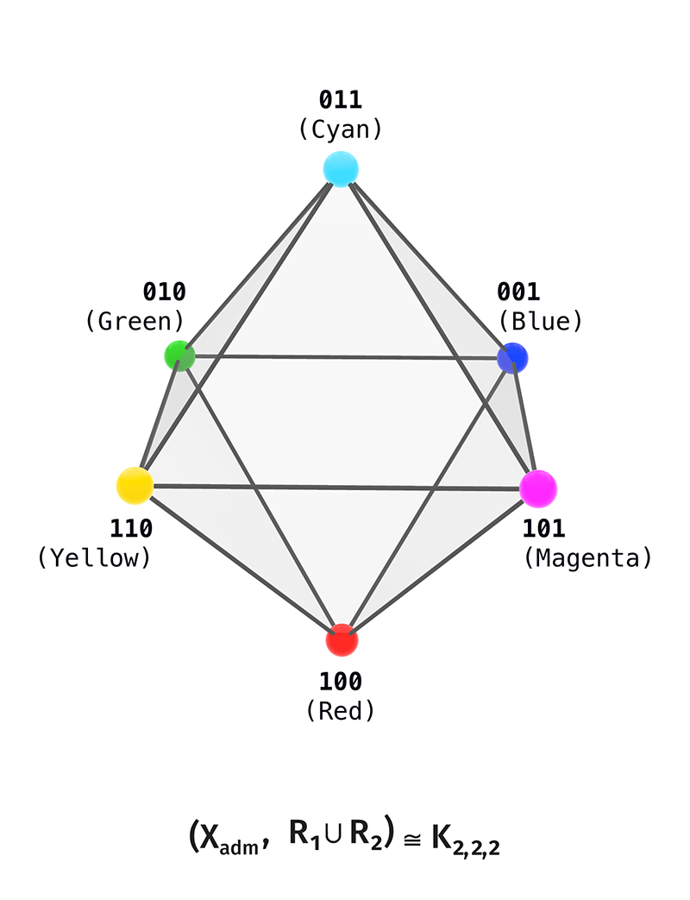

The arithmetic line is now split into two separate branches. [03A AMR-SR](../01_Mathematical_Start/03A_DOT_AMR_Scale_Residue_Line_EN.md)
works on the carrier \(\mathcal R=\mathbb N_{>0}^2\), analyzes pairs through
\((a,b)=g(p,q)\), primitive rays, difference layers, and the scalar residue
\(\mathrm{Res}_{\mathrm{sr}}\). [03B AMR-DC](../01_Mathematical_Start/03B_AMR_Divisor_Carrier_and_Chain_Extension.md)
works on the divisor carrier \(D(N)=\{d:d\mid N\}\), reads it as a product of
finite chains, and singles out
\(D^\circ(30)=\{2,3,5,6,10,15\}\) as an arithmetic avatar of the six-point
scene. These two branches are not identified: \(\mathrm{Res}_{\mathrm{sr}}\)
is not the relation \(R_{\mathrm{oct}}\), and the carriers
\(\mathbb N_{>0}^2\) and \(D(N)\) are connected only through explicit bridge
maps.

More specialized readings are separated into bridge texts. The
[spectral block](../02_Bridges/05_Cryptographic_Spectral_Block/DOT_Cryptographic_Spectral_Block.md)
states a theorem on a cross-polytope--hypercube composite, where Walsh
conditions for Boolean functions are read as the spectral stratification of an
explicit graph. The [\(A_2/\mathfrak{sl}_3/\mathfrak{su}(3)\) bridge](../02_Bridges/03_A2_sl3_su3/DOT_Six_State_A2_sl3_su3_EN.md)
relates the six-point carrier \(X_{\mathrm{adm}}\) to root data of type \(A_2\)
as a separate representation reading. The [Hopf/Borromean bridge](../02_Bridges/04_Hopf_Borromean/DOT_Principles_Hopf_2x3_Full_2026-04-24_EN.md)
fixes topological readings of pairing, finite holonomy, and triple
connectivity.

None of these bridges automatically extends the strict core. They show which
external mathematical languages can be attached to the constructed atlas of
finite carriers while preserving the boundary between core, reading, and
hypothesis.
