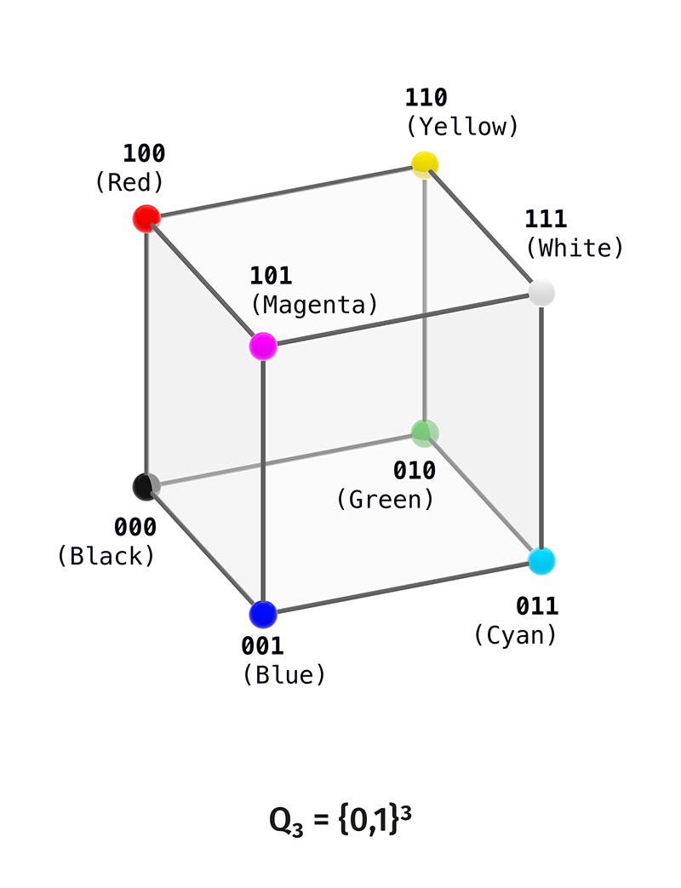
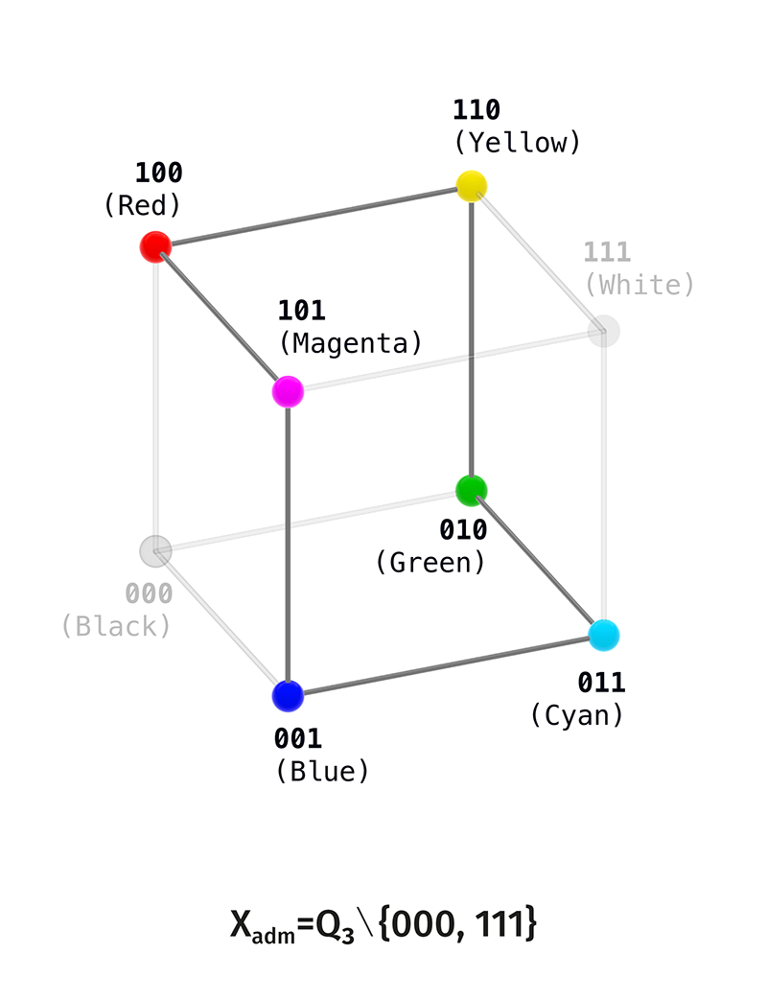
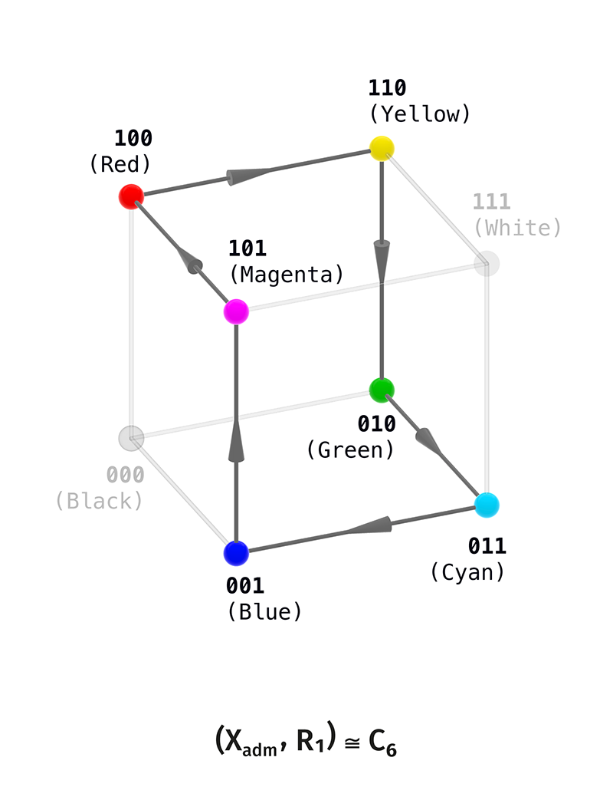
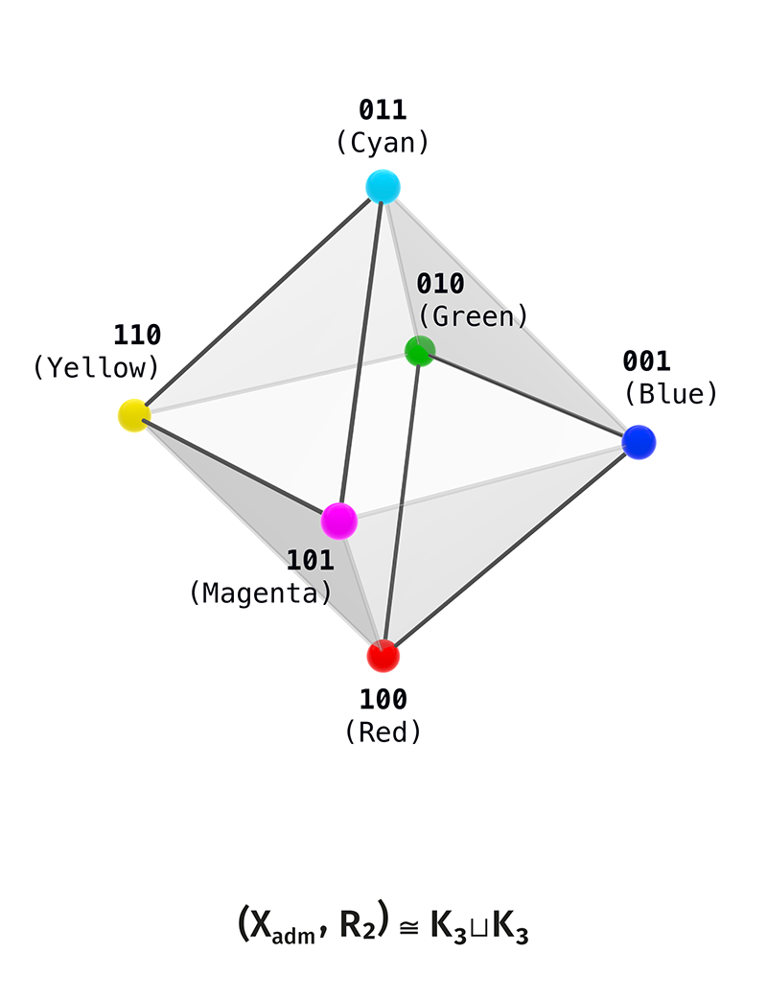
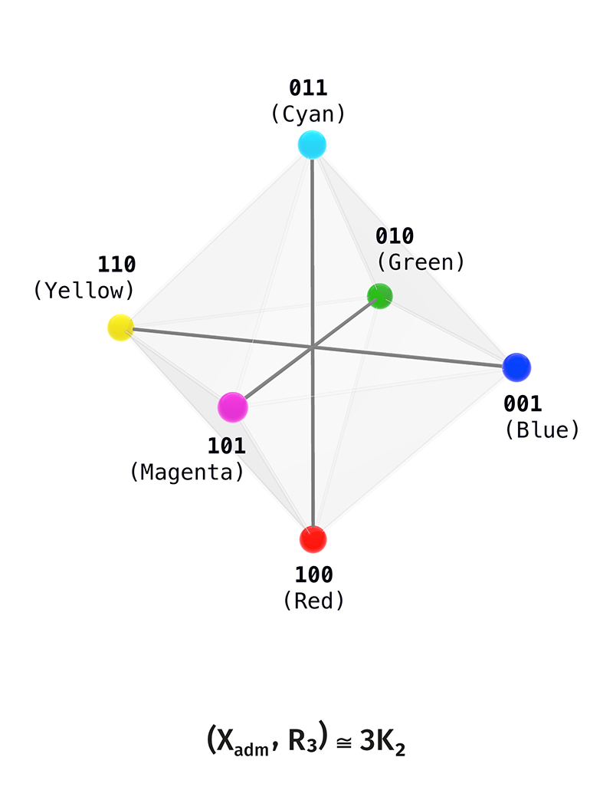
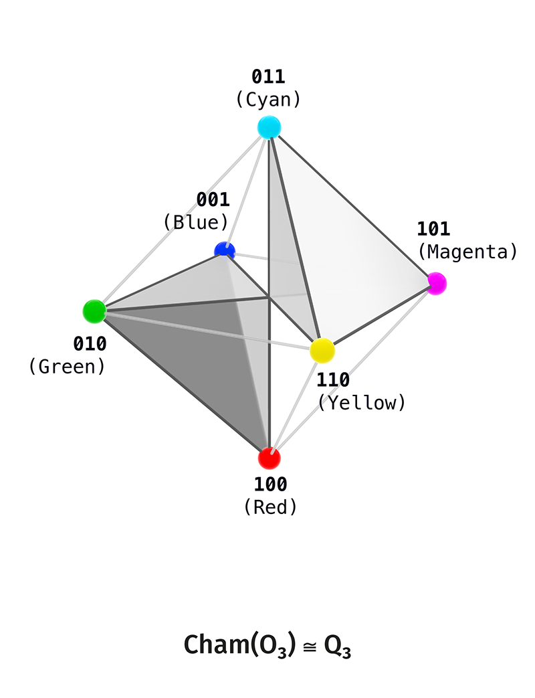
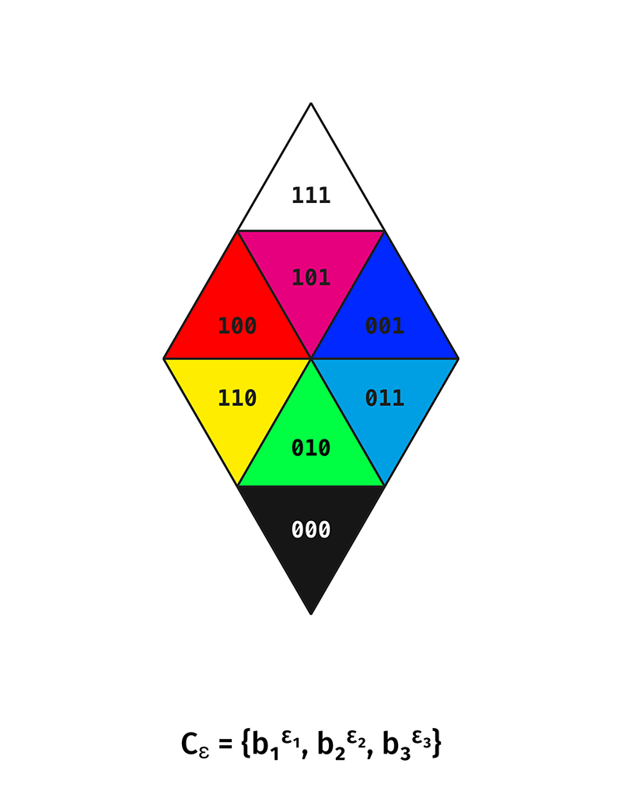
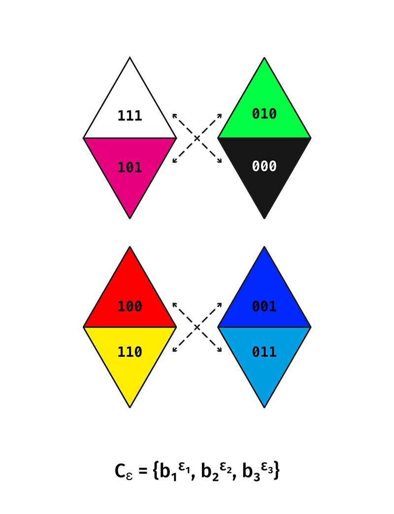
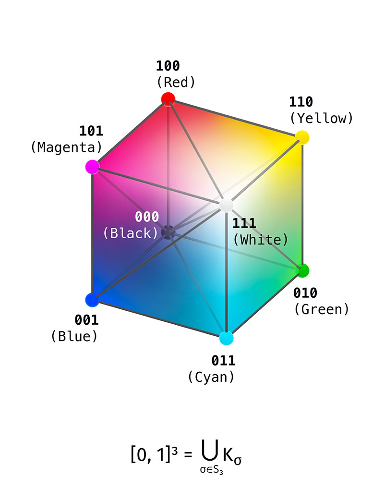

# Приложение B. Цветовой мост RGB/CMY/Kuhn/HSV

Статус: bridge-документ / точный реализованный эталон.

Этот документ задаёт цветовую реализацию rank-3 finite core в цветовом кубе $[0,1]^3$. Строгим источником является двоичный носитель $Q_3$; цветовой слой появляется после выбора соглашения, которое сопоставляет три координаты куба трём цветовым осям. В используемой записи координатные оси обозначены как $R,G,B$, а дополненные к ним вершины дают $C,M,Y$. Шесть ненулевых несатурированных вершин образуют цветовой слой

$$
RGB\sqcup CMY
=
\{R,G,B,C,M,Y\}.
$$

Kuhn-разбиение задаёт шесть тетраэдральных секторов внутри куба. HSV/HSB-координаты используются как локальные формулы чтения внутри этих секторов.

Strict core имеет собственные конечные carriers и relations. Цветовой слой реализует часть уже построенной конечной структуры в стандартном цветовом теле $[0,1]^3$.

Исходный strict-слой:

$$
Q_3=\mathbb{F}_2^3,
\qquad
X_{\\mathrm{adm}}=Q_3\setminus\{000,111\},
$$

$$
R_1,\quad R_2,\quad R_3.
$$

Целевой bridge-слой:

$$
[0,1]^3
$$

с выбранной RGB-записью координат, бинарными вершинами, Kuhn-секторами и локальными HSV-формулами.

Здесь $RGB$ и $CMY$ имеют одинаковый статус внутри шестивершинного цветового слоя. $RGB$ — выбранная запись координат цветового куба; при переходе к дополнению $x\mapsto 111-x$ тройка $RGB$ переходит в тройку $CMY$. HSV/HSB задаёт секторные координаты для последующего цветового чтения.

---

## B.1. Статус слоя

Цветовой bridge имеет три уровня.

**Конечный strict-каркас.**

$$
Q_3,\quad X_{\\mathrm{adm}},\quad $R_1, R_2, R_3$,\quad R_{12}=R_1\cup R_2
$$

являются native-объектами strict core.

**Реализованный цветовой слой.**

$$
[0,1]^3
$$

с выбранной записью координат $(R,G,B)$, восемью вершинами, шестью хроматическими вершинами $RGB\sqcup CMY$ и Kuhn-разбиением на шесть тетраэдров является реализованным bridge-carrier.

**Bridge-reading.**

$$
X_{\\mathrm{adm}}
\longleftrightarrow
\text{six chromatic vertices }RGB\sqcup CMY\text{ of the colour cube}.
$$

Это reading уже построенной finite structure. Цветовой слой имеет статус реализованного эталона. Исходным слоем теории остаётся strict finite core.

---

## B.2. Бинарный RGB/CMY-carrier

Используется binary cube:

$$
Q_3=\{0,1\}^3.
$$

Фиксируется стандартная RGB-конвенция:

$$
100=R,
\qquad
010=G,
\qquad
001=B.
$$

Тогда:

$$
110=Y=R+G,
$$

$$
101=M=R+B,
$$

$$
011=C=G+B.
$$

Total poles:

$$
000=\text{black},
\qquad
111=\text{white}.
$$

Хроматический shell:

$$
X_{\\mathrm{adm}}
=
\{100,010,001,110,101,011\}.
$$

Разложение:

$$
Q_3
=
\{000\}
\sqcup
X_{\\mathrm{adm}}
\sqcup
\{111\}.
$$

Это bridge-форма strict rank-3 puncture:

$$
Q_3\setminus\{000,111\}.
$$

---

## B.3. Relation-layers как цветовые readings

На strict carrier-е $X_{\mathrm{adm}}$:

$$
R_k=\{(x,y)\in X_{\\mathrm{adm}}\times X_{\\mathrm{adm}}:x\neq y,\ d_H(x,y)=k\},
\qquad
k=1,2,3.
$$

### B.3.1. $R_1=C_6$

$$
(X_{\\mathrm{adm}},R_1)\cong C_6.
$$

Один стандартный порядок:

$$
100\to110\to010\to011\to001\to101\to100.
$$

В цветовых именах:

$$
R\to Y\to G\to C\to B\to M\to R.
$$

Bridge-reading:

$$
R_1=\text{adjacent chromatic transitions}.
$$

Strict-статус:

$$
R_1=C_6
$$

является конечным graph-фактом на $X_{\mathrm{adm}}$.

### B.3.2. $R_2=K_3\sqcup K_3$

$$
(X_{\\mathrm{adm}},R_2)\cong K_3\\sqcup K_3.
$$

Две triads:

$$
\{100,010,001\}=\{R,G,B\},
$$

$$
\{110,101,011\}=\{Y,M,C\}.
$$

Bridge-reading:

$$
R_2=\text{RGB/CMY split}.
$$

Strict-статус:

$$
R_2=K_3\\sqcup K_3.
$$

### B.3.3. $R_3=3K_2$

$$
(X_{\\mathrm{adm}},R_3)\cong 3K_2.
$$

Complement pairs:

$$
100\leftrightarrow011,
$$

$$
010\leftrightarrow101,
$$

$$
001\leftrightarrow110.
$$

В цветовых именах:

$$
R\leftrightarrow C,
\qquad
G\leftrightarrow M,
\qquad
B\leftrightarrow Y.
$$

Bridge-reading:

$$
R_3=\text{цветовая комплементарность}.
$$

Strict-статус:

$$
R_3=3K_2.
$$

---

## B.4. Октаэдральный цветовой shell

Union relation:

$$
R_{12}=R_1\cup R_2.
$$

Strict graph-reading:

$$
(X_{\\mathrm{adm}},R_{12})
\cong
K_{2,2,2}.
$$

Это $1$-skeleton octahedron.

В цветовом bridge:

$$
000
\quad
\longleftrightarrow
\quad
X_{\\mathrm{adm}}
\quad
\longleftrightarrow
\quad
111.
$$

Bridge-reading:

$$
X_{\\mathrm{adm}}
=
\text{six-vertex chromatic shell}.
$$

Strict object:

$$
(X_{\\mathrm{adm}},R_{12}).
$$

Октаэдральный цветовой shell является реализованным геометрическим видом этого конечного графа.

Chamber-reading этого shell-а даёт восемь chamber-состояний:

---

## B.5. Kuhn decomposition

Continuous RGB cube:

$$
[0,1]^3.
$$

Он разбивается на $6$ Kuhn tetrahedra, по одному на каждый order coordinates.

В секторе

$$
R\geq G\geq B
$$

положим:

$$
u=B,
\qquad
a=R-B,
\qquad
b=G-B.
$$

Тогда:

$$
(R,G,B)=u(1,1,1)+(a,b,0).
$$

Эквивалентно:

$$
R=u+a,
\qquad
G=u+b,
\qquad
B=u,
$$

где:

$$
0\leq b\leq a,
\qquad
0\leq u\leq 1-a.
$$

HSV quantities in this sector:

$$
V=R=u+a,
$$

$$
C=R-B=a,
$$

$$
f_{\mathrm{hue}}=\frac{G-B}{R-B}=\frac{b}{a},
\qquad
a>0.
$$

Статус:

$$
\text{Kuhn/HSV formula}
=
\text{точный реализованный цветовой слой}.
$$

Этот слой является последующей реализацией strict finite core.

---

## B.6. Что импортируется в основной текст

В основном тексте можно цитировать:

$$
Q_3=\{0,1\}^3
$$

как finite carrier;

$$
X_{\\mathrm{adm}}=Q_3\setminus\{000,111\}
$$

как six-state admissible shell;

$$
R_1=C_6,
\qquad
R_2=K_3\\sqcup K_3,
\qquad
R_3=3K_2,
$$

как exact Hamming relation-readings;

$$
R_1\cup R_2=K_{2,2,2}
$$

как octahedral shell;

$$
[0,1]^3=\bigcup_{\sigma\in S_3}K_\sigma
$$

как реализованное цветовое тело Kuhn-секторов.

В bridge/dossier остаются:

$$
\text{HSV/HSL/Lab/LCh},
$$

$$
\text{теория перцептивного цвета},
$$

$$
\text{AMR-цветовые соответствия},
$$

$$
t=0.5\ \text{as realised threshold},
$$

$$
\text{continuous transport across sectors}.
$$

---

## B.7. Таблица статусов

| Объект / claim | Strict core status | Colour bridge status |
|---|---:|---:|
| $Q_3=\mathbb{F}_2^3$ | native | realised as binary RGB vertices |
| $X_{\mathrm{adm}}$ | native | chromatic shell |
| $R_1=C_6$ | native | hue-cycle reading |
| $R_2=K_3\sqcup K_3$ | native | RGB/secondary split |
| $R_3=3K_2$ | native | complementary pairs |
| $R_1\cup $R_2$=K_{2,2,2}$ | native | октаэдральный цветовой shell |
| $[0,1]^3$ RGB cube | вне strict finite core | native в bridge |
| Kuhn sectors | вне strict finite core | native в bridge |
| HSV formulas | вне strict finite core | точные последующие формулы |
| Lab/LCh | вне strict finite core | compatibility layer |
| AMR-цветовая идентификация | not-yet в strict core | bridge-гипотеза |
| физическое восприятие цвета | вне strict core | последующая интерпретация |

---

## B.8. Атлас рисунков цветового bridge-а

В модуле используются следующие figure-файлы:

| Файл | Объект |
|---|---|
| `B1_color_cube_Q3.png` | полный RGB-cube $Q_3=\{0,1\}^3$ |
| `B2_chromatic_carrier_Xadm.png` | punctured carrier $X_{\mathrm{adm}}=$Q_3$\setminus\{000,111\}$ |
| `B3_R1_hamming_cycle_C6.png` | $($X_{\\mathrm{adm}}$,$R_1$)\cong C_6$ |
| `B4_R2_two_triads_K3sqcupK3.png` | $($X_{\\mathrm{adm}}$,$R_2$)\cong K_3\sqcup K_3$ |
| `B5_R3_complementary_axes_3K2.png` | $($X_{\\mathrm{adm}}$,$R_3$)\cong 3K_2$ |
| `B6_octahedral_shell_R12_K222.png` | $($X_{\\mathrm{adm}}$,$R_1$\cup $R_2$)\cong K_{2,2,2}$ |
| `B7a_TNR_chambers_RGB_CMY_side_A.png` | chamber-layer, первая сторона |
| `B7b_TNR_chambers_RGB_CMY_side_B.png` | chamber-layer, вторая сторона |
| `B7c_TNR_chambers_two_octahedron_views.png` | две октаэдральные проекции chamber-layer-а |
| `B7d_chamber_code_projection_overview.png` | chamber-code projection |
| `B7e_chamber_pair_projection_tiles.png` | парные chamber-проекции |
| `B8_RGB_cube_Kuhn_HSV_sectors.png` | RGB cube with Kuhn/HSV sectors |
