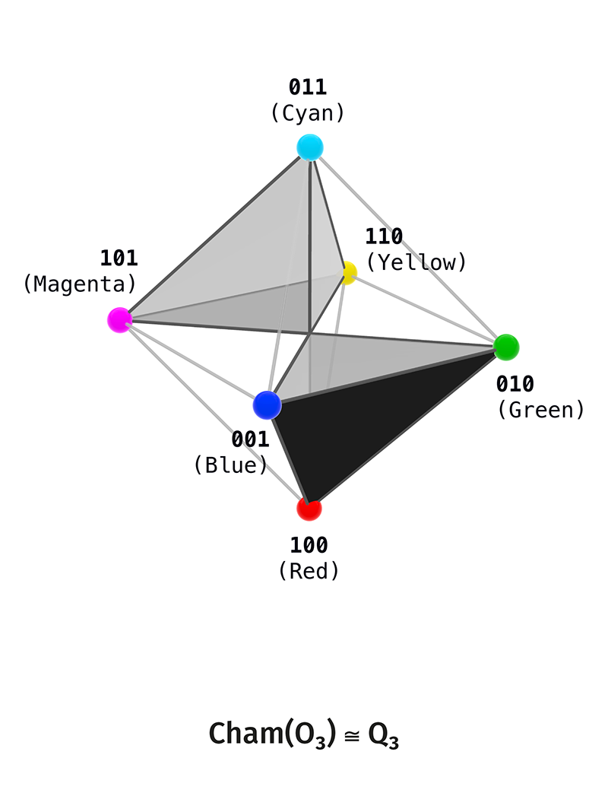
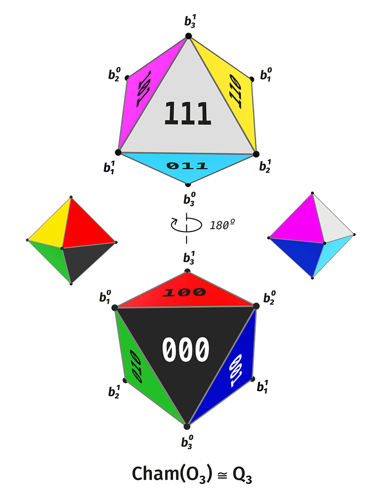

# Appendix AF. Object Atlas and Notation Glossary

## AF.0. Purpose

This appendix fixes the reference layer for the published DOT package. It introduces no new carriers, relations, or bridges. Its role is to collect the notation, standard graph forms, term statuses, and figures needed to read the main text.

The appendix has two parts:

- an object atlas: carriers, layers, relations, graphs, cycles, and operators;
- a glossary of statuses and notations: what is a constructed object, what is a reading, and what is reserved for later extensions.

All strict constructions are in the main manuscript and in the Mathematical Start files. This appendix is an index to them.

## AF.1. Carriers and Layers

| Notation | Meaning | Where Used |
|---|---|---|
| $Q_n=\mathbb F_2^n$ | full binary carrier of rank $n$ | main manuscript, Mathematical Start |
| $Q_n^*=Q_n\setminus\{0^n\}$ | nonzero layer | ranks $1$–$5$ |
| $U_n=Q_n\setminus\{0^n,1^n\}$ | full nontrivial layer with the two total poles removed | ranks $3$–$5$, general law |
| $S_k^{(n)}$ | weight-$k$ layer, i.e. states with $k$ ones | all ranks |
| $V_n=S_1^{(n)}\sqcup S_{n-1}^{(n)}$ | outer shell: basis points and dual basis points | general outer shell |
| $X_{\mathrm{adm}}$ | six-position admissible carrier of rank $3$ | strict finite center of rank $3$ |
| $\mathcal P_4=Q_4^*$ | nonzero carrier of rank $4$ | finite atlas of rank $4$ |
| $P^{(5)}=Q_5^*$ | nonzero carrier of rank $5$ | finite atlas of rank $5$ |
| $M_5=S_2^{(5)}\sqcup S_3^{(5)}$ | middle scene of rank $5$ | pair-dual structure of rank $5$ |
| $I_n$ | set of outer-shell axes | factorization $V_n\cong I_n\times\{-,+\}$ |
| $H_i^{(n)}$ | axial pair of the outer shell | axial-pair presentations |

The layers $S_k^{(n)}$ are defined by Hamming weight. For $x\in Q_n$, the weight $|x|$ is the number of ones in the binary word $x$.

## AF.2. Shell Decompositions

The full carrier $Q_n$ decomposes into shells:

$$
Q_n=\bigsqcup_{k=0}^{n}S_k^{(n)},
\qquad
|S_k^{(n)}|=\binom nk.
$$

The first five ranks:

| Rank | Full decomposition | Nonzero layer |
|---|---:|---:|
| $1$ | $2=1+1$ | $1$ |
| $2$ | $4=1+2+1$ | $3$ |
| $3$ | $8=1+3+3+1$ | $7$ |
| $4$ | $16=1+4+6+4+1$ | $15$ |
| $5$ | $32=1+5+10+10+5+1$ | $31$ |

For the outer shell, when $n\geq 3$:

$$
|V_n|=|S_1^{(n)}|+|S_{n-1}^{(n)}|=2n.
$$

For rank $3$, the outer shell coincides with $U_3$. Starting from rank $4$, the middle shells separate from the outer shell.

## AF.3. Main Relations

| Notation | Carrier | Meaning |
|---|---|---|
| $R_1$ | $X_{\mathrm{adm}}$ | Hamming distance $1$ inside the admissible six-position carrier |
| $R_2$ | $X_{\mathrm{adm}}$ | Hamming distance $2$ inside the admissible six-position carrier |
| $R_3$ | $X_{\mathrm{adm}}$ | Hamming distance $3$, complementary pairs |
| $\mathsf H_k^{(n)}$ | $Q_n^*$ or its sublayers | Hamming-distance-$k$ relation |
| $\kappa_n(x)=x+1^n$ | $Q_n$ | complement involution |
| $\Omega_n$ | $V_n$ | residual outer-shell relation: all pairs except complementary pairs |
| $\Lambda_n(\varepsilon,x)=\varepsilon\,|\,x$ | $\mathbb F_2\times Q_n\to Q_{n+1}$ | transition to the next rank through a new highest bit |

The relation $\mathsf H_k^{(n)}$ is treated as an undirected graph relation when edge counts are discussed. If an ordered-pair relation is meant, it must be stated explicitly.

## AF.4. Graph Glossary

| Technical Name | Verbal Description | Where It Appears |
|---|---|---|
| $C_6$ | cycle on six vertices | $R_1$ on $X_{\mathrm{adm}}$ |
| $K_3\sqcup K_3$ | two disconnected triangular components | $R_2$ on $X_{\mathrm{adm}}$ |
| $3K_2$ | three separate pairs | $R_3$ on $X_{\mathrm{adm}}$ |
| $K_{2,2,2}$ | complete tripartite graph with parts of size two; the skeleton of an octahedron | $R_1\cup R_2$, also the middle shell of rank $4$ |
| $K_{2,2,2,2}$ | complete four-partite graph with parts of size two | outer shell of rank $4$ |
| $K_{2,2,2,2,2}$ | complete five-partite graph with parts of size two | outer shell of rank $5$ |
| $K_{2,\ldots,2}$ | complete multipartite graph whose parts are complementary pairs | general outer shell $V_n$ |
| $L(K_n)$ | line graph of the complete graph $K_n$ | middle shells, graphs of coordinate pairs |
| $T(5)=L(K_5)$ | graph of the ten pairs of five coordinates, where adjacency means sharing one coordinate | $S_2^{(5)}$ and $S_3^{(5)}$ |
| $KG(5,2)$ | graph of disjoint pairs in a five-element set; the Petersen graph | $S_2^{(5)}$ and $S_3^{(5)}$ |

Graph names are used only after the carrier and the relation have been fixed. For example, $R_2\cong K_3\sqcup K_3$ means that the graph of the relation $R_2$ splits into two triangular components.

## AF.5. Cycles

| Notation | Carrier | Status |
|---|---|---|
| $C_6$ | $X_{\mathrm{adm}}$ | cycle of the relation $R_1$ |
| $C_6^{(4),\mathrm{mid}}$ | $S_2^{(4)}$ | chosen cycle on the middle shell of rank $4$ |
| $C_8^{(4)}$ | $V_4$ | chosen Hamilton cycle on the outer shell of rank $4$ |
| $C_{15}^{(4)}$ | $\mathcal P_4$ | Singer cycle after choosing a primitive polynomial over $\mathbb F_2$ |
| $C_{10}^{(5)}$ | $V_5$ | chosen Hamilton cycle on the outer shell of rank $5$ |
| $C_{31}^{(5)}$ | $P^{(5)}$ | Singer cycle after choosing a primitive polynomial over $\mathbb F_2$ |

A Hamilton cycle on the outer shell is a chosen representative inside the graph $K_{2,\ldots,2}$. The outer graph itself does not determine a unique cycle without an additional choice.

## AF.6. Presentations and Packages

A presentation is a quadruple

$$
\Pi=(X,R,q,\mathrm{rec}),
$$

where:

- $X$ is a finite carrier;
- $R$ is a relation on the carrier;
- $q$ is a reading, i.e. a map from the carrier into another level of description;
- $\mathrm{rec}$ is recovery data specifying which part of the source structure remains recoverable after the reading.

An exact object is considered constructed once all four components have been specified.

A package is a named collection of already constructed objects. A package is not a presentation unless it has the form $(X,R,q,\mathrm{rec})$.

| Notation | Type | Meaning |
|---|---|---|
| $\Pi_1$ | presentation | polar pair of rank $1$ |
| $\Pi_{3,k}$ | presentations | graph readings on $X_{\mathrm{adm}}$ |
| $\Pi_i^{\mathrm{ax},(n)}$ | presentations | axial pairs of the outer shell |
| $\mathfrak C_3$ | package | strict finite center of rank $3$ |
| $\mathfrak C_4$ | package | finite atlas of rank $4$ |
| $\mathfrak A_5$ | package | finite atlas of rank $5$ |
| $\mathfrak N$ | scheme | general rank-growth law |
| $\mathfrak V$ | scheme | general outer shell |

A scheme differs from a finite package because it is formulated for arbitrary $n$. If a scheme is included in a summary, its status must be separated from the finite list of ranks $1$–$5$.

## AF.7. Term Statuses

| Status | Meaning | Examples |
|---|---|---|
| Constructed | the object has a carrier, a relation, a reading, and recovery data or an explicitly specified operator role | $Q_n$, $X_{\mathrm{adm}}$, $R_1,R_2,R_3$, $\kappa_n$, $\Lambda_n$, axial presentations |
| Reading | the name describes an already constructed structure in another register | colour realization, algebraic reading $A_2/\mathfrak{sl}_3/\mathfrak{su}_3$, topological image |
| Deferred | the name denotes a future construction not used in the proofs of the current layer | physical interpretation, continuous topology as its own carrier, general cycle decomposition without an explicit construction |

The status of a term must be clear from the place where it is used. If a name appears in a statement, it must be constructed. If a name is explanatory, it remains a reading. If a name points to a future layer, it does not participate in proofs.

## AF.8. Bridges in the Package

| Document | Objects Used | What It Shows | Boundary of Use |
|---|---|---|---|
| Colour bridge | $Q_3$, $X_{\mathrm{adm}}$, RGB/CMY/HSV representations | realization of the six-position structure in colour models | does not introduce a physical theory of colour |
| Binary bridge | $Q_n$, $\Lambda_n$, $\kappa_n$, layers $S_k^{(n)}$ | growth mechanism through a new binary bit | does not add a new external carrier |
| $A_2/\mathfrak{sl}_3/\mathfrak{su}_3$ | $X_{\mathrm{adm}}$, $R_2$, complementarity | algebraic reading of the six-position structure | is not a particle model |
| Hopf and Borromean links | axial pairs, cycles, operator readings | topological images of finite relations | does not make topology part of the strict core |
| Spectral block | finite graphs, adjacency matrices, spectra | spectral invariants of finite graphs | is not cryptographic security without a separate problem statement |
| Additive-multiplicative resonance | finite center and arithmetic lattice | partial arithmetic interface | does not define a general law $k\mapsto R_k$ without additional proofs |

A bridge document may use the language of another domain only as a reading of a constructed finite structure. An external object becomes constructed only after its carrier, relation, reading, and recovery are specified.

## AF.9. Figure Atlas for the Publication Package

All links below point to files in `assets/figures/`. The figures illustrate already specified objects; the objects themselves are defined in the main text and in the bridge documents.

### AF.9.1. Basic Strict Atlas

**`1.1-P_R_P.png`** — polar layer $(P,R_P)$, $P=\{a,-a\}$; $I$ is the image of the reading, not a carrier vertex.

**`1.2-2_bits_Q_2.png`** — full two-bit carrier $Q_2=\{00,01,10,11\}$.

**`1.3-C_4.png`** — graph-reading $(Q_2,H_1^{(2)})\cong C_4$.

**`1.4-2K_2.png`** — graph-reading $(Q_2,H_2^{(2)})\cong 2K_2$.

**`1.5-K_4.png`** — complete graph-reading $(Q_2,R_{K_4}^{(2)})\cong K_4$.

**`1.6-K_4-e.png`** — partial closure $(Q_2,R_{K_4-e}^{(2)})\cong K_4-e$.

**`2.1-Q_3.png`** — full three-bit carrier $Q_3=\{0,1\}^3$.

**`2.2-X_adm.png`** — admissible carrier $X_{\mathrm{adm}}=Q_3\setminus\{000,111\}$.

**`3.1-R_1-C_6.png`** — relation $R_1$: $(X_{\mathrm{adm}},R_1)\cong C_6$.

**`3.2-R_2-2_triangles.png`** — relation $R_2$: $(X_{\mathrm{adm}},R_2)\cong K_3\sqcup K_3$.

**`3.3-R_3-3K_2.png`** — relation $R_3$: $(X_{\mathrm{adm}},R_3)\cong 3K_2$.

**`4.1-R_12-octahedron.png`** — union relation $R_{12}=R_1\cup R_2$: $(X_{\mathrm{adm}},R_{12})\cong K_{2,2,2}$.

**`4.2-R_1-C_6.png`** — the same relation $R_1\cong C_6$, shown in the octahedral layout.

**`4.3-R_2-K_3-U-K_3.png`** — the same relation $R_2\cong K_3\sqcup K_3$, shown in the octahedral layout.

**`4.4-R_3-3K2.png`** — axial factorization $X_{\mathrm{adm}}\cong I_3\times\{-,+\}$ and relation $R_3\cong 3K_2$.

**`4.5-S_1-S_2.png`** — shell split $S_1^{(3)}=\{001,010,100\}$, $S_2^{(3)}=\{011,101,110\}$.

**`4.6-R_1-C6.png`** — oriented/transport reading of $R_1\cong C_6$ after choosing a cycle orientation.

**`4.8-chamber_code_projection_overview.png`** — chamber-code projection, $C_\varepsilon=\{b_1^{\varepsilon_1},b_2^{\varepsilon_2},b_3^{\varepsilon_3}\}$.

**`4.9-chamber_pair_projection_tiles.png`** — pair projection tiles for the same chamber-code layer.

**`4.10-chambers_two_octahedron_views.png`** — two-octahedron chamber view, $\mathrm{Cham}(O_3)\cong Q_3$.

**`5.1-Q4_full_tesseract.png`** — full carrier $Q_4\cong\mathbb F_2^4$.

**`5.2-P4_nonzero_layer.png`** — nonzero layer $\mathcal P_4=Q_4\setminus\{0000\}$.

**`5.3-U4_full_nontrivial_layer.png`** — nontrivial carrier $U_4=Q_4\setminus\{0000,1111\}$.

**`5.4-S2_rank4_octahedral_graph.png`** — middle shell graph $(S_2^{(4)},\mathsf H_2^{(4)}|_{S_2^{(4)}})\cong K_{2,2,2}$.

**`5.5-V4_outer_shell_16_cell_graph.png`** — outer shell graph $(V_4,\Omega_4)\cong K_{2,2,2,2}$.

### AF.9.2. Colour Bridge Atlas

**`B1_color_cube_Q3.png`** — full RGB cube $Q_3=\{0,1\}^3$.

**`B2_chromatic_carrier_Xadm.png`** — $X_{\mathrm{adm}}=Q_3\setminus\{000,111\}$ as a chromatic carrier.

**`B3_R1_hamming_cycle_C6.png`** — $(X_{\mathrm{adm}},R_1)\cong C_6$, the colour Hamming cycle.

**`B4_R2_two_triads_K3sqcupK3.png`** — $(X_{\mathrm{adm}},R_2)\cong K_3\sqcup K_3$, two colour triads.

**`B5_R3_complementary_axes_3K2.png`** — $(X_{\mathrm{adm}},R_3)\cong 3K_2$, complementary colour axes.

**`B6_octahedral_shell_R12_K222.png`** — $(X_{\mathrm{adm}},R_1\cup R_2)\cong K_{2,2,2}$, the octahedral chromatic shell.

**`B7a_DOT_chambers_RGB_CMY_side_A.png`** — colour chamber view, side A.

**`B7b_DOT_chambers_RGB_CMY_side_B.png`** — colour chamber view, side B.

**`B7c_DOT_chambers_two_octahedron_views.png`** — two colour chamber octahedron views, $\mathrm{Cham}(O_3)\cong Q_3$.

**`B7d_chamber_code_projection_overview.png`** — chamber-code projection in colour.

**`B7e_chamber_pair_projection_tiles.png`** — paired chamber projections in colour.

**`B8_RGB_cube_Kuhn_HSV_sectors.png`** — RGB cube with Kuhn/HSV sectors, $[0,1]^3=\bigcup_{\sigma\in S_3}K_\sigma$.

### AF.9.3. Figure Availability Check

All PNG files listed above are present in `assets/figures/` and have nonzero size. At present, `assets/figures/` contains no separate publication figures for $V_5\cong K_{2,2,2,2,2}$, $T(5)=L(K_5)$, $KG(5,2)$, $C_{10}$, or $C_{31}$. These objects are defined in the text; their figures should be added as a separate series if they are needed in the GitHub package.

## AF.10. Minimal Notation Set

| Symbol | Meaning |
|---|---|
| $\mathbb F_2$ | field with two elements |
| $d_H(x,y)$ | Hamming distance |
| $|x|$ | Hamming weight |
| $1^n$ | word of $n$ ones |
| $0^n$ | word of $n$ zeros |
| $\sqcup$ | disjoint union |
| $\cong$ | isomorphism |
| $L(G)$ | line graph of $G$ |
| $K_n$ | complete graph on $n$ vertices |
| $K_{a,b,\ldots}$ | complete multipartite graph with parts of sizes $a,b,\ldots$ |
| $C_n$ | cycle of length $n$ |

This set is enough to read the Mathematical Start and bridge documents without consulting an external graph-theory glossary.

## AF.11. Extended Term Glossary

| Term | Status | Short Meaning |
|---|---|---|
| DOT | package name | the current finite-combinatorial theory line and its controlled bridge documents |
| DOT | file prefix | English document or English-facing theorem/package note |
| DOT | file prefix | Russian document in the package |
| strict core | constructed | finite core: carriers, relations, readings, recovery-data, operator packages |
| bridge-layer | reading | external interpretation layer for an already constructed finite structure |
| native object | constructed | object defined inside the strict core |
| readable object | reading | name that reads an already constructed object in another language |
| not-yet object | deferred | name of a future construction not used in proofs |
| carrier | constructed once the set is specified | finite set of states or vertices |
| relational carrier | constructed | pair $(X,R)$, where $R\subseteq X\times X$ |
| relation-layer | constructed | specific relation layer on a fixed carrier |
| reading | constructed | map $q:X\to Y$ reading the carrier into another level |
| recovery datum | constructed | data $\mathrm{rec}$ fixing the recoverable part of the reading fibers |
| presentation | constructed | quadruple $(X,R,q,\mathrm{rec})$ |
| exact presentation | constructed | presentation with full recovery over each element of the reading |
| identity graph-reading | constructed | graph-reading with $q=\mathrm{id}_X$ |
| package | service name | named collection of already constructed objects/presentations |
| scheme / law-package | scheme | formula or structure for arbitrary $n$, separate from a finite atlas |
| rank | constructed | number of binary coordinates in the carrier |
| rank-lift | constructed | transition $Q_n\to Q_{n+1}$ by adding a new highest bit |
| emergence-order | construction reading | order in which states appear under rank-lift |
| shell-order | constructed | decomposition of a carrier by Hamming weight |
| relation-order | constructed | decomposition of pair-relations by Hamming distance |
| Hamming weight | constructed | $|x|$, the number of ones in a bit-string |
| Hamming distance | constructed | $d_H(x,y)=|x+y|$ over $\mathbb F_2$ |
| total poles | constructed | the two extreme points $0^n$ and $1^n$ |
| puncture | constructed | removal of the total poles from $Q_n$ |
| admissible carrier | constructed | $X_{\mathrm{adm}}=Q_3\setminus\{000,111\}$ |
| complement | constructed | $\kappa_n(x)=x+1^n$ |
| complement-pair | constructed | pair $\{x,\kappa_n(x)\}$ |
| outer shell | constructed | $V_n=S_1^{(n)}\sqcup S_{n-1}^{(n)}$ |
| middle shell | constructed | middle shell, e.g. $S_2^{(4)}$ or $S_2^{(5)}\sqcup S_3^{(5)}$ |
| residual relation | constructed | $\Omega_n$, all outer pairs except complement-pairs |
| axial pair | constructed | $H_i^{(n)}=\{e_i,1^n-e_i\}$ |
| chamber | constructed | choice of one vertex from each complement-pair of $O_3$ |
| chamber-coordinate reading | constructed | $\mathrm{Cham}(O_3)\cong Q_3$ |
| incidence relation | constructed | relation between vertex-side $V_O$ and chamber-side $C_O$ |
| star | constructed | set of chambers incident to a given vertex |
| coordinate face | constructed | subset $F_i^\eta=\{\varepsilon\in Q_3:\varepsilon_i=\eta\}$ |
| graph-reading | constructed | reading of a relation-layer as a graph type |
| octahedral shell | graph reading | $(X_{\mathrm{adm}},R_1\cup R_2)\cong K_{2,2,2}\cong O_3^{(1)}$ |
| line graph | standard graph term | $L(G)$, graph of the edges of $G$ |
| Singer cycle | constructed after a choice | cycle on $Q_n^*$ after choosing a primitive polynomial |
| Hamilton-cycle | chosen object | cycle passing through all vertices of the chosen graph |
| colour bridge | bridge | RGB/CMY/Kuhn/HSV realization of the rank-3 finite core |
| RGB/CMY convention | bridge | convention $100=R$, $010=G$, $001=B$, $011=C$, $101=M$, $110=Y$ |
| chromatic carrier | bridge-reading | $X_{\mathrm{adm}}$ as six chromatic vertices |
| Kuhn sector | bridge | tetrahedral sector of the RGB cube determined by a coordinate order |
| HSV/HSB formulas | bridge | local reading formulas inside Kuhn sectors |
| Lab/LCh | compatibility layer | not part of the strict core and not used as a native object in the current package |
| $A_2/\mathfrak{sl}_3/\mathfrak{su}_3$ bridge | bridge | algebraic reading of the six-state finite datum |
| Hopf/Borromean bridge | bridge | topological reading of finite relations |
| cryptographic spectral block | separate theorem-package | spectral package for a composite graph and Boolean conditions |
| AMR | bridge/theorem interface | additive-multiplicative resonance interface, not a general law for all $R_k$ without additional proofs |
