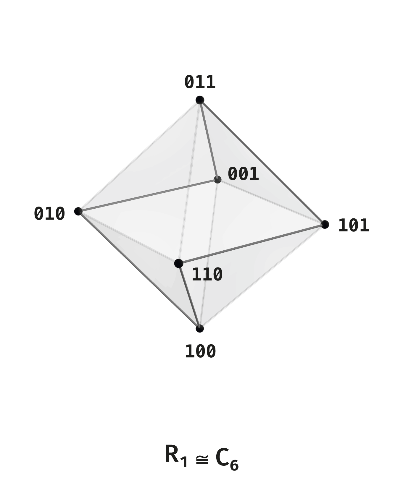
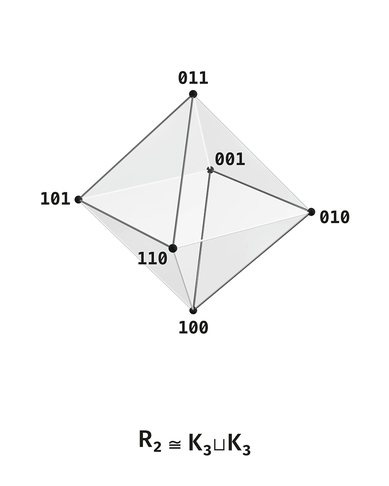
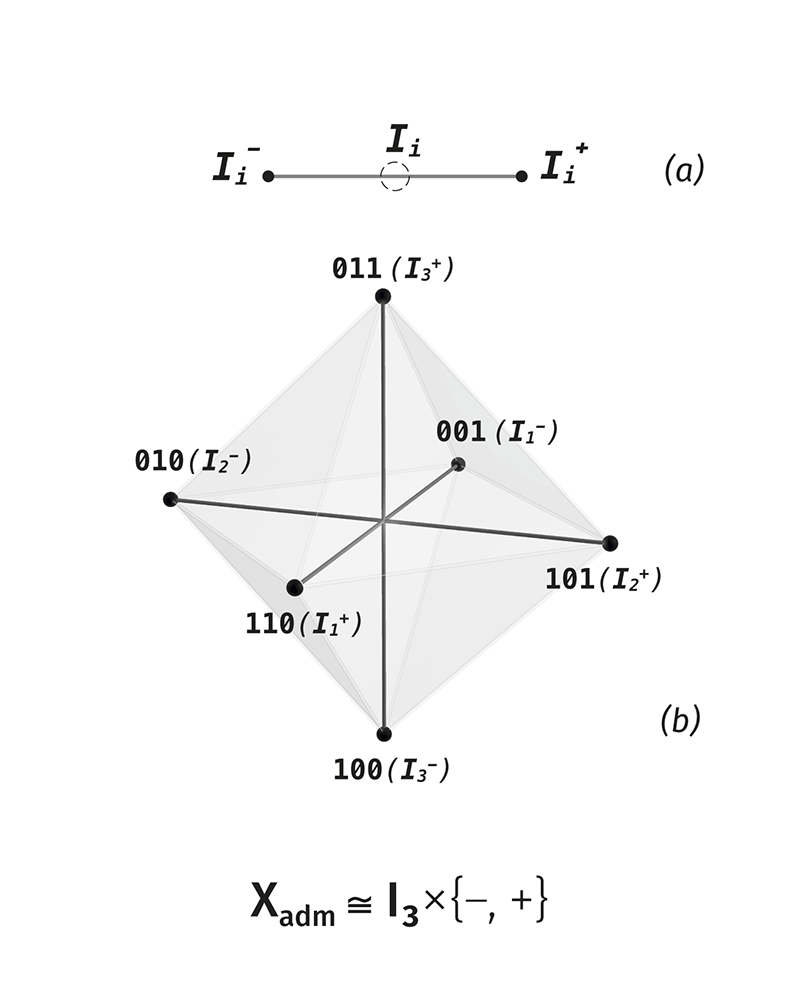
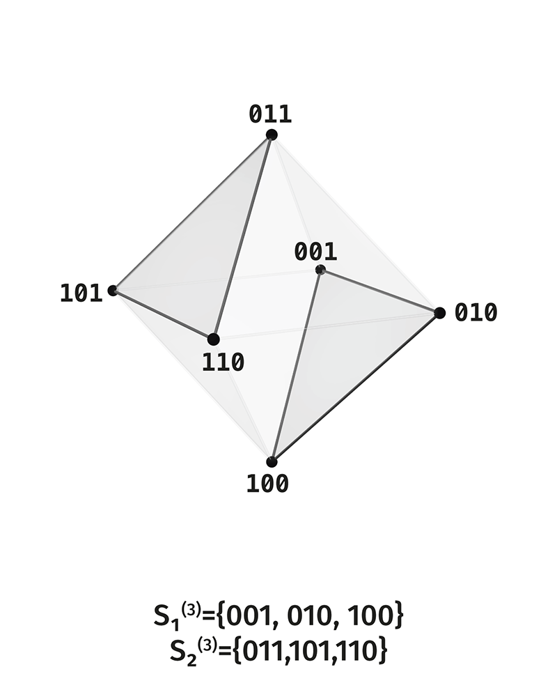
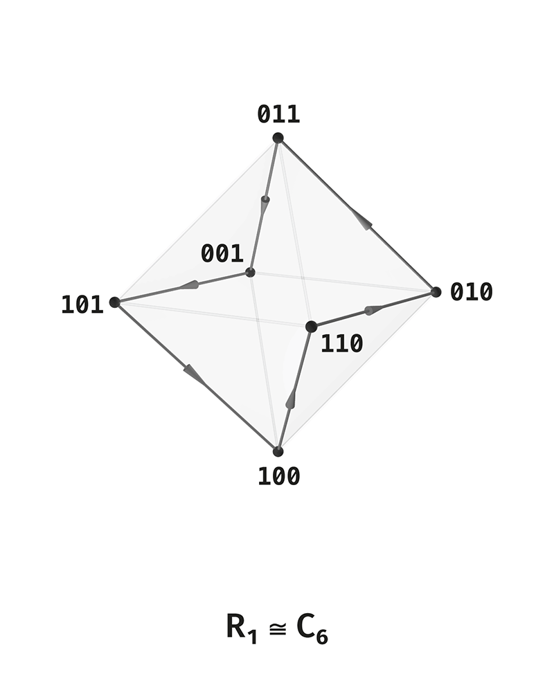
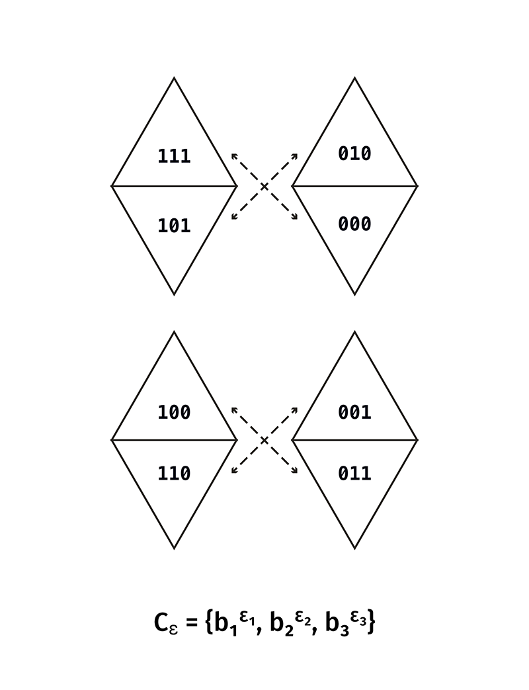

# Приложение AF. Атлас объектов и словарь обозначений

## AF.0. Назначение

Приложение фиксирует справочный слой для опубликованного пакета ТНР. Оно не вводит новых носителей, отношений или мостов. Его задача — собрать в одном месте обозначения, стандартные графовые формы, статусы терминов и список рисунков, которые помогают читать основной текст.

Приложение состоит из двух частей:

- атлас объектов: носители, слои, отношения, графы, циклы, операторы;
- словарь статусов и обозначений: что считается построенным объектом, что является чтением, что отнесено к будущим расширениям.

Все строгие построения находятся в основной рукописи и в файлах математического начала. Это приложение служит указателем к ним.

## AF.1. Носители и слои

| Обозначение | Смысл | Где используется |
|---|---|---|
| $Q_n=\mathbb{F}_2^n$ | полный двоичный носитель ранга $n$ | основная рукопись, математическое начало |
| $Q_n^*=$Q_n$\setminus\{0^n\}$ | ненулевой слой | ранги $1$–$5$ |
| $U_n=$Q_n$\setminus\{0^n,1^n\}$ | полный нетривиальный слой без двух предельных точек | ранги $3$–$5$, общий закон |
| $S_k^{(n)}$ | слой веса $k$, то есть состояния с $k$ единицами | все ранги |
| $V_n=S_1^{(n)}\sqcup S_{n-1}^{(n)}$ | внешний слой: базисные точки и двойственные базисные точки | общий внешний слой |
| $X_{\mathrm{adm}}$ | шестипозиционный допустимый носитель ранга $3$ | строгий конечный центр ранга $3$ |
| $\mathcal P_4=Q_4^*$ | ненулевой носитель ранга $4$ | конечный атлас ранга $4$ |
| $P^{(5)}=Q_5^*$ | ненулевой носитель ранга $5$ | конечный атлас ранга $5$ |
| $M_5=S_2^{(5)}\sqcup S_3^{(5)}$ | средняя сцена ранга $5$ | парно-тройственная структура ранга $5$ |
| $I_n$ | множество осей внешнего слоя | разложение $V_n\cong I_n\times\{-,+\}$ |
| $H_i^{(n)}$ | осевая пара внешнего слоя | презентации осевых пар |

Слои $S_k^{(n)}$ задаются весом Хэмминга. Для $x\in Q_n$ вес $|x|$ равен числу единиц в двоичной записи $x$.

## AF.2. Разложения по слоям

Полный носитель $Q_n$ раскладывается по слоям:

$$
Q_n=\bigsqcup_{k=0}^{n}S_k^{(n)},
\qquad
|S_k^{(n)}|=\binom nk.
$$

Первые пять рангов:

| Ранг | Полное разложение | Ненулевой слой |
|---|---:|---:|
| $1$ | $2=1+1$ | $1$ |
| $2$ | $4=1+2+1$ | $3$ |
| $3$ | $8=1+3+3+1$ | $7$ |
| $4$ | $16=1+4+6+4+1$ | $15$ |
| $5$ | $32=1+5+10+10+5+1$ | $31$ |

Для внешнего слоя при $n\geq 3$:

$$
|V_n|=|S_1^{(n)}|+|S_{n-1}^{(n)}|=2n.
$$

Для ранга $3$ внешний слой совпадает с $U_3$. Начиная с ранга $4$, средние слои отделяются от внешнего слоя.

## AF.3. Основные отношения

| Обозначение | Носитель | Смысл |
|---|---|---|
| $R_1$ | $X_{\mathrm{adm}}$ | расстояние Хэмминга $1$ внутри допустимого шестипозиционного носителя |
| $R_2$ | $X_{\mathrm{adm}}$ | расстояние Хэмминга $2$ внутри допустимого шестипозиционного носителя |
| $R_3$ | $X_{\mathrm{adm}}$ | расстояние Хэмминга $3$, комплементарные пары |
| $\mathsf H_k^{(n)}$ | $Q_n^*$ или его подслои | отношение расстояния Хэмминга $k$ |
| $\kappa_n(x)=x+1^n$ | $Q_n$ | комплементарная инволюция |
| $\Omega_n$ | $V_n$ | остаточное отношение внешнего слоя: все пары, кроме комплементарных |
| $\Lambda_n(\varepsilon,x)=\varepsilon\,|\,x$ | $\mathbb{F}_2\times $Q_n$\to Q_{n+1}$ | переход к следующему рангу через новый старший разряд |

Отношение $\mathsf H_k^{(n)}$ считается как неориентированное графовое отношение, если речь идёт о числе рёбер. Если используется отношение на упорядоченных парах, это должно быть указано отдельно.

## AF.4. Графовый словарь

| Техническое имя | Словесное описание | Где появляется |
|---|---|---|
| $C_6$ | цикл из шести вершин | $R_1$ на $X_{\mathrm{adm}}$ |
| $K_3\sqcup K_3$ | две несвязанные треугольные компоненты | $R_2$ на $X_{\mathrm{adm}}$ |
| $3K_2$ | три отдельные пары | $R_3$ на $X_{\mathrm{adm}}$ |
| $K_{2,2,2}$ | полный трёхдольный граф с долями по две вершины; остов октаэдра | $R_1\cup R_2$, также средний слой ранга $4$ |
| $K_{2,2,2,2}$ | полный четырёхдольный граф с долями по две вершины | внешний слой ранга $4$ |
| $K_{2,2,2,2,2}$ | полный пятидольный граф с долями по две вершины | внешний слой ранга $5$ |
| $K_{2,\ldots,2}$ | полный многодольный граф, доли — комплементарные пары | общий внешний слой $V_n$ |
| $L(K_n)$ | граф рёбер полного графа $K_n$ | средние слои, графы пар координат |
| $T(5)=L(K_5)$ | граф десяти пар пяти координат, смежность означает общую координату | $S_2^{(5)}$ и $S_3^{(5)}$ |
| $KG(5,2)$ | граф непересекающихся пар пятиэлементного множества; граф Петерсена | $S_2^{(5)}$ и $S_3^{(5)}$ |

Графовые имена используются только после того, как задан носитель и отношение. Например, запись $R_2\cong K_3\sqcup K_3$ означает, что граф отношения $R_2$ распадается на две треугольные компоненты.

## AF.5. Циклы

| Обозначение | Носитель | Статус |
|---|---|---|
| $C_6$ | $X_{\mathrm{adm}}$ | цикл отношения $R_1$ |
| $C_6^{(4),\mathrm{mid}}$ | $S_2^{(4)}$ | выбранный цикл на среднем слое ранга $4$ |
| $C_8^{(4)}$ | $V_4$ | выбранный гамильтонов цикл на внешнем слое ранга $4$ |
| $C_{15}^{(4)}$ | $\mathcal P_4$ | цикл Зингера после выбора примитивного многочлена над $\mathbb{F}_2$ |
| $C_{10}^{(5)}$ | $V_5$ | выбранный гамильтонов цикл на внешнем слое ранга $5$ |
| $C_{31}^{(5)}$ | $P^{(5)}$ | цикл Зингера после выбора примитивного многочлена над $\mathbb{F}_2$ |

Гамильтонов цикл на внешнем слое является выбранным представителем внутри графа $K_{2,\ldots,2}$. Сам внешний граф не задаёт единственного цикла без дополнительного выбора.

## AF.6. Презентации и пакеты

Презентация — это четверка

$$
\Pi=(X,R,q,\mathrm{rec}),
$$

где:

- $X$ — конечный носитель;
- $R$ — отношение на носителе;
- $q$ — чтение, то есть отображение носителя в другой уровень описания;
- $\mathrm{rec}$ — восстановление, указывающее, какая часть исходной структуры доступна после чтения.

Точный объект считается построенным, когда указаны все четыре компоненты.

Пакет — это именованная совокупность уже построенных объектов. Пакет не является презентацией, если он не имеет формы $(X,R,q,\mathrm{rec})$.

| Обозначение | Тип | Смысл |
|---|---|---|
| $\Pi_1$ | презентация | полярная пара ранга $1$ |
| $\Pi_{3,k}$ | презентации | графовые чтения на $X_{\mathrm{adm}}$ |
| $\Pi_i^{\mathrm{ax},(n)}$ | презентации | осевые пары внешнего слоя |
| $\mathfrak C_3$ | пакет | строгий конечный центр ранга $3$ |
| $\mathfrak C_4$ | пакет | конечный атлас ранга $4$ |
| $\mathfrak A_5$ | пакет | конечный атлас ранга $5$ |
| $\mathfrak N$ | схема | общий закон роста ранга |
| $\mathfrak V$ | схема | общий внешний слой |

Схема отличается от конечного пакета тем, что формулируется для произвольного $n$. Если схема включается в сводный обзор, её статус должен быть отделён от конечного перечня рангов $1$–$5$.

## AF.7. Статусы терминов

| Статус | Смысл | Примеры |
|---|---|---|
| Построено | объект имеет носитель, отношение, чтение и восстановление или явно заданную операторную роль | $Q_n$, $X_{\mathrm{adm}}$, $R_1, R_2, R_3$, $\kappa_n$, $\Lambda_n$, осевые презентации |
| Чтение | имя описывает уже построенную структуру в другом регистре | цветовая реализация, алгебраическое чтение $A_2/\mathfrak{sl}_3/\mathfrak{su}_3$, топологический образ |
| Отложено | имя обозначает будущую конструкцию, не используемую в доказательствах текущего слоя | физическая интерпретация, непрерывная топология как собственный носитель, общее разложение циклов без явного построения |

Статус термина должен быть ясен из места, где термин используется. Если имя входит в утверждение, оно должно быть построено. Если имя служит пояснением, оно остаётся чтением. Если имя указывает на будущий слой, оно не участвует в доказательствах.

## AF.8. Мосты пакета

| Документ | Какие объекты использует | Что показывает | Граница применения |
|---|---|---|---|
| Цветовой мост | $Q_3$, $X_{\mathrm{adm}}$, RGB/CMY/HSV-представления | реализацию шестипозиционной структуры в цветовых моделях | не вводит физическую теорию цвета |
| Двоичный мост | $Q_n$, $\Lambda_n$, $\kappa_n$, слои $S_k^{(n)}$ | механизм роста через новый двоичный разряд | не добавляет новый внешний носитель |
| $A_2/\mathfrak{sl}_3/\mathfrak{su}_3$ | $X_{\mathrm{adm}}$, $R_2$, комплементарность | алгебраическое чтение шестипозиционной структуры | не является моделью частиц |
| Хопф и Борромеевы кольца | осевые пары, циклы, операторные чтения | топологические образы конечных отношений | не делает топологию частью строгого ядра |
| Спектральный блок | конечные графы, матрицы смежности, спектры | спектральные инварианты конечных графов | не является криптографической стойкостью без отдельной постановки |
| Аддитивно-мультипликативный резонанс | конечный центр и арифметическая решётка | частичный арифметический интерфейс | не задаёт общий закон $k\mapsto R_k$ без дополнительных доказательств |

Мостовой документ может использовать язык другой области только как чтение построенной конечной структуры. Собственный внешний объект становится построенным только после задания его носителя, отношения, чтения и восстановления.

## AF.9. Атлас рисунков публикационного пакета

Все ссылки ниже указывают на файлы из `assets/figures/`. Рисунки являются иллюстрациями уже заданных объектов; сами объекты определяются в основном тексте и мостовых документах.

### AF.9.1. Базовый строгий атлас

**`1.1-P_R_P.png`** — полярный слой $(P,R_P)$, $P=\{a,-a\}$; $I$ является образом чтения, а не вершиной carrier-а.

**`1.2-2_bits_Q_2.png`** — полный двухбитный carrier $Q_2=\{00,01,10,11\}$.

**`1.3-C_4.png`** — graph-reading $(Q_2,H_1^{(2)})\cong C_4$.

**`1.4-2K_2.png`** — graph-reading $(Q_2,H_2^{(2)})\cong 2K_2$.

**`1.5-K_4.png`** — complete graph-reading $(Q_2,R_{K_4}^{(2)})\cong K_4$.

**`1.6-K_4-e.png`** — partial closure $(Q_2,R_{K_4-e}^{(2)})\cong K_4-e$.

**`2.1-$Q_3$.png`** — полный трёхбитный carrier $Q_3=\{0,1\}^3$.

**`2.2-X_adm.png`** — admissible carrier $X_{\mathrm{adm}}=$Q_3$\setminus\{000,111\}$.

**`3.1-$R_1$-$C_6$.png`** — relation $R_1$: $($X_{\mathrm{adm}}$,$R_1$)\cong C_6$.

**`3.2-$R_2$-2_triangles.png`** — relation $R_2$: $($X_{\mathrm{adm}}$,$R_2$)\cong K_3\sqcup K_3$.

**`3.3-$R_3$-$3K_2$.png`** — relation $R_3$: $($X_{\mathrm{adm}}$,$R_3$)\cong 3K_2$.

**`4.1-$R_1$2-octahedron.png`** — union relation $R_{12} = R_1 \cup R_2$: $($X_{\mathrm{adm}}$,R_{12})\cong K_{2,2,2}$.

**`4.2-$R_1$-$C_6$.png`** — тот же relation $R_1\cong C_6$, показанный на октаэдральной раскладке.

**`4.3-$R_2$-K_3-U-K_3.png`** — тот же relation $R_2\cong K_3\sqcup K_3$, показанный на октаэдральной раскладке.

**`4.4-$R_3$-3K2.png`** — axial factorization $X_{\mathrm{adm}}\cong I_3\times\{-,+\}$ и relation $R_3\cong 3K_2$.

**`4.5-S_1-S_2.png`** — shell split $S_1^{(3)}=\{001,010,100\}$, $S_2^{(3)}=\{011,101,110\}$.

**`4.6-$R_1$-C6.png`** — oriented/transport reading of $R_1\cong C_6$ after choosing a cycle orientation.

**`4.8-chamber_code_projection_overview.png`** — chamber-code projection, $C_\varepsilon=\{b_1^{\varepsilon_1},b_2^{\varepsilon_2},b_3^{\varepsilon_3}\}$.

**`4.9-chamber_pair_projection_tiles.png`** — pair projection tiles for the same chamber-code layer.

**`4.10-chambers_two_octahedron_views.png`** — two-octahedron chamber view, $\mathrm{Cham}($O_3$)\cong Q_3$.

**`5.1-Q4_full_tesseract.png`** — полный carrier $Q_4\cong\mathbb{F}_2^4$.

**`5.2-P4_nonzero_layer.png`** — ненулевой layer $\mathcal P_4=Q_4\setminus\{0000\}$.

**`5.3-U4_full_nontrivial_layer.png`** — нетривиальный carrier $U_4=Q_4\setminus\{0000,1111\}$.

**`5.4-S2_rank4_octahedral_graph.png`** — middle shell graph $(S_2^{(4)},\mathsf H_2^{(4)}|_{S_2^{(4)}})\cong K_{2,2,2}$.

**`5.5-V4_outer_shell_16_cell_graph.png`** — outer shell graph $(V_4,\Omega_4)\cong K_{2,2,2,2}$.

### AF.9.2. Цветовой bridge-атлас

**`B1_color_cube_Q3.png`** — полный RGB-cube $Q_3=\{0,1\}^3$.

**`B2_chromatic_carrier_Xadm.png`** — $X_{\mathrm{adm}}=$Q_3$\setminus\{000,111\}$ как chromatic carrier.

**`B3_R1_hamming_cycle_C6.png`** — $($X_{\mathrm{adm}}$,$R_1$)\cong C_6$, цветовой Hamming-cycle.

**`B4_R2_two_triads_K3sqcupK3.png`** — $($X_{\mathrm{adm}}$,$R_2$)\cong K_3\sqcup K_3$, две цветовые triads.

**`B5_R3_complementary_axes_3K2.png`** — $($X_{\mathrm{adm}}$,$R_3$)\cong 3K_2$, complementary colour axes.

**`B6_octahedral_shell_R12_K222.png`** — $($X_{\mathrm{adm}}$,$R_1$\cup $R_2$)\cong K_{2,2,2}$, octahedral chromatic shell.

**`B7a_TNR_chambers_RGB_CMY_side_A.png`** — colour chamber view, side A.

**`B7b_TNR_chambers_RGB_CMY_side_B.png`** — colour chamber view, side B.

**`B7c_TNR_chambers_two_octahedron_views.png`** — two colour chamber octahedron views, $\mathrm{Cham}($O_3$)\cong Q_3$.

**`B7d_chamber_code_projection_overview.png`** — chamber-code projection in colour.

**`B7e_chamber_pair_projection_tiles.png`** — paired chamber projections in colour.

**`B8_RGB_cube_Kuhn_HSV_sectors.png`** — RGB cube with Kuhn/HSV sectors, $[0,1]^3=\bigcup_{\sigma\in S_3}K_\sigma$.

### AF.9.3. Проверка наличия фигур

Все перечисленные выше PNG-файлы присутствуют в `assets/figures/` и имеют ненулевой размер. На текущий момент в `assets/figures/` нет отдельных publication-figures для $V_5\cong K_{2,2,2,2,2}$, $T(5)=L(K_5)$, $KG(5,2)$, $C_{10}$ и $C_{31}$. Эти объекты заданы в тексте, но их рисунки нужно добавлять отдельной серией, если они понадобятся в GitHub-пакете.

## AF.10. Минимальный набор обозначений

| Символ | Значение |
|---|---|
| $\mathbb{F}_2$ | поле из двух элементов |
| $d_H(x,y)$ | расстояние Хэмминга |
| $|x|$ | вес Хэмминга |
| $1^n$ | строка из $n$ единиц |
| $0^n$ | строка из $n$ нулей |
| $\sqcup$ | непересекающееся объединение |
| $\cong$ | изоморфизм |
| $L(G)$ | граф рёбер графа $G$ |
| $K_n$ | полный граф на $n$ вершинах |
| $K_{a,b,\ldots}$ | полный многодольный граф с долями размеров $a,b,\ldots$ |
| $C_n$ | цикл длины $n$ |

Этот набор достаточен для чтения математического начала и мостовых документов без обращения к внешнему словарю графовой теории.

## AF.11. Расширенный глоссарий терминов

| Термин | Статус | Краткое значение |
|---|---|---|
| ТНР | имя пакета | текущая finite-combinatorial theory line и её controlled bridge-документы |
| DOT | префикс файла | английский документ или документ, публикуемый как English-facing theorem/package note |
| ТНР | префикс файла | русский документ пакета |
| strict core | построено | конечное ядро: carriers, relations, readings, recovery-data, operator packages |
| bridge-layer | чтение | внешний слой интерпретации уже построенной finite structure |
| native object | построено | объект, заданный внутри strict core |
| readable object | чтение | имя, читающее уже построенный объект в другом языке |
| not-yet object | отложено | имя будущей конструкции, не участвующее в доказательствах |
| carrier | построено при задании множества | конечное множество состояний или вершин |
| relational carrier | построено | пара $(X,R)$, где $R\subseteq X\times X$ |
| relation-layer | построено | конкретный слой отношения на фиксированном carrier-е |
| reading | построено | отображение $q:X\to Y$, читающее carrier в другой уровень |
| recovery datum | построено | данные $\mathrm{rec}$, фиксирующие восстановимую часть волокон reading-а |
| presentation | построено | четверка $(X,R,q,\mathrm{rec})$ |
| exact presentation | построено | presentation с полным recovery над каждым элементом reading-а |
| identity graph-reading | построено | graph-reading с $q=\mathrm{id}_X$ |
| package | служебное имя | именованная совокупность уже построенных objects/presentations |
| scheme / law-package | схема | формула или структура для произвольного $n$, отдельно от конечного atlas-а |
| rank | построено | число бинарных координат carrier-а |
| rank-lift | построено | переход $Q_n\to Q_{n+1}$ через добавление нового старшего bit-разряда |
| emergence-order | чтение построения | порядок появления состояний при rank-lift-е |
| shell-order | построено | разложение carrier-а по Hamming-весу |
| relation-order | построено | разложение pair-отношений по Hamming-distance |
| Hamming weight | построено | $|x|$, число единиц в bit-string-е |
| Hamming distance | построено | $d_H(x,y)=|x+y|$ над $\mathbb{F}_2$ |
| total poles | построено | две крайние точки $0^n$ и $1^n$ |
| puncture | построено | удаление total poles из $Q_n$ |
| admissible carrier | построено | $X_{\mathrm{adm}}=$Q_3$\setminus\{000,111\}$ |
| complement | построено | $\kappa_n(x)=x+1^n$ |
| complement-pair | построено | пара $\{x,\kappa_n(x)\}$ |
| outer shell | построено | $V_n=S_1^{(n)}\sqcup S_{n-1}^{(n)}$ |
| middle shell | построено | средний shell, например $S_2^{(4)}$ или $S_2^{(5)}\sqcup S_3^{(5)}$ |
| residual relation | построено | $\Omega_n$, все outer-pairs кроме complement-pairs |
| axial pair | построено | $H_i^{(n)}=\{e_i,1^n-e_i\}$ |
| chamber | построено | выбор одной вершины из каждой complement-пары $O_3$ |
| chamber-coordinate reading | построено | $\mathrm{Cham}($O_3$)\cong Q_3$ |
| incidence relation | построено | relation между vertex-side $V_O$ и chamber-side $C_O$ |
| star | построено | множество камер, incident данной вершине |
| coordinate face | построено | подмножество $F_i^\eta=\{\varepsilon\in $Q_3$:\varepsilon_i=\eta\}$ |
| graph-reading | построено | чтение relation-layer-а как graph type |
| octahedral shell | чтение graph-а | $($X_{\mathrm{adm}}$,$R_1$\cup $R_2$)\cong $K_{2,2,2}$\cong $O_3$^{(1)}$ |
| line graph | стандартный graph term | $L(G)$, graph рёбер graph-а $G$ |
| Singer cycle | построено после выбора | cycle на $Q_n^*$ после выбора primitive polynomial |
| Hamilton-cycle | выбранный объект | cycle, проходящий все вершины выбранного graph-а |
| colour bridge | bridge | RGB/CMY/Kuhn/HSV реализация rank-3 finite core |
| RGB/CMY convention | bridge | соглашение $100=R$, $010=G$, $001=B$, $011=C$, $101=M$, $110=Y$ |
| chromatic carrier | bridge-reading | $X_{\mathrm{adm}}$ как шесть chromatic vertices |
| Kuhn sector | bridge | тетраэдральный сектор RGB-cube по порядку координат |
| HSV/HSB formulas | bridge | локальные формулы чтения внутри Kuhn-секторов |
| Lab/LCh | compatibility layer | не входит в strict core и не используется как native object текущего пакета |
| $A_2/\mathfrak{sl}_3/\mathfrak{su}_3$ bridge | bridge | алгебраическое чтение six-state finite datum |
| Hopf/Borromean bridge | bridge | топологическое чтение finite relations |
| cryptographic spectral block | отдельный theorem-package | spectral package для composite graph и булевых условий |
| AMR | bridge/theorem interface | additive-multiplicative resonance interface, не общий закон всех $R_k$ без дополнительных доказательств |
